# 棘手的消息传递，第二部分:业务处理

> 原文：<https://blog.devgenius.io/tricky-messaging-part-two-business-processing-758638943ee3?source=collection_archive---------4----------------------->

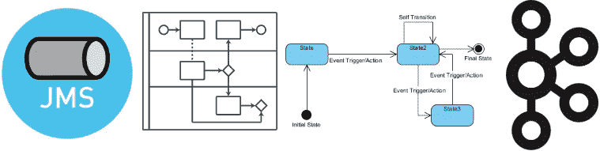

首先，让我们记住我们在上一篇文章 [**【同步传输和不唯一】**](/tricky-messaging-part-one-synchronous-transport-and-not-only-320edd7496f6) 中已经取得的成果以及我们可以用作技术基础的东西。

我们目前能够:

*   通过 JMS 队列进行同步和异步调用
*   最小化两端线程的阻塞时间，以及数据库上的事务时间
*   提供可伸缩性和容错能力，显著降低客户端-服务器的内聚性
*   实现“弱化的”伪会话(分区、运行时分片)，其中来自同一用户的请求可能由同一服务器提供服务

在本文中，我想看看在处理大量数据时经常使用的更具体的消息处理模式和反模式。一个典型的用例是处理复杂的结构化文档，如财务或海关文档。

# 运行时分片

在一组无状态服务器独立处理来自用户界面的文档或请求的情况下，最后一个特性可能看起来不是很有用。

然而，这并不完全正确，因为要处理每个文档，我们不仅需要它自己的数据，还需要来自请求操作的业务上下文的大量数据。

例如，如果我们将处理付款请求作为某个预算系统的一项功能，我们需要在处理每个请求之前从数据库中加载:

*   请求交易的类别的数据。可能会为每个类别定义一些预算限制。此外，我们可以满足限制这些类别的请求类型的可能性。通常，这样的类别系统是分层的，我们还需要加载不仅一个，而且所有的父类别。
*   为了根据请求对用户的电子签名进行额外的验证，我们必须加载他们关于所请求的交易的权限。它需要查明用户是否被允许在他的组织的上下文中签署这种类型的指定金额的请求。
*   用户可能会不时去度假，在这种情况下，他们会将自己的签名权限委托给同事。相应地，我们需要下载用户签名的“委托授权法案”并调整他当前可用的权限集。
*   管理员可以为不同类型的文档和不同类别定义不同的签名模板，即进一步处理文档所需的签名类型集。例如，文档的作者可能执行“第一”签名，而他们的直线经理可能执行“第二”签名。或者，在一个组织中可能有负责的主管，他们有权力签名，允许单独起草和发送文档进行处理。

这个列表离完成还很远，但是给出了需要从数据库中读取多少数据来处理购买普通抹布的请求的想法。假设我们正在与一家多层控股公司打交道，其中相同的人可能在不同的组织中承担不同的责任，并且可能以不同的组合相互隶属。在这种情况下，每次加载这么多的描述变得非常困难。

这就是为什么我们试图尽可能多地缓存从数据库加载的数据。

## 数据分类

关于缓存过程，我们可以区分以下常见的数据类别:

*   永久缓存的数据。这些通常是系统源代码中的常量或应用程序配置中定义的值。这就是为什么，他们往往是系统或技术的性质。例如，文档处理中的超时。
*   长期缓存数据或“常用字典”。通常，这是相对不经常更新的数据，根据 TTL 条件定期重新加载到内存中足够长的时间。例如，假期列表或控股公司的组织结构。
*   操作字典，包含动态可变的数据，这些数据不是业务事务的主题。例如，对特定类别执行操作的用户权限。通常，此类数据以小 TTL 存储，或者在新值写入数据库时失效
*   不可缓存的数据。这通常是业务交易数据，例如正在处理的文档本身。它还包括反映系统整体业务状态的数据，这些数据会随着单个事务的发生而快速更新。例如，它可能是特定类别预算限额的当前余额。

## 系统设计

通常，数据由类似 Infinispan 的解决方案缓存，这些解决方案为 JPA 二级缓存提供现成的支持。缓存本身既可以嵌入到应用程序中，也可以并行部署在同一个集群节点上(例如，查看“sidecar”Kubernetes 模式),以确保使用回送网络接口时响应时间较短。第二个选项更加灵活，因为它有效地区分了服务本身和支持它的缓存可用的资源量(例如，内存/线程)。缓存实例通常一起通信，以确保由一个服务更新的数据从缓存的所有实例中被驱逐。

因此，我们经常会遇到以下业务文档处理架构:

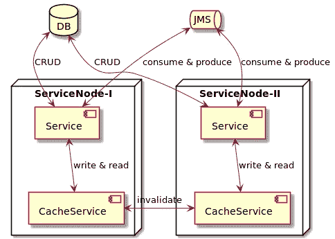

只要我们的数据很少，或者可缓存的频繁使用的数据的总量适合一个缓存服务的内存，这一切都很好。如果我们超过这个数量，继续在集群中的随机节点上处理文档，缓存就会变得非常低效。发生这种情况是因为缓存过程必须为每个未缓存的数据项清除内存以加载它，丢弃由某种策略选择的任何其他数据项。不幸的是，为了处理下面的查询，可能会再次需要这个数据项，从而导致额外的数据库查询、CPU 和内存使用。

当需要相同上下文的文档主要在相同的服务器节点上处理时，补救措施是运行时分片。

## 关于的一些注释

总之，只有几点需要提及:

*   我想特别强调，这不是数据分片，而是计算资源分片。服务的所有实例都可以访问相同的数据存储。
*   在任何时候，与一个数据上下文相关的所有请求流量都可以自动转发到另一个服务实例。不幸的是，它会导致缓存数据的大量更新。
*   如果被锁定到 ActiveMQ 对我们来说不是问题，我们可以在不进行复杂处理和使用标准的 **JMSXGroupId** 消息头的情况下达到相同的结果。

这种方案的另一个常见问题是确保缓存实例相互通信。这个问题尤其棘手，在云基础设施的情况下可能会经常遇到。还有一些情况，由于安全需求，我们需要在独立的特定安全网段中定位单个服务实例。

在企业解决方案中，我们可以通过组织(一个应用服务发布数据失效请求的专用主题)来修复此类问题。该服务的所有实例也订阅了该主题。收到消息后，它们会在相应的缓存实例上调用失效操作。

# 基于原始队列的处理

当客户机调用一个单独执行所有查询处理的服务时，一切都很好:数据库中的线程锁时间和事务持续时间是最小的。但是一旦我们进入分布式系统，事情就变得有点糟糕了。例如，如果服务 A 需要依次调用服务 B 和 C 并使用结果，我们有以下场景:

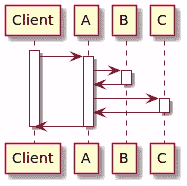

因此，当调用服务 B 时，服务 A 被阻塞(就像以前调用服务 A 时客户机被阻塞一样)。因此，如果客户机的请求是由对系统不同服务的整个调用树来处理的，那么我们只有在调用多叶端点服务时才能受益。

## 分割通话

为了修复这种情况，我们可以将每个操作拆分成几个部分，这些部分通过转发消息依次激活彼此。例如，如果服务 A 依次调用服务 B 和 C，我们可能会观察到以下操作序列:

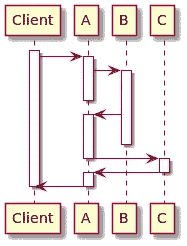

这种架构为我们提供了以下优势:

*   服务 B 和 C 仍然被最佳地称为叶服务
*   服务 A 的被调用操作被分成三个部分，每个部分都在阻塞相关资源方面进行了优化。
*   即使是最有“创造力”的开发人员也会发现在这里应用分布式事务很有挑战性(相当有害的反模式)。
*   在这种情况下，JMS 不保留消息队列中关闭消息的顺序这一事实与我们无关。这是因为对服务 B 和 C 的请求原则上不能交换。

然而，该方案也不是没有一些缺点:

首先，系统中的队列数量急剧增加。

*   这本身通常不是一个严重的问题，但是每个队列都是从一段代码到另一段代码的控制的异步转移。因此，一旦实现了一定数量的功能，就很难理解每个业务操作背后的调用位置和调用顺序。它不仅不方便，而且随着开发人员数量和实现的功能数量的增长，它也不具有可伸缩性。
*   随着时间的推移，应用程序变成了一堆队列，每个人都通过这些队列调用每个人。不可避免地存在没有人写入的队列。更糟糕的是，还有人写的队列，但是没人读。由于业务流程通常使用持久队列进行操作，这样的孤儿不可避免地会降低整体数据处理的速度。

第二个问题更严重，涉及到服务 A 需要在异步激活代码的各个部分之间传递原始调用的上下文。

这种情况可以包括:

*   至少要将源消息标识符用作最终响应的相关头
*   来自源请求的一些数据，只有在收到来自 B 的响应后才能应用
*   来自响应 B 的数据，这本身是不需要的，但是如果服务 C 返回一个错误并且服务 B 上的操作必须回滚，则可能需要

由于服务 B 的消息可以由服务 A 的一个实例发送，并由另一个实例接收，因此我们有以下方法来传递上下文:

*   在消息中传输上下文。这种方法非常优雅，因为我们在每个消息处理点都有某种分布式处理堆栈跟踪，这个堆栈跟踪描述了调用链中所有以前的服务。然而，只有当传输的数据量足够小时，才可以应用这种方法。在企业世界中，这种情况并不常见，尽管它确实时有发生。
*   上下文存储在某个共享存储库中。在企业环境中，它通常是一个数据库，但是我们也可以使用分布式缓存。在收到下一个回复时，服务应用程序代码的一个片段从数据库中加载业务流程上下文，应用收到的响应数据，更新上下文，保存上下文，并发送后续请求。

这种方法的第三个困难是可能的调用超时。服务 A 可以被动地、无休止地等待服务 B 的响应，如果服务 B 由于某种原因没有返回答案，那么服务 A 将永远不会知道这件事，也无法采取任何补偿措施。当来自服务 C 的响应丢失时尤其令人痛苦，因此不可能取消已经在服务 b 上执行的操作。为了处理这种复杂性，我们可以，例如，记录在业务流程执行的存储上下文中发送的消息，并定期轮询存储库以查找任何没有及时收到的响应。

一个不太严重的基本问题是，现在不能自动计算服务 A 上的合成方法调用的持续时间。像 Java Melody 这样的高级工具对我们没有帮助。我们被迫自己标记分散在不同源代码片段中的业务方法边界。

## 一连串的电话

在某些情况下，一个服务的结果被用作下一个服务的唯一参数，我们可以通过应用“路由单”模式来稍微优化交互。

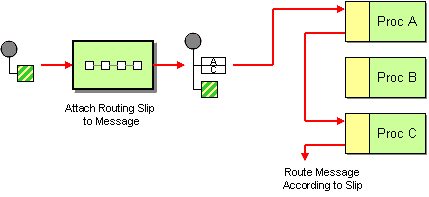

这个模板的欠考虑的应用使得服务相互依赖，这无疑是一个糟糕的做法。但是，您可以做一些更棘手的事情:

*   对服务 B 和 C 的独立请求被放在来自服务 a 的原始请求中。
*   中间响应的特殊部分也作为消息的标准部分提供。在将请求路由到服务 C 之前，服务 B 将其响应放在这个部分中(并且仅当请求这样的路由时)。
*   服务 C 接收请求，将来自该部分的所有响应放入其本地缓存，并执行请求。当服务 C 需要执行对服务 B 的调用时，它首先在缓存中搜索已经可用的请求结果。如果不成功(当某些东西调用代码时，而不是在所讨论的模式的上下文中)，它就开始远程调用。

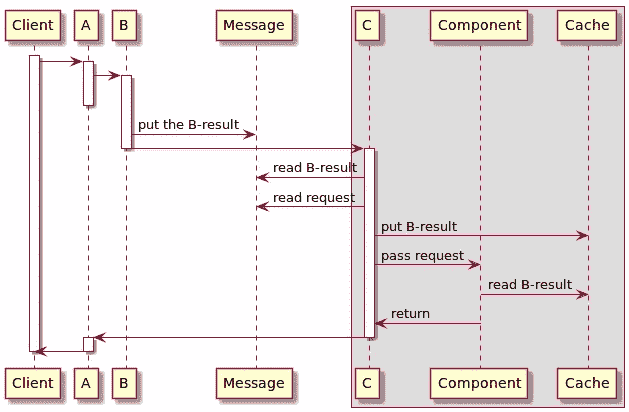

因此，我们可以像以前一样调用服务 B 和 C 的方法。按照这种方法，可以将消息应该连续发送到的整个服务列表和更高级的路由逻辑(带有条件转换和错误处理逻辑)放入其中。我们将在下一篇关于用户界面的文章中回到这个模式，那时我们将讨论通过在客户端部分消除事件驱动开发来简化代码的可能性。

此外，这种模式非常适合于实现交叉概念，例如验证数据格式、授权客户端请求的事务、验证一组证明事务数据的签名、审计等。在这种情况下，被调用的服务可能根本不依赖于先前被调用的基础设施服务，或者最低限度地依赖于它们。

在某种程度上，这种设计是众所周知的“责任链”模式的分布式实现。收据中提及的每项服务可以:

*   向客户端返回响应
*   将请求传递给下一个处理程序
*   根据传送给它们的一组进一步的处理程序或数据/元数据来修改收据

这个模板也有助于测试单个服务，因为您可以立即提供模拟的响应，而不是提供模拟的服务依赖性。

## 并行呼叫

如果服务 A 需要对服务 B 和 C 进行几次独立的调用，我们可以并行执行这些操作。在处理大型文件传输时，我们必须应用上一篇文章中讨论的相同模式。在这种情况下，情况更简单，因为我们不需要专门为结果的中间存储发明一个操作上下文——我们已经有一个了。

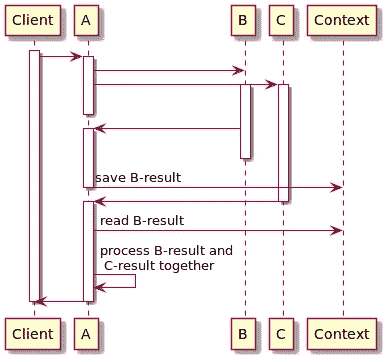

## 队列和计时器

这一组中的最后一个模式是通过定时器中断或启动某种活动。在最简单的情况下，服务可以向自己发送消息，添加特定于 ActiveMQ 的**AMQ _ 预定 _ 延迟**报头。

然而，也有更复杂的情况，其中:

*   MQ broker 根本不支持这样的特性
*   我们希望能够取消或改变计时器
*   如果计时器被触发，我们希望向不同的服务发送多条消息
*   其他服务应该能够发现任何计时器是否已经到期

因此，我们可以引入一个专门的服务来存储操作的上下文，并安排内部事件来及时激活它们。它可以基于对数据库的连续轮询(可能，但相当糟糕的设计)或通过 JMS 向自己发送预定的激活消息(在这种情况下，我们使用 JMS 代理作为集群级调度器)或使用专门的解决方案(如 Quartz Enterprise Job Scheduler)来实现这种效果。

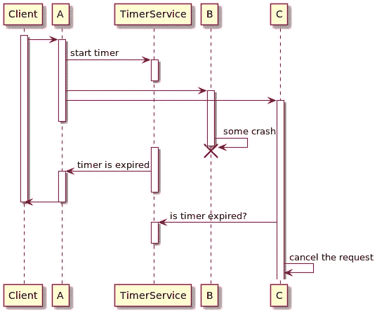

## 使用范围

总体而言，上述交互模板涵盖了实现业务流程所需的大约 80%的功能。

如果您的系统只使用一些业务流程，每个流程有 2-5 个异步步骤，那么您可能不需要更高级的技术和框架。

最有可能的是，大多数由基于 BPMN 的进程和状态机的实例访问的相当技术性的服务属于这一类。

# BPMN 的辉煌和苦难

应用 BPMN 的问题与本文的主题没有直接关系。然而，有必要讨论一下，澄清一个事实，即我们在某些情况下根本不使用 BPMN。一般来说，我们可以考虑由调度程序激活下面的任务，作为一种消息传输。从这个意义上说，基于 BPMN 的应用程序无疑是消息驱动的。此外，在 BPMN 流程的实施中，消息传递被广泛用作减少事务时间和增加系统吞吐量的一种手段。

曾几何时，BPMNs 只是非常高端、非常先进，并且仅由大型知名供应商提供，用于安装到无限的企业环境中。在那个时候，将它们用于普通应用是完全不可能的。大约 10 年前，我们的团队询问了一些非常值得尊敬的供应商代表，我们每天需要多少硬件来处理几百万份财务文档。他们紧张地咽了口唾沫，看向别处，开始谈论任何一个经理只用鼠标就能画出几乎任何一个业务流程是多么的伟大和容易。

已经有了像 jBPM 和 Activity 这样的解决方案，但是它们还很原始，需要大量的工作才能充分成熟。然而，与企业 BPMN 服务器相比，这已经是一个巨大的进步。关于这两种引擎之间比较的更多细节，请参见我的文章 [**“关于基于 BPM 的应用程序的一些随笔”。甲骨文，卡蒙达，和其他…“**T3”。](/some-casual-notes-about-bpm-based-applications-oracle-camunda-and-others-38ffca053957)

最后，一个清晰的、可嵌入的、透明的、轻量级的、现成的 Camunda 登场了。我们可以使用这个服务器开箱即用，没有太多的恐惧，也不需要在没有月亮的午夜添加蜥蜴皮和处女血。看起来这个银弹可以解决文章前面部分列出的所有问题。然而，应用 BPMN 方法本身，即使是在这样一个轻量级的风格中，也会引入一些基本的陷阱。主要是因为典型的 BPMN 引擎本质上是一个非常高级的调度程序，在轮询关系数据库的基础上实现。

## 嵌入式 BPMN 引擎

如果我们将引擎嵌入到服务中:

*   业务操作将在调度程序产生的同一个事务中执行。如果我们有性能问题，或者更严重的是，运行远程调用，引擎的可伸缩性作为一个整体会受到很大的影响。
*   由于引擎数据库位于与服务数据库相同的模式中，因此无法快速实现同时处理所有服务的管理界面。
*   由于调度程序不断轮询数据库以准备运行作业，因此无论系统是否有工作负载，资源都会被消耗。

下图显示了在 BPMN 流程描述中处理事件的典型示例。在这种情况下，我们不关心事件的性质以及使用了什么技术。它是流程实现的片段，位于具有 BPMN 引擎的单个服务中。

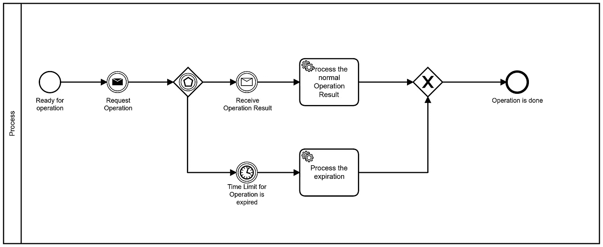

唯一重要的一点是，在消息发送操作和等待响应之间不应该有其他活动。否则，在 BPMN 引擎还没有预料到的时候，响应可能来得太早。我们可以通过使用有界子流程来克服这个限制。

因此，在请求后业务活动中，我们可以通过有界中断消息或定时器捕获事件活动来处理响应。只要有界过程已经完成，我们就可以应用传统的方法。这种方法的缺点是处理方案笨拙，技术细节过多。这是基于 BPMN 编程的典型反模式。

另一个标准解决方案是实现一个专用的纯技术流程，该流程将收到的消息保存在其上下文中，并尝试等待，直到目标接收方流程最终到达就绪点。但总的来说，对这种奇特设计的需求是相当罕见的。

frequest 反模式将来自传入消息的有效负载存储(尤其是永久存储)在流程实例的数据库存储上下文中，并由下一个任务处理它。流程实例上下文主要用于存储参数、标志和标识符。将大量数据放入其中会显著降低 BPMN 引擎的速度。因此，我们必须将数据放入单独的存储中，并将唯一的标识符保存到消息中。

另一种反模式是向流程实例发送消息，而不事先通知流程是否准备好接收和使用消息。从商业角度来看，这通常是可以接受的。例如，如果客户端可能在第一条消息之后几天才发送以下消息。此时，流程无疑已经达到了期望的状态，并准备好接收下一条消息。然而，测试这样的过程变得极其困难。因此，向方案中添加通知是有意义的，即使从业务角度来看没有多大意义。此外，我们可以使用此类通知来收集统计数据或进行事件调查。

## 作为独立服务的 BPMN 引擎

注意，上述 BPMN 模式不容易应用于嵌入式 depy 以外的情况。这是因为某些标准的消息相关技术不是 BPMN 规范的特征。当然，我们可以修改 Camunda 服务器或发布 groovy 代码来发送带有 BPMN 定义的消息。但这意味着一种定制，并朝着以前的方法发展。

与此同时，我们可以考虑将执行者可用的**外部任务**的发布视为向某个逻辑“主题”发送消息。

当我们在 BPMN 引擎之外找到业务代码时:

*   我们继续不断地对基础进行轮询，但是可伸缩性和管理问题正在显著减少。
*   我们有单独的单一服务来部署、管理、配置等等。更糟糕的是，这种服务处于基础设施和应用服务之间。从这一刻起，没有人对此负责:无论是系统管理员还是开发人员。我们有一个典型的孤儿，每个人都喜欢尽可能少地接触他，以避免对后果负责。
*   如果我们想要保持我们的服务的通用性，我们必须实现额外的服务——“任务执行者”。这些执行者与流程定义紧密结合，从 BPMN 服务中提取外部任务，并在一般服务的请求下执行它们。系统变得更加分散和复杂。
*   业务代码和调度程序代码现在在不同的事务中执行，我们必须处理部分不一致的数据。这不是一个严重的问题，但对于开发者和分析人员来说，这是一个额外的严重不适。当然，我们可以修改 **ExternalTask** 特性来使用 JMS 传输，它将发布任务的描述并从执行者那里接收答案。在这种情况下，我们将在每一端都有适当的事务性。但这意味着实现非平凡定制的必要性。
*   如果我们需要将大量数据从一个执行者转移到另一个执行者，我们就不能将这些数据临时放入流程上下文中，以便在提交事务时自动删除。相反，我们需要引入另一个服务来临时存储有效载荷。该服务通常还负责格式验证和转换。因此，一个外部任务的执行可能需要同时与至少三个数据源进行交互:BPMN 引擎、有效负载存储和一些服务的数据库。应用程序开发人员出错的风险也相应增加。

## 与 BPMN 相关的基本问题

此外，在应用程序中实现 BPMN 处理会带来以下基本问题:

*   BPMN 不仅是一种技术，也是一种特定的开发方法，位于应用程序架构和业务架构之间。因此，甚至将过程分解成单个任务的粒度也远不是一个纯粹的技术问题。例如，我们经常遇到这样的情况，一个非常详细的流程中的许多任务在一个事务中被一个接一个地一起执行。一方面，业务分析人员不清楚结果，另一方面，也没有技术意义或好处。
*   流程描述及其实现分别以 XML 描述和 Java / Groovy 代码的形式存在。在进化的过程中，这种捆绑不断地趋于瓦解。确保描述一致性的唯一方法是通过极其详细的集成测试，这需要精心准备的数据和资源来保持最新。
*   系统不可避免的发展和对长期流程的支持意味着我们要在四个维度上处理版本化:BPMN 描述的版本、Java 代码版本、存储在流程实例中的数据版本(流程持续时间可以是几天或几个月)，以及数据库模式版本。对于大多数开发人员来说，这个事实通常是一个令人不快的发现。这个问题不是 BPMN 独有的，但在这里，它是后来才注意到的，并引起了更多的困惑。
*   对于系统的开发者和用户来说，由单个活动组成的过程的概念并不完全透明。通常，我们操作一些业务对象，对于他们来说，询问对象处于什么状态是很直观的。BPMN 与数据对象的状态无关。所以这通常是多余的，并且很难理解一些数据实例发生了什么。无论如何，用户需要在界面中看到业务实体的一些状态。所以我们无论如何都不能抛弃状态，而必须在活动模型之上模拟它们。在大多数情况下，从一开始就处理基于状态的模型通常要容易得多。

让我试着描述一个典型的服务，在我看来，BPMN 的用法是多余的:

*   一个或两个进程，每个进程只包含几个异步操作。尽管被划分为单独的任务，但活动的其余部分是在单个事务中一起同步执行的。
*   这些任务主要是技术性的，从业务分析师和管理员的角度来看，它们的内容不是很清楚。
*   最初，有更多的流程和任务，但是当我们优化性能时，它们不可避免地开始合并和增加粒度。这种重构通常会产生一些积极的影响，因为调度程序会花费大量资源来运行流程实例、选择要执行的单个任务、处理存储在数据库中的上下文等。这种简化通常不是问题，因为从一开始它们的独立存在就没有多大意义。
*   当我们迈向第一个版本时，开发人员通常会为了优化的目的而禁用进程历史收集。之后，我们没有任何关于单个业务步骤性能的信息。在实际操作过程中，通常没有人会考虑未来以及事件将如何调查——这是一个非常鲁莽的决定。
*   在操作系统时，没有人太注意优化现有的业务流程。
*   BPMN 方案作为编码业务逻辑的另一种方式，非程序员可以部分理解。当然，漂亮而准确的图片对任何级别的经理来说都是一种享受。

## 明显的优势

然而，BPMN 有一个明显的优势，即作为参与发展进程的所有各方之间的交流手段。尤其是如果我们有:

*   许多服务组之间共享的多个复杂流程
*   它们是由专门的分析师组成的独立团队设计的。

在复杂项目的情况下，这种能力成为成功的关键。

# 状态机

## 元数据和原则

与 BPMN 相比，状态机的描述非常简洁，主要由以下基本元素组成:

*   **StateMachineDesc** —元数据的其他元素的容器
*   **状态** —可能的状态之一
*   **转变** —从一种状态到另一种状态的可能转变
*   **决策** —在几个可能的转换中进行选择的能力
*   **回调** —可执行代码的某个片段，它定义了状态机的行为

下图说明了所列元素之间的关系:

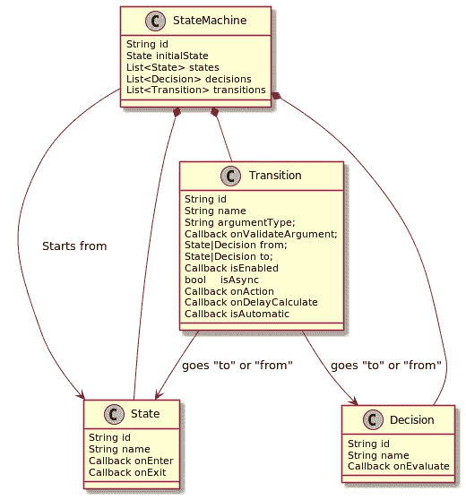

国家机器的意识形态也相当简单琐碎。

*   我们必须通过激活相应的转换来执行文档/集合上的所有操作，转换的回调反过来执行对数据库的查询或对存储的数据进行任何其他更改。
*   每个集合/文档存储相应状态机实例的标识符作为其数据的一部分。
*   为了对一个集合/文档执行操作，任何应用服务首先向 **StateMachineService** 请求当前状态和可用转换的列表。之后，它请求执行一个可用的转换，并传递所需的参数。

## 系统设计

以下主要应用程序组件通常与状态机服务交互:

*   **用户界面** —通过 **StateMachineService** 读取可用转换列表，并要求执行一些转换
*   **statemachinecinterfacegenerator**—在运行时构建(例如，由 JavaPoet 构建)经典的 Java 接口，该接口将所有可能的转换作为方法呈现
*   **state machine interface**—将对某个状态机的访问表示为 java 接口。除了 UserInterface 之外，所有应用程序代码都必须通过这个接口调用状态机上的操作
*   一组 JMS 和相应的基础设施——每个转换一个
*   **HistoryService** —存储转换的历史以供将来分析。此外，它还在类似于 JavaMelody 的东西中发布关于操作时间的所有统计信息
*   **ReportService** —生成两组工件。首先，它生成关于流程实例历史的不同种类的报告(通常通过类似 JasperReport 的方式)。其次，它提供了状态机元数据的图形化表示(通常通过 Graphviz 或类似的工具)

下一个模式说明了不同组件之间的关系:

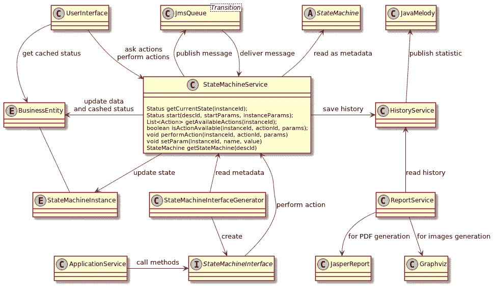

## 优势和异议

此类功能的实现通常只包含 10-30 个类，并带来以下好处:

*   该引擎非常简单、轻量级，并且对开发人员是透明的。
*   纯事件驱动架构，消除了不断轮询数据库的需要
*   它消耗最少的资源，可以很容易地嵌入到任何服务中。后者使得与任何已经存在的软件组件集成更加容易。
*   所有操作都是事务性的，开销成本最低
*   因为每个异步转换对应一个单独的队列，所以数据处理的“热图”是自动构建的
*   生成接口上的 AOP 和类似 JavaMelody 的工具支持收集所有相关的统计信息进行分析
*   设计提供了开箱即用的水平可扩展性和容错能力
*   由于元数据结构的简单性，很容易开发一个 DSL，它允许在同一个源代码片段中同时描述状态结构和实现回调的代码。在不同的状态机中重用代码/描述的公共片段更容易。
*   仍然可以使用状态机的结构作为开发人员、分析人员和管理人员之间共享知识的手段
*   从管理员和用户的角度来看，它允许快速回答两个基本问题:“对象的状态是什么”和“可以用它做什么”
*   由于状态机描述的结构非常简单，因此很容易以声明方式和编程方式对其进行定制。我们可以在不同的层次上同样容易地做到这一点:对于特定的部署，对于特定的租户，甚至对于正在处理的实体的具体实例。

反对使用这种方法的主要理由通常是一样的:JMS 不保持消息的顺序。我想特别强调的是，这个反对意见与本案完全无关:

*   每个转换只能由前一个状态发送的事件启动。因此，任何时候队列中只有一条发送给状态机实例的消息。发送给不同实例的消息的相对顺序通常对我们来说并不重要。
*   顺便说一下，在 BPMN 发动机的情况下，这方面的情况通常要糟糕得多。在并行流程分支中，各个活动的执行顺序通常没有定义。此外，两个活动可能会尝试在完成期间并行更新流程状态。在这种情况下，其中一个会收到**OptimisticLockingException**并自动重启。如果它已经在没有使用分布式事务的情况下执行了一次远程调用(消除分布式事务是一种常见的方法，因为它们不可靠，会降低系统吞吐量)，它将尝试更新远程资源两次。

# 卡夫卡的用法

与第一篇文章不同，在第一篇文章中，我们发现卡夫卡作为一种交通工具的使用相当复杂，不够灵活，这里的情况要好得多。这主要是因为我们不需要任何基于按标题过滤消息的复杂模式。

除了高吞吐量和用作备份数据存储的能力之外，Kafka 还为我们提供了开箱即用的对传入消息进行分区的功能。这是什么意思？

*   运行时分片——如果我们正确地设置了消息业务密钥，具有相同业务密钥的消息将主要由相同的服务器处理。这样，我们就可以有效地使用缓存技术。
*   根本没有异步处理。来自同一分区的两条消息不能由不同或相同服务器执行的两段代码同时处理。这种非异步特性使得实现一些特性变得非常容易，比如从片段组装一个大消息或者检查重复消息。
*   保证了消息处理的严格顺序。正如我们已经看到的，在状态机的使用环境中，这种情况并不重要。

让我们考虑一下这些以及我们必须处理的其他一些情况对业务流程实现的影响。

## 严格顺序消息处理

有一些限制，记住这些限制是很有用的:

*   首先，我们必须理解，只有来自单个分区的消息才会得到一致的处理。来自相同或不同主题的不同分区的消息可以按任何顺序处理。
*   此外，由于数据在物理上存储在集群中的不同服务器上，因此同时发送到不同分区的消息可能会以非常显著且不可预测的相对延迟结束处理。
*   此外，如果到 Kafka 主题的消息通过像 HTTP gateway 这样的结构，可能不可避免的消息混乱是可行的。由于 JVM 的结构，我们不能说 Kafka 主题中在关闭时间到达 servlet 容器输入端的消息的相对顺序。这是因为它们是由不同的线程处理的，线程中的事件没有固定的相互顺序。此外，在分布式系统中，失败可能随时发生，随后是 HTTP 操作的重新请求。与原始 HTTP 请求的顺序相比，所有这些也将改变 Kafka 消息的顺序。

严格的顺序消息处理意味着在任何连续或永久错误的情况下,“中毒”消息会阻塞单个分区的整个处理流。除了 JMS 的情况之外，我们不能简单地使用相同的或专用的队列以及相应的函数头，将后续的检索推迟一段时间。因此，我们需要建立一个完整的复杂系统，这个系统由专用于时间间隔的主题和相应的消费者组成，它将允许我们连续地将那些现在不能处理的消息推迟到更长的时间间隔。另一种可能的方法是基于关系数据库为延迟的消息建立一个存储库，但是在这种情况下，吞吐量会较低。

我们还必须维护一些推迟消息的上下文。如果我们推迟了与某个数据集合相关的一个消息，我们也必须推迟所有后续消息在它之后应用，保持逻辑结果。相应地，错误处理实现变得更加复杂，并且很可能再次类似于由一些关系数据存储来支持。

更详细地说，这些技术在文章[**“Kafka 中的异常和重试策略”**](/exceptions-and-retry-policy-in-kafka-6f0d3cf2c330) 中讨论，并且其实现是具有挑战性的。

## 卡夫卡在增加主题数量方面没有很好地扩展

从集群的角度来看，每个新主题都会导致一组专用的复制过程，直到跨集群活动监视和重新分发实际元数据。因此，为了保持每个代理服务器上线程的最佳数量，我们必须向集群添加更多的节点。

从 Kafka 的客户端角度来看，被监听的许多主题意味着所有执行线程消耗大量的额外资源。这些线程集合包含由原始 Kafka 客户端实现的线程、Spring 容器、监控基础设施等等。粗略地说，我们可以假设每个额外的主题都会给应用程序的每个分区带来十几个新线程。

由于在某种程度上受到主题数量的限制，当试图将每个状态机的每个异步转换映射到一个单独的主题时，我们可能会遇到一些困难，就像 JMS 的情况一样。因此，我们只能遵循“每个状态机一个主题”的方法不幸的是，在这种情况下，数据处理的“热图”更不容易获得。此外，长时间运行和快速转换现在将由同一组线程执行，并且会降低彼此的速度。此外，一个很少执行的操作会显著降低所有其他文档的处理速度。

如果我们与许多租户打交道，并且必须为每个租户保证特定的带宽，情况会变得更加糟糕。在这种情况下，我们必须为租户+状态机的每个组合使用单独的主题。

正如我们所看到的，尽管我们付出了努力，但随着我们的项目取得商业成功，主题的数量继续过度增长。

## 可量测性

就我们可以通过 Kafka 处理的数据量而言，Kafka 本身是非常可扩展的。不幸的是，对于消费者来说就不一样了:它的伸缩程度受到主题分区数量的限制。如果消息处理很快，这不是问题(例如，当我们只转换/丰富数据或收集一些统计数据时)。但是如果我们需要执行几个数据库查询来处理每条消息，分区的数量就会成为一个严重的限制因素。因为涉及数据库的操作通常是阻塞操作。因此，为了有效地使用数据库，我们需要更多的线程。数据库查询运行得越慢，我们就需要越多的线程来有效地处理查询线程。

当然，我们可以在收到消息后立即将其发送到单独的线程池进行进一步处理。这意味着回到与异步相关的问题，例如，在检查传入消息流中的重复项时。

此外，维护组的分区偏移量也变得更加困难。假设我们读取了第 100 条、第 101 条和第 102 条消息，并错误地处理了第 101 条消息。在这种情况下，我们不能自动保存偏移 102 并继续处理。我们需要保存偏移量 100，并记住我们已经处理了第 102 条消息。

在这种情况下，我们开始考虑是否更容易将收到的所有内容“按原样”保存在数据库中，然后逐个处理。对数据库的请求少一个，多一个—头疼的程度差不多。

## 处理

卡夫卡在这种情况下使用的一个更严重的问题是，它以一种非常不寻常的方式实现交易。我已经在我的文章[**“Kafka 与数据库的事务集成”中写过这个问题**](/transactional-integration-kafka-with-database-7eb5fc270bdc) 然而，除了那些从那时起已经描述过的，我还发现了一些非常令人讨厌的其他人。所有这些主要是用交易行为在卡夫卡那里实现的方式来解释的。它是在现有的消息存储和传输机制之上实现的。因此，它不是架构的核心原则，而是一些额外的可选功能。

简而言之，事务性是如何实现的:

*   为了标记一个交易的结束，代理向分区写入技术消息( **Cx/Rx** )。这些消息消耗偏移量，但是除了通常的消息( **Mx** )之外，它们不能被消费者读取。
*   交易只存在于消费者的想象中，是整个信息流的一个功能。对于每个单独的消息，其事务状态无法确定，而是由先前/后续技术消息的存在来确定。
*   事务性消费者读取序列并过滤未提交的消息。但是它必须按照发送的顺序读取信息。因此，当它遇到一个打开的事务时，它只是停止并等待，直到最终写入一个技术消息。该技术消息必须表明事务已经提交或回滚。为了完全确定，我们可以在文档中读到:“此外，消费者不需要任何缓冲来等待事务完成。相反，经纪人不允许它进行包括未结交易在内的冲抵。”

这种建筑产生了许多有趣的效果:

*   所以，如果我们用某种类似**卡夫卡工具**的工具来看这样一个题目的内容，就会看到序列中的一些奇怪的空隙。最大偏移量为 105 的分区的内容看起来是这样的:**……[M100][M102][M104]……**—最后我们可以看到六个偏移量，只有三条消息。我们看不到类似**【C103】和【C101】**的技术信息。这样的增量并不可怕，除非您试图通过偏移量的差异来计算一个主题中的消息数量。像 Grafana 这样的跨所有分区的监控工具显示了至少一条消息的奇怪延迟。
*   假设服务 A 被配置为 **read_committed** ，并读取服务 B 的事务性消息。如果服务 B 或其传入请求中断，它将开始回滚事务。在这种情况下，服务 A 确实没有什么可读取的:在第 100 个提交的消息之后:**【M100】【C101】【M102】【M103】【R104】【M105】【M106】【R107】**。但是回滚的消息已经在分区中了(顺便说一句，对普通用户是可见的)，它们消耗偏移量。所以过了一会儿，管理员开始哭了:“服务 A 已经停止消费消息，立即在 Grafana 上看到，有几千美元的缺口，紧急修复它！！!"。实际上，服务 A 处于良好状态，但我们仍然很头疼，因为 Grafana 无法区分好的缺口(因为没有提交而确实不应该消费的消息)和坏的缺口(尚未消费的消息)。
*   如果其中一个服务启动了一个事务并挂起/变慢，那么至少有一个分区会被临时锁定。在这种情况下，服务 A 确实再次没有要读取的内容:在第 100 个提交消息之后:**【M100】【C101】【M102】【M103】【M104】【M105】**。消费者必须等到事务提交/回滚后才能继续。同样，我们有一个缺口，没有任何工具来了解实际发生了什么。如果一个变慢的服务通常在一个事务中发送多条消息，它就有机会阻塞整个主题。对于同时写入许多服务/代码片段的主题来说，这是一个严重的潜在问题。

再一次，我自己得出的结论是，卡夫卡不适合企业系统。如果我们要进行事务性数据处理，这一点更是如此。它适用于大量的非事务性数据流，丢失其中的一小部分并不痛苦。这种流有几个例子:技术日志或关于用户行为的信息。

那么，如果我们确实想在这种背景下使用卡夫卡，我们应该怎么做呢？答案很明显——根本不要使用事务。我们应该做什么？一般来说，建议将消息保存到专用的表中，并应用像 Debezium 这样的 CDC 解决方案。

在某些情况下，您可以使用更简单的设计来发送消息:

*   发送方将消息保存到数据库并提交事务。接下来，他在同一线程中同步向 Kafka 发送一条消息，并从数据库中删除该消息。
*   如果一个线程或整个服务终止，消息将保留在数据库中。因此，您需要一个监视器来选择和重新发送在数据库中存在时间超过特定时间的消息。
*   通过在全局集合中累积已发送消息的标识符，并与发送过程异步地批量删除它们，可以优化这种方法。发送的重复消息的数量将相应增加。
*   如果接收者对复制有抵抗力，那就足够了。如果没有，我们需要一种机制，在重新发送消息之前，通过调用 Kafka 来检查它是否不在传出主题中。
*   接收方按照操作的确切顺序进行类似的操作。它首先对收到的消息及其业务处理执行重复检查。并且只有在这之后，它才对接收到的消息进行确认。因此，在崩溃的情况下，一些消息将被接收两次，但在处理开始时被过滤掉。

## 一起

前面的章节逐渐引导我们认识到，最好的方法是在服务内部为传入和传出的消息组织两个事务性存储库，以及在它们之间传输 Kafka 主题消息的机制。

*   如果我们想避免不断地轮询这些存储库，我们需要在内存中实现两个队列。当我们将消息存储在存储库中时，消息 id 将被推入其中。
*   这些队列的监听器(传入/传出监视器)将负责通过主键从存储库中读取消息并处理它们:传递给业务处理程序或发送到传出 Kafka 主题。
*   在处理传入的消息时，我们可以组织一个更复杂的基于索引的结构，而不是简单的队列，从而允许我们在处理之前对已经从 Kafka 接收的消息进行重新排序/延迟/重新处理。
*   在服务重启的情况下，我们只需要根据从输出主题中读取的存储库数据和消息来重新初始化队列数据
*   为了提高处理网络和磁盘的效率，建议在处理数据库和 Kafka 主题时使用批处理

下图可以说明这个处理流程:

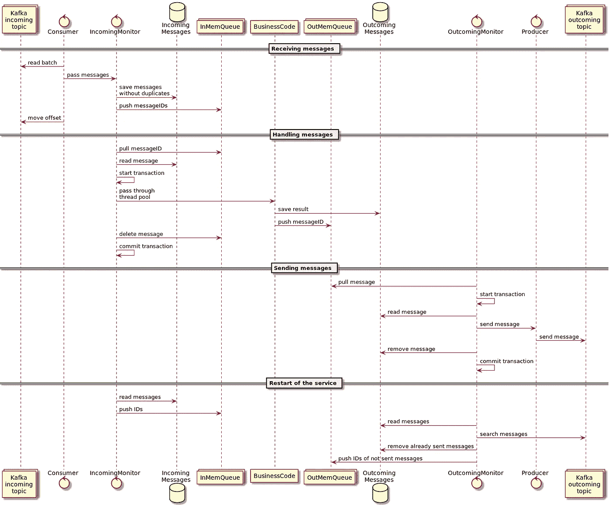

这种方法的主要优点是:

*   收件箱和发件箱数据库非常紧凑，我们不需要一直轮询它们。如果有必要，我们可以把它们放在服务器的内存中。我们可以使用高级的基于表的排队机制(例如在 PostgreSQL 或 TimelineDB 中可用)来优化对这种表的处理。
*   我们可以自由地改变消息处理的顺序、重新分组、解除、拆分/连接等。
*   我们可以任意更新消息的属性，以实现任何复杂的处理方案。
*   从传统意义上来说，所有与消息相关的工作都是完全以事务方式执行的。并且它不需要开发者知道具体的技术、模式、Kafka 的架构、附加的 API 等等。

这种设计还为我们带来了以下激动人心的特性:

*   整个 Kafka 相关的基础设施，包括监视器，可以作为通用辅助边车容器与业务服务一起实现和部署。它使得业务服务代码非常简单，易于理解和测试。
*   在应用程序开发的初始阶段，当所有服务都只是潜在的标记时，为了加速原型开发，我们可以完全忘记 Kafka，并在以后需要时将此功能作为交叉概念添加。

总结以上情况，我们可以得出结论，与卡夫卡合作的细节完全符合其创作者所宣称的原则:“聪明的经纪人 vs 愚蠢的经纪人”。但在这种背景下经纪人的愚蠢，在我看来，是被略微高估了。

*   首先，我们同时在系统中获得两个分布式产品(Kafka + ZooKeeper)，每个产品都需要部署、管理和监控。
*   其次，Kafka 集群中数据和负载的自动分布远非总是稳定和最优的。这款产品与“部署后就忘记”的理念相去甚远。

因为，在卡夫卡的例子中，经纪人是愚蠢的，客户肯定是相反的聪明。这意味着客户端开发人员也必须有相当的能力，并花费相当多的额外努力，这并不是在所有情况下都是合理的。

# 作为存档或备份存储的卡夫卡

这是否意味着 Kafka 在实现业务流程的环境中对我们来说实际上是无用的？事实证明不是:它是一个方便的工具，但却扮演了一个完全意想不到的角色。

JMS 的一个基本缺点是，来自队列的消息在被侦听器使用后会被立即删除。将它们保存在基于数据库的档案中相对缓慢且昂贵，尤其是考虑到我们永远不会重读其中的 99%。此外，被视为备选方案的数据库和 S3 文件存储没有必要的吞吐量。

同时，对系统的可审计性也有实际要求。除了其他方面，它还意味着能够详细跟踪由特定流程实例产生的整个信息流。一个类似的要求可以作为一个特定过程在一个相当长的时期内的“再现性”。严格地说，这是一个很难实现的功能，因为随着时间的推移，系统中的一切都在变化——源代码、字典的内容、数据结构等等。因此，几乎不可能重新运行流程的实例，给它一个相同的环境和数据。但是这通常根本不需要以编程方式再现流程行为。我们可以向审计员提供流程实例消费或产生的所有必要数据，以便手动一步一步地执行并验证结果。

在这种情况下，Kafka 作为一个高吞吐量的信息库对我们非常有用，我们可以将所有的流程执行数据转储到其中:初始数据、传入和传出的消息、用户任务和外部任务的有效负载、分支点或调用另一个流程之前的流程状态等等。因此，我们可以提供所有的信息，这些信息可能对以后的审计、再现或简单地解析事件有用。在这种情况下，我们使用 Kafka 作为高性能的日志记录系统。

一个逻辑问题产生了，为什么不能只记录所有消息，用 Elasticsearch + Kibana？答案是非常悲伤和直接的——由于业务消息可能会产生数兆字节的数据，我们冒着用大量数据扼杀 Elasticsearch 的风险，其中大部分数据我们根本不想索引。

如果我们把所有的消息放在 Kafka 中，我们只能通过指向消息的唯一指针来访问它们。该指针由以下部分组成:主题名、分区号和消息在分区中的偏移量。我们可以通过指针访问单个消息，以及从某个指针开始的消息流。因此，我们可以在 Kafka 中存储大量数据，并发送索引到 Elasticsearch 中，只搜索每条消息的元数据，并返回指向 Kafka 流的指针。

这种方法的基础结构由以下主要组件组成:

*   服务中与 BPMN 引擎交互的代码:从 JMS 队列接收消息，搜索相应的流程实例，将消息传递给流程实例以供执行。之后，它用流程 ID、所执行操作的结果以及其他与业务相关的数据来丰富消息。最后，它向卡夫卡的主题传递了一个信息，这个主题充当了档案存储。
*   索引应用程序:使用来自归档主题的消息，计算指向消息的指针，用消息的元数据(当然包括指针)创建 JSON 文档，将 JSON 文档发送到 Elasticsearch 进行索引。
*   应用程序管理员可以通过 Kibana 按照各种标准搜索带有消息描述的文档。每个描述都包含一个指向消息的指针，由 Kibana UI 自动生成，作为指向报告服务的 HTTP 链接。Elasticsearch 和 Kibana 手册将此描述为“管理索引模式数据字段”。在最简单的情况下，用户通过点击该链接，从报告的服务中获得消息的完整视图，包括所有数据、业务/传输标题等。
*   Camunda UI 的一个管理插件，它在当前流程实例的上下文中输出一个完整的消息列表，这些消息带有到报告服务的链接。它通过查询 Elasticearch 来运行。
*   报告服务:可以生成一系列报告，从单个消息的内容到与单个流程相关的活动的完整描述。一方面，它使用 Elasticearch 来搜索消息。另一方面，它直接读取 Kafka 令牌来访问消息本身。

下图可以说明这种交互模式:

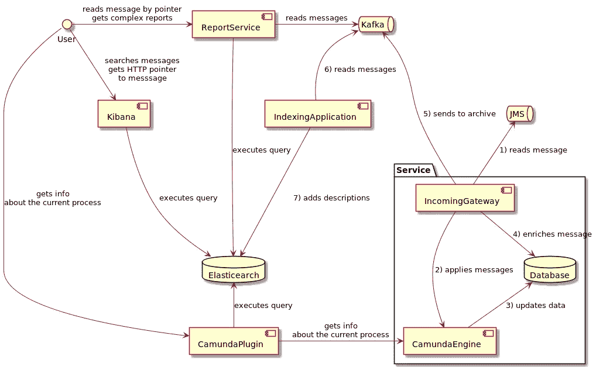

原则上，使用 Kafka 存储作为事件源备份存储已经不远了。这种存储可用于在出现意外问题时，从发送到流程的消息流中重新创建主数据库。然而，这给服务的实现带来了很大的限制。

*   所有与数据相关的操作都必须通过业务流程专门执行。
*   处理中使用的所有附加数据(例如字典)要么必须保持不变，要么以版本化的形式存储。
*   所有可执行代码也必须进行版本控制。这可能是实现起来最具挑战性的需求。

# 结论

因此，我们研究了几种实现基于消息传递的业务流程的方法:

*   什么都不用——我们不需要使用信息传递，即使它是惊人的、时尚的、进取的
*   原始队列
*   嵌入式 BPMN 引擎
*   专注的 BPMN 服务
*   国家机器。
*   zebee——来自卡蒙达的实验性 BPMN 发动机。它的主要区别在于，它不使用关系数据库来存储数据，而是像 Kafka 一样使用分区分布式存储。我对这个系统没有经验，所以我只能把它作为一个可能的、非常有前途的替代方案来提。

每个变体都被设计成通过引入一些额外的工作、代码、方法、基础设施等来降低系统的复杂性。在每种情况下应用什么是一个讨论的问题。

在我看来，总的原则如下:方法的复杂性不能超过我们想要消除的复杂性。治疗不能比疾病更毒。

如果我们只考虑系统的两个方面，生产力和业务流程的复杂性，我会推荐以下方法:

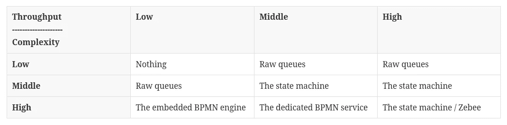

我还想再次重申，这些方法只有在主动使用数据库处理消息内容的企业应用程序环境中才是实用的。

相比之下，下一篇文章将关注在实现用户界面时如何使用消息。它不会像这个那么大，因为我很少处理这方面的发展。

然而，有一些事情需要记住，它们可以让应用程序开发人员的生活变得更加轻松。

