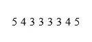

# Python #Python 系列中的棘手模式程序-8

> 原文：<https://blog.devgenius.io/tricky-pattern-program-in-python-python-series-8-57f556ce363f?source=collection_archive---------11----------------------->

在探索这个模式程序之前，让我向你坦白一件事。这个特殊的模式程序花了将近 20 分钟来破解逻辑。所以，我请求你也这样做。首先，观察格局，尝试破解逻辑。如果你能做到，那就恭喜你了。如果没有，不用担心，我们会一起破解它。

开始了，


n = 4 的矩形数字模式

类似地，n = 5 时的模式输出


n = 5 的矩形数字模式

现在停在这里，相对于 n 值足够接近地观察图案，并尝试分解图案的结构。

如果你读过我之前关于 python 模式程序的[文章](https://medium.com/@psmohammedali/hard-patterns-in-python-python-series-7-1fedf07fbe57)，你可能会发现如果我们能够回答三个问题，我们就能解决逻辑问题。

让我们来回答这些问题。

1.  关于 n 有多少行？

对于 n = 5，我们有 9 行。类似地，对于 n = 4，我们有 7 行。因此，对于 n 行，我们将有(total_rows = 2*n -1)行。棘手的部分是我们必须将整个行分解成 3 个部分。因为第一部分与第二部分和第三部分有一种模式，反之亦然。

2.每行要打印多少列？



n = 5 的第二行，

如果您再次访问模式输出中的特定行。假设，在前半部分，每一行都有一个递减的数字，然后一个数字本质上是重复的，然后数字递增。


n = 5 的第二行的列细分

单行三种模式。第一是递减，第二是重复，第三是递增。

3.在每行的特定列中打印什么？

我们需要打印基于行号和列号的数字。

**这种模式的 Python 代码**

```
def number_pattern(n):
    # first half pattern
    total_rows = (2 * n) - 1
    n1 = total_rows // 2
    i = 1
    while i <= n1:
        # Decrement loop from n
        col = 1
        p = n
        while col <= i:
            print(p, end="")
            p = p - 1
            col = col + 1

        # repetitive loop
        col = 1
        p = n1 - i + 2
        while col <= (2 * (n1 - i) + 1):
            print(p, end="")
            col = col + 1

        # Increment loop from __ to n
        col = 1
        p = n1 - i + 2
        while col <= i:
            print(p, end="")
            p = p + 1
            col = col + 1
        print()
        i = i + 1

    # Second half Pattern
    p = n
    col = 1
    while col <= n:
        print(p, end="")
        col = col + 1
        p = p - 1

    col = 1
    p = 2
    while col <= n - 1:
        print(p, end="")
        col = col + 1
        p = p + 1
    print()

    n2 = n1
    # Third Half pattern
    i = 1
    while i <= n2:
        # Decrement loop from n
        col = 1
        p = n
        while col <= n2 - i + 1:
            print(p, end="")
            p = p - 1
            col = col + 1

        # Repetitive loop
        col = 1
        while col <= (2 * i - 1):
            print(i + 1, end="")
            col = col + 1

        # Increment loop
        col = 1
        p = i + 1
        while col <= (n2 - i + 1):
            print(p, end="")
            col = col + 1
            p = p + 1

        i = i + 1
        print()

n = int(input())
number_pattern(n)
```

LOC(代码行数)可能很高，因为我已经详细编码了。您可以根据自己的方便程度进行优化。

这种模式程序有助于你掌握循环和条件编程。

快乐编码…