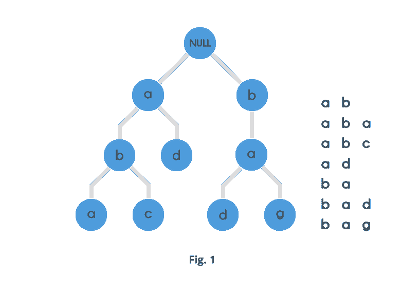

# Trie(关键字树)前缀树

> 原文：<https://blog.devgenius.io/trie-keyword-tree-prefix-tree-5d59cdf895ea?source=collection_archive---------5----------------------->

字符串本质上可以被视为各种编程问题中最重要和最常见的主题。字符串处理在现实世界中也有多种应用，例如:

*   搜索引擎
*   染色体组分析
*   数据分析

以文本形式呈现给我们的所有内容都可以被可视化为字符串。

尝试:

尝试是一种非常特殊和有用的数据结构，它基于字符串的前缀*。它们用于表示数据的“检索”,因此称为 Trie。*

前缀:前缀是什么:

字符串的前缀只不过是任意 n 个字母 n≤|S|,可以严格地从字符串的开始处开始。例如，“阿巴卡巴”一词有以下前缀:

一个
ab
ABA
ABAC
abaca
abacab

Trie 是一种特殊的数据结构，用于存储可以像图形一样可视化的字符串。它由节点和边组成。每个节点最多由 26 个子节点组成，边将每个父节点连接到其子节点。这 26 个指针只不过是针对英语字母表的 26 个字母中的每一个的指针。

字符串根据它们在 trie 中的前缀以自顶向下的方式存储。所有长度为 1 的前缀被存储到第 1 级，所有长度为 2 的前缀被排序到第 2 级，依此类推。

例如，考虑下图:



# 应用程序

# 作为其他数据结构的替代

如下所述，trie 比二分搜索法树有许多优点。

trie 也可以用来代替[哈希表](https://en.wikipedia.org/wiki/Hash_table)，相比之下有以下优点:

*   与不完美的哈希表相比，在 trie 中查找数据在最坏的情况下更快，时间为 O(m )(其中 m 是搜索字符串的长度)。不完善的哈希表可能会发生键冲突。键冲突是不同键到哈希表中相同位置的哈希函数映射。在一个不完美的散列表中，最坏情况下的查找速度是 O(N) 时间，但是更典型的是 O(1)时间，其中 O(m)时间花费在评估散列上。
*   在一个 trie 中不同的键没有冲突。
*   trie 中的桶类似于存储键冲突的散列表桶，只有当单个键与多个值相关联时才有必要。
*   当更多的关键字被添加到 trie 时，不需要提供散列函数或改变散列函数。
*   trie 可以通过关键字提供条目的字母顺序。

然而，与哈希表相比，trie 也有一些缺点:

*   Trie 查找可能比哈希表查找慢，尤其是在硬盘驱动器或其他辅助存储设备上直接访问数据时，与主存储器相比，这些设备的随机访问时间较长。
*   有些键，比如浮点数，会导致没有特别意义的长链和前缀。然而，按位 trie 可以处理标准的 IEEE 单精度和双精度浮点数。
*   有些尝试可能需要比哈希表更多的空间，因为可能会为搜索字符串中的每个字符分配内存，而不是像大多数哈希表那样为整个条目分配一块内存。

# 字典表示法

trie 的一个常见应用是存储[预测文本](https://en.wikipedia.org/wiki/Predictive_text)或[自动完成](https://en.wikipedia.org/wiki/Autocomplete)字典，例如在[移动电话](https://en.wikipedia.org/wiki/Mobile_telephone)上找到的。这种应用程序利用了 trie 快速搜索、插入和删除条目的能力；然而，如果只需要存储字典单词(即，不需要存储每个单词的辅助信息)，则最小[确定性非循环有限状态自动机](https://en.wikipedia.org/wiki/Deterministic_acyclic_finite_state_automaton) (DAFSA)将比 trie 使用更少的空间。这是因为 DAFSA 可以压缩来自 trie 的相同分支，这些分支对应于被存储的不同单词的相同后缀(或部分)。

尝试也非常适合实现近似匹配算法，包括那些在[拼写检查](https://en.wikipedia.org/wiki/Spell_checking)和[断字](https://en.wikipedia.org/wiki/Hyphenation_algorithm)软件中使用的算法。

# 术语索引

[判别树](https://en.wikipedia.org/w/index.php?title=Discrimination_tree&action=edit&redlink=1) [术语索引](https://en.wikipedia.org/wiki/Term_indexing)将其信息存储在 trie 数据结构中。

# 算法

trie 是支持查找和插入操作的节点树。Find 返回键字符串的值，Insert 将字符串(键)和值插入到 trie 中。插入和查找都在 O( *m* )时间内运行，其中 m 是密钥的长度。

可以使用一个简单的节点类来表示 trie 中的节点:

```
**class** **Node**:
   **def** __init__(self) -> **None**:
       *# Note that using dictionary for children (as in this implementation)*
       *# would not allow lexicographic sorting mentioned in the next section*
       *# (Sorting), because an ordinary dictionary would not preserve the*
       *# order of the keys*
       self.children: Dict[str, Node] = {}  *# mapping from character ==> Node*
       self.value: Any = **None**
```

注意`children`是一个节点的子节点的字符字典；据说“终端”节点是表示完整字符串的节点。
可以按如下方式查找 trie 的值:

```
**def** find(node: Node, key: str) -> Any:
    *"""Find value by key in node."""*
    **for** char **in** key:
        **if** char **in** node.children:
            node = node.children[char]
        **else**:
            **return** **None**
    **return** node.value
```

可以对这个程序稍加修改

*   检查 trie 中是否有以给定前缀开头的单词，以及
*   返回对应于给定字符串的某个前缀的最深节点。

插入通过根据要插入的字符串遍历 trie，然后为 trie 中不包含的字符串的后缀附加新节点来进行:

```
**def** insert(node: Node, key: str, value: Any) -> **None**:
    *"""Insert key/value pair into node."""*
    **for** char **in** key:
        **if** char **not** **in** node.children:
            node.children[char] = Node()
        node = node.children[char]
    node.value = value
```

**Trie 的 Kotlin 实现:**

Trie 的基本概念是每个节点最多可以有 26 个子节点，因为我们有 26 个字母[a-z]。

所以我们必须使用带有 HashMap 的 Node，它将字符存储为键，将值存储为节点。

**插入 Trie :**

所以我们将在 Trie 中一个字符一个字符地添加，如果我们当前节点的地图包含相同的字符，那么我们可以向前移动，否则我们将创建一个节点。

如果所有字符都已插入，则将该节点标记为 *isWorldend。*

**在 Trie 中搜索:**

我们可以像在 insert 中一样搜索，在 Trie 中逐个字符地搜索，直到我们的字符完成，然后检查 *isWorldEnd* 是否为真，然后返回 true，否则返回 false。

**在 Trie 中搜索前缀:**

搜索前缀与搜索关键字是一样的，唯一的区别是我们可以忽略 *isWorldEnd* 值，就好像所有字符匹配返回 true 一样。

下面是 Trie 的代码:

```
**class** Trie {

    **private val root** = Node(0.toChar())

    **inner class** Node(**val char**: Char) {
        **val map** = HashMap<Char, Node>()
        **var isWorldEnd** = **false** }

    **fun** insert(word: String) {
        **if** (word.*isNotEmpty*()) {
          insertNode(**root**,word,0)
        }
    }

    **private fun** insertNode(node: Node, word: String, i: Int) {
        **val** index = i
        **if** (index < word.**length**) {
            **val** char =  word.*elementAt*(i)
            **if** (node.**map**.containsKey(char)) {
                **val** child = node.**map**[char]
                insertNode(child!!,word,index+1)
            } **else** {
                node.**map**[char] = Node(char)
                insertNode(node.**map**[char]!!,word,index+1)
            }
        }
        **else**{
            node.**isWorldEnd** = **true** }
    }

    */** Returns if the word is in the trie. */* **fun** search(word: String): Boolean {
        **if**(word.*isNotEmpty*()){
            **var** index = 0
            **var** node  = **root
            while** (index < word.**length**){
                **val** char = word.*elementAt*(index)
                **if**(node.**map**.containsKey(char)){
                    node = node.**map**[char]!!
                    index++
                }
                **else**{
                    **return false** }
            }

            **if**(node.**isWorldEnd**){
                **return true** }
        }
        **return false** }

    **private fun** searchPrefix(word: String) : Boolean{
        **if**(word.*isNotEmpty*()){
            **var** index = 0
            **var** node  = **root
            while** (index < word.**length**){
                **val** char = word.*elementAt*(index)
                **if**(node.**map**.containsKey(char)){
                    node = node.**map**[char]!!
                    index++
                }
                **else**{
                    **return false** }
            }
        }
        **return true** }

    */** Returns if there is any word in the trie that starts with the given prefix. */* **fun** startsWith(prefix: String): Boolean {
        **return** searchPrefix(prefix)
    }

  }
```

感谢你阅读这篇文章。