# 慢速后端故障排除(使用 TCP 转储)

> 原文：<https://blog.devgenius.io/troubleshoot-slow-back-ends-using-tcp-dump-c4fad2169bbb?source=collection_archive---------7----------------------->

*   作为一名软件开发人员，你可能听说过一些系统提供缓慢的服务，或者有时很慢。但是可能有几个因素导致了这些问题。
*   所以今天我们将看看如何解决这些缓慢的问题。
*   这里我们有基于 Express 的程序。

**server.js**

*   首先，我们使用一个简单的文本负载来检查这一点。
*   因此，在启动服务器后，我们将发送此事务。(这里我用了失眠)。

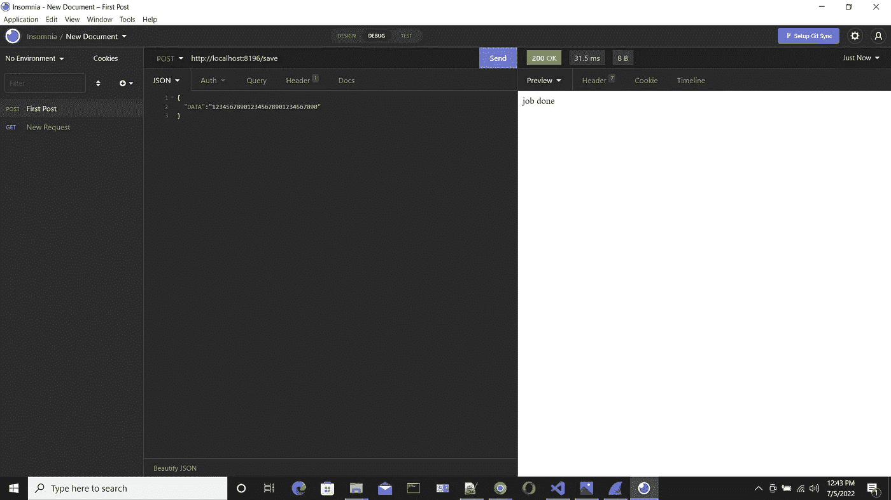

*   我们将寻找 wireshark 来进行这次捕获。

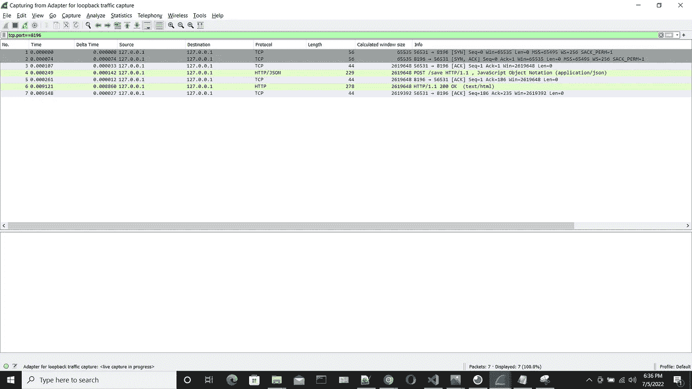

*   在这里，您可以看到在最初的请求中，窗口大小是 65 535。
*   **那么什么是窗口大小呢？**这是我们的接收缓冲区大小。TCP 窗口大小字段控制数据流，因为大小字段不能扩展，所以使用比例因子。通过使用 TCP 窗口缩放，我们可以将最大窗口大小从 65，535 字节增加到 1 千兆字节。

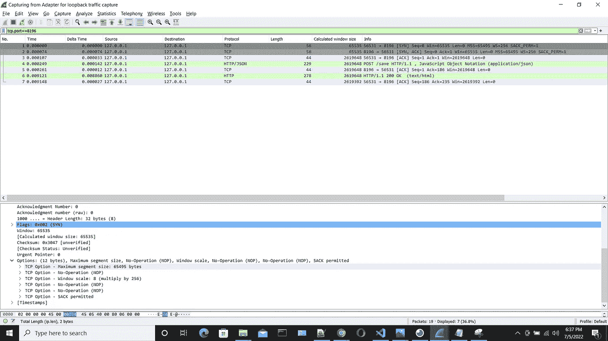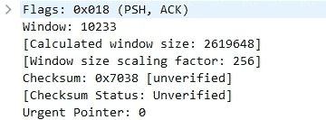

*   如果你得到从客户端到服务器的第四个事务，它说窗口是 10233。如果你得到第一个，窗口显示 65，535，65，535 字节意味着这是一个巨大的。

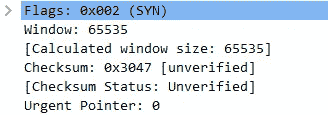

*   想象一下，我们要上传 1gb 或 2gb 的文件，然后我们发送 65535 字节，然后确认它，然后我们发送下一个数据块，确认它，然后发送另一个数据块，因为使用 65535 字节非常慢，所以上传将会花费很长时间。
*   早期的 TCP 窗口大小计划为 65535。在那些日子里，这已经足够了。但是随着协议的增长，我们需要更多的空间。
*   因此，作为解决方案，他们使用窗口缩放。

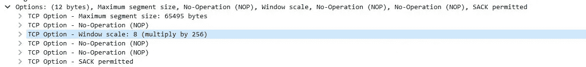

*   这意味着即使最大缓冲区大小是 65677，也可以接受该大小的 256 倍。

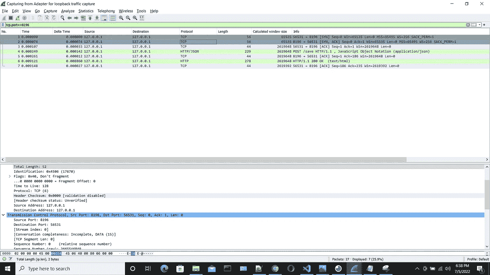

*   但是从客户端到服务器，我们看不到像以前那样的规模。因为它只发生在握手过程中。
*   因此，如果我们使用 TCP 转储来分析速度缓慢，您需要确保我们应该捕获这些 SYN-SYN-ACK-ACK 数据包，因为我们需要确保带宽得到充分利用。

# **上传大文件:**

*   该文件大小为 352kb。现在让我们检查一下该文件的事务将会发生什么。

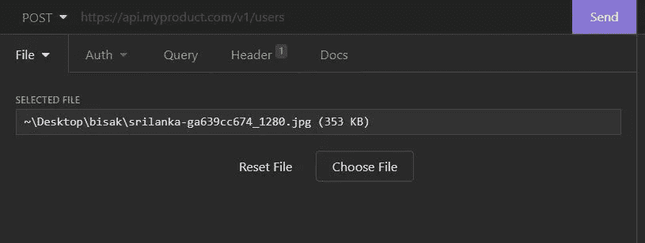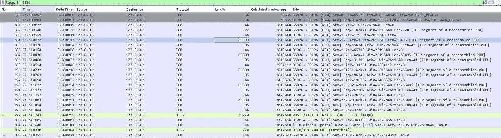

*   如果我们检查第二个。你可以看到窗口比例是 8。

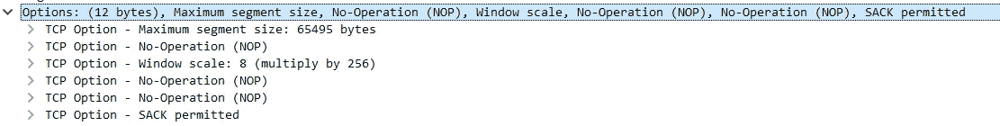

*   所以看看窗户的大小就知道了。这里你可以看到它下降了一会儿，然后又回到原来的大小。

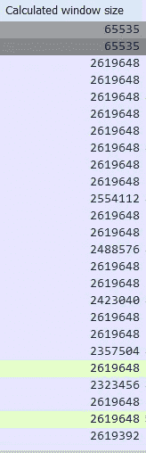

*   让我们通过一个例子来弄清楚这个场景。
*   假设客户端 A(客户端)向 B(服务器)发送 100 个数据。但是 C(应用)是在 B 之上的，因为 B 只是一个协议。在 A 和 B 之间是 TCP。所以现在 C 需要从 b 那里得到这些数据。
*   a 得到 100 分，然后 B 回到 B，同时 C 从 C 那里拿走他们，让我们假设 C 拿走了 90 分。现在还剩 10 个。

现在 B 可以向 A 要求多少？

*   是 90。所以 A 给 B 90。现在认为 C 拿了 70。所以下次 B 向 A 要 30。(100–30)

**下一次接受=全尺寸-保留在缓冲器中**

*   所以现在我们可以看到它一直在下降。当应用程序运行缓慢，计算出的窗口大小下降，几乎为零时，问题就来了。
*   在这种情况下，我们应该非常小心。即使我们在高速应用中传输数据，第 7 层中的用户也不会以同样的速度消耗数据。
*   假设由于某种原因这个下降到了零。现在我们称之为**零窗口情况**。
*   现在服务器(B)告诉我们，它达到了零，这意味着服务器没有任何空间。全部 100 满。所以 C 不接受数据。因此现在需要等待。所以会有一个滞后。
*   在这种情况下，我们必须解决这个问题。(为什么这样打 0 窗口大小？)

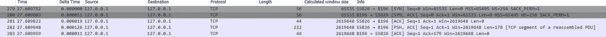

*   这里你可以看到。如果你看到这里有一个相当大的延迟，我们必须解决它。因为将数据包发送到服务器并从服务器返回将花费那么多时间，这可能会导致速度变慢。

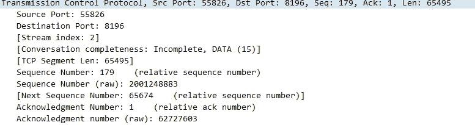

*   这里您可以看到 TCP 数据段的长度是 65495。现在 B(服务器)将这个长度保存在它的发送缓冲区中。

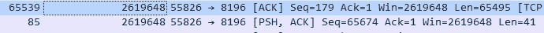

*   现在长度是 65495，序列是 65674。因为之前的序列是 179，然后我们发送 65495，因此这两个加在一起。
*   现在 A(客户端)向 B(服务器)发送 65495 个字节。现在把它返回给 a。在客户端发送确认之前，它会一直在服务器的发送缓冲区中。
*   因此，如果这个时间很慢/如果服务器花很多时间来响应，这意味着事务很慢，需要在服务器的发送缓冲区中保留更多数据而不清除。(即使它已经发送了那些数据)。所以现在传输很慢。

*   上述情况是由于 TCP 重新传输造成的。发生这种情况是因为 ACK 没有及时到达服务器，这可能是由于连接速度慢造成的。因此可能有多次重传。
*   **生存时间**——客户端和服务器之间的距离是多少/我们要通过多少个路由器。

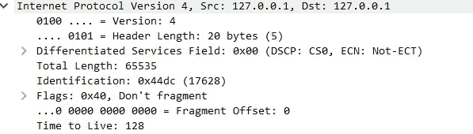

*   这是 128。
*   假设这个值是 120，这意味着从服务器到客户端有 8 跳。这表明我们正在走一条糟糕的路由路径，最好检查一下我们的 DNS，看看为什么我们要走这么长的路径才能到达服务器。

# **当计算出的窗口大小达到零时**

*   在这里，我使用了 pcapng 文件来演示它。

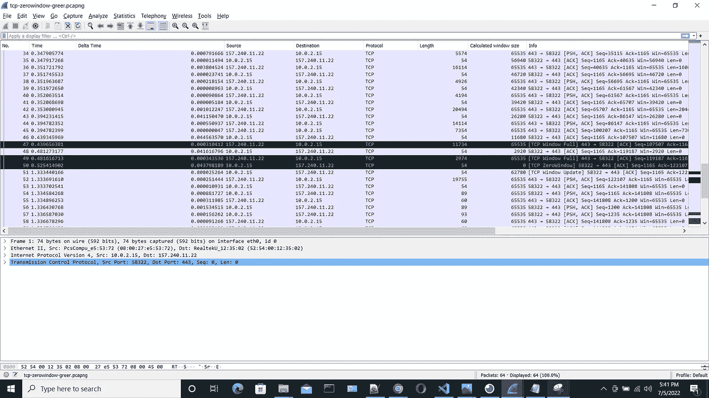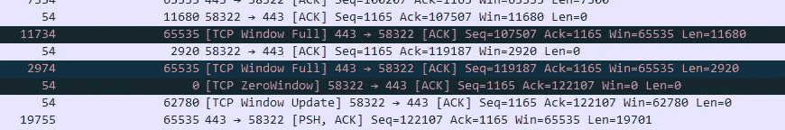

*   在这里，您可以清楚地看到计算出的窗口大小是如何不断下降的。
*   这里它结束了 TCP 0 窗口，一段时间后，下一个流量。我们可以在窗口更新中看到它。

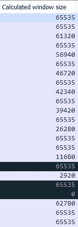

*   但是它没有超出我们最初协商的窗口大小。**那么为什么这个没有超过 65535 呢？**
*   现在看看这个握手。

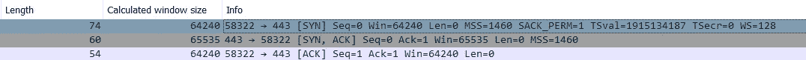

*   在客户端的握手过程中，它说窗口大小右窗口是 7(128 倍)。

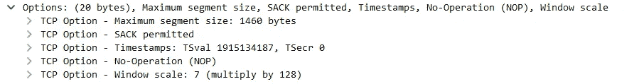

*   但是在服务器的 ACk 中，它不发送窗口大小，因为它不理解窗口大小是什么意思。
*   这可能是由某些原因造成的。

1.  低处理能力

2 .使用最小的 TCP 栈。

*   因此，我们只能发送数据。这里服务器读取数据的速度不同，这就是为什么我们可以看到它一直下降到零。所以客户端不会发送任何数据后，导致许多问题。

*   现在看看另一个场景。我将修改我开始时使用的第一个程序。

*   增加了 1 分钟的超时时间，并将 POST 改为 GET。

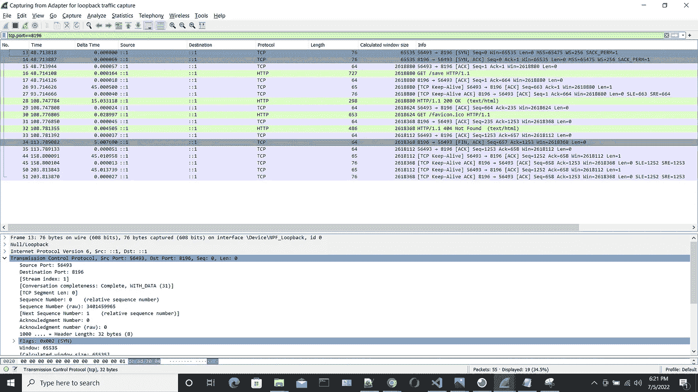

*   现在，您可以在这里看到，如果您取这个时间，在 45 秒后，它将发送 keep alive。

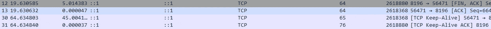

*   当您对此进行分析时，您可以看到，在 45 秒后，我们将发送一个保活报头。所以意思是服务没问题/网络没问题。因为增量时间总是在范围内

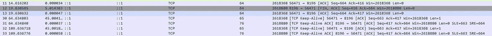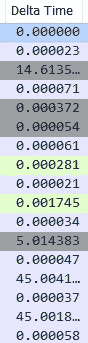

*   但问题出在应用程序内部，因为一旦你发出请求，直到 45 秒或 1 分钟，它都不会回应你。
*   因此，最好从服务端返回来看看为什么会发生这种情况。然后从服务器获取一个 TCP 转储，通过分析，我们可以检查出速度慢的原因。

**事实可查。**

*   **你需要注意 delta 时间**:因为它告诉往返时间，如果它增加会导致很多问题，比如 ACK 变慢。这导致重发过程中的数据和其他数据将停留在缓冲区内。
*   **计算出的窗口大小:**如果它一直下降，那么应用程序有问题。它可能不会以与数据发送相同的速度消耗数据。
*   **keep alive 报头频繁发送:**服务器正在等待，直到我们获得数据。

希望这篇文章能增加你的知识。

参考: