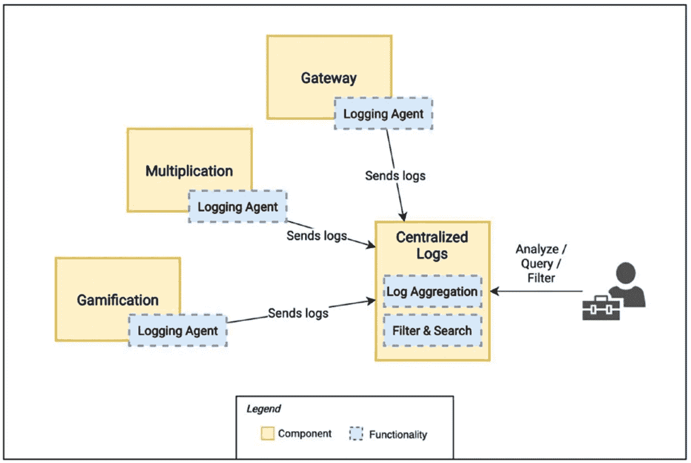
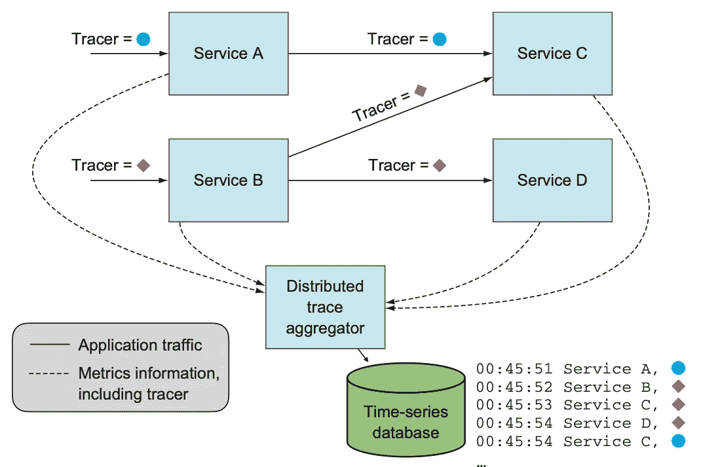

# 云原生应用故障排除

> 原文：<https://blog.devgenius.io/troubleshooting-a-cloud-native-application-62e3d34c9553?source=collection_archive---------12----------------------->

人为错误是不可避免的问题和失败的主要原因。这种失败的可能性随着[云原生](https://medium.com/@tobias.wittmann/what-is-cloud-native-2b4a6eae8c4a)应用的规模而增加。为了最大限度地减少平均停机时间，主动识别错误非常重要。对于这一点来说，所有必要的信息都是可用的，以找到这种错误的原因，这是至关重要的。理想情况下，这样的问题应该在用户注意到它们之前被发现[1]。为此，有多种机制可以帮助监控云原生应用[2]。下面将简要介绍这些机制。

[](https://medium.com/@tobias.wittmann/what-is-cloud-native-2b4a6eae8c4a) [## 什么是云原生？

### 云原生有许多不同的定义。一方面，这是因为云具有…

medium.com](https://medium.com/@tobias.wittmann/what-is-cloud-native-2b4a6eae8c4a) 

# 监视

为了能够在用户甚至注意到存在问题之前及时和适当地对错误和故障做出反应，必须对系统进行监控。必须从要监控的系统中收集数据，并将其转换成可用于分析问题的有价值的信息[1]。这是由所谓的度量标准提供的基础，度量标准被测量并随后被收集[1，3]。度量的例子是 CPU 和内存使用的百分比，或者成功处理的请求的比率。指标由在特定时间点测量的数据点组成，包括帮助描述和总结指标的标记和标签。指标总是在固定的时间点进行测量，选择正确的时间间隔非常关键。太小的间隔将导致太多的信息，很难从中得出有意义的结论。此外，间隔太小会导致性能问题，因为收集的数据查询过于频繁。另一方面，间隔太大提供的信息太少，这意味着分析不再可能[3]。

基于这些收集的信息，发送通知，即所谓的警报。当组件中出现问题或错误时，它们会发出通知。这种警报可以发送给个人或整个团队，以便他们能够对问题做出反应。然而，也有一些系统和工具可以自动处理某些问题和错误。这些系统也可以通过警报得到通知[4]。

# 记录

日志是分析错误的重要组成部分。这个概念本身并不新鲜，但是对于调试问题和错误分析已经很长时间了[5]。在 monolith 中，日志集中写在一个或多个文件中，以便于查找[6]。

云原生应用程序及其分布式服务为日志记录带来了新的挑战。这是因为许多单个组件中的每一个都产生自己的日志。由于伸缩的原因，组件通常不会只有一个实例，这导致了大量的数据。另一个困难是服务部署在没有持久存储的容器或无服务器功能中，因此当容器不再存在时，所有日志都会消失[5]。这两个问题的解决方案是在一个中央组件中收集和存储来自每个组件的所有累积日志。在这个中心组件中，可以通过服务搜索日志[7，6]。



# 描摹

在分布式云原生应用中，由于其有限且孤立的组件，每个请求通常会导致对其他组件的进一步请求，即整个请求链[2，6]。如果一个组件中出现错误，很难跟踪这个请求的过程，这导致了错误分析的困难[6]。当一个动作可以被几个事件触发时，问题就出现了[7]。

这个问题可以通过追踪来解决。在这种情况下，一个唯一的标识符被分配给每个传入的请求，并且这个标识符被给予每个进一步的内部请求[2，6]。然后，将该标识符添加到每个日志输出[6]中，并收集在中央组件中。加上额外的信息，比如时间戳，请求的历史可以跨不同的服务进行跟踪[2]。例如，在下图中可以看到，在服务 A 中收到的请求会导致对服务 C 的进一步调用。如果请求不是在服务 A 中收到的，就会出现这种情况。对服务 B 的独立调用也会导致对服务 C 的调用，然后是对服务 D 的请求[2]。



```
**References:**[1] K. Arora, E. Farr, J. Gilbert, and P. Zonooz, “Monitoring,” in Architecting Cloud Native Applications Design, ch. 8, pp. 231–249, Packt, 2019.[2] C. Davis, “Troubleshooting: Finding the needle in the haystack,” in Cloud Native Patterns, ch. 11, pp. 295–319, Manning Publications, 2019.[3] M. Chakraborty and A. P. Kundan, “Observability,” in Monitoring Cloud-Native Applications, ch. 2, pp. 25–54, Apress, 2021.[4] J. A. M. Iglesias, “Monitoring microservices,” in Hands-On Microservices with Kotlin: Build reactive and cloud-native microservices with Kotlin using Spring 5 and Spring Boot 2.0, ch. 10, pp. 300–322, Packt, 2018.[5] M. Chakraborty and A. P. Kundan, “Architecture of a modern monitoring system,” in Monitoring Cloud-Native Applications, ch. 3, pp. 55–96, Apress, 2021.[6] N. Lamouchi, “Meeting the microservices concerns and patterns,” in Pro Java Microservices with Quarkus and Kubernetes, ch. 10, pp. 277–290, Apress, 2021.[7] M. Macero Garcia, “Common patterns in microservices architectures,” in Learn Microservices with Spring Boot, ch. 8, pp. 283–415, Apress, 2020.
```