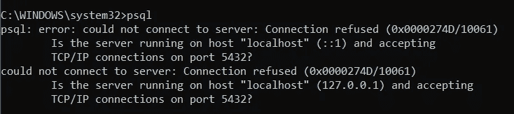
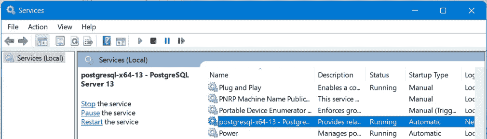
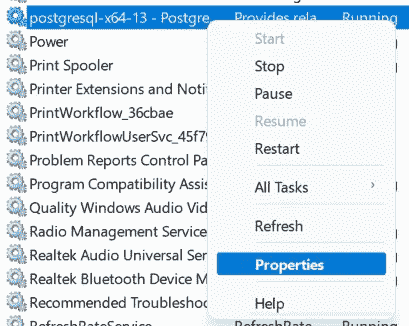
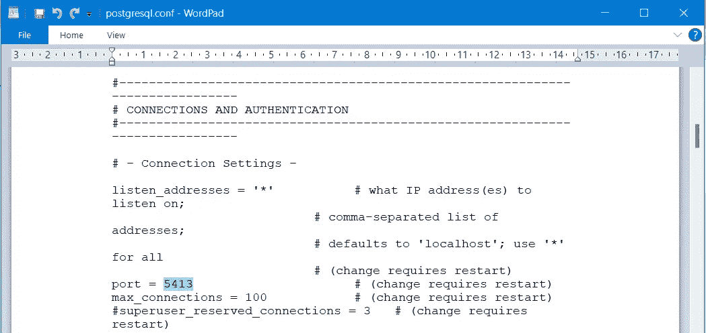
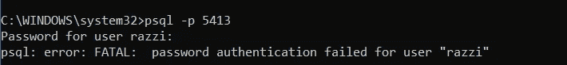
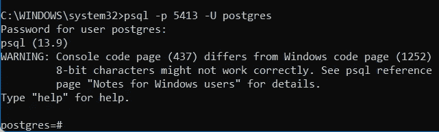
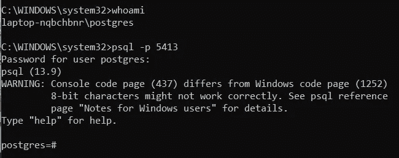
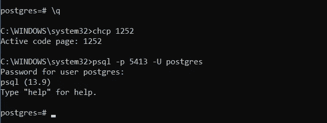

# Windows 上 PostgreSQL 安装问题的疑难解答

> 原文：<https://blog.devgenius.io/troubleshooting-postgresql-installation-on-windows-6b36f6addb4f?source=collection_archive---------4----------------------->


由[凯文·Ku](https://unsplash.com/@ikukevk?utm_source=medium&utm_medium=referral)在 [Unsplash](https://unsplash.com?utm_source=medium&utm_medium=referral) 上拍摄

在 Stack Overflow 中有一些关于 Windows 平台上 PostgreSQL 安装问题的讨论。其中包括:

`(1) An error occurred executing the Microsoft VC++ runtime installer`

`(2) psql: error: could not connect to server: Connection refused`

`(3) psql: error: FATAL: password authentication failed for user “xxxxx”`

第一个问题与安装前问题有关，而第二个和第三个问题与安装后问题有关。

为了解决预安装问题，建议开发者使用 Chocolatey(虫火谷)安装方法。它将下载 PostgreSQL 的所有先决条件。按照步骤在处安装虫火谷[，即](https://chocolatey.org/install)[https://chocolatey.org/install](https://chocolatey.org/install)。

安装虫火谷后，访问 https://community.chocolatey.org/packages/postgresql13[按照 PostgreSQL 的安装指南进行操作。虫火谷网站提供了如下所示的自定义安装脚本示例。](https://community.chocolatey.org/packages/postgresql13)

```
choco install postgresql13 --params '/Password:test /Port:5433' --ia '--enable-components server,commandlinetools'
```

该脚本告诉虫火谷为默认用户“postgres”安装密码为“test”的 PostgreSQL 版本 13，然后将服务设置为在端口 5433 运行。

PostgreSQL 安装完成后，开发人员将能够通过一个名为 PSQL 的程序使用服务器。PSQL 开始运行时会出现两个常见问题；(1)无法连接到服务器，(2)密码验证失败。除此之外，可能还有与字符编码(即代码页)相关的警告消息。

# (1)无法连接到服务器



这里，PSQL 告诉我们它无法连接到服务器，并建议我们检查 PostgreSQL 服务的状态。运行 Windows 服务管理器(按 WIN 按钮，键入 services.msc，然后按 ENTER)。检查列表中是否有 postgresql 服务。如果服务尚未运行，请单击启动按钮。



如果服务已经启动，但错误消息仍然存在，请返回到 Windows 服务管理器，右键单击 postgresql 项目，然后选择属性。



看看下面显示的“可执行文件路径”条目。复制数据路径，例如`“C:\Program Files\PostgreSQL\13\data”`

```
"C:\Program Files\PostgreSQL\13\bin\pg_ctl.exe" runservice -N "postgresql-x64-13" -D "C:\Program Files\PostgreSQL\13\data" -w
```

进入数据路径文件夹，找到配置文件，即`postgresql.conf`文件。它是 PostgreSQL 的主配置文件，也是配置参数设置的主要来源。检查该文件中提到的端口号是否与虫火谷自定义安装脚本中包含的端口号相似(例如 **5433** )。如果不是，使用文件中声明的值。例如，下面的配置文件使用 **5413** 。



尝试使用 port 参数运行 PSQL，即

`psql -p 5413`

# (2)密码错误

一旦检测到正确的端口，PSQL 将对用户进行身份验证。默认情况下，它将本地主机用户名作为登录名，而登录名通常不是“postgres ”,因此默认密码(在虫火谷自定义安装脚本中指定)将不起作用。



添加另一个参数，将 **postgres** 设置为登录用户名，即

`psql -p 5413 -U postgres`

然后键入密码，例如`test`(基于上面的虫火谷自定义安装脚本)。



或者，创建一个名为“postgres”的 Windows 用户，并使用该帐户运行 psql。(提示:使用控制台命令`whoami`检查本地机器的当前用户)。



这两种方法都有助于解决密码错误。

# (3) PostgreSQL 代码页警告

现在用户已经成功登录，PSQL 可能会报告一条警告消息，指出控制台代码页不同于 Windows 代码页。要解决代码页问题，请退出 PSQL，即`\q`。键入终端命令`chcp 1252`，然后再次登录。警告现在应该已经消失了。



问题已解决😊