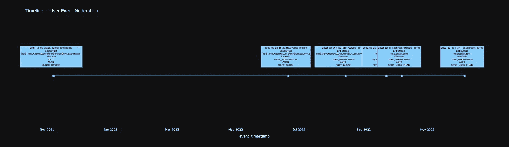

# Python 中的信任和安全用户事件时间线图

> 原文：<https://blog.devgenius.io/trust-and-safety-user-events-timeline-plot-in-python-2f6efd0b486d?source=collection_archive---------7----------------------->

# 背景

大多数公司都有一个部门负责审核/监控用户的活动。无论是欺诈、诈骗、账户接管等。一些不受欢迎的行为，有人在监视着。这是必要的邪恶，因为我们中的一些人是不必要的邪恶。

# 概念

这个图表背后的想法是，通过一个拼凑的图，将这些不想要的事件的时间线可视化。

在某个地方可能有更好的情节，在某个#python 库中，但是我更喜欢#plotly。即使他们没有一个标准的时间线图。[阴谋地](https://medium.com/u/5fdd6522cd45?source=post_page-----2f6efd0b486d--------------------------------)来吧！因此，我通过 plotly 的图形对象库建立了一个转换图。

现在，有一百万个不同的参数可以插入，我已经使用了一些，但如果你想寻找额外的情节特征，你可以在 plotly 中做几乎任何事情。那里有一个非常好的社区。plotly 上有很多 stack overflow 帖子，还有一个论坛可以发布问题。我真的很感激！

# 密码

我必须假设你已经有了一个数据框架。公开发布#SQL 查询很棘手。你不希望发布敏感信息，如数据库、表格或用户信息。因此，让我们假设您有一个数据帧，其中包含一些用户事件级别的信息列。

下面的代码，你必须指定一些参数，比如你想在每个注释中包含的列(在函数中注明)。但除此之外，这是很好的去！

# 真正的书呆子的有趣花絮

这个图真的是散点图。但是我藏了 y 轴。我还遍历了每个注释，因为手动指定每个注释在图中应该出现的位置的想法听起来像是打电话给一群企业购买您的产品。我就是不打算那么做:)。因此，函数中间的循环接受 3 个参数:和`x, y and columns to include in the annotation`，并根据传入的 x 和 y 列对它们进行定位。在我的例子中，是 T1 和虚拟 y 柱 T2。

这段代码中另一个奇怪的地方是放置每个注释框的位置。我开始想“嗯，我将使用 x，y 列，考虑到这些框需要相当大以便阅读，它们与图的组合只能大到适合屏幕…让我们创建一列随机数字，每个数字之间的距离最小，看看这是否可行”。它没有。嗯，确实是这样——但是我明白了这个想法，并决定创建一个函数，根据行索引是正还是负来指定彼此相反的数字。这样效果更好！这是第一个子功能。

# 这些图表的进展

如果你好奇的话:

# 最后要:

我希望这能为你们节省一些时间！

感谢阅读。

马克斯