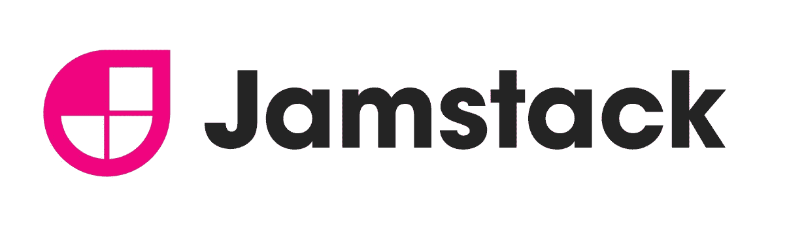
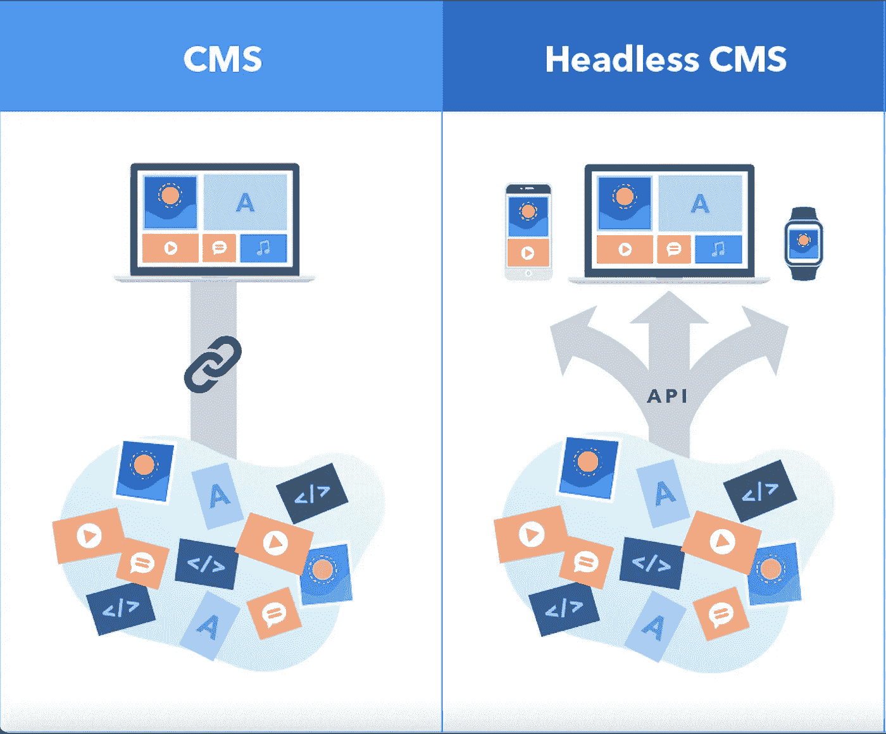
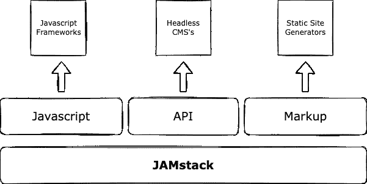
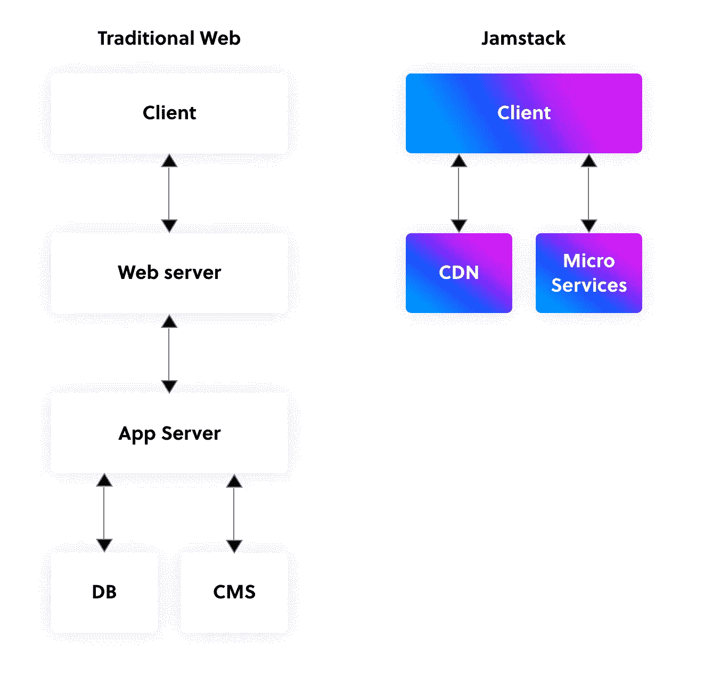

# 尝试 JAMstack 架构

> 原文：<https://blog.devgenius.io/trying-my-hand-at-jamstack-architecture-a2a505ee1009?source=collection_archive---------14----------------------->

构建我的第一个 JAMstack 应用程序时的一些注意事项

我最近完成了一个兼职项目，涉及将一个具有传统服务器客户端架构的网站重新构建为一个基于现代 JAMstack 架构的新网站。我想写一篇文章来解释我从中学到的一些概念。

然而最重要的是，我的意图是试图用通俗的语言向阅读这篇文章的人解释什么是“JAMstack”网站；不管你有没有技术知识。

# 这是我的目录:

*   解包并定义 JAMstack 架构。
*   对比传统的客户机服务器体系结构和 JAMstack 体系结构。
*   JAMstack 架构的优势
*   结论**。**

# 让我们打开包装，定义这个概念:

JAMstack 是一个描述现代 web 开发架构的术语。正如“栈”这个词所暗示的，它不是一个特定的技术栈，而是一种构建应用程序和网站的独特方法。
“JAM”外壳代表 **Javascript、** **API** 和**标记**这些都是这个架构中需要的通用工具和技术。

## **Javascript** :

这是网络上占主导地位的客户端脚本语言，97%的网站使用它；因此，毫无疑问，它将成为该架构中使用的主要编程语言。如前所述，JAMstack 并没有规定您应该使用的工具，因此任何 ***Javascript 框架*** 或库都可以使用。

这里有一篇有趣的文章，你可以查看来了解更多关于 Javascript 框架的知识。对于我的项目，我选择了 [**React.js**](https://reactjs.org/) 。

## 美国石油学会:

代表“应用程序编程接口”。API 是一个软件中介，它允许两个应用程序相互对话。在 JAMstack 架构中，API 位于我们的表示层(即我们的网站或应用程序)和一个“*”无头内容管理系统( ***【无头内容管理系统】)*** 或任何 ***微服务*** 之间。在这篇文章的后面，我会更深入地研究一下 ***微服务*** 。*

*一个 ***无头 CMS*** 是任何类型的后端系统(通常是第三方服务)，为我们的应用程序或网站中使用的数据提供托管和内容管理。术语“无头”传达了这样一个事实，即它不仅仅局限于一个表示层，它可以插入到多个表示层中。
像 **Wordpress** 这样的传统内容管理系统一次只能管理一个面向网页的平台。*

*在一个数字平台不断发展的世界里，公司现在正在开发网站、移动网站、应用程序、数字显示、对话界面等等； ***无头 CMSs*** 允许您将内容和资产插入任何当前和未来的表示层或设备，从而提供更大的灵活性和可扩展性。*

**

*受限的传统 CMS 与灵活的无头 CMS*

*所以要把事情追溯到我们的 ***果酱*** 的缩写；保存在 ***无头 CMS*** 中的内容通过***API***交付。对于我的项目，我选择了****。** 这里是其他无头 CMS 的[列表，你可以从中选择。](https://jamstack.org/headless-cms/)***

## *****标记**:***

***JAMstack 网站是作为静态的 [HTML](https://www.w3schools.com/html/html_intro.asp) 文件，或者静态的“标记”提供的。
对我的非技术人员来说，HTML 代表“超文本标记语言”。[除了其他东西](https://www.w3schools.com/html/html_intro.asp)，HTML 描述了网页的结构。
jam stack 网站的承诺之一是*速度！这是通过交付一个由一个或多个 HTML 网页组成的静态网站来实现的，这些网页每次都以相同的方式加载。
相比之下，动态网站会根据任何变化的数据输入(例如，一天中的时间、用户的位置或任何其他用户输入)进行不同的加载。

这一切都是通过 ***【静态站点生成器】***(*s)实现的。
一个**一个 *SSG* 一个**是一个基于原始数据和一套模板生成全静态 HTML 网站的工具。本质上，一个静态的站点生成器自动完成编码单个 HTML 页面的任务，并提前准备好这些页面提供给用户”(由 [Cloudfare](https://www.cloudflare.com/en-ca/learning/performance/static-site-generator/) 定义)。*****

***我选择的也是我在项目中使用的 SSG 是 [**NextJS**](https://nextjs.org/) ，它构建在[**react . js**](https://reactjs.org/)**Javascript 框架之上。这里有一份你可以从中挑选的**SSG**列表。*****

**********

*****JAMstack 架构中使用的工具的可视化分解。*****

# *****客户端服务器架构与 JAMstack 架构*****

**********

*****传统网站有*的客户端-服务器架构。网站必须一直在服务器上运行。******

******要求服务器按需提供数据/信息。每当一个客户端请求一个页面时，服务器就准备好这个页面并作为响应发送给客户端(客户端指的是我们的网页或应用程序)。服务器托管、交付和管理客户端请求的大部分资源和服务。******

******这种架构通常被定义为"*"，因为这种架构有许多可移动的部分，如上图所示。*******

*******JAMstack 架构从主机基础设施(如 web 服务器)中移除了多个移动部件和系统。你基本上只需要一个**内容交付网络(CDN)** 和**微服务。*********

*******一个 **CDN** 是分布在世界不同地点的服务器的分布式网络。它保存一份你网站的缓存副本，并把它发送到你网站访问者地理位置附近的服务器上。通过这种方式， **CDN** 被设计为尽可能快地加载你的站点！*******

*******我选择的 CDN 是 [Vercel](https://vercel.com/) 。其他比较流行的还有[亚马逊的 z AWS cloudfront](https://aws.amazon.com/cloudfront/) 、[谷歌云](https://cloud.google.com/cdn)、 [Netlify](https://www.netlify.com/) 、 [Akamai](https://www.akamai.com/) 等等……不一而足。今天，CDN 非常受欢迎和广泛，大部分网络流量都是通过它们提供的。*******

*********微服务**，这里的[定义为](https://jamstack.org/glossary/microservice/)，指的是“一个编程范例，其中一个大型应用程序的许多部分被分解成具有较小职责的不同单元。”*******

*******这种范式有助于脱离整体结构，并将任何功能分解成更小的组。
API 微服务很受欢迎。它们是专门的第三方服务，帮助管理我们在任何网站或应用程序中找到的最常见的功能。*******

*******这里有几个例子:*******

*   *******在我的 JAMstack 应用程序的上下文中；通过*API 从[**my Headless CMS of choice**](https://www.contentful.com/)中检索信息和内容的能力本身就是一个 ***微服务*** 。********
*   ******如果你的网站需要用户认证的功能，比如说通过[auth0.com](https://auth0.com/)的服务；那是一辆 ***微服*** 。******
*   ******如果你需要通过你的网站接受和处理支付，你可以使用 [Stripe](https://stripe.com/en-ca) 的 API 将该功能集成到你的应用中…哦，另一个**T3微服务。********

# ******JAMstack 的优势:******

******如果 JAMstack 体系结构的标准得到正确实施，它可以带来许多好处。******

## ********更好的性能**:******

******正如前面在 ***标记*** 定义中提到的，JAMstack 架构承诺快速网站:“JAMstack 应用程序中几乎所有的内容都是由 CDN 提供的静态 HTML 文件组成的。这是向最终用户提供网络内容的最快方式”。([云闪](https://www.cloudflare.com/learning/performance/what-is-jamstack/))******

******此外，正如我们在 **CDN** 的定义中所看到的，它们允许快速转移加载网站内容所需的资产，从而实现超快速的网站，进而提供更好的整体用户体验。******

## ********更好的安全性**:******

******“JAMstack 体系结构从主机基础架构中移除了多个移动部件和系统，从而减少了需要防御攻击的服务器和系统。”([https://jamstack.org/why-jamstack/](https://jamstack.org/why-jamstack/))
再也不用担心服务器或数据库的漏洞了。******

## ********维修性**:******

******由于托管复杂性大大降低，这意味着网站和应用程序更容易维护。服务器通常需要修补、更新和严密维护。这不再是 JAMstack 的问题。******

## ********开发者体验:********

******另一个显著的好处是为开发人员提供了更好的开发体验。由于这种架构的技术不可知性质，开发人员有大量的工具和约定可供选择，因此找到开发人员来构建 JAMstack 站点并不困难。******

# ******结论******

******因此，我们已经看到 JAMstack 是一个现代的 web 开发架构，专注于摆脱传统的客户机-服务器整体主义和传统 CMS 平台的限制范围。相反，它倾向于一种无服务器架构，大幅减少其移动部件，以及一种旨在跟上数字平台格局及其所需内容多样性的无头 CMS 系统。这种“堆栈”的技术不可知性质使开发人员可以自由地使用大量的工具，允许他们使用最有效的工具来构建您的项目。因此，JAMstack 可以被称为“未来证明”的原因是显而易见的。******

******所以我们有它！希望你能从这篇文章中学到一些东西，感谢你的阅读！:)******

## ******资源******

*   ******【JAMstack 官方网站******
*   ******[Javascript](https://en.wikipedia.org/wiki/JavaScript)******
*   ******[Javascript 框架](https://developer.mozilla.org/en-US/docs/Learn/Tools_and_testing/Client-side_JavaScript_frameworks)******
*   ******[React.js](https://reactjs.org/)******
*   ******[无头内容管理系统](https://www.contentful.com/r/knowledgebase/what-is-headless-cms/)******
*   ******[无头 CMS 列表](https://jamstack.org/headless-cms/)******
*   ******[心满意足](https://www.contentful.com/)******
*   ******[HTML](https://www.w3schools.com/html/html_intro.asp)******
*   ******[静态现场发电机](https://www.cloudflare.com/en-ca/learning/performance/static-site-generator/)******
*   ******[T21**SSGs**清单】](https://jamstack.org/generators/)******
*   ******[缓存](https://en.wikipedia.org/wiki/Cache_(computing))******
*   ******[Cloudfare](https://www.cloudflare.com/en-ca/learning/performance/static-site-generator/)******
*   ******[微服务](https://jamstack.org/glossary/microservice/)******