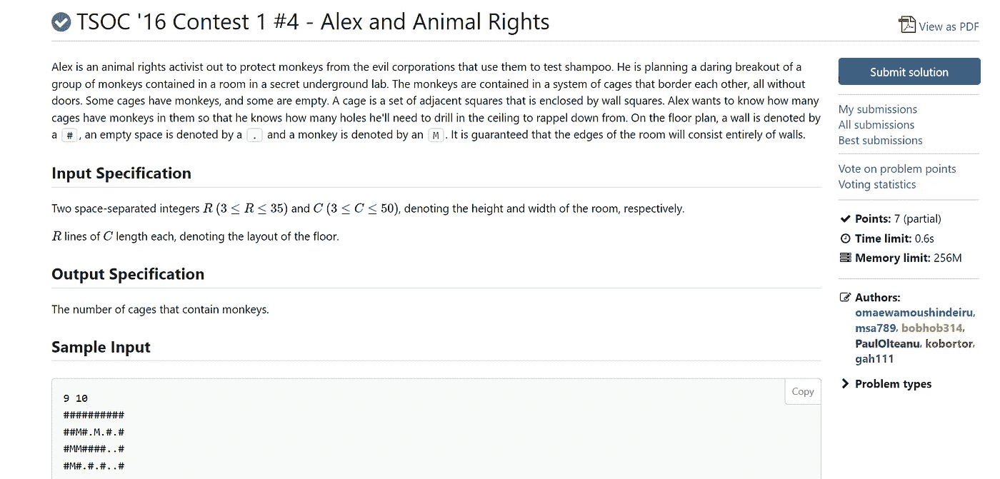
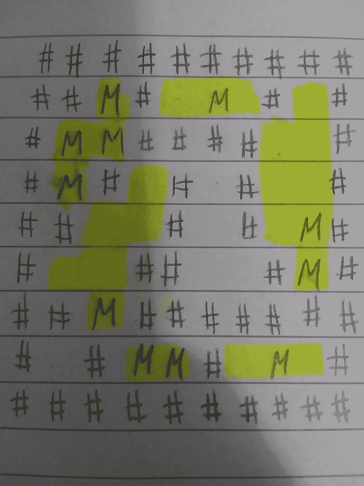
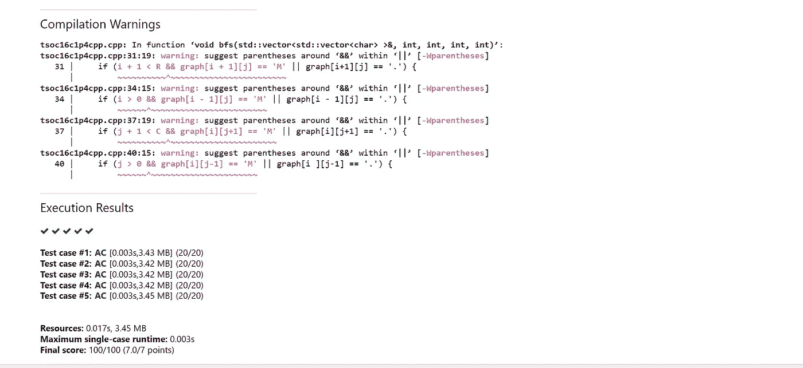

# TSOC 2016 年竞赛 1 # 4-亚历克斯和动物权利

> 原文：<https://blog.devgenius.io/tsoc-16-contest-1-4-alex-and-animal-rights-496f466bbf83?source=collection_archive---------15----------------------->



[这个问题](https://dmoj.ca/problem/tsoc16c1p4)算是图的问题吧。基本上，有猴子，用“M”表示，困在笼子里，笼子的壁用“#”表示。我们必须找出有多少笼子里有猴子。让我们从分析第一个样本输入开始，然后想出一个解决这个问题的方法。

这是第一个样本输入的样子。请注意，我已经突出显示了包含猴子的笼子。



注意，中间的笼子里没有猴子，所以我们不数它。这给出了 6 的预期输出。

现在让我们开始考虑一种方法。如果你已经解决了 Leetcode 的岛屿数量问题，你应该知道如何从这里开始。用图论的术语来说，问题是问我们一只猴子包含多少个连通的部分。那么，我们如何着手解决这个问题。

嗯，您可以遍历“图形”或者更确切地说是网格，如果您看到一只猴子(M ),您可以增加一个计数器，运行深度或宽度优先搜索，并用一堵墙(#)替换所有访问过的节点。这防止了重新计算笼子和猴子。请注意，我选择用“#”替换已访问的节点，因为如果我们选择“.”这将导致一个无限的循环，我发现了“艰难”的方式。让我们现在就开始实施。

让我们来回答这个问题“为什么这样做？”当你穿过格子时，你会遇到猴子。这部分理解。然后在看到一只猴子时，你的代码应该/将要调用一个 DFS/BFS 函数。建议将它放入一个函数中，使你的代码在将来的工作面试中更容易阅读和理解。这是因为你遇到了一个无人问津的笼子。我说它未被访问的原因是因为在图的遍历函数中，你将被访问的节点标记为墙，或者如果你愿意的话，标记为界外。这与维护一个被访问的集合是一样的，但是不需要额外的空间/时间。您的 BFS/DFS 将负责探索笼子的最大范围。一旦完成，可以说整个笼子本身就“消失”了，你将无法再去探索它。你对每一个装猴子的笼子都这样做，最终将不会再有猴子的笼子了。然后就可以输出你的答案了。

首先，我们需要深度优先搜索功能。我将递归地对此进行编码，但是您可以选择迭代地这样做，或者甚至选择广度优先的变体。下面是我如何实现深度优先搜索的:

```
void dfs(vector<vector<char>>& graph, int i, int j, int R, int C) {
    graph[i][j] = '#';
    if (i + 1 < R && graph[i + 1][j] == 'M' || graph[i+1][j] == '.') {
        dfs(graph, i + 1, j, R, C);
    }
    if (i > 0 && graph[i - 1][j] == 'M' || graph[i - 1][j] == '.') {
        dfs(graph, i - 1, j, R, C);
    }
    if (j + 1 < C && graph[i][j+1] == 'M' || graph[i][j+1] == '.') {
        dfs(graph, i ,j+1, R, C);
    }
    if (j > 0 && graph[i][j-1] == 'M' || graph[i ][j-1] == '.') {
        dfs(graph, i, j-1, R, C);
    }

}
```

正如您在代码中看到的，我们用' # '替换了当前节点，以便不在并发迭代中探索它，并且我们确保我们没有越界(离开图表)或穿越墙壁。然后是主要功能。这看起来会像这样:

```
int main()
{
    int R, C;
    cin >> R >> C;
    vector<vector<char>> graph(R, vector<char>(C));
    for (int i = 0; i < R; i++) {
        for (int j = 0; j < C; j++) {
            cin >> graph[i][j];
        }
    }
    int counter = 0;
    for (int i = 0; i < R; i++) {
        for (int j = 0; j < C; j++) {
            if (graph[i][j] == 'M') {

                counter++;
                bfs(graph, i, j, R, C);
            }
        }
    }
    cout << counter << endl;

}
```

我希望这有助于您理解这个连接组件问题。如果有的话，请随意留下一个赞，并留下你想让我尝试的任何其他问题的评论。

