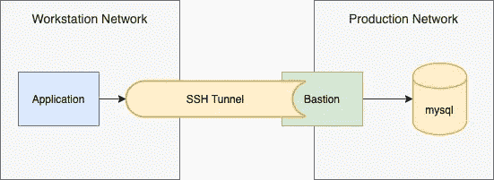
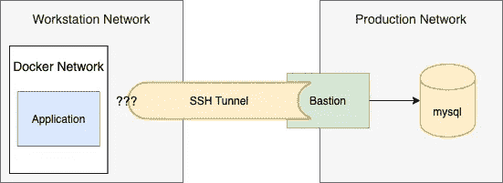
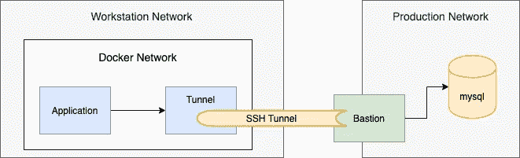

# 从 Mac 上的 Docker 建立隧道

> 原文：<https://blog.devgenius.io/tunneling-from-docker-on-a-mac-5c5395d791f7?source=collection_archive---------1----------------------->

这可能更适合作为堆栈溢出的答案，但我认为这个答案非常有趣，我会写一篇关于它的中型文章。

首先，我们来定义一下问题:

直到今天，希望为开发目的创建 SSH 隧道的开发人员只需启动另一个终端并运行带有 forward tunnel 命令的 SSH 命令，例如

```
ssh -N -L 3306:mysqlserver.internal:3306 user@bastion.com
```

然后，他们将配置他们的开发环境来连接到他们的 MySQL 服务器的 localhost:3306，而不是直接连接到未公开的 mysqlserver.internal。



没有 Docker 的隧道

2020 年，你很可能使用 Docker 开发你非常酷的应用，这意味着你的应用的网络不再是你的主机的网络。这意味着天真地连接到 localhost:3306 **是行不通的。**



使用 Docker 隧道

# 啊哦…那我们接下来该怎么办？

所以既然明白了问题，那就来说说怎么解决吧。

我们可以采取一些方法:在主机网络上运行您的 docker，找到一种从 docker 内部连接回主机的方法，或者在 docker 内部运行隧道(无论是您的应用程序 docker 还是同一 docker 网络中的一个单独的 docker)。

# 在主机网络上运行 Docker

可以使用以下命令在主机网络上运行 docker:

```
docker run --network host
```

这是最理想的解决方案，因为它只是取消了 Docker 网络。但是有什么问题呢？

> `host`网络驱动程序仅适用于 Linux 主机，不支持 Mac 版 Docker Desktop、Windows 版 Docker Desktop 或 Windows Server 版 Docker EE。

(此处阅读更多:[https://docs.docker.com/network/network-tutorial-host/](https://docs.docker.com/network/network-tutorial-host/))

因此，如果你是一个 Linux 开发人员，你可以按 Ctrl+W，去读别的东西。但那些使用 MAC 和 Windows 机器的人截至今天还不能使用 Docker 桌面客户端做到这一点。

# 连接回您的主机

显然，从 docker 内部连接回您的主机是可能的。问题是你必须查看现有的接口，找到你的主机的 IP 地址，而不是使用一个固定的主机名，比如“localhost”。

你可以在[这个堆栈溢出答案](https://stackoverflow.com/questions/17770902/forward-host-port-to-docker-container)中阅读更多关于如何做到这一点的信息。

因此，如果你想要快速和肮脏的东西，这个解决方案可以很容易地为你工作。但是如果你想建立一个合适的开发环境，你不能每次都依赖于找到你的主机的 IP 地址。

# 在你的容器里运行隧道

另一个简单的解决方案，但是由于 Docker 的最佳实践，应该避免使用。所以让我们跳过这个选项。

# 在新 Docker 网络的专用容器内运行隧道

也许最干净和最可靠的方法是对接你的隧道，并连接到你的 MySQL 服务器，就像它是一个远程主机。

这可以手动完成，也可以使用 Docker 编写器完成。我们将手动执行，以便更好地解释发生了什么。这需要我们做 3 件事:

1.  创建一个新的码头网络
2.  在您创建的网络中启动您想要访问的 docker
3.  建立一个隧道码头，并把它放在你创建的网络上

它看起来怎么样？



使用专用容器进行隧道传输

要创建 docker 网络，我们只需运行:

```
docker network create mynetwork
```

现在我们有了一个新的网络，我们可以在我们的应用程序和隧道 dockers 上使用`--network mynetwork` 参数。

让我们使用一行程序来执行 SSH，而不是构建 Docker 文件，因为我们可以很容易地在 Docker Hub 上找到已经安装了 SSH 并做了一些配置的 Docker。

这是:

```
docker run \
  --network mynetwork \
  --name dbtunnel \
  -v ~/.ssh:/root/.ssh \
  kroniak/ssh-client \
    ssh -v -o StrictHostKeyChecking=no \
    bastion.com \
    -N \
    -L 0.0.0.0:3306:mysql.internal:3306
```

在这个例子中，我使用了看起来运行良好的`[kroniak/ssh-client](https://hub.docker.com/r/kroniak/ssh-client/)`,但是我很确定还有很多其他的已经预装了 SSH。

在我们将它用作一行程序之前，我们需要用三个重要参数设置容器:

1.  我们之前提到的`network`参数，以便在您的应用程序和隧道对接程序之间建立连接
2.  `name`参数，设置 docker 的主机名。在本例中，`dbtunnel`是所选择的名称，这将是您的应用程序为了能够访问数据库而要连接的主机名。
3.  一种传递 SSH 密钥的机制——要么将`.ssh` a 目录映射到 docker(简单),要么使用`ssh-agent`,这需要一点额外的工作，但总的来说是一种更好的方法。

现在我们已经设置了 docker 命令，我们终于可以构造 SSH 命令了。一些重要的提示:

1.  需要提供`-o StrictHostKeyChecking=no`参数，以便连接会由于容器无法将您正在连接的主机名添加到已知主机列表中而失败。这是因为该命令没有磁盘状态它可以存储这一点，也不是一个交互式应用程序。我们可以让它存储状态，但是如果容器不需要状态，这是一个不好的做法。
2.  隧道命令`-L`需要有第四个部分，告诉容器监听来自任何地方的连接(因此有了`0.0.0.0`)，而不是默认的本地主机`127.0.0.1`。请记住，这里的 localhost 指的是`dbtunnel` docker，而不是您的主机。
3.  `-N`和`-v`命令只是让命令更有用——它们删除了接口，让命令更冗长。

隧道快乐！