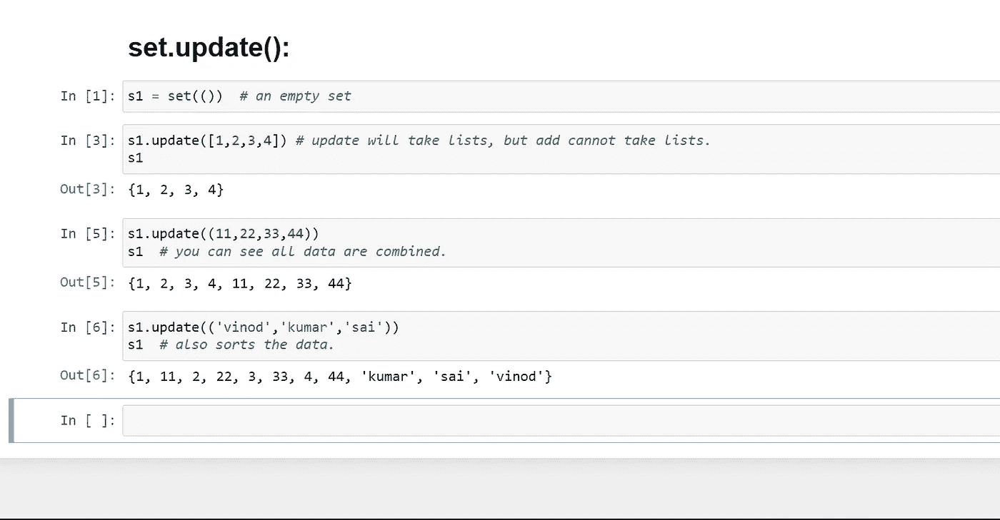

# 元组、集合和字典

> 原文：<https://blog.devgenius.io/tuples-sets-and-dictionary-8b4db2b23f64?source=collection_archive---------8----------------------->

伙计们，我们以前讨论过列表，现在我们将继续列表后的主题。

元组、集合和字典是非常小的主题，它们的操作也很少。所以我把这三个话题放在一个博客里。

下面我们就来详细了解一下这些话题。

# 01.元组:

元组用于在单个变量中存储多个数据项。Tuple 是 Python 中用于存储数据集合的 4 种内置数据类型之一。

在向元组中添加数据时，字母和名称应该用括号括起来，如(' Vinod '，' g ')。对于数字，它不是强制性的，你可以直接添加，而不用括号。

元组是有序的并且**不可改变的**的集合。

元组用圆括号写，()。

有可能把列表转换成元组吗？

是的，你可以将列表转换成元组，让我们看看如何转换。

所以我们可以在元组中执行的操作是:

01.数数，

02.索引。

我们只能对元组执行两个操作。

# 01.元组.索引( ) :

tuple index()方法**帮助我们找到 tuple** 中某个元素的索引或出现位置。

该功能主要执行两个功能:

1.  给出元组中第一个出现的元素。
2.  如果在元组中没有找到提到的元素，则引发异常。

英寸 index()操作，您应该将值作为参数给出。

# 02.元组.计数( ) :

count()方法**返回指定值在元组**中出现的次数。

英寸 count()你也将给出值作为参数。

这是我们能够在元组中执行的两个操作。尽管元组是不可变的，所以你不能像我们在 list 中那样添加或删除元组中的数据。

如果你想添加任何数据到元组，创建一个列表并添加你想要的数据，然后转换成元组。您可以使用+，tuple1 + tuple2 连接两个元组。

在您的练习中，您尝试将元组转换为列表，然后将列表转换为元组。要将元组转换为列表，请使用关键字列表而不是元组。

# 另一种数据类型是集合。

# 集合:

集合**用于在单个变量**中存储多个项目。Set 是 Python 中用于存储数据集合的 4 种内置数据类型之一。

集合是一个无序的、不可改变的*和无索引的集合。

集合也写入(集合数据)中。

如果你像这样给 normally()并存储数据，它会认为这是一个元组。所以用“set”关键字初始化集合。比如 set1 = set(数据)

所以输出格式是这样的→ {output}。

集合有一个优点，那就是有助于获得清晰的数据。它将对你的数据进行排序，并按升序排列。

因此，我们可以在集合中执行的操作有:

1.  增加
2.  清楚的
3.  复制
4.  差异
5.  差异 _ 更新
6.  抛弃
7.  交集
8.  交集 _ 更新
9.  isdisjoint
10.  issubset
11.  发行人
12.  流行音乐
13.  去除
14.  对称 _ 差异
15.  对称 _ 差异 _ 更新
16.  联盟
17.  更新

我将解释一些操作，你可以尝试其他操作。

# 01.set.add():

可以使用内置的 **add()** 函数将元素添加到集合中。使用 add()方法一次只能将一个元素添加到集合中。

循环用于通过 add()方法一次添加多个元素。

**注意:** 列表不能作为元素添加到集合中，因为列表是不可散列的，而元组可以添加，因为元组是不可变的，因此是可散列的。

# 02.set.update():

对于两个或更多元素的添加，使用 Update()方法。

update()方法接受列表、字符串、元组以及其他集合作为其参数。在所有这些情况下，都要避免重复的元素。

更新和添加是相似的，但是这个更新也将列表作为一个参数。

# 03.set.remove():

可以使用内置的 remove()函数从集合中删除元素，但是如果集合中不存在该元素，就会出现 KeyError。

要从没有 KeyError 的集合中删除元素，请使用 discard()，如果该元素不在集合中，它将保持不变。

# 04.set.pop():

Pop()函数也可以用来从集合中移除和返回一个元素，但是它只移除集合中的最后一个元素。

你只要自己试试，这和拆卸是一样的。用 pop()替换 remove 函数。

# 05.set.clear():

为了从集合中删除所有元素，使用了 clear()函数。

只是→ set.clear()。

**您可以在集合中进行类型转换，这意味着您可以将不同的数据类型转换成集合:**

这些是集合中的主要运算，其余的运算是并、交、反并、单子集等数学过程。对于其他操作，请查看我的 YouTube 频道，链接在文章下方，或者尝试参考 python 文档了解详细内容。

# 另一种数据类型是字典。

# 词典:

**Python 中的 Dictionary** 是数据值的无序集合，用于像 map 一样存储数据值，这与其他只保存单个值作为元素的数据类型不同。

字典保存**键:值**对。字典中提供了键值以使其更加优化。

可以通过在花括号 **{}** 内放置一系列元素来创建字典，用逗号分隔。Dictionary 保存成对的值，一个是键，另一个对应的 pair 元素是它的 **Key:value** 。

字典中的值可以是任何数据类型并且可以重复，而键不能重复并且必须是不可变的。

字典键区分大小写，相同名称但不同大小写的键将被区别对待。

我们可以把 list 转换成 dict，因为 dict 是 key:value 对，list 里没有 key:value。

所以我们可以在字典中执行的操作是:

1.  清楚的
2.  复制
3.  fromkeys
4.  得到
5.  项目
6.  键
7.  流行音乐
8.  流行项目
9.  设置默认值
10.  更新
11.  价值观念

dict 中没有 add 操作，但是我们可以这样添加数据:

# 01.dict.get():

这将有助于从字典中访问元素。此方法接受键作为参数并返回值。

# 02.dict.keys():

Dict.keys()也做同样的事情，比如 get()，它将检索所有的关键数据。

**语法:**字典键()

# 03.dict.values():

Dict.values()将检索 Dict 中的所有值数据。

**语法:**字典值()

# 04.dict.items():

Dict.items()将以 key:value 格式检索 Dict 中的所有数据(键和值)。

**Synatx :** dict.items()

# 05.dict.pop():

Dict.pop()用于删除项目。

**语法:** dict.pop(唯一键)

你必须给钥匙才能弹出数据/删除数据。

这些是 dict 中的主要操作。如果你想要更多，请查看我的 youtube 频道并练习。

伙计们，今天的话题到此结束。我们将在 python 中遇到另一个话题，直到我们练习好为止。你是职业选手，你能做到。

爱你们所有的人。

如果我在某个地方犯了拼写错误，对不起，请忽略并尝试通过谷歌搜索自己，它会帮助你。

谢谢你。

*******************************************************************

*希望你明白这个简单的概念。所以我计划用一种简单的方式写一篇关于每一个与 python 相关的概念的博客，在这里你可以很容易地学习。*

*请继续支持我们，感谢所有阅读了完整博客的人。*

*请您喜欢并关注本账户。*

***皆爱无恨。***

***我们有一个上传节目相关话题的 YouTube 频道，您可以订阅我们的频道进行支持。***

[***https://www.youtube.com/channel/UChiEiQ2E3_DUGYDG340si-A***](https://www.youtube.com/channel/UChiEiQ2E3_DUGYDG340si-A)

***这是我们 YouTube 频道的链接，请订阅。***

*本文概念及撰写人:*

***SAI KUMAR 和 VINOD KUMAR。***

*******************************************************************