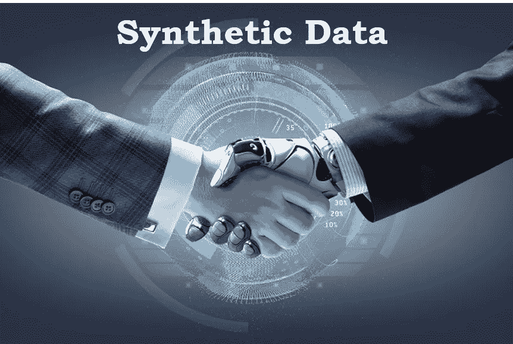

# 用合成数据加速你的人工智能/人工智能项目。

> 原文：<https://blog.devgenius.io/turbo-charge-your-ai-ml-projects-with-synthetic-data-d6225774513c?source=collection_archive---------12----------------------->

合成数据不仅填补了人工智能/人工智能项目的重要空白，也填补了软件开发的许多其他方面。深入这个地区，了解一下为什么现在这么热。

你的第一个想法是，“合成数据到底是什么？”它是出于保护隐私、测试系统或为机器学习算法或其他软件系统创建训练数据的目的而生成的人工数据。

你会想——“等等！人造的？!"“嗯，如果这不是真实的数据，我认为谈论它没有任何意义！”

当然可以。

但是说真的，在我回答这个问题之前，让我们后退一步，理解在构建通用软件系统& AI/ML 系统时遇到的典型挑战。

*   **数据不足** —此处举多个例子。A)很多时候，正确的数据集是可用的，但它不包含足够的您试图建模的实际数据的示例。b)数据可用，但获取成本太高，或者您无法证明获取数据的正当性(门控数据集)。c)将可用数据转化为对你有用的形式(贴标签/标记/分类)太费时间和/或成本。
*   **隐私** —您正在处理的数据包含敏感信息，不能在结果和报告中暴露。
*   **偏倚** —已知数据偏向某些类别或概率，或者您只想确保它尽可能无偏。
*   **易错数据** —数据有足够的变化和数量，但有太多的错误，对你没有用处。
*   **缺失数据点** —数据集中存在许多空白，使其无用。
*   **数据扩充并不能解决问题** —数据 aug 技术并不能帮助你在真实世界的测试中达到要求的准确度。
*   **没有假设(但重要)场景的数据** —您想要模拟似是而非的场景，但您的数据不符合这些可能性。你的一些测试场景已经死了。

> 重要的是要认识到上述问题不仅适用于 ML 领域，也适用于一般的软件系统。

合成数据是一门科学，也是同样重要的艺术，创造模拟真实数据的人工数据。它是一种受控的创造，模仿真实数据的统计属性，因此与真实数据一样有用。有许多方法可以创建它:

*   基于统计分布-在确定值范围和一些其他属性后，根据统计分布生成数据。
*   基于代理的建模—创建一个模型来解释观察到的行为，然后使用相同的模型再现随机数据。
*   基于深度学习的模型-变分自动编码器和生成式对抗网络(GAN)模型可用作合成数据生成技术，通过向模型提供更多数据来提高数据利用率

> 对合成数据的需求一直在稳步增长。公司已经意识到了信息技术的效用，以及围绕数据限制发布软件的无用性。

这篇来自 Businesswire 的文章谈论了市场。以下是摘录:

仅举几个合成数据提供商的行业例子:

*   [edge case . AI](https://www.edgecase.ai/)—AI/ML 系统的数据标签服务。
*   [Faker](https://faker.readthedocs.io/en/master/) —通用软件系统开源 Python 库。
*   [CA 测试数据管理器](https://www.broadcom.com/products/software/continuous-testing/test-data-manager) —为通用软件系统生成合成测试数据，并帮助管理这些数据。
*   [OneView](https://www.oneview.space/) —用于 ML 算法模型训练的合成数据集。专注于卫星和航空图像。

**合成数据的挑战**:如果我不谈论这个问题，那将是我的失职。合成数据虽然肯定有用，但也有其粗糙的边缘，如果不加以缓解，可能会破坏项目。

*   重要的是要记住，从数学上讲，完美地复制真实世界的数据分布或试图实现完美的隐私是不可能的。你的合成数据必须努力在这里取得平衡。更高的隐私导致更低的合成数据效用。
*   离群值生成可能遭受不相关。边缘案例必须仔细建模，并咨询领域专家。
*   合成数据的质量与输入数据和数据生成模型的质量高度相关。
*   合成数据可以反映原始数据中的偏差。
*   合成数据必须伴有其效用和风险的可信指标。

> 采用集合方法生成合成数据。他们可以在很大程度上帮助应对挑战。

我亲身体验过合成数据的力量:

*   在我们的医疗保健平台 [SVPT](https://svpt.versoly.page/) 中，我们正在建立一个叫做“SVPT 咨询”的东西。当物理治疗师在 SVPT 应用程序中保存患者资料时，顾问在分析患者资料后，为治疗师提供有用的输入，以帮助治疗方案。这些反馈类似于:“*患者 A 的 X 状态和 Y 状态*一起被 76%的治疗师看过”，或者，“*治疗方案 ABC 已经帮助 64%的 Z 状态患者以 81%的速度恢复*”。正如你可能意识到的，做出这样的声明需要大量的数据。然而，我们不可能控制 SVPT 在现实世界中看到的那种情况。我们通常以给定条件和患者档案的数据块结束。为了提供咨询，合成数据是我们的一个重要工具。
*   在上一篇文章中，我演示了如何为 [Covid19](https://medium.com/@sushrut.j.mair/contact-tracing-for-covid-19-222c474b0919) 进行联系人追踪。要做到这一点，位置历史、健康状况和其他人口统计信息至关重要。但是，这是敏感数据，不容易获得。我最终编写了一个合成数据生成器[来构建所需的数据语料库。](https://github.com/sushrutmair/Covid19/blob/master/datagen/generator.py)

如果你想更深入地研究合成数据，这里有一些我觉得有用的链接。快速的网络搜索会发现更多。

*   [https://research.aimultiple.com/synthetic-data/](https://research.aimultiple.com/synthetic-data/)
*   [https://news . MIT . edu/2017/artificial-data-give-same-results-as-real-data-0303](https://news.mit.edu/2017/artificial-data-give-same-results-as-real-data-0303)
*   [https://towards data science . com/do-you-need-synthetic-data-for-you-ai-project-e7ecc 2072 d6b](https://towardsdatascience.com/do-you-need-synthetic-data-for-your-ai-project-e7ecc2072d6b)
*   [https://ai . Google blog . com/2020/02/generating-diversity-synthetic-medical . html](https://ai.googleblog.com/2020/02/generating-diverse-synthetic-medical.html)
*   [https://www . oreilly . com/radar/the-quest-for-high-quality-data/](https://www.oreilly.com/radar/the-quest-for-high-quality-data/)

*感谢您阅读这篇文章！我欢迎您的任何意见或疑问。我是一名独立的技术顾问，在移动应用、云和微服务架构、机器学习和大数据分析领域经验丰富。最近，我 a)引导、设计并构建了一个医疗保健生物反馈平台，b)构建了一个大数据分析管道，c)开创了自然语言处理领域的新方法，d)使用机器学习帮助自动化业务流程，以及 e)稳定并完善了一个报告主要领域问题的 ETL 测试产品。如果您或您的组织正在寻求数字化转型方面的帮助，* [*给我留言*](https://in.linkedin.com/in/sushrut-mair-3769b62) *！*