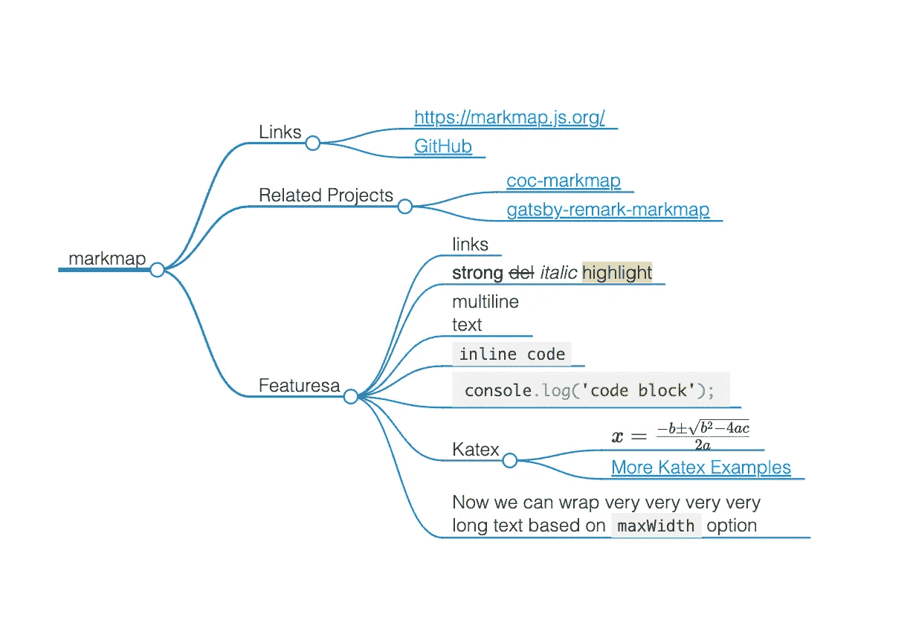

# 将您的代码转换成图表。

> 原文：<https://blog.devgenius.io/turn-your-code-into-diagrams-b28134c2c94?source=collection_archive---------4----------------------->

图作为代码:6 𝐰𝐚𝐲𝐬把代码变成美丽的架构图

1.  [**图表**](https://diagrams.mingrammer.com/) **:**

[图表](https://diagrams.mingrammer.com/)让你用 Python 代码绘制云系统架构。

它的诞生是为了在没有任何设计工具的情况下原型化一个新的系统架构。您还可以描述或可视化现有的系统架构。

`Diagram as Code`允许你在任何版本控制系统中跟踪架构图的变化。

图表目前支持六大提供商:`AWS`、`Azure`、`GCP`、`Kubernetes`、`Alibaba Cloud`和`Oracle Cloud`。它现在还支持`On-Premise`节点以及`Programming Languages`和`Frameworks`。

**输出:**

2. [**美人鱼**](https://mermaid-js.github.io/mermaid/#/) **:**

Mermaid 允许您使用文本和代码创建图表和可视化。这是一个基于 JavaScript 的图表工具，它呈现受 Markdown 启发的文本定义，以动态地创建和修改图表。

**输出:**

3.[Moondraw](https://monodraw.helftone.com/):**Monodraw**允许您轻松创建基于文本的艺术作品(如图表、布局、流程图)并直观地表示算法、数据结构、二进制格式等。因为它只是文本，所以几乎可以很容易地嵌入到任何地方。当然也支持导出为图片(PNG 和 SVG)。

4.[**plant UML**](https://plantuml.com/)**:**

它是一个开源工具，允许用户用纯文本语言创建图表

**输出:**

5. [**标记图**](https://markmap.js.org/) **:**

把你的降价想象成思维导图。它支持 VS 代码插件

**输出:**

6. [**围棋图解**](https://godiagram.com/winforms/latest/index.html) **:**

答。用于快速构建交互式图表的库使用 Go 创建漂亮的系统图表

我错过了什么吗…

请不要忘记鼓掌…

关于排名前 50 的 Android 博客，请阅读以下内容:

 [## 2022 年 50 个最佳 Android 开发博客和网站

### 美国加州山景城 Android 开发者博客是 Android 平台的官方博客，它是……

blog.feedspot.com](https://blog.feedspot.com/android_developer_blogs/)