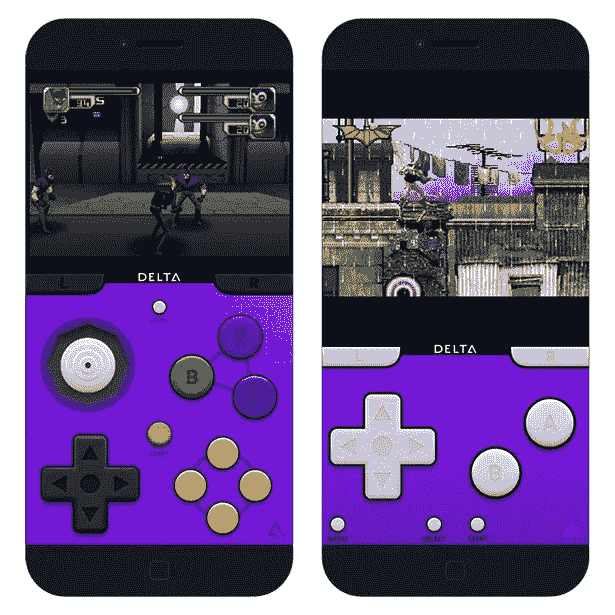

# 只需一部 iPhone/iPad，无需越狱，就能把你的客厅变成复古游戏的天堂

> 原文：<https://blog.devgenius.io/turn-your-living-room-into-a-retrogaming-paradise-with-just-an-iphone-ipad-without-jailbreak-69f4466871dc?source=collection_archive---------19----------------------->

这就是人们对复古游戏的看法，但我们来这里是为了一些不同的东西

最近，我们几乎讨论了所有不用 AppStore 安装应用程序的无 JB 方式。既然你已经开始了解它的工作原理，让我们来讨论一下你可以通过这些技巧在你的设备上享受到的美好事物。

如果当你听到诸如“Gameboy Advance”、“Nintendo DS”、也许“Nintendo 64”甚至“Entertainment System”之类的东西时，你开始感到有点兴奋，那么请不要停止阅读这篇文章。可以成为改变人生的经历(jk！)

那么…让我们来谈谈 retrogaming 仿真，这涉及到在您的 iOS 手机/平板电脑上仿真旧游戏系统。

# 需要什么

**功能强大的 iOS 设备** —任何安装了 iOS12 及以上版本的设备都可以完成这项工作。这意味着 iPhone 5s 和更高版本，所有 iPad Air 型号和更高版本，iPad mini 2 和更高版本以及 iPod touch 6 代都符合这一目的。

**仿真软件**——根据你想要仿真的控制台，市场上有许多不同的选项。我们稍后会在这里讨论其中一些。

**AppleTV 或带 HDMI 的 A/V 适配器—** AppleTV + AirPlay 是无线流媒体的一个惊人组合，可以提供快速响应和无延迟的体验。不过，如果你没有 AppleTV，苹果官方的 A/V 适配器也没问题。你也可以找到一些更便宜的非官方电缆，但大多数都超级脆弱，所以这将是一个“买便宜，买两次”的情况。

Lightning 数字 AV 适配器至 HDMI

MFI 控制器——这是额外的东西，但是如果你想找回童年时游戏机游戏的真实体验——给自己买一个游戏手柄。如今，它们随处可得，价格也相对低廉。

# 应用程序以及如何获取它们

几年前，在几次尝试进入 AppStore 失败后，游戏模拟器变成了仅通过 Cydia 独家发行的越狱应用。然后，随着第一个 JB-free 商店在 2012 年左右出现，你仍然必须在日期和时间设置上做一些手脚(也称为“日期把戏”)和其他一些骗人的把戏，以便让应用程序正确安装。

现在，在 2020 年，几乎所有的软件都可以直接从网上下载。正如我们在以前的文章中提到的，侧装是安装模拟器的一个很好的捷径。找到符合您需求的第三方商店，做自己的研究和/或重新阅读[这篇文章](https://medium.com/@thenextgenstore/the-3rd-party-stores-free-vs-paid-2fc665e715a8)，了解在注册替代应用商店时需要考虑的事项。

以下是你可能在商店里找到的能抓住你的心和灵魂的应用程序。

## 三角洲

由 Riley Testut & Caroline Moore 创建的传奇 GBA4iOS 仿真器的继承者。

GBA4iOS 是一款 Game Boy Advance 模拟器，拥有无数著名游戏。比如神奇宝贝蓝宝石，最终幻想 6 进阶，塞尔达传说:迷你帽等。

所以，DELTA 基本上是 Riley 的传奇 GBA4iOS 的最大化的一体化版本，增加了任天堂 64，任天堂 DS，SNES 和 NES 的支持。

## iNDS

多平台任天堂 DS 模拟器到 iOS 的一个端口。错过《马里奥赛车 DS》、《GTA:唐人街之战》、《神奇宝贝黑与白》等游戏，它是必备。

该仿真由 DeSmuME threaded ARM 解释器提供支持，因此即使在 iPhone 5 上也几乎可以全速运行。你甚至可以在新的设备上获得 60+ fps。最终图像质量的图像过滤器，自动保存，100K 作弊，以及更多的是包括在内。

## PPSSPP

PPSSPP 是 iOS 唯一稳定的 PSP 模拟器。它能够运行许多原创游戏，但你的设备越新，性能就越好。请注意，由于对非越狱设备的限制，并非所有游戏都将全速运行。所以，如果你错过了达克斯特，战神:奥林匹斯之链，或小岛康誉的辉煌金属齿轮固体:和平行者，这是你的选择武器。

## 反拱

这个 app 超级强大。它实际上是模拟器、游戏引擎和媒体播放器的前端，使你能够通过其光滑的图形界面在不同的设备上运行各种经典游戏。

RetroArch 拥有大量高级功能，如着色器、网络播放、倒带、下一帧响应时间、提前播放、机器翻译、盲人辅助功能、OpenGL 和 Vulkan API 支持等！

注意:这需要精通技术。

## 起源

嗯，它没有进入我们的前五名名单，但因为我们合并了前两个，我们爱上了这一个，我们决定添加它。有趣的事实:这是有史以来最古老的模拟器之一！

这个应用程序因运行 NES、Famicom、GameBoy(颜色和高级)、世嘉主系统、世嘉创世纪和 Mega Drive、世嘉游戏装备以及其他近无数伟大的复古游戏而闻名。它有一个内置的服务器，方便 ROM，节省传输，和外部控制器的支持。

# 设置事物

一旦选择了有线或无线路径，设置就相对简单了。

如果你带着适配器和 HDMI，只需将你的 iPhone 或 iPad 插入适配器，并通过 HDMI 连接到你的屏幕上。启动模拟器，加载一些东西来玩，享受这些 OG 游戏的乐趣。

Apple TV 的 AirPlay 甚至更简单，因为你可以将你的小工具的屏幕无线投射到你的高清电视上。

# 游戏手柄带来更多乐趣

这是游戏拼图的最后一块。

你几乎可以使用任何游戏手柄来玩游戏，但要获得最佳性能，你需要一个合适的控制器。MFi(为 iPhone/iPad/iPod 制造)认证的控制器被认为是最佳选择，因为它们已经获得了苹果的认可，无论苹果推出什么样的 iOS 更新，它们都肯定会工作。(这可能是拥有非 MFi 产品的最大缺点。)

寻找这个标志

购买苹果认可的控制器还有一个额外的好处:所有 MFi 控制器都与苹果的任何移动设备以及苹果电视兼容。因此，只需一个游戏手柄，您就可以在所有设备上玩游戏。

虽然建议您自己进行研究，因为所有的控制器几乎都是一样的，但由于 MFi 认证政策，这更像是一场选美比赛，而不是一个审查的主题。然而，这里有几个控制器，我们在我们的办公室有&爱:钢系列光轮和钢系列层云。

钢铁系列光轮

# …在你走之前

嗯，模拟器真的很神奇。它们帮助我们唤醒童年的记忆，并给你的 iPhone/iPad 带来一些超能力，但有一个问题。如果没有 rom(来自内存芯片的数据的虚拟副本)，仿真器几乎没有用。

所以，问题是使用模拟器在世界上任何地方都是合法的，但是共享、下载和使用有版权的 rom 是非法的。然而，为你自己的游戏制作一个 ROM 的备份/存档副本是合法的。

我们不是律师，这不是法律意见，但请提前查找游戏仿真的具体 DMCA 规定，并自行承担风险。

总而言之，从第一天起，本文中的所有应用程序(甚至更多的模拟器)都将在 NextGen 商店中提供！加入我们的旅程，千万不要错过你在 AppStore 上找不到的酷应用；)