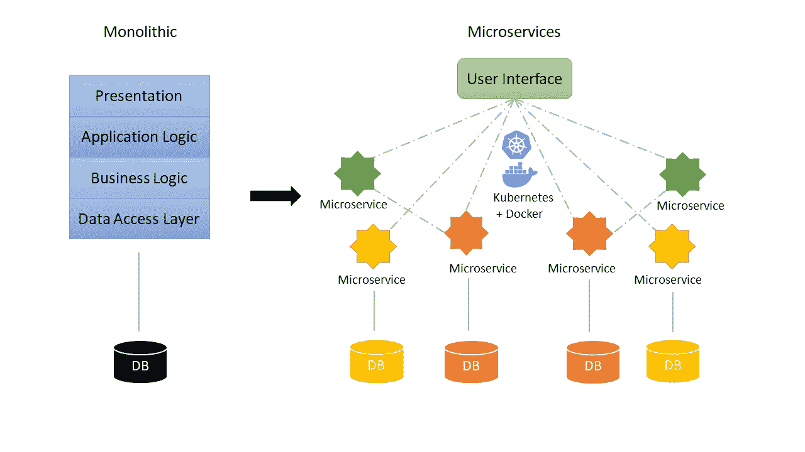
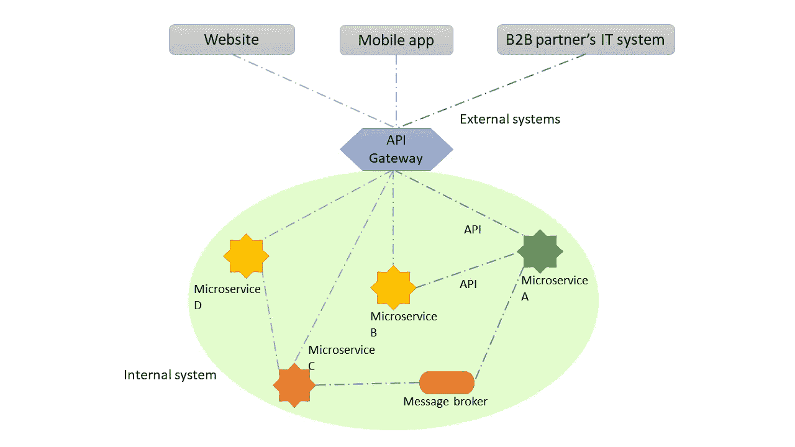
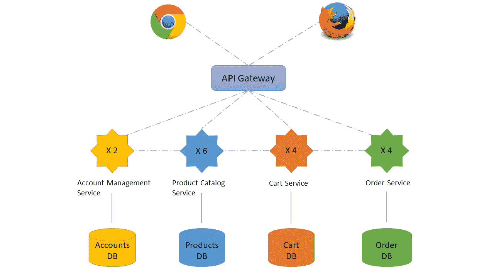

# 微服务:用微服务把你的软件系统变成一件艺术品

> 原文：<https://blog.devgenius.io/turn-your-software-system-into-a-work-of-art-with-microservices-6f6565575af3?source=collection_archive---------2----------------------->

# 曾几何时，整体架构统治了软件开发的世界

如果一个人从未开发过单一的应用程序，他就不能称自己是一个成功的软件工程师。整体架构是统治软件开发世界的传统架构。整体式应用程序是一个可部署的单元，其中不同的模块紧密耦合地相互连接。这样的应用程序只有一个包含所有层(如表示层、业务逻辑层、应用程序逻辑层和数据访问层)的代码库。

但是，当应用程序增长时，传统的整体架构将不是一个好的选择，因为存在以下棘手问题:

👉理解和维护一个庞大而复杂的代码库通常是困难的，尤其是对于一个新的开发人员来说。

👉添加一个小特性需要重新编译和重新部署整个应用程序

👉CI/CD(持续集成和持续部署)非常耗时

👉伸缩是非常复杂的，因为一个单一的应用程序很少是无状态的，它的模块是不可分割的

👉迁移到新技术成本高昂，因为所有组件都是相互依赖的

米歇尔·bożek 在 [Unsplash](https://unsplash.com?utm_source=medium&utm_medium=referral) 上拍摄的照片

软件开发团队饱受这些痛点的困扰，直到 2010 年微服务的诞生。这种松散耦合的分布式架构被越来越多的技术领导者所采用，如网飞、谷歌和亚马逊，它已经席卷了软件开发行业。

# 微服务的基础

在深入探讨之前，我们先来看看微服务架构的定义。它是面向服务的架构(SOA)结构风格的一种变体——将应用程序安排为一组 ***松散耦合的服务*** 。在微服务架构中，**服务是*细粒度的*** ，而**协议是轻量级的**【1】。

下图说明了整体架构和微服务架构之间的差异:

整体架构与微服务架构(作者与❤️)

正如我们所看到的，单片应用程序的巨大自包含单元现在被分解为一个 UI(用户界面)和称为微服务的小的独立元素。随着 web 技术的快速发展，现在可以使用 React、Angular 或 Vue.js 等框架开发独立的客户端用户界面。这样的 web 应用程序从远程 web 服务器下载，然后直接在用户的浏览器中执行，这意味着表示层负载完全从服务器端移除。当用户打开网站时，他的浏览器将从微服务中获取数据。除了与 UI 的交互，微服务之间还会进行数据交换。

那么，UI 和微服务是如何交互和访问数据的呢？

最常见的答案是通过**API(**应用编程接口)。API 是一种计算接口，它定义了多个软件应用程序或混合硬件-软件中介之间的交互。**它定义了可以进行的呼叫或请求的种类，如何进行，应该使用的数据格式，应该遵循的惯例等等** [2]。最流行的 API 类型被称为“REST API”它基于 HTTP 命令，这是 web 开发人员所熟悉的。

当然，还有其他的解决方案，比如**消息代理**(例如 rabbit MQ)**缓存**用于特殊情况，尤其是当通信是异步的时候。

如今，当我们开发新的数字解决方案时，除了为用户设计多样化的网站和移动应用程序，为 B2B 合作伙伴提供公共 API 也很流行。不幸的是，那些外部系统都在我们部署微服务的内部系统边界之外。为了控制所有的外部调用，一个 **API 网关**比如Spring Cloud zuul 应该被实现为**所有客户端**的单一入口点。

下图展示了来自 B2B 合作伙伴的 IT 系统的一个完整的公共 API 调用(蓝色线条)。该调用首先被发送到 API 网关，然后被路由到微服务 A，微服务 A 需要通过 API 和消息代理从微服务 B 和 C 获取数据。

来自外部系统的公共 API 调用的路径(由作者与❤️创建)

# 为什么要选择微服务架构？

与整体式应用相比，我们之前提到的难题并不存在:

👉每个微服务都有自己的代码库。当一些代码有味道时，影响是有限的，重构总是可能的。一个新的开发者可以很容易地参与进来。

👉添加一个小功能不会影响所有服务。因此，只需要重新部署相关的服务。

👉 **CI/CD** 管道使用 **Docker、Kubernetes 和云技术**很容易建立。

👉当一个微服务关闭时，请求可以立即通过**负载平衡器和**发送到另一个镜像微服务，因为服务是无状态的。还可以通过添加实例来扩展具有高负载的特殊微服务。因此，系统具有**高可用性和良好的可扩展性**。

👉每个微服务都可以有自己的技术选择。比如一个业务微服务用 Java 写，另一个微服务用 C#写，数据分析微服务用 Python 写。

# 基于微服务的在线购物服务

现在，让我们以一个简化的在线购物服务为例，从功能的角度来看微服务。

基于微服务的网上购物服务(作者与❤️)

如上图所示，整个网站分为以下几个部分:

## 1️⃣的用户界面

它包含一个网站和一个手机应用程序，只允许注册用户进行网上购物。此外，管理员还可以通过用户界面管理产品和用户帐户。

## 2️⃣账户管理服务(2 个实例)

这个微服务验证用户的身份。它还会将用户信息返回给 UI 或其他服务。管理员可以通过这项服务管理用户帐户。

主要 API 端点:

*   判断当前用户是否是 un admin:**HTTP HEAD***/API/users/is-admin*
*   获取当前用户信息:**HTTP GET***/API/users/me*
*   管理员添加用户:**HTTP POST***/API/users*
*   管理员更新用户账号:**HTTP PUT***/API/users/{ userId }*

## 3️⃣产品目录服务(6 个实例)

它允许用户检索所有产品。为了获得更好的性能，可以为产品搜索添加过滤器。它还允许管理员管理产品。**由于此微服务使用频繁，数据负载相当大，建议通过添加更多实例来扩展它。**

主要 API 端点:

*   获取所有产品:**HTTP GET***/API/products*
*   获取所有可用产品:**HTTP GET***/API/products？状态*= {可用状态文本}
*   通过 admin 添加产品:**HTTP POST***/API/products*
*   由管理员更新产品:**HTTP PUT***/API/products/{ product id }*

## 4️⃣推车服务(4 个实例)

Cart 微服务负责管理用户的购物车。它还允许用户将购物车转换为订单，并通过第三方支付平台完成支付过程。

主要 API 端点:

*   获取所有购物车物品: **HTTP GET** /api/items
*   在购物车中添加一个新项目: **HTTP POST** /api/items
*   删除购物车中的商品:**HTTP DELETE**/API/items/{ itemId }

## 5️⃣订单服务(4 个实例)

这项微服务允许用户在最后查看订单信息。它还允许用户查看他们的订单历史。

主要 API 端点:

*   获取订单:**HTTP GET**/API/orders/{ orderId }
*   获取所有订单历史: **HTTP GET** /api/orders

# 我曾经落入的陷阱

使用微服务架构几年，掉进了很多陷阱！现在我想与你分享这些错误:

## ❌:我认为前端很容易，开发微服务应用的困难只在后端。

这是完全错误的！当后端是细粒度的，就很容易添加 API。然而，为了显示一个页面，前端可能需要与许多不同的 API 进行交互。因此像 RXJS 这样的反应式编程库在前端是必不可少的。对新手来说很难，说实话，把我们资深全栈开发者弄哭了。

## ❌ **我在发布前没有足够的时间，所以我可以跳过 CI/CD 管道，手动发布。**

据说涂了很多肥皂的胡子是剃掉了一半。在枯燥重复的送货任务上，机器比人类强多了。如果没有自治的 CI/CD 管道，就很难保证每个微服务都部署了正确的版本。很快就会变成一场灾难。

## ❌ I 可以在非生产环境中使用简化的基础架构。

在我以前的一个项目中，在发布之前发现了意想不到的惊喜，因为只有生产环境的基础设施是完全负载平衡的！直到第一次在生产环境中部署，我们才意识到我们需要一个外部缓存。因此，最佳实践是准备至少一个测试环境，该环境复制与生产环境完全相同的基础设施。

## ❌日志和监控并不重要，我可以在第一次发布后添加它们。

API Gateway 中一个简单的传入调用可以导致不同服务之间的一长串交互。因此，调试和技术支持变得具有挑战性。这就是为什么从一开始就使用弹性搜索等技术实现高效的日志记录和监控系统来跟踪收入/结果调用的路径非常重要。

## apis 越多，系统就越好。

如果没有良好的控制和纪律，微服务的数量会呈指数级增长。因此，IT 系统将变得难以管理。正确的方法是将系统细分成小的服务，并制作可重用的 API。记住，只有在必要的时候才添加新的 API！

# 结束了

如果你想更进一步，有很多设计模式和组件，如 CQRS 模式、事件源模式和企业服务总线，可以帮助实现良好的微服务。

虽然微服务架构的营销在不断增长，但架构本身尚未完善。仍然有许多难题需要解决。

反正我相信微服务是未来。如果方法正确，它可以将您的软件系统变成一件艺术品。我希望我可以快进 10 年，看看微服务带来了什么样的巨大变化！

# **资源**

[1]https://en.wikipedia.org/wiki/Microservices

[2]https://en.wikipedia.org/wiki/API