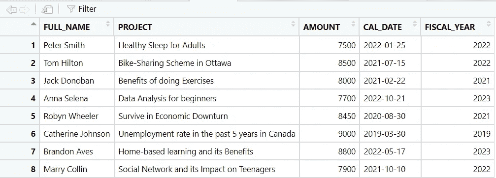
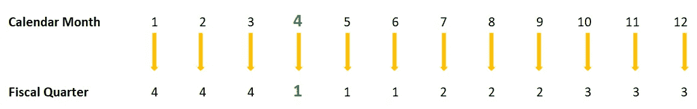

# 将日历年度转换为 R 中的会计年度

> 原文：<https://blog.devgenius.io/turning-calendar-year-to-fiscal-year-in-r-da9037a461dd?source=collection_archive---------10----------------------->

一个想法闪现在我的脑海里，所以我马上开始记下来，以防之后我可能会忘记。今天的重点将是如何把日历年变成财年。什么是财政年度？

> “财政年度结束日是公司结束 12 个月业务周期的日期。大多数公司的财政年度与日历年度不同，都在 12 月 31 日以外的日期结束。这对于零售商店等季节性企业尤为重要，零售商店在年底左右的业务会增加，需要将产能集中在销售和生产上，而不是清点库存。
> 
> 常见的财政年度结束日期包括 3 月 31 日、6 月 30 日和 9 月 30 日。加拿大所有主要的国内私人银行都将在 10 月 31 日结束财年。"

*来源:* [*什么是财年结束| BDC.ca*](https://www.bdc.ca/en/articles-tools/entrepreneur-toolkit/templates-business-guides/glossary/fiscal-year-end)

也就是说，在大多数情况下，数据以日历年的形式存储在数据库中。如果计算基于会计年度，则需要从日历年度转换为会计年度。


将日历年度转换为 R 中的会计年度

# 场景 1

这个数据集包括 8 个项目，从 2019 年到 2022 年分配给 8 个不同的人，有一定的资金。作为第一步，您的任务是将日历年转换为财年。

```
library(dplyr)
library(lubridate)
df <- structure(list(FULL_NAME = c("Peter Smith", "Tom Hilton", "Jack Donoban", "Anna Selena", "Robyn Wheeler", "Catherine Johnson", "Brandon Aves", "Marry Collin"), 
                     PROJECT = c("Healthy Sleep for Adults", "Bike-Sharing Scheme in Ottawa", "Benefits of doing Exercises", "Data Analysis for beginners", "Survive in Economic Downturn", "Unemployment rate in the past 5 years in Canada", "Home-based learning and its Benefits", "Social Network and its Impact on Teenagers"), 
                     AMOUNT = c(7500, 8500, 8000, 7700, 8450, 9000, 8800, 7900), 
                     CAL_DATE = as.Date(c("2022-01-25", "2021-07-15", "2021-02-22", "2022-10-21", "2020-08-30", "2019-03-30", "2022-05-17", "2021-10-10"))), class = "data.frame", row.names = c(NA, -8L))
```


让我们假设贵公司的财政年度从**4 月 1 日**到**3 月 31 日**开始。看下面的日期，回答什么是财政年度？

*   2022–01–25
*   2020–08–30
*   2019–03–30

**答案是:**

1.2022 财年**或 2021–2022 财年**或 2021–2022 财年

2.2021 财年**或 2020–2021 财年**或 2020–2021 财年

3.2019**财年**或 2018–2019 财年

**一目了然，我们可以立即告诉它给定日期的财政年度。问题是我们如何告诉系统根据日历年创建一个包含财政年度的新列。逻辑很简单，如下所示:**

****2022–01–25**:每当日历年的月份**大于 3** (三月的月份)，会计年度将增加 **1 年**。如果月份**小于 3** ，则财年**将与日历年**保持一致。在这个例子中，我们可以看到**01(1 月)小于 03(3 月)**，所以会计年度与日历年度相同- **2022** 。**

**考虑到这一点，我们可以使用`**ifelse**` 语句来实现我们的目标。**

```
df2 <- df %>% 
  mutate(FISCAL_YEAR = ifelse(month(CAL_DATE)>3, year(CAL_DATE)+1, year(CAL_DATE)))
# if the month > 3, FICAL_YEAR will be added 1, if not FISCAL_YEAR will be 
# the same year as CAL_DATE
```

****

**将日历年度转换为会计年度**

**`**ifelse**` 语句的意思是:`**ifelse**(**condition**, **result when it is true**, **result when it is false**)`**

**`**lubridate**` 包中的`**month()**`和`**year()**`函数将分别返回给定日期的月份和年份(数字)。**

# **场景 2**

**现在你已经知道如何从日历年得到财政年度。**财政月**呢？**

**如果会计年度从 4 月开始，则这是日历年度和会计年度之间的等价月份的汇总表。**

****

**这里的想法是，你告诉系统从日历月转换到财政月，如上图所示(正确的顺序)。系统如何知道什么是正确的顺序？到了这一步，你可能会想到给一个向量以确切的顺序。下面是一个可能的解决方案。**

```
fis_month <- c(10,11,12,1,2,3,4,5,6,7,8,9)
df2 <- df %>% 
  mutate(FISCAL_YEAR = ifelse(month(CAL_DATE)>3, year(CAL_DATE)+1, year(CAL_DATE)),
         FISCAL_MONTH = fis_month[month(CAL_DATE)])
```

**首先，我们需要创建一个向量来模仿财政月的顺序，如图所示。只是问你一个问题。我们如何根据索引得到向量的值？更具体的说，我们想得到`**fis_month**`向量中第一个元素的值，也就是`**10**`。我们能做什么？**

```
fis_month[1] # it will return 10.
#[1] 10
fis_month[4] # it will return 1.
#[1] 1
```

**现在你知道了如何根据一个向量的索引来获取它的值。让我们再看一次图像。如果我们可以获得日历年的月份，并将其作为索引传递给`**fis_month**` vector，它将返回财政年度的相应月份。`**month(CAL_DATE)**`将返回`**CAL_DATE**`列的月份(数值型)。这个数字现在被用作`**fis_month[]**` **中的索引。****

****

**从日历月到会计月**

# **场景 3**

**你必须知道如何获得财政年度和财政月份。现在我们想到了什么是财政季度？要获得财政季度，它与场景 2 非常相似。我们需要创建一个四分之一向量，其顺序相当于日历年的每个月。**

****

```
fis_qua <- c(4,4,4,1,1,1,2,2,2,3,3,3)
df2 <- df %>% 
  mutate(FISCAL_YEAR = ifelse(month(CAL_DATE)>3, year(CAL_DATE)+1, year(CAL_DATE)),
         FISCAL_MONTH = fis_month[month(CAL_DATE)],
         FISCAL_QUARTER = fis_qua[month(CAL_DATE)])
```

****

**从日历季度到财政季度**

**它的工作方式与场景 2 中的财政月相同，所以我不会详细介绍，因为它重复了内容本身。在这一步，要计算每个财政月、季度或年度的资金总额，您只需将它们分组，然后将这些数字加在一起。有些人喜欢导出 Excel 文件并使用数据透视表，而有些人喜欢用 r 编写代码。**

# **奖金**

**查看财政年度列，我们可以看到它们都是数字。如果你想改变命名约定格式(即从`**2022**`到`**FY2122**`，我们可以轻松修改。**

```
# Custom function to extract the character from the right of the text string
my_right <- function(data, num){
  str_sub(data, start = str_length(data)-num+1)
}

df2 <- df %>% 
  mutate(FISCAL_YEAR = ifelse(month(CAL_DATE)>3, year(CAL_DATE)+1, year(CAL_DATE)),
         FISCAL_YEAR2 = paste0("FY", my_right(FISCAL_YEAR-1,2), my_right(FISCAL_YEAR,2)),
         FISCAL_MONTH = fis_month[month(CAL_DATE)],
         FISCAL_QUARTER = fis_qua[month(CAL_DATE)])
```

****

**从日历季度到财政季度**

**为了简单起见，让我们制作另一个名为`**FISCAL_YEAR2**`的专栏。该列将包含一串财政年度的最后一位数字`**FY**`和 **2** 。(即 **2022** 或**2021–2022**或 **FY2122** )。`**my_right()**`是一个自定义函数，基本上与 Excel 中的`**RIGHT()**`函数作用相同。这个函数将从一个文本字符串的右边提取字符数。在我们的例子中，我们只需要提取最后 2 个数字，所以我们输入为 **2。**如果想进一步了解 R 中的`**LEFT()**`、`**MID()**`、`**RIGHT()**`自定义函数，参见[这篇文章](https://medium.com/@michaeltvu/how-to-convert-left-mid-and-right-into-r-cd6f20e902ef)。**

# **参考**

**财政年度:[什么是财政年度结束| BDC.ca](https://www.bdc.ca/en/articles-tools/entrepreneur-toolkit/templates-business-guides/glossary/fiscal-year-end)**

**会计年度计算: [Excel 会计年度计算(contextures.com)](https://www.contextures.com/fiscalyearcalculations.html#:~:text=To%20get%20the%20fiscal%20year,%3DC4%2C1%2C0))**