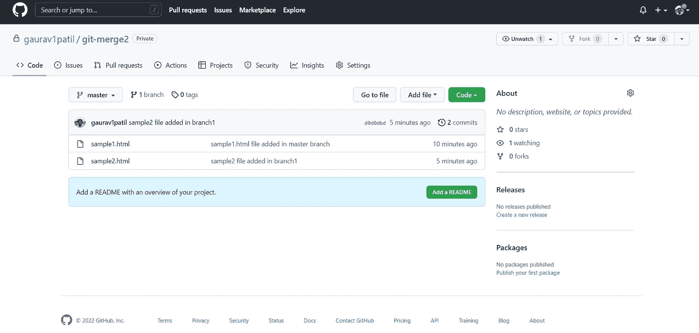

# 教程 6 : Git 合并—第 2 部分

> 原文：<https://blog.devgenius.io/tutorial-6-git-merge-part-2-6ac8d049d815?source=collection_archive---------15----------------------->


加布里埃尔·海因策在 [Unsplash](https://unsplash.com?utm_source=medium&utm_medium=referral) 上的照片

错过了之前的教程？——[**点击这里**](https://gaurav-patil21.medium.com/tutorial-5-git-merge-part-1-cc6919ab2c91) **。**

我们将在本教程中讨论以下主题:

> [**第 1 部分:在主分支**](#5002) 添加文件
> 
> [**第二部分:创建另一个文件并添加到另一个分支**](#996c)
> 
> [**第 3 部分:通过合并总分行**](#3f46) 中的分行 1，添加总分行中的分行 1 的文件
> 
> [**第四部分:将主分支推送到 Github 库，查看合并后的分支**](#ed08)

**目标**:假设我们在不同的分支中有两个或更多不同的文件，并且想要合并主分支中的所有这些文件。

在我们的[第一教程](https://gaurav-patil21.medium.com/tutorial-1-getting-started-with-git-71dfcf638713)中，我们已经创建了一个**试用**文件夹，并将**sample1.html**文件存储在其中。我用的是 VS 代码 IDE。

```
<html><body><h1>This is a first heading.</h1></body></html>
```

在命令提示符下运行以下所有命令。

# 第 1 部分:在主分支中添加文件

让我们使用命令提示符在**试用**文件夹中创建一个空的 Git 存储库。

```
git init
```

输出:

```
Initialized empty Git repository in C:/Users/Gaurav/OneDrive/Desktop/trial/.git/
```

由于我们在这个文件夹中有**sample1.html**文件，让我们使用命令提示符检查状态:

```
git status
```

输出:

```
On branch masterNo commits yetUntracked files:
 (use “git add <file>…” to include in what will be committed)
 sample1.htmlnothing added to commit but untracked files present (use “git add” to track)
```

在命令提示符下可以看到**sample1.html**(红色**)表示该文件还没有添加到本地库中。**

```
git add .
```

输出:

在这里点上“ **git add。**"表示该文件夹中的所有文件都要添加。或者你也可以写“**git add sample1.html**”。

现在让我们再次检查状态，看看文件是否被添加到本地存储库中。

```
git status
```

输出:

```
On branch masterNo commits yetChanges to be committed:
 (use “git rm — cached <file>…” to unstage)
 new file: sample1.html
```

您可以看到**sample.html**(**为绿色**)，表明该文件已添加到本地存储库中，但尚未提交。所以，让我们承诺吧。

```
git commit -m “sample1.html file added in master branch”
```

输出:

```
[master (root-commit) fb944f5] sample1.html file added in master branch
 1 file changed, 5 insertions(+)
 create mode 100644 sample.html
```

现在检查我们当前所在的分支:

```
git branch
```

输出:

```
* master
```

所以只有一个分支——**高手**分支。星号(*)表示我们所在的分支。

# 第 2 部分:创建另一个文件并将其添加到另一个分支中

现在创建**sample2.html**如下所示，我使用 VS 代码 IDE:

```
<html><body><h1>This is a second heading.</h1></body></html>
```

现在我们已经通过更改标题文本创建了 sample2.html 的**文件，让我们检查一下状态。**

```
git status
```

输出:

```
On branch master
Untracked files:
 (use “git add <file>…” to include in what will be committed)
 sample2.htmlnothing added to commit but untracked files present (use “git add” to track)
```

你可以在命令行看到【sample2.html**(红色)**。

现在让我们[创建分支](https://gaurav-patil21.medium.com/tutorial-3-dealing-with-branches-in-git-2d3205e4cafa)比如“branch1 ”,将这个修改过的文件添加到那个分支中，

如下所示:

```
git checkout -b branch1
```

输出:

```
Switched to a new branch ‘branch1’
```

因此，我们**创建了一个新分支**并切换到其中，这意味着我们**将**从**主分支**移动到**分支 1** 。

现在，我们可以将这个新文件添加到新创建的 branch1 中。

```
git add .
```

可以通过运行以下命令再次检查状态:

```
git status
```

输出:

```
On branch branch1
Changes to be committed:
 (use “git restore — staged <file>…” to unstage)
 new file: sample2.html
```

你可以在命令行看到**新文件:****sample2.html(绿色)**。

让我们提交新文件:

```
git commit -m “sample2 file added in branch1”
```

输出:

```
[branch1 d0d0dbd] sample2 file added in branch1
 1 file changed, 5 insertions(+)
 create mode 100644 sample2.html
```

它清楚地表明，在 branch1 中添加了 sampl2 文件。

# 第 3 部分:通过合并主分支中的 branch1 来添加主分支中的 branch1 的文件

让我们检查一下分支机构，我们目前处于:

```
git branch
```

输出:

```
* branch1
 master
```

**branch 1**前的星号(*) 表示我们当前的分支。

现在让我们**切换** **到主分支** **合并**分支 1 和主分支。

```
git checkout master
```

输出:

```
Switched to branch ‘master’
```

输出相当明显。

现在，我们**通过在命令提示符下运行以下命令，将分支 1 与主分支**(当前分支)合并:

```
git merge branch1
```

输出:

```
Updating 11e441d..d0d0dbd
Fast-forward
 sample2.html | 5 +++++
 1 file changed, 5 insertions(+)
 create mode 100644 sample2.html
```

这样我们就成功地合并了分支机构。

但是我们怎么知道这是否真的有效呢？

你知道主控里有**sample1.html 文件，分支 1** 里有**sample2.html。在**合并后，两个文件都应该在主**分支中。如果有什么可以检查的话。你猜怎么着，有！！**

让我们将这个合并的主分支推到我们新创建的 github 存储库中，并检查文件的内容。

# 第 4 部分:将主分支推送到 Github 存储库以查看合并的分支

[首先创建一个新的仓库](https://www.geeksforgeeks.org/creating-repository-in-github/)。

然后在命令提示符下运行以下命令:

```
git remote add origin <[repo-url](https://github.com/)/username/repo-name.git>
```

我创建了一个名为 **git-merge2** 的 git 存储库

正如我们在之前的教程中看到的，我们为远程存储库添加了新的[远程](https://gaurav-patil21.medium.com/tutorial-4-in-git-294457349b52)。

```
git remote add origin [https://github.com/gaurav1patil/git-merge2.git](https://github.com/gaurav1patil/git-merge1)
```

然后，我们将合并的主分支推送到修改后的文件所在的位置。

```
git push -u origin <branch_name>
```

因此，我们在命令提示符下运行以下命令:

```
git push -u origin master
```

输出:

```
Enumerating objects: 6, done.
Counting objects: 100% (6/6), done.
Delta compression using up to 8 threads
Compressing objects: 100% (5/5), done.
Writing objects: 100% (6/6), 593 bytes | 296.00 KiB/s, done.
Total 6 (delta 0), reused 0 (delta 0), pack-reused 0
To [https://github.com/gaurav1patil/git-merge2.git](https://github.com/gaurav1patil/git-merge2.git)
 * [new branch] master -> master
branch ‘master’ set up to track ‘origin/master’.
```

现在通过刷新页面来检查您的 github 存储库。

在我的例子中，它看起来像这样:



可以清楚地看到，合并之后，主分支中有两个文件。你可以通过点击文件名来检查文件的内容。

**恭喜你！！！**

现在你知道如果我们在不同的分支中有多个文件，在 git 中合并是如何工作的了。

在我们的 [**下一篇教程**](https://gaurav-patil21.medium.com/tutorial-7-git-pull-and-git-fetch-768277a379e5) 中，我们还没有探索 git 拉取和 git 取取。