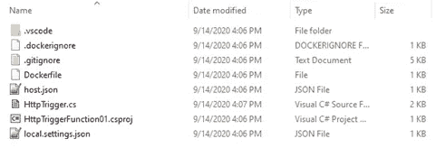
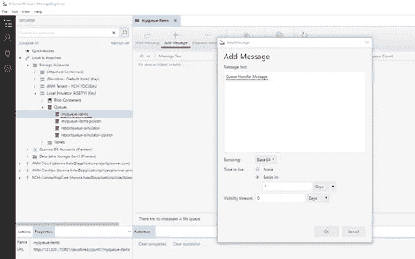
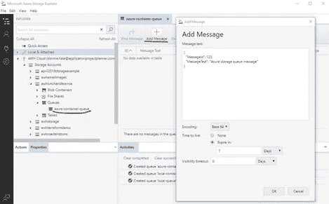
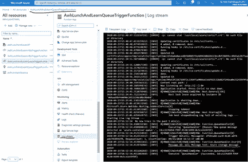

# 教程—通过 Linux 容器实现 Azure 功能

> 原文：<https://blog.devgenius.io/tutorial-azure-functions-via-linux-containers-74aac0a89581?source=collection_archive---------1----------------------->

# 介绍

在过去的几年中，无服务器功能已经成为产品架构师工具箱中的一个重要工具。像 [Amazon Lambda](https://aws.amazon.com/lambda/) 、 [Azure Functions](https://azure.microsoft.com/en-us/services/functions/) 和 [Cloudflare Workers](https://workers.cloudflare.com/) 这样的产品允许以比平台即服务产品更简单的方式开发和部署小型、专注的功能。

我不认为它们(还)是需要授权、共享业务逻辑以及其他横切关注点的全功能 API 应用程序的替代品。然而，在最近的一个项目中，我们希望使用一个移动应用程序可以调用的 Azure 函数。我们的挑战是 Azure Function 中的功能需要访问免费 Azure Function 应用服务计划中不提供的操作系统原语(GDI functions)。

我们找到了一个供应商推荐和这个[微软 Azure 教程](https://docs.microsoft.com/en-us/azure/azure-functions/functions-create-function-linux-custom-image?tabs=bash%2Cportal&pivots=programming-language-csharp)，它为我们指明了使用基于 Linux 的 Docker 容器作为 Azure 功能的部署机制的方向。这种方法:

1.满足我们能够访问操作系统原语的要求。

2.使用较便宜的 Linux Azure 功能应用服务计划。

3.允许本地开发人员在一个容器中进行测试，该容器实际上等同于将在 Azure 上部署和运行的容器。

第三点值得解释一下。正如您将在本教程中看到的，微软为基于 Linux 的 Docker 容器 Azure 函数提供了基本容器映像。Azure 函数运行时是基础映像一部分。虽然支持 Azure 云环境的其余部分并不存在于本地，但运行时是相同的。因此，本地测试提供了更大程度的信心，即该功能在部署到 Azure 时将同样执行。

对于本教程，我们将开发一个基于 HTTP-trigger 的 Azure 函数和存储队列触发的 Azure 函数。我们将使用 Azure Function CLI 工具在本地开发和运行它们。然后我们将在 Docker 容器中运行和测试它们。然后我们将它们作为 Docker 容器部署到 Azure。

## **本教程中使用的工具:**

[Azure Function CLI 工具](https://www.npmjs.com/package/azure-functions-core-tools)

[Docker 桌面](https://www.docker.com/products/docker-desktop)

[Azure CLI 工具](https://docs.microsoft.com/en-us/cli/azure/?view=azure-cli-latest)

[Azure 存储模拟器](https://docs.microsoft.com/en-us/azure/storage/common/storage-use-emulator)

[Azure 存储浏览器](https://azure.microsoft.com/en-us/features/storage-explorer/)

## **本教程的组成部分:**

**1。创建一个基于本地 HTTP 触发器的 Azure 函数**

**2。在本地容器中运行函数**

**3。将 HTTP 触发器功能容器部署到 Azure**

**4。创建一个本地队列触发的 Azure 函数**

**5。增强队列触发功能**

6。在本地 Docker 容器中运行队列触发函数

7。将队列触发的功能容器部署到 Azure

# 第 1 部分:创建一个基于本地 HTTP 触发器的 Azure 函数

首先，我们将创建一个简单的基于 HTTP 触发器的 Azure 函数。这一步与 Linux 容器相关的唯一方面是下面第 2 步中的 *— docker* 参数。您可以省略该参数，并使用这些步骤开始使用您计划作为“普通”Azure Function 应用服务(即，不是容器)部署的 Azure Function。

先决条件:安装 [Azure 功能核心 CLI 工具](https://www.npmjs.com/package/azure-functions-core-tools)。

从空目录中的 PowerShell 提示符启动:

> 1.Run: **func — version**
> 这是 Azure Function CLI 工具的命令。它应该显示如下内容:3.0.2881
> 
> 2.run:**func init httptriggerfunction 01—worker-runtime dot net—docker**
> 这将创建一个新的 Azure Function 项目，具有适当的。csproj 文件和所需的 Azure 函数文件。
> 
> 3.运行:**CD http triggerfunction 01**
> 
> 4.run:**func new—name HttpTrigger—template " HTTP Trigger "**
> 这样就创建了一个新的基于 HTTP Trigger 的 Azure 函数。
> 
> 5.Run: **func start**
> 在默认端口 7071 上运行该功能。
> 
> 6.在浏览器中打开[http://localhost:7071/API/http trigger](http://localhost:7071/api/HttpTrigger)查看函数的响应。
> 
> 7.PowerShell 中的 Ctrl-C 来停止功能 app。

在运行该函数之前，新项目和函数在 Windows 资源管理器中如下所示:

此时，您还可以打开。并在调试器下运行它。第一次这样做时，Visual Studio 可能会显示一个“下载 Azure Function CLI 工具”对话框。显然，至少在某些场景中，VS 使用了与直接安装不同的安装方式。

# 第 2 部分:在本地容器中运行函数

先决条件:安装并运行最新版本的 Docker 桌面。

> 1.运行: **docker info**
> 验证它返回关于 docker 的信息，确保 Docker Desktop 正在运行。
> 
> 2.检查生成的 Dockerfile 文件:

> 3.运行:**任。\Dockerfile。\Dockerfile.local**
> 我们稍后会解释这样做的原因。简而言之，这是为了区分用于构建本地容器的 Docker 文件和用于构建要在 Azure 中部署的容器的 Docker 文件。它们之间唯一的区别是在构建容器时添加的环境变量。
> 
> 4.运行: **docker 构建—文件。\Dockerfile.local —标记 local/httptrigger01:v0.1.0。**
> 注“.”在命令行的末尾。该命令构建容器的本地版本。图像名称的“local/”前缀是一种约定，表示它不打算上传到 Docker Hub。
> 
> 5.运行: **docker images**
> 这将显示新的图像名称，例如
> local/http trigger 01v 0 . 1 . 0 b 2 EB 87 ce 6 AC 3 大约一分钟前 484MB
> 
> 6.run:**docker run-p:8080:80 local/http trigger 01:v 0 . 1 . 0**
> 这样运行容器，将主机(Windows)上的端口 8080 映射到容器中的端口 80。
> 
> 7.在浏览器
> 中打开[http://localhost:8080/API/http trigger](http://localhost:8080/api/HttpTrigger)此时，你会得到一个 401 未授权错误，我们将在下面解释。
> 
> 8.在另一个 PowerShell 提示符下，运行: **docker ps**
> 这列出了正在运行的图像。记下容器 ID，例如 1a82b3021578。
> 
> 9.在另一个 PowerShell 提示符下，运行:**docker stop 1a 82b 3021578**
> 这将停止原始 PowerShell 会话中容器。您将在该提示符下看到“作业停止”消息。

您得到 401 未授权错误的原因是因为由 **func new** 命令创建的触发函数将其授权级别设置为“function”。Azure Function Core CLI 工具(即 **func start** )并不强制该属性——它们是用于本地开发和开发者级测试的。本地容器所基于的映像确实强制实施了该属性，但是由于它不在 Azure 中运行，所以还没有创建包含在 HTTP 请求中以允许函数执行的密钥。

为了解决这个问题，我们将把授权级别改为匿名。

> 1.将选项“—配置调试”添加到 Dockerfile.local 的“dotnet publish”命令
> 中，这确保了它将使用项目的“调试”配置。

> 2.确保在中启用了“调试”常量符号。csproj 文件。

> 3.编辑 HttpTrigger.cs 文件，以便 AuthorizationLevel 对于调试版本是“匿名”的。

> 4.重新运行上面的步骤 3 到 8。步骤 6 中的请求现在成功了。

# 第 3 部分:将功能容器部署到 Azure

接下来，我们将从项目构建一个容器，并将容器部署到 Azure。

*先决条件:拥有一个 Docker Hub 账户，您可以向其发布 Docker 图片。安装了* [*Azure CLI 工具*](https://docs.microsoft.com/en-us/cli/azure/?view=azure-cli-latest) *。*

> 1.将 Docker.local 文件复制到 Docker.azure 文件，并将配置更改为“Release”

> 2.运行: **docker 构建—文件。\ docker file . azure—tag adhalejrawh/http trigger 01:v 0 . 1 . 0。**
> 这构建了我们将部署到 Azure 的映像。映像名称的“adhalejrawh/”前缀是一个约定，表示该映像将被推送到 Docker Hub 帐户。
> 
> 3.运行: **docker 登录**
> 这可以确保您登录到 Docker Hub。如果您在 Docker Desktop 中登录到 Docker Hub，它会简单地通知您登录成功。
> 
> 4.run:**Docker push adhalejrawh/http trigger 01:v 0 . 1 . 0**
> 这将图像推送到 Docker Hub。当你创建 Azure function 应用服务时，你将告诉 Azure 使用这个图像，它将从 Docker Hub 中提取这个图像。
> 
> 5.运行以下命令来设置我们将重用的一些 shell 变量:
> **$ resource group = " awhlunchandlerng "**
> **$ storage account = " awhlunchandlernsa "**
> **$ function plan = " awhlunchandlernap "**
> **$ function name = " awhlunchandlernhttptriggerfunction "**
> 
> 6.运行: **az —版本**
> 验证 Azure CLI 工具已安装且可访问。
> 
> 7.运行: **az 登录**
> 登录你的 Azure 账户。这可能会将您带到一个浏览器窗口，并在您登录 PowerShell 会话时给您一条消息。
> 
> 8.运行:**az account Set—subscription { subscription-guid }**
> 将您的资源使用上下文设置为适当的订阅。
> 
> 9.运行:**az group Create—name＄resource group—location east us 2**
> 为 Azure 函数创建一个资源组。
> 
> 10.运行:**az storage account Create—name＄storage account—location east us 2—resource-group＄resource group—SKU Standard _ LRS**
> 创建存储帐户。将由应用洞察等 Azure 功能使用。可用于基于存储队列的 Azure 函数触发器。
> 
> 11.运行:**az function app plan Create—resource-group $ resource group—name $ function plan—location east us 2—number-of-workers 1—SKU EP1—is-Linux**
> 创建函数 app 服务计划。这指定了有多少硬件资源可用于该功能。
> 
> 12.run:**az function app Create-name $ function name-storage-account $ storage account-resource-group $ resource group-plan $ function plan-deployment-container-image-name adhalejrawh/http trigger 01:v 0 . 1 . 0-functions-version 3**
> 创建函数，告诉 Azure 要向其部署哪个映像。您需要注意该命令显示的 json 结果中的几条信息:
> —“默认主机名”值:[awhlunchandlearnhttptriggerfunction.azurewebsites.net](http://awhlunchandlearnhttptriggerfunction.azurewebsites.net/)
> —“id”值，类似于:"/subscriptions/c 602 D2 fa-790 b-4721–93e 8–4ab 9315064 e 1/resource groups/awhlunchandlerng/providers/Microsoft。web/sites/AwhLunchAndLearnHttpTriggerFunction "
> 
> 13.run:**$ storageConnectionString = az storage account show-connection-string-resource-group $ resource group-name $ storage account-query connectionString-output tsv**
> 将连接字符串保存到 shell 变量中的存储帐户。
> 
> 14.run:**az function app config appsettings Set-name $ function name-resource-group $ resource group-settings azurewebjobstorage = $ storageConnectionString**
> 将连接字符串设置为函数的配置(环境)变量。
> 
> 15.在浏览器
> 中转到[https://awhlunchandlerlearnhttptriggerfunction . azure websites . net/API/http trigger](https://awhlunchandlearnhttptriggerfunction.azurewebsites.net/api/HttpTrigger)应得到 401 未授权，因为授权级别是 function，这意味着需要传递一个密钥才能调用该函数。
> 
> 16.run:**az rest-method post-uri "/subscriptions/c 602 d2fa-790 b-4721–93e 8–4ab 9315064 e 1/resource groups/awhlunchandlerng/providers/Microsoft。web/sites/AwhLunchAndLearnHttpTriggerFunction/host/default/list keys？API-version = 2018–11–01”—查询函数 Keys.default —输出 tsv**
> 获取函数的密钥。它是以下形式的字符串:scywieh 8 hcywbkvpcqnfxsudgy 7k 9k 27 nqw 2 wd 3km a5 bwis 8 dwk ixg = =
> 
> 17.将该键作为查询字符串参数添加到 URL 中，命名为“code”:
> [https://awhlunchandlearnhttpttrigger function . azure websites . net/API/http trigger？code = scywieh 8 hcywbkvpcqnfxsudgy 7 K9 k 27 nqw 2 D3 KMA 5 bwis 8 dwk ixg = =](https://awhlunchandlearnhttptriggerfunction.azurewebsites.net/api/HttpTrigger?code=sCyWIEH8hCyWBKVPcqNfXSudgy7K9k27nQw2WD3kMa5BWIS8Dwkixg==)
> 现在该函数返回一个 200 OK，具有预期的输出。

# 第 4 部分:创建本地队列触发的 Azure 函数

Azure 的功能可能会“绑定”到(或被触发)多种不同的技术[。HTTP 触发器是最简单的触发机制，适用于函数需要与其他后端技术(如数据库)进行交互并将数据返回给调用该函数的应用程序的情况。因此，对于调用者来说，HTTP 触发器功能是同步的。](https://docs.microsoft.com/en-us/azure/azure-functions/functions-triggers-bindings)

通常，一个函数只需要给出所需的数据，而不必向需要该函数执行的应用程序返回任何东西。在这些情况下，通常使用由队列中的消息触发的 Azure 函数。

现在我们将创建一个 Azure 函数，它由到达 [Azure 队列存储](https://azure.microsoft.com/en-us/services/storage/queues/)的消息触发。

我们不会重复已经讨论过的细节。我们将关注队列触发的 Azure 函数的不同之处。

先决条件:安装 [Azure 存储模拟器](https://docs.microsoft.com/en-us/azure/storage/common/storage-use-emulator)和 [Azure 存储浏览器](https://azure.microsoft.com/en-us/features/storage-explorer/)。

> **1** 。从第 1 部分开始，遵循一般模式来初始化一个函数项目和一个函数:
> 
> a.**func init queuetriggerfunction 01—worker-runtime dot net—docker**
> 
> b.**CD queuetriggerfunction 01**
> 
> c. **func new — name QueueHandler —模板队列**
> 
> **2** 。启动 Microsoft Azure 存储模拟器
> 
> **3** 。启动 Microsoft Azure 存储浏览器
> 
> **4** 。运行功能: **func 启动**
> 
> **5** 。在步骤 1c 中创建的函数中的默认队列名称是“myqueue-items”:
> 
> a.在存储资源管理器中，导航至本地和连接->存储帐户->本地仿真器->队列
> 
> b.如果它没有名为“myqueue-items”的队列，则添加一个
> 
> c.将消息添加到队列中

> **6** 。在运行该功能的控制台窗口中，您将看到回显到屏幕上的消息

# 第 5 部分:增强队列功能

在本教程的第 4 部分，我们创建了一个 Azure 函数，它由到达存储队列的消息触发。该功能是一个合理的起点，但是它需要一些更改来作为生产就绪功能的基础:

1.告诉函数监视哪个队列的连接字符串是函数的配置参数，但是队列名称是硬编码的。队列名称也应该是一个配置参数。

2.该函数应该期望队列消息采用 json 格式，这种格式可以反序列化为强类型对象。

**将队列名称更改为配置参数**

生成的队列函数如下所示:

将其更改如下:

我们已经将带有连接字符串的参数的名称设置为显式的(AzureWebJobsStorage)。我们还通过在名称(%QueueName%)周围放置“%”字符，使队列名称成为一个配置参数。

为了在函数本地运行时实现这一点，我们还需要将配置参数添加到 local.settings.json，它在本地运行时充当函数的 Azure 配置参数。

**接受消息为 JSON**

因为排队消息的标准格式可能是 json，所以创建一个简单的队列消息类:

将消息从 json 反序列化到 QueueMessage 类的实例，并记录消息详细信息:

## 运行该功能

> 1.和第 4 部分一样，通过 **func start** 运行函数
> 
> 2.在存储浏览器中，创建“本地队列”队列；并向队列中添加一条消息:

> 3.该功能将显示记录的输出:

# 第 6 部分:在本地 Docker 容器中运行队列触发函数

## 从本地 Docker 容器访问存储模拟器

本地容器当然可以配置为引用实际的 Azure 存储队列:只需将容器中的 AzureWebJobsStorage 配置变量设置为 Azure 队列的连接字符串，我们将在第 7 部分中看到。然而，如果所有需要的工具和技术都在本地运行，那么进行本地开发会更方便。也许你的本地电脑无法连接到 Azure。

由于该函数在容器中运行，而存储模拟器在主机操作系统中运行，因此面临的挑战是，默认情况下，容器无法连接到存储模拟器来从队列中提取消息。这可以通过将主机上容器可访问的端口代理到存储模拟器侦听的端口来解决。

根据 [Azure 存储模拟器](https://docs.microsoft.com/en-us/azure/storage/common/storage-use-emulator)文档，模拟器监听本地 127.0.0.1 地址，使用端口 10000 用于 blobs，10001 用于队列，10002 用于表。Docker 利用 Hyper-V 虚拟以太网适配器作为交换机，在容器和主机之间提供连接。运行“ipconfig /all”可以看到这一点:

为了允许容器连接到存储模拟器，我们将虚拟交换机的 IP 地址上的端口 40000、40001 和 40002(任意选择)代理到存储模拟器的端口(这必须在具有管理员权限的命令提示符下完成):

通过使用“netstat -an”查找监听端点来验证结果:

## 配置并构建本地 Docker 容器

> 1.将生成的 Dockerfile 重命名为 Dockerfile.local
> 
> 2.编辑 Dockerfile.local 以添加其他环境变量设置:

> 3.请注意 AzureWebJobsStorage 和 QueueName 环境变量。当通过“func start”或在 Visual Studio 中运行时，这些设置将取代 local.settings.json 文件中的设置。用于 AzureWebJobsStorage 的值是与 local.settings.json 中的“UseDevelopmentStorage=true”等效的连接字符串格式，请参见 [Azure 存储模拟器](https://docs.microsoft.com/en-us/azure/storage/common/storage-use-emulator)的文档。不过，您会注意到 IP 地址和端口与我们上面代理的相匹配，例如[http://172 . 31 . 160 . 1:40001](http://172.31.160.1:40001/)。
> 
> 4.按照第 2 部分中的过程，构建容器:
> **docker build — file。\Dockerfile.local —标记 local/queuetrigger01:v0.1.0。**
> 
> 5.运行容器:**docker run-p:8080:80 local/queuetrigger 01:v 0 . 1 . 0**
> 
> 6.使用 Azure Storage Explorer，向 Azure Storage Emulator 中名为“local-container-queue”的队列发布一条消息:

> 7.当本地容器中运行的 Azure 函数轮询队列时，它将输出消息内容。与通过“func start”或 Visual Studio 运行函数相比，轮询通常需要更长的时间:

# 第 7 部分:将队列触发的功能容器部署到 Azure

这些步骤与第 3 部分中我们将 HTTP 触发器功能部署到 Azure 时的步骤非常相似。

> 1.将 Docker.local 文件复制到 Docker.azure
> 
> 2.从 Docker.azure 中移除 AzureWebJobsStorage 和 QueueName 环境设置，并将“Release”指定为构建配置:

> 环境设置将在 Azure Function app 服务中配置。这允许将相同的容器部署到开发、测试、UAT 和生产环境中。
> 
> 3.构建容器: **docker 构建文件。\ docker file . azure—tag adhalejrawh/queuetrigger 01:v 0 . 1 . 0。**
> 
> 4.确保您已登录 Docker Hub、Azure，并且在 Azure 中设置了正确的订阅。(参见[第三部分](https://awhcode.atlassian.net/wiki/spaces/SI/pages/1234796682/Part+3+Azure+Functions+via+Linux+Containers))
> 
> 5.将集装箱推到码头中心:**码头推送 adhalejrawh/queuetrigger 01:v 0 . 1 . 0**
> 
> 6.确保在命令 shell 中设置了第 3 部分中的 shell 变量，并将$functionName 设置为“awhlunchandlernqueuetriggerfunction”
> 
> 7.创建函数:**az function app create-name $ function name-storage-account $ storage account-resource-group $ resource group-plan $ function plan-deployment-container-image-name adhalejrawh/queuetrigger 01:v 0 . 1 . 0-functions-version 3**
> 注意，除非第 3 部分中的资源组、存储容器和应用服务计划已被删除，否则它们仍然存在并可应用于此函数。
> 
> 8.获取存储容器的连接字符串:**$ storageConnectionString = az storage account show-connection-string-resource-group $ resource group-name $ storage account-query connectionString-output tsv**
> 
> 9.设置连接字符串的配置设置:**az function app config appsettings set-name $ function name-resource-group $ resource group-settings azurewebjobstorage = $ storageConnectionString**
> 
> 10.设置队列名称的配置设置:**az function app config appsettings set—name＄function name—resource-group＄resource group—settings queue name = azure-container-queue**

## **验证队列触发功能**

此时，Azure 函数已经存在，并且具有连接到存储帐户和监视队列中的消息所需的配置设置。因为这个简单的函数不会产生验证它是否工作的结果，所以我们可以用两种方法来验证这个函数。

> 1.使用 Azure Storage Explorer，将一条消息放入队列中，并查看它是否被选中，而不会被放入“有害”队列:

> 如果该功能工作正常，在添加邮件后的大约 1 分钟内，邮件将从队列中消失(在 Storage Explorer 中对队列使用“刷新”)。
> 
> “毒药”队列是当队列触发的函数因未处理的异常而退出时，Azure 将创建的队列。病毒队列的名称是以“-poison”为后缀的队列名称。您可以通过刷新存储容器中的“队列”来检查是否创建了病毒队列。
> 
> 2.从 Azure 门户监控 Azure 功能的日志流:
> 转到该订阅的 Azure 门户，选择 Azure 功能资源。转到右侧的“日志流”刀片，实时监控该功能的日志。然后将消息放入队列中。

我们可以在日志流中看到函数日志消息的输出。

**结论**

在本教程中，我们创建了一个 HTTP trigger Azure 函数，在本地运行它，用该函数构建并运行一个本地 Docker 容器，并在 Azure 中部署和测试该函数。我们还创建了一个队列触发器 Azure 函数，使用 Azure 存储模拟器在本地运行它，在本地 Docker 容器中构建并运行该函数，同时监控 Azure 存储模拟器，并在 Azure 中部署和测试该函数。

有了这些技术的介绍，您就可以开始在 Azure 函数中实现您的应用程序逻辑了。

**-唐尼·黑尔，AWH 软件开发团队负责人**