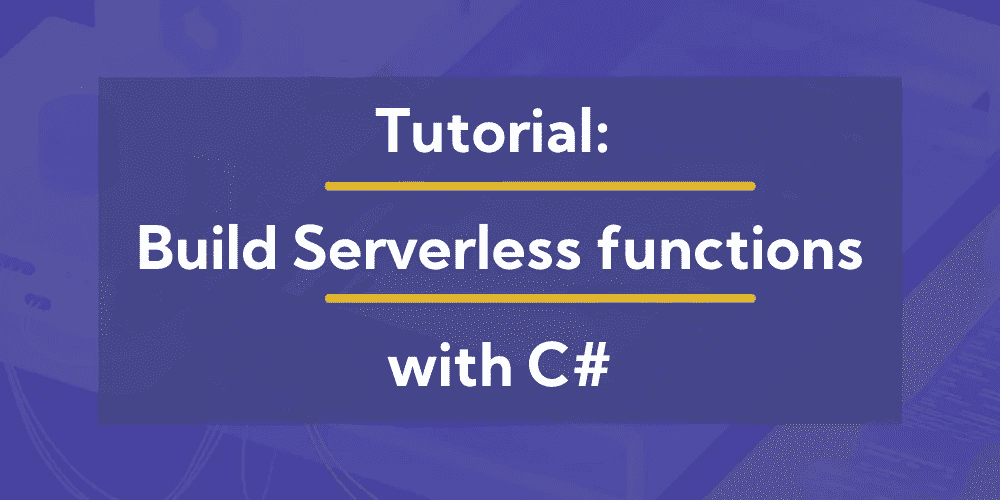

# 教程:用 C#构建无服务器函数

> 原文：<https://blog.devgenius.io/tutorial-build-serverless-functions-with-c-f8dac135a674?source=collection_archive---------4----------------------->

一种叫做无服务器计算的解决方案彻底改变了云计算的世界。对于开发者来说，使用它绝对是一种享受。

在这项创新之前，开发人员不得不担心为他们的代码提供动力的资源。自从无服务器计算推出以来，开发人员对操作系统和硬件架构的关注已经成为过去。它处理所有的服务器管理，同时专注于您擅长的事情——编写高质量的代码。

本文将解释如何在主要的云提供商服务上构建无服务器功能:Azure 和 AWS。

> 如果您是无服务器计算的新手，或者需要深入了解无服务器的起源和发展，请查看这篇[文章](https://dashbird.io/blog/origin-of-serverless/)。



# 将 C#与 Azure 函数结合使用

使用 C#构建无服务器 Azure Functions 应用程序需要满足两个基本的先决条件:

1.  拥有有效的 Microsoft Azure 订阅。如果你还没有，你可以[创建一个免费账户](https://azure.microsoft.com/en-us/free/)。
2.  获取 Azure 存储帐户。如果你没有存储帐户，可以通过登录[Azure 门户](https://portal.azure.com/)来创建。

作为一名 C#开发人员，您已经熟悉了用于构建应用程序的各种工具，包括 Visual Studio 代码和 Visual Studio IDE。这两个工具都有助于创建具有 Azure 功能的应用程序，这取决于你最喜欢哪一个。让我们更深入地研究一下这两个工具。

# Visual Studio 代码

Visual Studio Code 是一个轻量级但功能强大的代码编辑器，有不同的版本可用于 Windows、Linux 和 macOS。

要为 Azure 函数构建应用程序，您需要获得 Azure Tools for Visual Studio 代码，它将为您提供直接从 VS 代码编辑器访问或创建资源的便捷命令。

要设置 Azure 工具，通过启动编辑器并导航到左侧菜单上的扩展市场来安装 [Azure 扩展包](https://marketplace.visualstudio.com/items?itemName=ms-vscode.vscode-azureextensionpack)。VS 代码中的扩展市场接口应该如下所示:

当您完成了 Azure for VS 代码的设置后，通过使用命令 **CTRL+Shift+P** 启动命令面板，并在出现的文本字段中键入“ **Azure: Login** ”，从代码编辑器登录 Azure。单击出现的相应结果，编辑器将生成一个代码，其中包含如何完成该过程的说明。

如果你要用 VS 代码用 C#开发，另一个重要的扩展是 Visual Studio 代码的 [C#。在撰写本文时，该扩展支持基本的调试功能，关于](https://marketplace.visualstudio.com/items?itemName=ms-vscode.csharp)[的全部细节可以在这里找到](http://aka.ms/vscclrdebugger)。

# Visual Studio 2017 IDE

从 15.5 版本开始，Azure 开发工作负载与 Azure Functions 工具捆绑在一起。这意味着如果你计划安装 Visual Studio 2019 的最新版本，你需要在你的安装过程中包括 Azure 开发工作负载。

安装完成后，在 Visual Studio 中登录到您的 Microsoft 帐户，并创建一个新的 Azure Functions 项目，您就可以开始工作了。

既然我们已经强调了如果你想用 Azure functions 在 C#中构建无服务器功能，你需要知道什么，让我们转到讨论你需要什么来开始在 AWS Lambda 无服务器框架上运行无服务器应用

# 将 C#与 AWS Lambda 一起使用

AWS Lambda 是 AWS 无服务器架构的计算部分，几乎不需要管理。这是最受欢迎的无服务器选项之一，尽管 AWS 在 2014 年推出了它，但在 2018 年，AWS 宣布正式支持 [a .NET Core 2.0 运行时](https://aws.amazon.com/about-aws/whats-new/2018/01/aws-lambda-supports-c-sharp-dot-net-core-2-0/)，并在 [2020 年支持 3.1 版本](https://aws.amazon.com/blogs/compute/announcing-aws-lambda-supports-for-net-core-3-1/)。理解这一点至关重要。NET 核心不同于。以下是 AWS 选择的几个原因。NET 核心。NET 框架

*   。NET Core 是最新重新设计的。NET，它专注于更现代的应用程序，尤其是支持云的应用程序，这在编写 Lambda 函数时有很大的好处
*   。NET Core 是用模块化设计设计的，这意味着你只能包含。NET 你将需要当你写你的 Lambda 函数。这导致更少的内存使用，因为 Lambda 对内存使用收费，函数对内存的需求越少，使用 AWS Lambda 的成本就越低。
*   。NET Core 是开源的，并根据 Amazon Linux 进行了验证，Amazon Linux 是 AWS Lambda 的底层平台，这使得 AWS 可以应对使用它可能出现的安全问题。
*   与。NET 核心，你现在可以在任何平台上编写你的 C#代码，而不是早期的。NET，在那里你可以只在 Windows 环境下编写 C#代码。

要开始使用 Visual Studio 在 C#中构建 Lambda 函数，您需要了解 AWS Lambda 有一个现成的模式来为您的 Lambda 函数创作代码。该模式包括以下概念:

*   **处理程序** —处理程序函数是由 AWS Lambda 调用的函数，用于开始执行您的 Lambda 函数。AWS Lambda 将任何输入数据作为第一个参数传递给该函数，并将一个上下文对象作为第二个参数传递。
*   **上下文对象** —是传递给处理函数的第二个参数，它提供了代码与 AWS Lambda 交互的信息。
*   **记录** —声音记录系统是编写良好的功能的重要组成部分。AWS Lambda 将这些日志写入 CloudWatch 日志。
*   **异常**

现在我们知道了为 AWS Lambda 编写的框架，让我们看看所有这些是如何一起工作的。

# 用 Visual Studio 编写 AWS Lambda 的 C#代码

开始为 Lambda 函数编写代码需要一些先决条件:

*   如果你没有，你可以[在这里](https://portal.aws.amazon.com/billing/signup?nc2=h_ct&src=header_signup&redirect_url=https%3A%2F%2Faws.amazon.com%2Fregistration-confirmation#/start)创建一个 AWS 账户
*   [下载](https://visualstudio.microsoft.com/downloads/)并安装 Visual Studio IDE 2019。
*   [下载](https://marketplace.visualstudio.com/items?itemName=AmazonWebServices.AWSToolkitforVisualStudio2017)并安装 AWS Toolkit for Visual Studio

一旦您安装了所有的先决条件，打开 Visual Studio 并在 Start Page 选项卡旁边显示的 AWS Toolkit for Visual Studio 窗口的**上填写 AWS 凭证。可以按照窗口中的说明获取凭证(访问密钥和秘密密钥)。**

一切就绪后，让我们继续构建 Lambda 项目。

*   创建一个. NET 核心 Lambda 项目
*   打开 Visual Studio IDE，然后转到“文件”>“新建”>“项目”
*   在“已安装”窗格上，单击 Visual C#，然后单击 AWS Lambda 项目(。NET Core)如下图所示:
*   用您选择的名称填写项目名称，并单击 OK，保留默认值，然后继续选择您想要构建的 Lambda 项目的类型。
*   单击 Finish 创建项目，并查看项目代码和结构。

使用项目创建的一个关键文件是`aws-lambda-tools-defaults.json`文件，您可以在其中设置函数处理程序和其他选项。

该文件的内容应该如下所示:

```
{
  "Information": [
    "This file provides default values for the deployment wizard inside Visual Studio, and the AWS Lambda commands added to the .NET Core CLI.",
    "To learn more about the Lambda commands with the .NET Core CLI execute the following command at the command line in the project root directory.",
    "dotnet lambda help",
    "All the command line options for the Lambda command can be specified in this file."
  ],
  "profile": "default",
  "region": "us-east-2",
  "configuration": "Release",
  "framework": "netcoreapp3.1",
  "function-runtime": "dotnetcore3.1",
  "function-memory-size": 256,
  "function-timeout": 30,
  "function-handler": "AWSLambda1::AWSLambda1.Function::FunctionHandler"
}
```

# 发布到 AWS Lambda

在 AWS Lambda 上运行我们的代码的下一步是发布它。这是在代码已经被审查并且你确信它是好的之后进行的。下面的步骤概述了发布代码需要做的事情。

*   在右边，你可以看到这个项目。在解决方案资源管理器中，单击“发布到 AWS Lambda”。
*   接下来，在出现的上传到 AWS Lambda 窗口中填写函数名。此时，您可以为您的函数指定任何喜欢的名称。完成后，单击下一步。
*   在“高级功能详细信息”页面上，使用与您的 AWS 帐户相关联的角色填写“角色名称”部分。这是一个必填字段，需要在进入上传流程的下一阶段之前提供。其他部分包括 VPC 部分(仅当您的功能将访问亚马逊 VPC 上的资源时适用)和环境部分。
*   一旦您的函数开始上传，将显示一个显示上传状态的窗口，之后将显示一个函数视图页面，您可以在其中分别测试您的函数和查看日志。
*   Invoke 按钮开始测试函数，同时日志输出显示测试的输出。这些日志也保存在 AWS 中的 CloudWatch 日志中，在那里可以查看日志的更多细节。

# 结论

现在，您已经快速了解了使用强大的 C#编程语言构建和发布无服务器应用程序所需的知识，尽管在 [Dashbird](https://dashbird.io/) 上，我们更倾向于 AWS Lambda，但没有什么可以阻止您探索 Microsoft Azure 函数和 AWS Lambda 选项，为您的应用程序获得无服务器基础架构。

*延伸阅读:*

[如何获得 C# Lambda 函数的概述](https://dashbird.io/blog/how-to-get-overview-c-lambdas/)

[AWS vs Azure，快速对比](https://dashbird.io/blog/aws-vs-azure/)

[无服务器可观察性和实时故障排除](https://dashbird.io/observability/serverless-observability-real-time-debugging/)