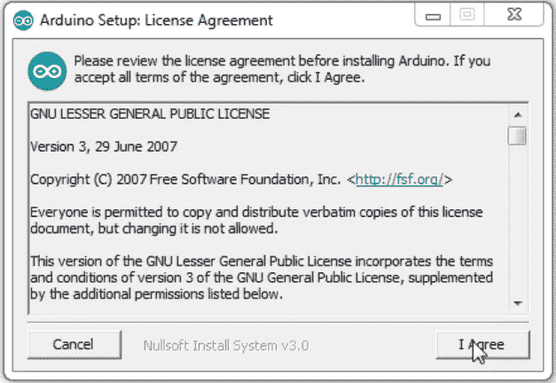

# Tutorial Installasi Arduino

> 原文：<https://blog.devgenius.io/tutorial-installasi-arduino-98bfea681ba4?source=collection_archive---------30----------------------->

source : [https://commons.wikimedia.org/wiki/File:Arduino_Logo.svg](https://commons.wikimedia.org/wiki/File:Arduino_Logo.svg)

Untuk membuat poject dengan melibatkan Arduino, diperlukan software Arduino IDE untuk melakukan program ke alat yang akan dibuat. Nah terlebih dahulu kita perlu untuk melakukan installasi software Arduino IDE. adapun langkah — langkahnya seperti yang saya jelaskan di bawah ini :

1.  Download intaller Arduino IDE di link berikut [https://www.arduino.cc/en/main/software](https://www.arduino.cc/en/main/software)

Pilih versi Arduino berdasarkan sistem operasi yang digunakan.

2\. Pada halaman konfirmasi untuk download pilih “Just Download”

3\. Install file Arduino.exe yang didownload

4\. Pada License Agreement , klik tombol “I Agree” untuk memulai menginstall software

5\. Untuk kotak dialog Installation Option pilih semua option/pilihan dan tekan tombol “Next”

6\. Pada installation folder atau pilihan folder penyimpanan program Arduino, pilih lokasi untuk menyimpan dan klik tombol “install” untuk memulai proses installasi Arduino

7\. Proses instalasi Arduino mulai berjalan, program di extract ke window

8\. Ketika proses instalasi sedang berjalan, akan muncul kotak dialog untuk install driver, centang pada opsi “Always trust software from Arduino..” dan klik tombol “Instal”

9\. Proses instalasi selesai. Jendela ini bisa ditutup dengan menekan tombol “Close”

10\. Proses instalasi Software Arduino sudah selesai terinstal di laptop. Cek di Desktop Windows atau Start Menu untuk menjalankan Software IDE Arduino. Double Klik icon Arduino di desktop atau klik di Start Menu

11\. Jendela awal software Arduino IDE

