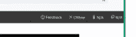
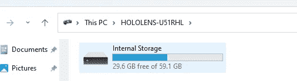

# 教程:如何用 Hololens 2 创建你周围的空间地图

> 原文：<https://blog.devgenius.io/tutorihow-to-create-spatial-maps-of-your-surroundings-with-the-hololens-2-3b73d0a8d1e7?source=collection_archive---------1----------------------->

## 使用 screencaps 进行空间制图的逐步说明

## 为什么要用 Hololens 2 创建空间地图？

Hololens 2 不断创建你周围的空间地图，以检测墙壁、家具等。让全息图与空间互动的第一步是探测空间。本教程将向您展示一种简单的方法来下载这些空间地图作为 obj 文件，以便在您最喜欢的 3D 编辑器中查看。如果你是 Hololens 的游戏开发人员，试图弄清楚为什么咖啡桌会一直把你的角色切成两半，或者像这样，你可能会想这么做。

## 什么影响空间地图质量

我发现一些事情会影响空间贴图的质量，灯光，如果表面是反光的，以及我通过物体的速度。

反光物体似乎会让全息透镜感到困惑，它很难理解这种几何形状。同样，极高和极低的光线很难创建精确的几何图形，最后，如果我跑得太快，我会太快地经过物体，让全息透镜分析空间和创建几何图形。轻快地奔跑会导致低分辨率的几何图形，并且试图使用全息透镜在移动的汽车中创建空间地图是不可能的，它只是移动得太快了。

## 步骤 0:将 Hololens 和你的 Windows PC 连接到你的移动热点

为了能在收集空间地图时自由走动，我喜欢用手机作为移动热点。

将 Hololens 和您的 Windows 笔记本电脑连接到热点，以便它们可以通过 Windows 设备门户中的同一个 Wifi IP 地址进行连接。

注意:你不必使用移动热点，但我发现在户外“野外”走动超级方便。你可以很容易地使用你自己的家庭无线网络或者工作无线网络。唯一真正重要的是它们都连接到同一个网络。无论是 wifi 网络、LTE 移动网络还是以太网，都无关紧要。

这是我在本地社区收集空间数据的照片。因为我使用的是移动蜂窝网络，所以我可以自由移动，不会像使用 WIFI 网络那样被限制在一个地方。

我的 Hololens 和我的笔记本电脑连接到同一个网络。这才是最重要的。

## 第一步

打开全息透镜，戴在头上

## 第二步

点击手腕上的 Windows 图标，打开 Windows 开始菜单[1]

## 第三步

通过用手指点击或说出“设置”一词来选择设置选项[2]

## 第四步

用手指点击左下角的“更新和安全”或说出“更新和安全”来选择它

## 步骤 5:在 Hololens 上启用设备门户

选择“面向开发人员”菜单项

1.  启用使用开发人员功能将应用程序从 Visual Studio 部署到您的 HoloLens。如果您的设备运行的是 Windows Holographic 版本 21H1 或更高版本，也请启用设备发现。
2.  通过说“向下滚动”向下滚动，并启用设备门户，这可以让你从网络浏览器连接到 HoloLens 上的 [Windows 设备门户](https://docs.microsoft.com/en-us/windows/mixed-reality/develop/advanced-concepts/using-the-windows-device-portal)。
3.  通过说“向下滚动”向下滚动，并记下您的以太网和 wifi 设备门户网址。它们看起来会像: [https://192.168。***.*](https://192.168.***.*) 。总共有两个，一个用于以太网，一个用于 wifi。[5]

## 步骤 6:在 Windows PC 上启用开发人员模式和设备门户

转到设置。

选择隐私和安全。

为开发者选择。

启用开发人员模式，阅读所选设置的免责声明，然后选择“是”接受更改。

启用设备门户

注意:为了简单起见，我选择将“身份验证”设置为关闭，因为我是这个网络上唯一的一个人，但是出于安全原因，您当然可以保持这个状态。

重启你的机器。

## 步骤 7:连接到 Windows 设备门户

用 USB C 线把你的 Hololens 连接到你的 Windows 机器上

确保它是打开的，并且在你的头上，所以它是“在线的”

使用您之前写下 wifi 地址(注意下面以太网地址被圈起来，但是使用 Wifi 地址)输入到网络浏览器中。[7]

您的设备门户主页将如下所示:

## 步骤 8:使用 3D 视图创建空间地图

展开视图->三维视图

你会看到一个如下的 3D 视图。当你移动你的头时，绿色的镜头会更新。

确保你的 Hololens 处于“在线”状态，你可以在右上角看到一个指示器，告诉你它是否在线。如果它不在你的头上，它会睡着，所以你可以再次打开它，并确保它连接到你的网络。

我使用浏览器的缩放功能缩小到足够大，这样我就可以一次看到 3D 视图和“更新”按钮。

当我四处走动查看资料时，我会反复点击“更新”按钮，以不断向空间地图添加几何图形

当我收集完几何图形后，我点击保存按钮，将一个. obj 文件保存到我的下载文件夹中。

你可以装货。obj 文件到任何你喜欢的 3D 编辑器中。OBJ 是一种相当通用的格式。

您甚至可以以编程方式解析 obj 文件并对其进行分析。

## 如何拍摄屏幕截图

**1。硬件按钮**

要快速拍摄当前视图，请同时按下 HoloLens 设备上的 ***音量增大*** 和 ***音量减小*** 按钮。这是 HoloLens 版的截图。

**2。语音命令**

Cortana 还可以通过语音命令拍照，如果你说:“嘿 Cortana，拍张照。”

## 如何录制视频

说“开始录制”，您将开始录制视频。

## 如何从 Hololens 获取您的屏幕截图和视频

用 USB-C 线将你的 Hololens 连接到你的 windows 笔记本电脑上

在这台电脑下的 Windows 资源管理器中寻找你的全息透镜

确保你已经打开了全息透镜并戴在头上，否则它看起来就像一个空的驱动器

你可能需要在 Hololens 中输入你的个人识别码，才能让你的硬盘出现

转到内部存储->图片

进入相机胶卷文件夹

你所有带时间戳的视频和照片都会在那里。

# 参考

[1] Hololens 2 基本设置。[https://docs.enklu.com/docs/HoloLens/HoloLens2Basics&设置](https://docs.enklu.com/docs/HoloLens/HoloLens2Basics&Setup)

[2]为 Hololens 安装 PIX。[https://docs . Microsoft . com/en-us/windows/mixed-reality/develop/advanced-concepts/installing-pix-holo lens](https://docs.microsoft.com/en-us/windows/mixed-reality/develop/advanced-concepts/installing-pix-hololens)

[3]我如何在 Hololens 上拍摄照片和录制视频。[https://www . re-flekt . com/knowledge/how-do-I-take-photos-and-record-videos-on-the-holo lens](https://www.re-flekt.com/knowledge/how-do-i-take-photos-and-record-videos-on-the-hololens)

【4】超级棒的 Hololens Unity 设置教程。[https://circuitstream.com/blog/hololens-setup/#steps](https://circuitstream.com/blog/hololens-setup/#steps)

[5]设置 HoloLens 以使用 Windows 设备门户。[https://docs . Microsoft . com/en-us/windows/mixed-reality/develop/advanced-concepts/using-the-windows-device-portal # setting-up-holo lens-to-use-windows-device-portal](https://docs.microsoft.com/en-us/windows/mixed-reality/develop/advanced-concepts/using-the-windows-device-portal#setting-up-hololens-to-use-windows-device-portal)

[6]在 Windows PC 上启用开发人员模式。[https://docs . Microsoft . com/en-us/windows/mixed-reality/develop/advanced-concepts/using-visual-studio？tabs = hl2 # windows PC 上的开发者模式](https://docs.microsoft.com/en-us/windows/mixed-reality/develop/advanced-concepts/using-visual-studio?tabs=hl2#developer-mode-on-a-windows-pc)

[7]设备门户页面。[https://docs . Microsoft . com/en-us/windows/mixed-reality/develop/advanced-concepts/using-the-windows-device-portal # device-portal-pages](https://docs.microsoft.com/en-us/windows/mixed-reality/develop/advanced-concepts/using-the-windows-device-portal#device-portal-pages)

## 联系我

我喜欢与其他 VR/AR/XR 开发者、3D 爱好者、图形程序员等合作、交流技巧。请随时给我发消息或通过以下链接与我联系:

 [## 阿什利·塔普-达拉斯-沃斯堡大都会区|职业简介| LinkedIn

### 查看 Ashley Tharp 在 LinkedIn 上的职业资料。LinkedIn 是世界上最大的商业网络，帮助…

www.linkedin.com](https://www.linkedin.com/in/ashleytharp/) 

这里是我的 Github，其中可能包含一些有用的片段或工具，你可能会发现相关的。请随意开始我的回复或留下你想改进的 Github 问题。

 [## 坐以待毙-概述

### 此时您不能执行该操作。您已使用另一个标签页或窗口登录。您已在另一个选项卡中注销，或者…

github.com](https://github.com/sitting-duck)