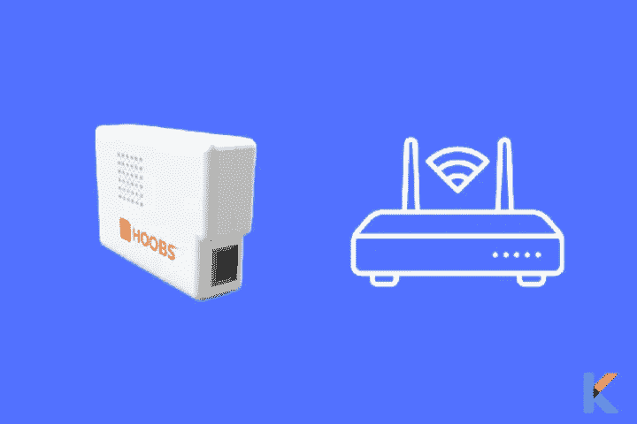
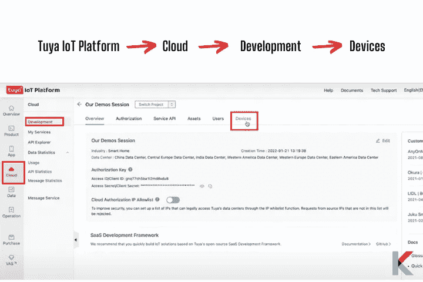

# 如何将图雅设备添加到 Apple HomeKit

> 原文：<https://blog.devgenius.io/tuya-apple-homekit-2a55c7890666?source=collection_archive---------2----------------------->

我最近买了一个 Lomota 智能灯泡，因为它便宜又多。但遗憾的是，它只支持 Google Home 和亚马逊 Alexa。我想用苹果 HomeKit 来买。此外，我想在没有互联网连接的情况下在本地控制它。对了。很高兴知道图雅设备可以在本地控制。但是我们需要使用开源的 Homebridge 解决方案。想知道如何使用苹果 HomeKit 中的本地键控制 TuyaSmart 设备吗？让我们看看怎么做。


# 如何将图雅智能设备集成到 HomeKit 中？

尽管图雅本身并不支持 HomeKit，但它可以通过使用 HomeBridge 插件与苹果 HomeKit 集成。它是一个第三方轻量级插件服务器。它也是所有不支持 HomeKit 的智能家居设备的最佳解决方案。因此，你可以使用 HomeBridge 将任何智能设备[连接到 HomeKit。](https://kodmy.com/add-any-smarthome-device-to-homekit/)

**使用苹果 HomeKit(图雅苹果 HomeKit)控制图雅设备所需的一切**

*   图雅用户帐户
*   图雅开发者帐户
*   图雅智能设备

感谢 HomeKit 开发者社区为他们提供的解决方案，可以[将图雅智能设备集成到苹果 HomeKit](https://original.newsbreak.com/@ishara-fernando-1590158/2525599507447-how-to-add-tuya-smart-devices-to-apple-homekit?s=influencer) 。以下是两个主要的解决方案。

01.软件解决方案→

02.硬件解决方案→

# 将图雅添加到 Apple HomeKit 的解决方案

让我来分析一些将图雅产品添加到你的苹果 HomeKit 的可能方法。因此，现在您可以使用 HomeBridge 将任何智能家居设备连接到 HomeKit。

## 软件解决方案

## 住宅桥

简而言之，Homebridge 是一款轻量级服务器，旨在将您的整个智能生态系统统一在一个简单的控制系统下。这个第三方软件应用程序可以与您的家庭自动化系统集成，为不直接支持 Apple HomeKit 的智能家居设备提供 HomeKit 集成。它也是 HomeKit 和第三方应用程序之间的桥梁。

相反，请查看 [Homebridge 指南](https://kodmy.com/homebridge/)以了解更多关于 Homebridge 的信息。

**在您的电脑上安装 home bridge**

作为第一种解决方案，你可以在电脑(macOS、Windows 10、Linux、Docker)上安装 Homebridge。但是，有必要让您的计算机全天候运行。如果您想自己安装 Homebridge 并将设备添加到 HomeKit，只需使用我们的[将图雅设备添加到 Homekit 的完整步骤指南→](https://kodmy.com/tuya-homekit/#tuya-homeKit-homebridge) 即可

但是，你需要有一些编码经验来自己做。否则，你可以采用我们的下一个解决方案。

**不能自己安装 Homebridge？**

如果你自己安装 Homebridge 有任何问题，你可以从 Kodmy 团队获得帮助，因此安装过程会稍微复杂一些。如果您认为在安装 Homebridge 时需要帮助，请不要担心，我们会为您提供帮助。

Kodmy 专家团队可以帮助您将戒指装置添加到 HomeKit 中。Kodmy 团队的专家在家庭自动化方面知识渊博，经验丰富。所以，他们会积极地让你参与进来，并照顾好所有的事情。你所需要的是一个远程桌面联系人，如 AnyDesk 或任何其他。当你和 Kodmy 团队一起安装 Homebridge 的时候，你不会面临任何问题；他们会为你处理整个过程。

如果您通过下面的联系按钮请求在 Mac/PC 上安装 Homebridge，我们将在 24 小时内与您联系。

[请求您的安装](https://kodmy.com/homebridge-installation-request/)

## 硬件解决方案

## 1.胡布斯

[HOOBS](https://kodmy.com/hoobs/) 代表 Homebridge 开箱即用，由树莓 Pi 和 Homebridge 预装软件组成。此外，它可以将数以千计的第三方配件与 HomeKit 集成在一起，现在可以兼容 2000 多种配件。然而，HOOBS 是一个比其他解决方案更昂贵的解决方案。

[只需 255 美元就能得到所有的东西](https://kodmy.com/store/product/hoobs-box-starter-kit/)

## 2.树莓派

Raspberry Pi 是一款价格低廉的流行单板电脑。如果你要通过 WiFi 运行你的树莓 Pi，你需要将它连接到你的家庭网络。此外，您还需要一个至少 4GB 容量的 microSD 卡，以及来自 Raspberry Pi 的独立操作系统(Windows、Mac、Linux)上的管理工具(注意:要将 Homebridge 闪存到 microSD 卡中)。Raspberry Pi 是给 HomeKit 添加戒指设备最便宜的方式。

[花 131.99 美元买树莓派](https://kodmy.com/store/product/raspberry-pi-4/)

# 使用 Homebridge 将图雅设备添加到 Apple Homekit 的分步指南

在此之前，请确保您已将设备与图雅应用程序链接。参见[如何在图雅物联网平台上配置](https://kodmy.com/tuya-homekit/#configure)。

1.  在 Mac/PC 上安装 Homebridge
2.  安装环形插件
3.  编辑配置文件
4.  运行插件
5.  HomeKit 上的控制设备

特别提示:如果你在使用 Homebridge 将图雅设备添加到 Apple HomeKit 时遇到任何问题，你可以向 Kodmy 专家发送 [**Homebridge 安装请求**](https://kodmy.com/homebridge-installation-request/) 。

遵循我们的步骤指南，将您的图雅设备轻松集成到您的 Apple HomeKit。

**01。在 Mac/PC 上安装 home bridge**

如果你想在 Mac/PC 上安装 Homebridge，你可以找到我们的[如何将任何智能家居设备添加到 HomeKit](https://kodmy.com/add-any-smarthome-device-to-homekit/#step-guide-homebridge) 文章来了解步骤指南。所以，你可以很容易地在你的电脑上安装 Homebridge。

**02。安装图雅插件**

一旦安装了 Homebridge，你需要安装图雅插件。

步骤 01:首先，打开 PC 上的终端或打开 Homebridge UI

第二步:接下来，你可以安装图雅 Homebridge 插件，如下所示。

使用您的终端安装图雅插件:

```
**npm install homebridge-tuya-platform**
```


它需要很少的时间来安装图雅插件，并在安装后检查安装是否成功。

使用 Homebridge UI 安装图雅插件:

步骤 01:使用 [http://homebridge](http://homebridge) 在 web 浏览器中打开 Homebridge


步骤 02:点击菜单栏中的插件


步骤 03:在搜索字段中搜索 Homebridge 图雅，如图所示


**03。编辑配置文件**

现在，你已经安装了图雅插件。然后，您需要在运行插件之前编辑配置文件。

步骤 01:作为编辑配置文件的第一步，您需要使用以下命令导航到目录:

```
**homebridge-tuya-platform/config**
```

步骤 02:接下来，编辑配置文件(config.json ),如下图所示

步骤 03:然后，您可以指定选项的值


*   用户名和密码:在这里，您可以使用图雅智能或智能生活应用程序的用户名和密码。
*   AccessId 和 AccessKey:您可以使用您的云项目的用户访问 Id 和访问密码。要选择云项目，你必须去图雅物联网平台。(进入物联网平台>点击项目概述>现在，您可以找到访问 ID 和访问密码)


*   Lang:您可以保留默认值。
*   端点:作为端点，您可以选择云项目的可用性区域。(适用于您的图雅智能或智能生活应用程序帐户所在的区域)
*   项目类型:作为项目类型，您可以选择您所选择的开发方法(注意:创建项目时，您可以选择自定义开发或智能家庭平台即服务。所以，你可以选择它作为项目类型)
*   AppSchema:您可以在 tuyaSmart 或 smart life 等物联网平台上获得用于链接设备的移动应用程序
*   国家代码:选择国家代码时，您必须选择您在登录图雅智能或智能生活应用程序时选择的国家代码

**04。运行插件**

步骤 1:在运行插件之前，您需要使用:cd 导航到 homebridge-tuya-platform 目录..

步骤 2:接下来，您可以使用以下代码运行插件:

```
**homebridge -D -U ./config/ -P ./**
```


**05。桥接至 HomeKit**

第一步:现在，在你的苹果设备上打开 Home 应用

第二步:然后，扫描 Homebridge UI 的二维码以与 Homebridge 配对，或者您可以输入 8 位 PIN 码。(注意:在配置文件中找到 PiN 码)


**06。HomeKit 上的控制装置**

毕竟，你可以通过 HomeKit 仪表盘控制你所有的图雅设备。


# 如何使用 HOOBS 将图雅设备添加到 Apple HomeKit

毕竟，你需要用你的图雅应用程序连接设备。让我们看看[如何在图雅物联网平台](https://kodmy.com/tuya-homekit/#configure)上配置。

1.  将 HOOBS 连接到您的家庭网络
2.  在浏览器上打开 HOOBS 界面
3.  为 HOOBS 安装图雅插件
4.  图雅插件的配置
5.  在 Apple Home 中添加图雅配件

特别说明:HOOBS 是为您的 HomeKit 添加图雅设备的最昂贵的解决方案之一。如果您想选择最经济实惠的解决方案，Kodmy 团队可以在这方面为您提供帮助。你只需要 [**请求 Kodmy 专家进行 Homebridge 安装**](https://kodmy.com/homebridge-installation-request/) 。

**01。将 HOOBS 连接到您的家庭网络**



步骤 01:将 HOOBS 集线器连接到电源插座上

步骤 02:将以太网端口连接到路由器(位于 HOOBS Hub 背面的以太网端口)

**02。将 HOOBS 无线连接到您的 Wi-Fi 网络。**

步骤 1:在你的浏览器上打开 HOOBS 界面


之后，一旦 HOOBS 连接到你的家庭网络，你必须在本地服务器上设置你的 HOOBS 帐户。(访问 [http://hoobs.local](http://hoobs.local) 可以做到这一点)。

步骤 02:一旦完成，你必须创建一个管理员帐户。(注意:输入您选择的姓名、用户名和密码)

**03。为 HOOBS 安装图雅插件**


第一步:登录你新创建的 HOOBS 账户

第二步:去主窗口

第三步:点击插件图标，输入“图雅局域网”

步骤 04: 使用 **homebridge-tuya-lan** 安装插件

04 年。图雅插件的配置

步骤 01:访问 HOOBS 图雅插件页面

步骤 2:复制副标题“配置”下提供的代码


步骤 03:返回图雅局域网插件安装插件

步骤 04:点击“已安装插件”选项

05。在苹果首页添加图雅配件


步骤 01:在你的苹果设备上打开苹果主页

步骤 2:点击添加附件

步骤 03:选择“我没有代码或无法扫描”

步骤 04:然后，它会出现在屏幕上，并输入八位数的设置代码，将他们添加到 Apple Home。

步骤 05:如果你想找到设置代码，你可以在 HOOBS 仪表板上找到它(在家庭设置 pin 下)

然后，你的设备不是 HomeKit 认证的，你可能会得到一个警告(忽略它并添加)

如果你喜欢这些东西，你可以通过下面的链接获得。

[只需 241.99 美元](https://kodmy.com/store/product/hoobs-box-starter-kit/)

# 如何使用 Raspberry Pi 将图雅设备添加到 Apple HomeKit

您所需要的只是受支持的 Raspberry Pi 型号、4GB 或更大的 SD 卡，以及带有 SD 卡读卡器的 Windows、macOS 或 Linux 电脑。

**步骤**

1.下载并闪存到 SD 卡

2.连接到网络

3.管理 Homebridge

4.连接到 HomeKit

5.安装和配置插件

特别提示:如果您认为最好使用 Homebridge 解决方案将您的图雅设备添加到 HomeKit 中，Kodmy 专家将随时为您提供帮助。您现在可以简化复杂的安装过程。请随时向 Kodmy 团队发送您的 [**Homebridge 安装请求**](https://kodmy.com/homebridge-installation-request/) 。

**1。下载并闪存到 SD 卡**

使用 Homebridge Raspberry Pi 图像无需注册，因为它是完全免费的。你知道什么是 Raspberry Pi 成像仪是将 Homebridge Raspberry Pi 图像闪存到 SD 卡的最简单方法。

[花 40.98 美元买树莓派](https://kodmy.com/store/product/raspberry-pi-4/)

步骤 01:下载并安装最新版本的 Raspberry Pi 镜像


步骤 2:打开 Raspberry Pi 成像仪应用程序

步骤 03:单击选择操作系统


步骤 04:向下滚动并选择“其他特定用途操作系统”类别


步骤 05:选择 Homebridge，然后选择最新的 Homebridge 图像


第六步:点击选择存储，并选择您的 SD 卡

第七步:点击写


**2。连接到网络**

以太网或 WiFi 都是连接 Pi 的选项。以太网可用于连接 Raspberry Pi，无需额外配置。你只需要第一次打开你的智能设备。如果您想通过 Wi-Fi 连接您的 Raspberry Pi，请按照以下步骤操作

步骤 01:打开设备电源(没有连接以太网电缆)

第二步:扫描新的无线网络(用你的手机)

步骤 03:连接到名为 Homebridge WiFi 设置的热点

步骤 04:几分钟后打开强制网络门户，然后你可以将树莓 Pi 连接到你的本地 Wi-Fi 网络。

**3。管理 Homebridge**

您可以使用 Homebridge 用户界面安装、删除、更新插件，以及修改 Homebridge 的 config.json 文件。(注意:默认用户名和密码都是 admin)

如果你是 Mac 用户，你想通过 [http://homebridge.local.](http://homebridge.local.) 访问用户界面，否则，如果你是 Windows 用户，按照这些步骤找到你的 Raspberry Pi 的 IP 地址。

步骤 01:登录您的路由器

步骤 02:找到“连接的设备”或“dhcp 客户端”页面:

你可以使用你的 iPhone 访问 [http://homebridge.local](http://homebridge.local) (注意:一旦你使用默认用户名和密码登录 homebridge，在系统信息下找到 IP 地址)

步骤 03:然后，你需要下载 iOS 或 Android 的 Fing 应用程序来扫描你的网络

步骤 04:一旦完成启动，IP 地址将显示在附带的屏幕上，如果你插入一个显示器到您的树莓派

**4。连接到 HomeKit**

步骤 01:打开苹果设备上的主页应用程序

步骤 02:点击主页标签和加号(+)

步骤 03:点击添加附件，然后扫描二维码

如果您第一次添加附件，您可能会收到一条消息，提示您需要进行额外的设置。因此，当你添加一个插件时，它会在没有任何许可的情况下出现在 Home 应用程序中。

**将图雅设备与苹果 HomeKit 集成的简单方法**

有很多方法可以将你的图雅智能设备集成到 Apple HomeKit 中。以下是将图雅设备集成到家庭工具包的 3 种简单方法

1.  只需使用图雅电子邮件凭据进行配置
2.  使用图雅官方的 HomeBridge 插件
3.  本地控制方式

使用 web 和本地键，您可以使用 [HomeKit 配件](https://kodmy.com/homekit/)轻松控制您的图雅设备。让我们看看如何获得图雅的本地密钥。

# 在图雅物联网平台上配置

## 从图雅平台提取设备密钥—本地密钥配置

您甚至可以在没有互联网连接的情况下本地控制您的设备。你需要在你的苹果设备上安装 TuyaSmart 应用程序，并在此之前设置一个帐户。

如果您在 http://iot.tuya.com/[上没有图雅开发者帐户，您需要创建一个帐户。](http://iot.tuya.com/)

**创建项目**

第一步:返回图雅物联网平台页面，现在转到创建的云开发项目(云、开发、创建云项目)。


第二步:然后，你必须填写细节，并点击创建按钮


**链接账户**

第 1 步:一旦你创建了云项目，然后我们需要将它链接到我们的用户帐户，通过我们想要控制的设备，我们使用应用程序上的一个。

第二步:在链接您的帐户之前，再次进入云开发，然后在图雅物联网平台设备。

第三步:接下来，选择链接图雅应用程序帐户选项卡，然后点击右边的添加应用程序帐户按钮。


第四步:你会看到一个二维码，进入智能手机上的图雅智能应用程序。然后你必须点击我的图标，然后点击[ — ]按钮。现在你可以扫码了。


第五步:这两个帐户现在将被链接。你可以在网站的列表中看到。

**提取设备 ID**

您可以看到已添加到您的图雅应用程序的设备

步骤 1:从开发屏幕转到物联网平台中的设备，并选择创建的设备



步骤 2:接下来，您要复制设备 ID，并从下拉列表中选择正确的数据中心


**获得设备许可**

现在，您有了您的设备 ID，但是我们需要在做任何事情之前添加 API 权限。

步骤 1:从云菜单转到我的服务，然后单击它。

第二步:在你想去点击物联网核心，你需要注册试用版计划。

**提取到图雅本地密钥**

现在我们对设备 ID 有了一些 API 权限

步骤 1:现在，到了云，然后是 API explorer

第二步:然后，进入智能家居管理系统，在设备管理下，你可以向下滚动以获得设备的详细信息


第三步:现在，复制粘贴设备 ID 并提交请求，毕竟你可以看到你的本地密钥。


步骤 4:复制您的本地密钥以及设备 ID，以便进入我们的 HomeBridge

**配置图雅设备**

步骤 1:返回 HomeBridge 并选择设备类型

第二步:给你的设备一个名字，然后给图雅 ID

步骤 3:将图雅键复制并粘贴到本地键中


第四步:然后，给制造，并填写其他部分(如果你不知道如何填写其他部分-去 GitHub 问题，你会找到设备类型，)点击保存，

步骤 5:重启 HomeBridge 并允许它加载所有插件

第六步:转到附件，你可以在这里看到你的设备，点击它来控制你的设备使用 HomeBridge。如果你去我的 Apple Home 应用，你也可以使用 Apple HomeKit 来控制它

# 如何使用图雅 HomeBridge 网络插件控制苹果 HomeKit 中的图雅设备

我们希望安装官方的图雅 Homebridge 插件，这样就可以使用苹果 HomeKit 控制图雅智能设备。您可以使用 HomeBridge 或 HOOBS 将您的图雅设备与 HomeKit 集成。这里有两种简单的方法。

1.  **只需使用图雅电子邮件凭证进行配置**
2.  **图雅开发配置**

## 只需使用图雅电子邮件凭据进行配置

您可以使用图雅电子邮件凭证，通过 HomeKit 简单地[控制图雅智能设备。但是您不能在本地控制您的设备。你需要有互联网连接。](https://kodmy.com/tuya-smart/)

让我们看看[如何使用图雅电子邮件凭证配置图雅插件](https://kodmy.com/tuya-homekit/#tuya-homeKit-homebridge)

我们可以使用插件和图雅的云之间的互联网连接来控制你的图雅设备。

此插件使用您的电子邮件凭据，并需要活跃的互联网连接。此外，您现在可以通过 HomeKit 控制设备。如果您浏览插件配置，您甚至可以将这些设备类型暴露到这个插件中。

## 图雅开发配置

HomeBridge 开发团队引入了一个新的 HomeBridge 插件。他们积极支持 Homebridge 社区。所以，使用这种方法你可以很容易地接触到 Apple HomeKit。配置不同于第一种方式。

**如何配置图雅开发插件—步骤**

第一步:在图雅 HomeBridge 开发团队的网页上，你可以看到他们支持的官方插件和设备类型。(小家电、安防和传感器、电工类、照明)。

如果你去 GitHub 页面打开一个问题，他们会积极地解决它，并尝试帮助你将设备启用到 Apple HomeKit。他们是一个非常活跃的社区来配置这个插件

第二步:去安装图雅 HomeBridge 插件。(复制插件-home bridge-图雅-平台的头文件)。然后去 HomeBridge 插件。单击安装。需要几秒钟。一旦插件安装完毕，你需要填充 HomeBridge tuya 平台的设置。(用户名、密码、国家代码、访问 id、访问密钥)。

第三步:要获得其他信息，你可以去 iOT.Tuya.com。现在，您想转到“云开发”选项卡

步骤 4:然后，创建一个新项目(填充和创建)，并授权遵循 API 服务设备日志和通知，

第五步:下一步，你要去设备标签，然后像以前的方法链接图雅应用程序帐户。

第四步:在你的手机上打开图雅智能应用程序，点击你的个人资料，点击扫描帐户，然后在这里扫描帐户，确认登录，让我们去设备

步骤 5:现在，您可以看到您已经安装的设备。然后，您可以转到概述。

第 6 步:我们需要这个插件的访问 id，所以，你想去物联网图雅平台，并前往概述

第七步:然后你可以看到激活密钥，复制这个密钥，粘贴到这里。

第八步:选择平台为图雅智能。并点击保存。保存后，您需要单击重启网桥

第 9 步:一旦插件被加载，你想去配件，然后你可以看到你的设备在这里。您可以使用 HomeBridge 或 Apple Home 应用程序控制您的图雅设备

这个插件使用你的互联网连接，这就是它如何暴露图雅网络开发的所有设备，然后将其导出到苹果 HomeKit。

如果你更喜欢戒指设备，你还可以找到[如何用苹果 HomeKit](https://kodmy.com/ring-homekit/) 文章添加戒指设备。

# 去哪里买最好的图雅智能家居产品？

**1。用于 LED 条形灯的 Zigbee RGBW LED 驱动器**

你可以从亚马逊花 69 美元买到用于 LED 灯的 Zigbee RGBW LED 驱动器。

**2。智能运动传感器**

在购买智能运动传感器之前，您可以[对比 **SENCKIT 运动传感器**和 **Gaoducash 智能 WiFi 温湿度监测仪**](https://kodmy.com/compare/smart-detectors-and-sensors?modelList=senckit-motion-sensor,gaoducash-smart-wifi-temperature-humidity-monitor) 一次选择最完美的。而且，你可能[以 19.98 美元的价格从亚马逊获得智能运动传感器](https://amzn.to/3D7LsVz)。

**3。智能 WiFi 温湿度监控器**

买之前可以[对比一下 **Gaoducash 智能 WiFi 温湿度监测仪**和 **SENCKIT 运动传感器**](https://kodmy.com/compare/smart-detectors-and-sensors?modelList=gaoducash-smart-wifi-temperature-humidity-monitor,senckit-motion-sensor) 。此外，你可能会以 24.98 美元的价格从亚马逊获得智能 WiFi 温度湿度监控器。

**4。视频门铃摄像头**

你可以从亚马逊花 49.99 美元买到视频门铃摄像头。点击这里

**5。图雅智能生活安防摄像头**

你可能会从亚马逊花 35.99 美元买到[图雅智能生活安全摄像头。](https://amzn.to/3DcdpM6)

除此之外，你想知道[如何将 myQ 设备添加到 Apple HomeKit](https://kodmy.com/myq-homekit/) ，你可以找到更多关于 myQ HomeKit 的信息。

# 常见问题

## 图雅本地支持 HomeKit 吗？

我们都知道图雅并不支持 HomKit。图雅是第三方制造商。因此，由于苹果公司的一套特定准则，很难获得“与 HomeKit 配合使用”标签的批准。但我们可以期待未来“与 HomeKit 一起工作”的标签。

## 什么是本地图雅？

您可以在没有互联网连接的情况下在本地操作图雅设备。家庭助理可以通过自定义集成在本地处理基于图雅的设备。通过使用推送更新而不是轮询，这种自定义集成可以更快地更新设备状态。

## 图雅能和 HomeKit 一起工作吗？

此应用程序与 Apple HomeKit 不兼容。你可以在你的 iPhone 或 iPad 上下载图雅智能应用程序，然后通过图雅智能应用程序控制设备。

## 如何在我的家庭助手中设置本地图雅？

您不需要 HOOBS hub 或 HomeBridge 来为您的家庭助理添加和配置图雅。您可以从配置->集成->添加集成->图雅直接添加它。

## 图雅使用 Zigbee 吗？

是的。图雅智能设备使用 Wi-Fi 和 Zigbee。所以，你不仅可以买到**的图雅 WiFi 产品**，还可以买到 ZigBee 3.0 智能产品。它们与 ZigBee 网关集线器兼容。请记住，您可以根据自己的意愿定制您的系统。这取决于您的个人需求和安全要求。此外，您可以使用图雅 Homebridge 的图雅 Zigbee Apple HomeKit 设备。

## **你能把智能生活和 HomeKit 联系起来吗？**

你可以使用开源软件在苹果的 HomeKit 上控制智能生活设备。你还可以通过 iOS 上的 Home app 将 Homebridge 添加到 HomeKit 中。准备好在你的图雅智能生活 apple Homekit 上实现自动化。

## 图雅和智能生活是一样的吗？

是的。图雅**智能 App 和智能生活 App 都是图雅官方 App** 。但是这两个 app 只有一个区别。图雅智能应用程序使用图雅的标志和元素，但智能生活应用程序不使用图雅的标志和元素。

## 你可以用图雅 HomeKit 集成做什么？

*   图雅提供各种网络硬件模块，包括 Wi-Fi、蓝牙和 ZigBee 模块，现在您可以通过 Homekit 获得这些模块。
*   图雅与 Homekit 集成，让您获得显著的云优势。此外，这家公司提供了一个巨大的、高度加密的云服务，速度快得令人难以置信。世界上 200 多个国家也可以访问它。
*   当图雅与你的 Homekit 集成时，它可能会激发你的应用开发者潜能。图雅允许你为自己创建一个应用程序，不需要任何编码技能。
*   图雅可以与 Homekit 集成，以覆盖所有必要的智能家电类别，包括照明、电气设备、安全产品、主要甚至小型电器。