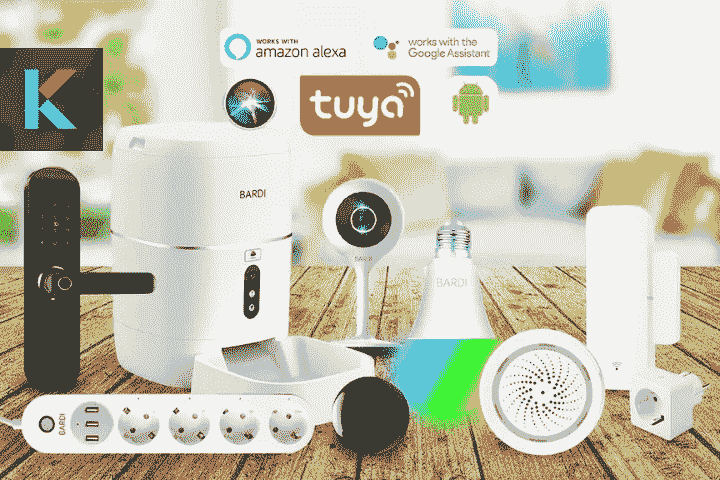
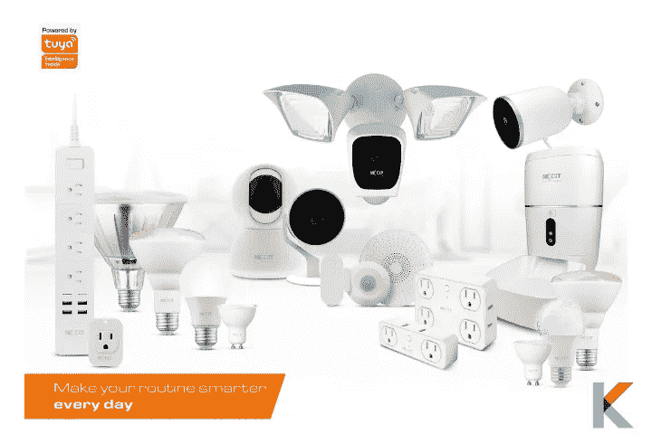
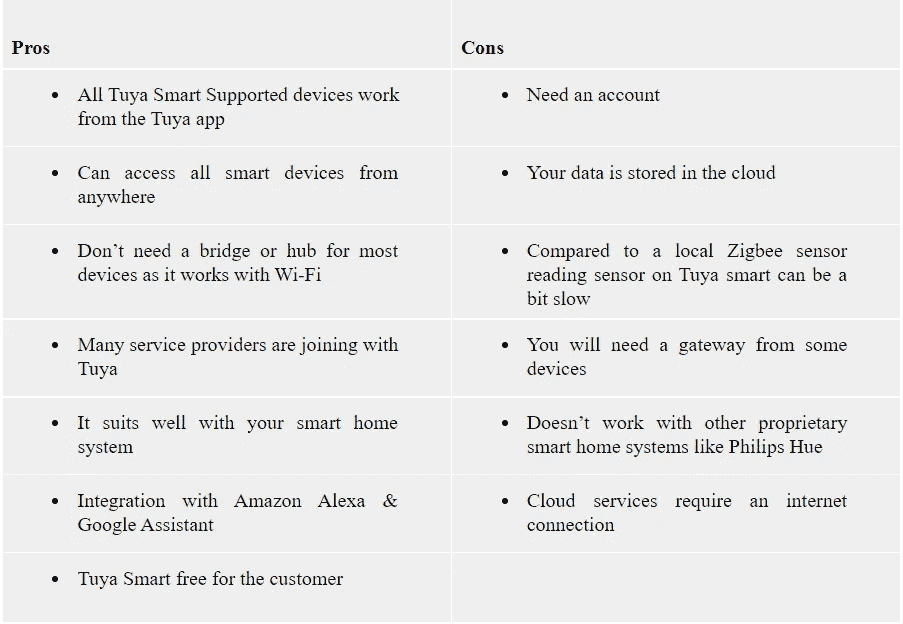
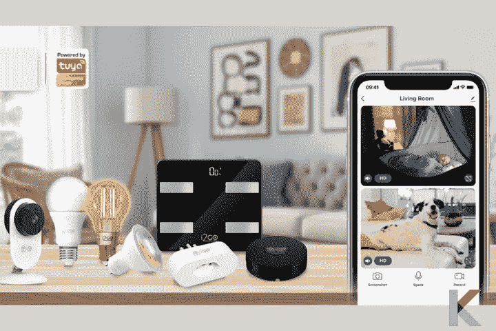
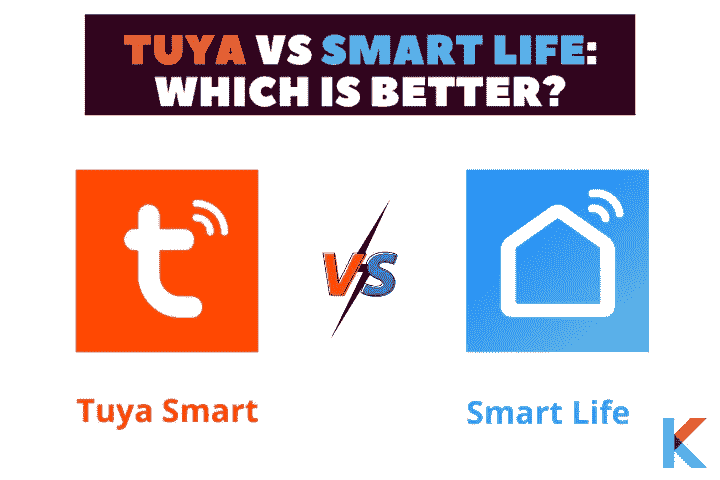

# 图雅智能:智能家居自动化和解决方案

> 原文：<https://blog.devgenius.io/tuya-smart-623b5eb93025?source=collection_archive---------6----------------------->

最近，许多智能家居设备出现了显著增长。这就是为什么你现在可以使用任何东西，从智能电视或智能扬声器到智能灯泡、智能冰箱、智能调光开关等等。由于智能家居设备市场的蓬勃发展，许多制造商抓住了这个机会。有这么多智能设备，很难只选择一个品牌。

图雅·斯马特

如果你想把你的家变成一个真正的智能家居，图雅智能将帮助你。对于任何寻求对不同品牌的多种智能家居设备进行单点控制的人来说，您来对地方了。在这篇文章中，你将了解图雅智能:智能家居自动化和解决方案的一切。

***在这篇文章中，你会学到:***

*   什么是图雅智能？
*   图雅 Smart 的特点、优点和缺点
*   图雅智能家居解决方案
*   图雅应用程序
*   如何设置图雅智能 App
*   图雅 vs 智能生活
*   图雅智能的 5 大产品和服务
*   图雅智能兼容平台
*   去哪里买图雅智能产品
*   图雅智能安全吗？

# 什么是图雅智能？

[图雅智能](https://kodmy.com/tuya-smart/)是“一个物联网服务+ AI”(全球智能)平台。它可以帮助您在一个地方轻松控制您的智能设备。也被称为全球领先的语音 AI 交互平台。此外，图雅还与消费者、原始设备制造商、零售连锁店和制造品牌建立联系，以满足智能需求。它为客户提供一站式人工智能物联网解决方案，涵盖云服务、硬件接入、应用软件开发等。

图雅·斯马特

现在，您可以将所有智能设备连接到一个应用程序，因此它允许您创建各种自动化来告诉您的设备如何完全按照您的需要执行。我相信这是你的[智能家居系统](https://kodmy.com/best-home-automation-systems/)需要的东西。通过图雅智能应用或智能生活应用，客户可以将不同品牌的不同智能家居设备整合到一个平台中。

此外，图雅通过将超过 1 亿台智能设备接入市场，为全球 93，000 名客户提供服务。他们倾向于创建完全中立的“AI-IoT”产品赋能模式。此外，图雅智能产品已销往近 200 个国家，累计超过 30，000 个智能产品。

此外，当我们谈到图雅智能公司时，图雅是 2014 年成立的中国物联网公司之一，其主要创始人来自阿里巴巴集团。他们的业务遍及全球，在中国、日本、印度、美国、德国等地都有分支机构。此外，您可以使用图雅应用程序和智能生活应用程序来控制图雅智能产品列表中的智能家居产品。这是真的。图雅不生产任何智能家居产品，但他们为其他智能家居制造商提供了一个平台。

因此，它支持图雅智能设备(如图雅智能插头、智能开关、智能灯泡、智能锁、智能报警系统、智能调光器等)与云的后台连接，并为服务提供商提供无缝创建智能家居应用的工具。

相反，请查看我们的 [KNX 智能家居](https://kodmy.com/knx-smart-home/)和 [Wink 智能家居解决方案](https://kodmy.com/wink-smart-home-solution/)文章，了解更多关于其他智能家居系统的信息。

**你更喜欢安卓还是苹果 HomeKit？**

安卓用户——这款图雅智能手机兼容谷歌助手和亚马逊 Alexa。所以，继续读下去。

苹果 HomeKit 用户——图雅智能本身并不支持苹果 HomeKit。如果你有一个苹果 HomeKit，你很可能会想把你的图雅设备连接到 HomeKit 上。想过怎么做吗？让我们来了解一下[如何给苹果 HomeKit](https://kodmy.com/tuya-smart/#tuya-apple-homekit) 添加图雅配件。

**轻松检查您的图雅智能设备兼容性**

如果你有一个谷歌助手，你可以很容易地检查智能家居设备与谷歌助手的兼容性。还有，你不仅可以检查谷歌助手的兼容性，还可以检查设备与 Alexa 和 Siri 的兼容性。所以，现在是时候寻找[谷歌兼容的智能家居设备](https://play.google.com/store/apps/details?id=com.knovik.canda)了。

使用下面的按钮下载 Canda——谷歌助手兼容性检查器。

[从 Play Store 下载](https://play.google.com/store/apps/details?id=com.knovik.canda)

否则，如果你是 iPhone 用户，你可以使用下面的按钮下载 Canda-Siri 兼容性检查器。

[从应用商店下载](https://apps.apple.com/us/app/canda-compatibility-checker/id1630339464)

# 图雅 Smart 的特点、优点和缺点

***特性***

*   轻松快速地将图雅智能应用或智能生活应用连接到您的设备
*   从任何地方远程控制智能家居设备
*   使用一个应用程序一次添加和控制多个智能家居设备
*   通过亚马逊 Alexa 和谷歌助手进行语音控制
*   智能多智能设备互操作性
*   轻松与家人分享智能家居设备
*   接收实时警报

***利弊***

# 图雅智能家居解决方案

[图雅智能](https://kodmy.com/tuya-smart/)

***图雅智能照明解决方案***

图雅智能提供一站式智能照明解决方案，如智能照明硬件解决方案。它拥有一体化应用、物联网云平台、家庭照明应用、商业照明 SaaS 平台和各种增值服务。以下是几款图雅智能家居照明解决方案。

*   Zigbee RGB 智能梦幻灯解决方案
*   蓝牙网状成长灯
*   梦幻彩色派对灯智能解决方案
*   用于照明驱动器的 Zigbee 智能解决方案
*   智能 LED 蜡烛解决方案
*   台灯解决方案
*   智能面板照明解决方案

你可以从亚马逊花 69 美元买到用于 LED 条形灯的 Zigbee RGBW LED 驱动器。

***图雅智能传感器***

图雅通过提供家居安防传感解决方案，为您打造一个智能安全的家。他们的传感器生态系统涵盖消防、安全、环境监控等领域。此外，图雅智能兼容 Wi-Fi+ble、BLE、Zigbee 和 NB-IoT。

*   智能应急按钮解决方案
*   亮度传感器
*   PM2.5 检测器
*   漏水探测器
*   门窗传感器解决方案
*   温度和湿度传感器
*   人体运动传感器

你可以[花 19.98 美元从亚马逊获得智能运动传感器](https://amzn.to/3D7LsVz)和[从亚马逊获得智能 WiFi 温度湿度监控器](https://amzn.to/3obaleR)。

***大型家电***

图雅智能为空调、冰箱、热水器、洗衣机等主要家电提供大量智能家居解决方案。他们提供一站式解决方案，为客户提供高品质的智能生活。

*   小冰箱智能解决方案
*   空调智能解决方案
*   热水器智能解决方案

***小家电***

图雅还提供数十种小家电解决方案，如风扇、伺服加热器和空气改善产品。它兼容多种协议，在物联网平台上提供一站式智能解决方案。

*   智能除湿机
*   图雅吸奶器智能解决方案
*   智能毛巾保暖解决方案
*   智能空气净化器解决方案

***厨房电器***

烹饪、速溶饮料、厨房清洁和食物储存解决方案是图雅的智能厨房解决方案。下面给出了许多其他解决方案。

*   智能电烤箱解决方案
*   智能电水壶解决方案
*   智能食品探针解决方案
*   电饭煲的智能解决方案
*   空气油炸锅的智能解决方案
*   慢炖锅的智能解决方案
*   电水壶的智能解决方案

***运动与健康***

*   智能白噪声机解决方案
*   智能跳绳解决方案
*   智能水杯解决方案
*   智能手表解决方案
*   BLE 营养量表
*   BLE 体脂秤的智能解决方案

***安防与视频监控***

*   蓝牙智能锁解决方案
*   智能 Wi-Fi 访问控制解决方案
*   300 万像素网关嵌入式 PT 摄像机
*   300 万像素半球摄像机解决方案
*   智能 Wi-Fi 双向视频聊天锁解决方案
*   智能图像集成基于单芯片的 Wi-Fi 锁解决方案
*   蓝牙智能挂锁解决方案
*   超低功耗保活 Wi-Fi
*   蓝牙门锁配件解决方案
*   300 万像素立方体摄像头解决方案
*   蓝牙智能安全解决方案
*   Wi-Fi 智能保险箱解决方案
*   Zigbee 智能锁的智能解决方案
*   Wi-Fi Pro 智能锁解决方案

你可以从亚马逊花 49.99 美元[买到视频门铃摄像头](https://amzn.to/3Dccmf8)，从亚马逊花 35.99 美元买到图雅智能生活安全摄像头[。](https://amzn.to/3DcdpM6)

***网关控制***

*   有线和无线智能网关 _Zigbee
*   智能控制面板 PCBA 开发-免费
*   智能多功能 Zigbee 网关
*   通用遥控器
*   蓝牙无线网关— C
*   有线 ZigBee 网关
*   无线 Zigbee 网关
*   蓝牙插座网关的智能解决方案
*   有线和无线智能网关 _Zigbee

***能量***

*   智能水表解决方案
*   智能电表解决方案
*   智能断路器
*   娱乐
*   带扬声器的星空投影仪智能解决方案
*   蓝牙网状成长灯

通过下面的链接，你可以从亚马逊以 31.98 美元的价格买到电动球阀浇水定时器 WiFi 电动关水控制器。

# 图雅应用程序

图雅智能是一个应用程序，通过移动设备或平板电脑控制您的智能产品。它适用于 iOS 和 Android 操作系统。此外，您可以使用这个二维码下载图雅应用程序。你只是想扫描要下载的代码。

图雅有两个应用，智能生活应用和图雅智能应用。选择智能生活应用程序是你最好的起点，因为它支持 IFTT，而图雅智能应用程序不支持它。此外，还有适用于 PC 的图雅智能应用程序。

# 如何设置图雅智能 App

如果你想尝试图雅智能，有几个步骤来开始使用该应用程序

*   首先，你必须在你的智能手机上下载图雅智能应用程序
*   然后，创建您的图雅帐户
*   下一步，在应用程序的主屏幕上定位，创建你家的简介
*   之后，添加您的家庭成员，并将您想要使用的智能设备与图雅连接

# 图雅 vs 智能生活

图雅智能应用程序是该应用程序的基本版本。此外，智能生活应用程序是改进的图雅智能应用程序。图雅智能 app 为品牌提供了一个平台。这两款应用都可以在 Google Play 和 App Store 上下载。

*   **图雅 app 和智慧生活 app 的优势**

# 图雅智能的 5 大产品和服务

*   **图雅物联网模块**

当我们考虑智能设备时，网络连接是一件非常重要的事情。图雅物联网模块全球适用，支持蓝牙、Wi-Fi、Zigbee 等主流联网方式。图雅物联网模块已经广泛应用于智能家居领域。

*   **图雅云**

图雅为全球客户提供安全、稳定、快速的云服务。图雅云拥有 1000 万用户的并发处理能力和 1 亿米的海量数据。此外，他们还整合了阿里云和亚马逊全球服务节点。

*   **图雅智能 App**

它是智能系统的智能控制中心。“图雅智能公共 App”和“品牌 OEM App”是图雅的两个项目。这些程序由图雅公司提供支持。

*   **数据与运营中心**

你知道什么叫智能不仅仅是一个产品。于是，消费者运营工具和强大的数据统计能力无缝连接消费者，实现智能销售和运营。

*   **智能产品增值服务**

图雅利用生态链接能力帮助合作伙伴赢得市场。根据产品销售区域，为您的产品选择相应的增值服务。

# 图雅智能兼容平台

图雅智能集成了许多平台，以提高工作能力

*   谷歌助手
*   亚马逊回声
*   IFTTT
*   谷歌巢
*   天猫精灵
*   iPhone4S 上的语音控制功能
*   百度 DuerOS
*   罗基德
*   JD 丁咚
*   腾讯肖伟

# **去哪里买图雅智能产品？**

你可以在阿里巴巴和亚马逊上买到非常棒的图雅智能家居产品。此外，您现在可以选择合适的图雅智能家居产品，并从亚马逊获得特别优惠和折扣。亚马逊上有许多图雅产品，包括图雅插头、图雅智能开关、图雅智能相机、图雅智能调光器、图雅智能网关等等。

# 图雅智能安全吗？

不要担心图雅·斯马特的安全。它是安全的，因此它有 TLS 加密与图雅云通信。此外，它还加密了 AES 密钥的传输。所有这两种加密都可以确保安全性。图雅云还提供五层安全策略，包括数据加密、授权和认证、动态密钥、通道加密和虚拟设备设计。

**数据加密** -即使设备被盗，也无法被破译为军用级 AES 数据加密

**授权和认证** -它保证数据隔离、三重控制请求和连接认证

**动态密钥**——一机双码动态密钥和动态密码，确保算法暴露情况下的设备安全。

**通道加密**——图雅通过 https 加密通道传输确保网络传输的安全性

**虚拟设备设计** -即使遭到黑客攻击也能快速恢复

**我们的选择**

在本次图雅智能评论中，您可以了解到图雅智能下载、图雅智能登录、图雅智能 PC 版、图雅智能产品列表、图雅哪里买、图雅智能 App vs 智能生活 App、图雅智能公司、Tuya 智能兼容，以及更多关于 Tuya 的内容。它通过学习你需要知道的关于图雅智能智能家居自动化和解决方案的一切，帮助你提升你的智能家居。一旦你从一个点(比如你的手机)控制了整个家，就没有回头路可走了。

如果您想知道如何在图雅平台上迈出第一步，这非常简单。你只需要一个支持图雅的设备、一个图雅应用程序和一个无线互联网连接，就可以开始使用图雅智能。我确定。这将有助于进一步集成到家庭自动化平台中。请在评论区分享你宝贵的想法和经验。

如果你对 Nest 智能家居解决方案感兴趣，你可以在这里找到[谷歌 Nest Mini 设置并查看](https://kodmy.com/google-nest-mini-setup-and-reviews/)。

*更多内容尽在*[*blog . dev genius . io*](http://blog.devgenius.io)*。*