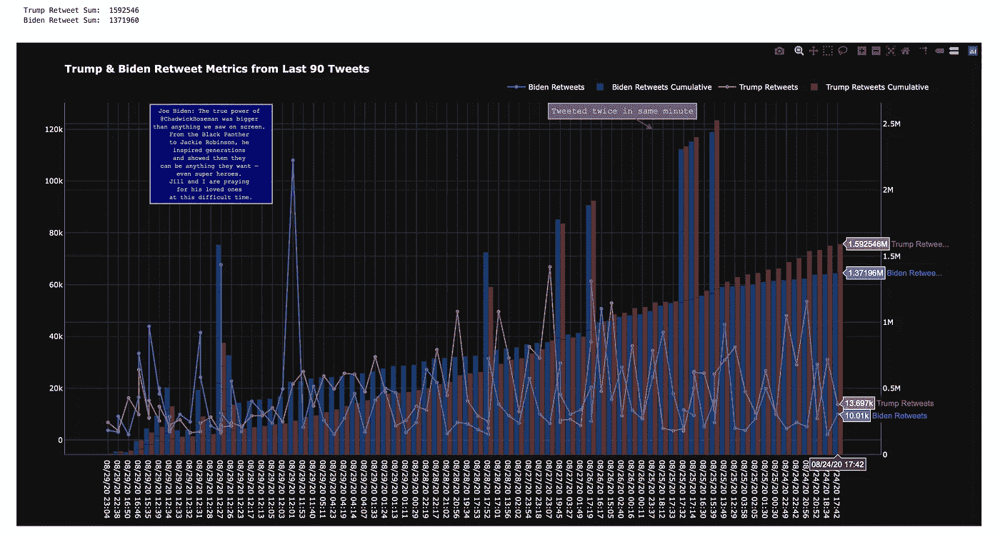
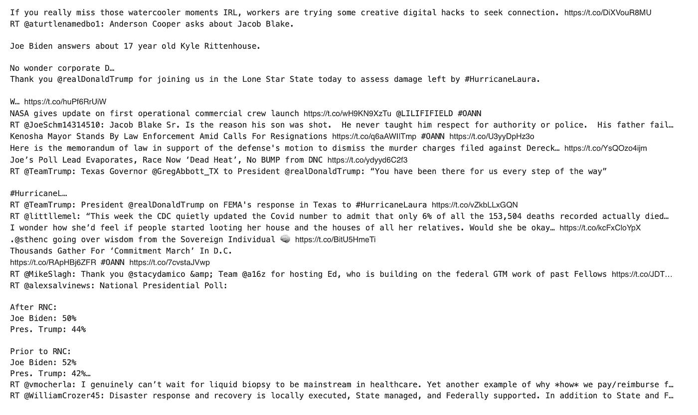
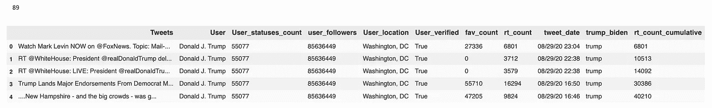
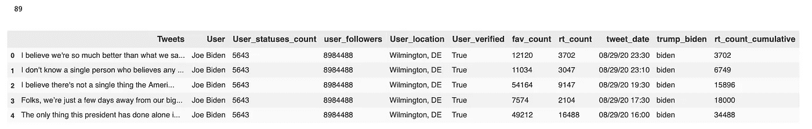
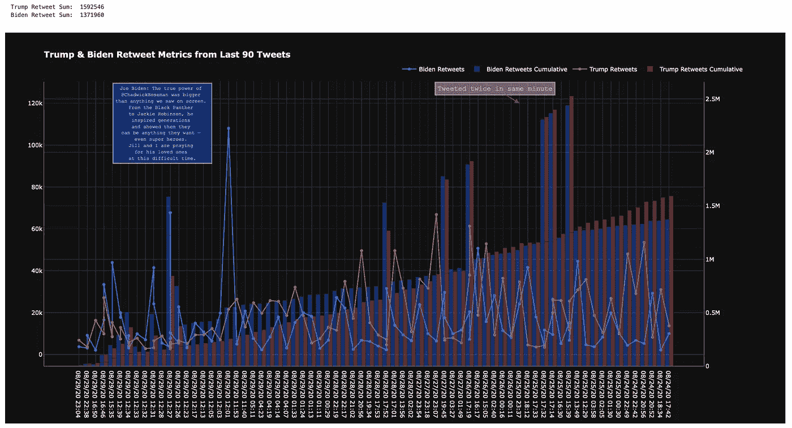

# 用 Pandas 和 Plotly 实现 Twitter API 数据可视化

> 原文：<https://blog.devgenius.io/twitter-api-data-visualizations-with-pandas-and-plotly-1e9d0c00ab26?source=collection_archive---------2----------------------->



特朗普和拜登发推文和转发

# 首先，如何阅读这张图表，因为我知道解释比猜测容易

*   红蓝线是特朗普和拜登过去一周的推文
*   红色和蓝色条是特朗普和拜登过去一周的累计转发总数
*   Y1 轴是每条推文的转发次数
*   Y2 轴是推文转发的累计总和
*   x 轴是日期

# 这不会是多余的

有很多文章对 Twitter API 进行了概述。这不是那个。

我在这里的目标是通过向您展示代码，并提供一些在构建此图时对我有帮助的提示，让您在几分钟内上手并运行。

# 代码块 1

**分成 3 块*

```
import tweepy
import numpy as np
import pandas as pd
import re
import plotly.express as px
import plotly.graph_objects as go
from plotly.subplots import make_subplotsapi_key = 'x'
api_secret_key = 'y'
bearer_token = 'a'
access_token = 'b'
access_token_secret = 'd'
password = 'd'auth = tweepy.OAuthHandler(api_key, api_secret_key)
auth.set_access_token(access_token, access_token_secret)api = tweepy.API(auth)public_tweets = api.home_timeline()
for tweet in public_tweets:
    print(tweet.text)
```

## 几个要点:

*   用`pip install tweepy`安装`tweepy`和`plotly`或在 ju pter`!pip install tweepy`中
*   为 twitter api 创建您的帐户—这很快。我使用了我的个人推特账户:[https://developer.twitter.com/en/portal/projects-and-apps](https://developer.twitter.com/en/portal/projects-and-apps)
*   在 api 密钥和访问令牌行中插入您的凭证

上面的代码生成了几条如下所示的 tweets:



代码片段 1 中的一些推文

# 代码段 2

```
auth = tweepy.OAuthHandler(api_key, api_secret_key)
auth.set_access_token(access_token, access_token_secret)
api = tweepy.API(auth)df1 = pd.DataFrame(columns = ['Tweets', 'User', 'User_statuses_count', 
                             'user_followers', 'User_location', 'User_verified',
                             'fav_count', 'rt_count', 'tweet_date'])# search_words = "#trump"
# new_search = search_words + " -filter:retweets"
# date_since = "2020-11-16"
search_words="from:realdonaldtrump"def stream(data, file_name):
    i = 0
    for tweet in tweepy.Cursor(api.search
                               , q=data
                               , count=500
                               , lang='en').items():
        print(i, end='\r')
        df1.loc[i, 'Tweets'] = tweet.text
        df1.loc[i, 'User'] = tweet.user.name
        df1.loc[i, 'User_statuses_count'] = tweet.user.statuses_count
        df1.loc[i, 'user_followers'] = tweet.user.followers_count
        df1.loc[i, 'User_location'] = tweet.user.location
        df1.loc[i, 'User_verified'] = tweet.user.verified
        df1.loc[i, 'fav_count'] = tweet.favorite_count
        df1.loc[i, 'rt_count'] = tweet.retweet_count
        df1.loc[i, 'tweet_date'] = tweet.created_at
        df1.to_excel('{}.xlsx'.format(file_name))
        i+=1
        if i == 90:
            break
        else:
            pass# stream(data = ['#trump'], file_name = 'my_tweets')
stream(data = search_words, file_name = 'my_tweets')
df1['tweet_date'] = df1.tweet_date.astype('datetime64')
df1['trump_biden'] = "trump"
df1['rt_count_cumulative'] = df1.rt_count.cumsum()
df1 = df1.sort_values(by='tweet_date',ascending=False)
df1['tweet_date'] = df1.tweet_date.dt.strftime('%m/%d/%y %H:%M')df1.head(5)
```

## 几个要点:

*   前 3 行重复
*   创建一个熊猫数据框架，把我们的推文插入其中
*   创建一个在`stream`函数中使用的变量`new_search`——当我们调用它时，它会查询 twitter 的 api
*   请随意更改这些参数。有很多方法可以过滤你的查询。
*   这一条从特朗普那里拉了 90 条推文——Twitter 只会从@特朗普那里拉大约 130 条推文，从@拜登那里拉 90 条——不知道为什么
*   所有的`df1.locs`都在抓取列——在字典中查找更多的列:[https://developer . Twitter . com/en/docs/Twitter-API/v1/data-dictionary/overview/tweet-object](https://developer.twitter.com/en/docs/twitter-api/v1/data-dictionary/overview/tweet-object)
*   最后几行是修改 dataframe(将`tweet_date`转换为`datetime`数据类型，添加 trump 列，添加 retweets 的累计总数列，格式化`tweet_date`列，调用前 5 行)。

## 上面的代码产生了这样的结果:



# 代码段 2.5(与代码段 2 相同，但构成拜登的账户):

```
df2 = pd.DataFrame(columns = ['Tweets', 'User', 'User_statuses_count', 
                             'user_followers', 'User_location', 'User_verified',
                             'fav_count', 'rt_count', 'tweet_date'])search_words = "from:joebiden"def stream(data, file_name):
    i = 0
    for tweet in tweepy.Cursor(api.search
                               , q=data
                               , count=500
                               , lang='en').items():
        print(i, end='\r')
        df2.loc[i, 'Tweets'] = tweet.text
        df2.loc[i, 'User'] = tweet.user.name
        df2.loc[i, 'User_statuses_count'] = tweet.user.statuses_count
        df2.loc[i, 'user_followers'] = tweet.user.followers_count
        df2.loc[i, 'User_location'] = tweet.user.location
        df2.loc[i, 'User_verified'] = tweet.user.verified
        df2.loc[i, 'fav_count'] = tweet.favorite_count
        df2.loc[i, 'rt_count'] = tweet.retweet_count
        df2.loc[i, 'tweet_date'] = tweet.created_at
        df2.to_excel('{}.xlsx'.format(file_name))
        i+=1
        if i == 90:
            break
        else:
            pass# stream(data = ['#trump'], file_name = 'my_tweets')
stream(data = search_words, file_name = 'my_tweets')
df2['tweet_date'] = df2.tweet_date.astype('datetime64')
df2['trump_biden'] = "biden"
df2['rt_count_cumulative'] = df2.rt_count.cumsum()
df2 = df2.sort_values(by='tweet_date',ascending=False)
df2['tweet_date'] = df2.tweet_date.dt.strftime('%m/%d/%y %H:%M')df2.head(5)
```

## 产生这个:



# 代码块 3(图表)

这段代码可能是最吓人的，但不用担心。只是`plotly`。你可以用 plotly 修改任何你想修改的东西。挺牛逼的。

****请记住，推特可以防止你通过他们的 api 很快下载太多数据。我只能抓到 90 排。我做了其他查询，在几分钟内得到了 1000 行，但是对于 10000 多行，开始需要很长时间(~小时)。***

```
#concat/stack dfs
df = pd.concat([df1,df2],ignore_index=True)print('Trump Retweet Sum: ', df1.rt_count.sum())
print('Biden Retweet Sum: ', df2.rt_count.sum())#create lists
tweet_date = list(df.tweet_date)
biden = list(df[df["trump_biden"] == "biden"]["rt_count"])
trump = list(df[df["trump_biden"] == "trump"]["rt_count"])
biden_cumulative = list(df[df["trump_biden"] == "biden"]["rt_count_cumulative"])
trump_cumulative = list(df[df["trump_biden"] == "trump"]["rt_count_cumulative"])#the chart
fig = make_subplots(specs=[[{"secondary_y": True}]])fig.add_trace(go.Scatter(x=tweet_date
                         , y=biden
                         , marker_color='rgb(26, 118, 255)'
                         , mode='lines+markers'
                         , name='Biden Retweets'))
fig.add_trace(go.Bar(x=tweet_date
                     , y=biden_cumulative
                     , marker_color='rgb(26, 118, 255)'
                     , opacity=.4
                     , name='Biden Retweets Cumulative'),
             secondary_y=True)fig.add_trace(go.Scatter(x=tweet_date
                         , y=trump
                         , marker_color='indianred'
                         , mode='lines+markers'
                         , name='Trump Retweets'))
fig.add_trace(go.Bar(x=tweet_date
                     , y=trump_cumulative
                     , marker_color='indianred'
                     , opacity=.4
                     , name='Trump Retweets Cumulative'),
             secondary_y=True)fig.update_layout(template='plotly_dark'
                 , title='<b>Trump & Biden Retweet Metrics from Last 90 Tweets</b>'
                 , barmode='group'
                 , bargap= 0
                 , bargroupgap=0.01
                 , height = 800
                 )fig.update_layout(legend=dict(
    orientation="h",
    yanchor="bottom",
    y=1.02,
    xanchor="right",
    x=1
))fig.add_annotation(
        x=13, y=108000,
        xref="x", yref="y",
        text="Joe Biden: The true power of <br> \
        [@ChadwickBoseman](http://twitter.com/ChadwickBoseman) was bigger <br> \
        than anything we saw on screen. <br> \
        From the Black Panther <br> \
        to Jackie Robinson, he <br> \
        inspired generations <br> \
        and showed them they <br> \
        can be anything they want — <br> \
        even super heroes. <br> \
        Jill and I are praying <br> \
        for his loved ones <br> \
        at this difficult time.",
        showarrow=True,
        font=dict(
            family="Courier New, monospace",
            size=10,
            color="#ffffff"
            ),
        align="center",
        arrowhead=2, arrowsize=1, arrowwidth=2, arrowcolor="#636363",
        ax=-50, ay=-10,
        bordercolor="#c7c7c7", borderwidth=2, borderpad=4,
        bgcolor="darkblue",
        opacity=0.8
)fig.add_annotation(
        x=53, y=120000,
        xref="x", yref="y",
        text="Tweeted twice in same minute",
        showarrow=True,
        font=dict(
            family="Courier New, monospace",
            size=14,
            color="#ffffff"
            ),
        align="center",
        arrowhead=2, arrowsize=1, arrowwidth=2, arrowcolor="#636363",
        ax=-50, ay=-30,
        bordercolor="#c7c7c7", borderwidth=2, borderpad=4,
        bgcolor="grey",
        opacity=0.8
)fig.show()
```

## 几个要点:

*   我们做的第一件事是“堆叠”或`concat`两个特朗普和拜登数据框架。有点像 sql 中的`union`。
*   然后我打印了转发的总数，为什么不呢
*   然后，我们为将要在图表中使用的每一个对象创建`lists`(这让我们为`graph_objects`库这样做；有点讨厌，但我已经习惯了)
*   接下来，我们创建`fig`并设置一个带有次轴的`make_subplots`
*   接下来，我们创建所有的轨迹(x 是`tweet_date`，y1 是`rt_count`，y2 是`cumulative_retweet_count`，我们称之为`biden`或`trump`，设置颜色，用标记将它们变成条形或线条，并为图例命名轨迹)
*   接下来是更新布局:创建一个标题，加粗，增加条形图的间距，图表的主题(黑色)和实际图表的大小
*   接下来更新布局:这段代码只是水平放置在顶部，而不是垂直放置在右边(默认)
*   接下来是添加注释:图表中的两个文本框；这些是非常可定制的——几乎太可定制了
*   最后我们用`fig.show()`来称这个图



特朗普和拜登的推特和转发数量

# 带走？

*   推特不会很快给你提供很多数据；我相信最多 7 天
*   特朗普和拜登都倾向于在同一分钟内发两次推特(特朗普会不会只是在拜登发推特的时候评论他)
*   特朗普的总转发量略高于拜登:160 万至 137 万；本周，特朗普和拜登的支持率分别为 54%和 46%
*   拜登的一条推特拥有巨大的转发量——这让他在几天的累计转发量中领先，因为该推特的转发量大幅增加。
*   特朗普与他的转发累计总数更一致一些；更渐进的增长
*   特朗普的平均转发量高于拜登的平均转发量

# 就这样，伙计们

您可以复制这 3 个代码块中的每一个，并在 jupyter 中运行，得到如上所示的图形。尽管如此，注释并不直观。你将需要删除那些 b/c，当你运行代码的时候，它们就没有意义了，因此推特也就不一样了。

希望这有点道理！

-麦克斯