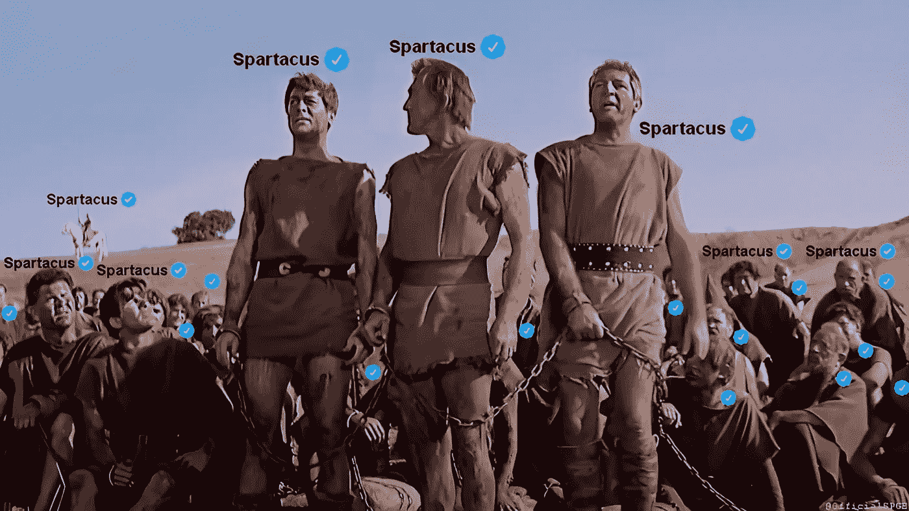
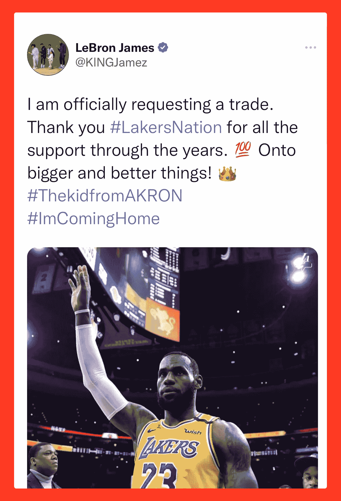
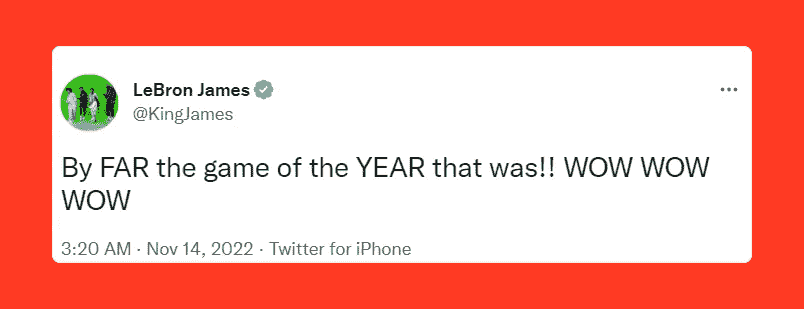
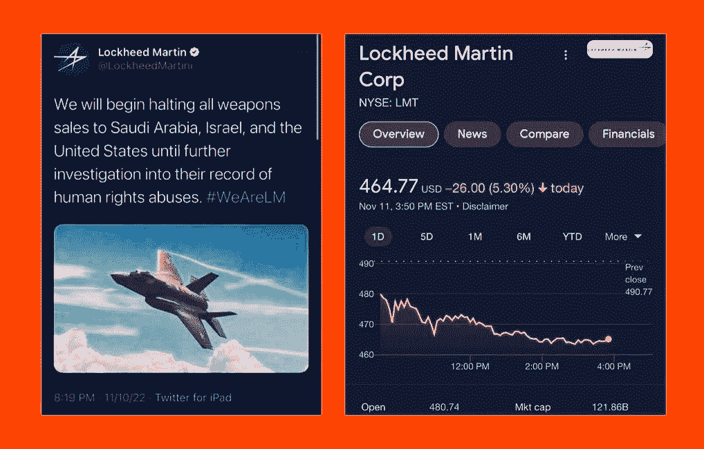
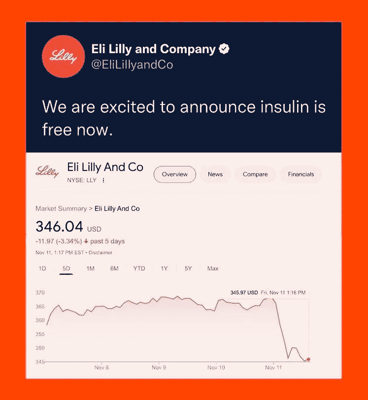
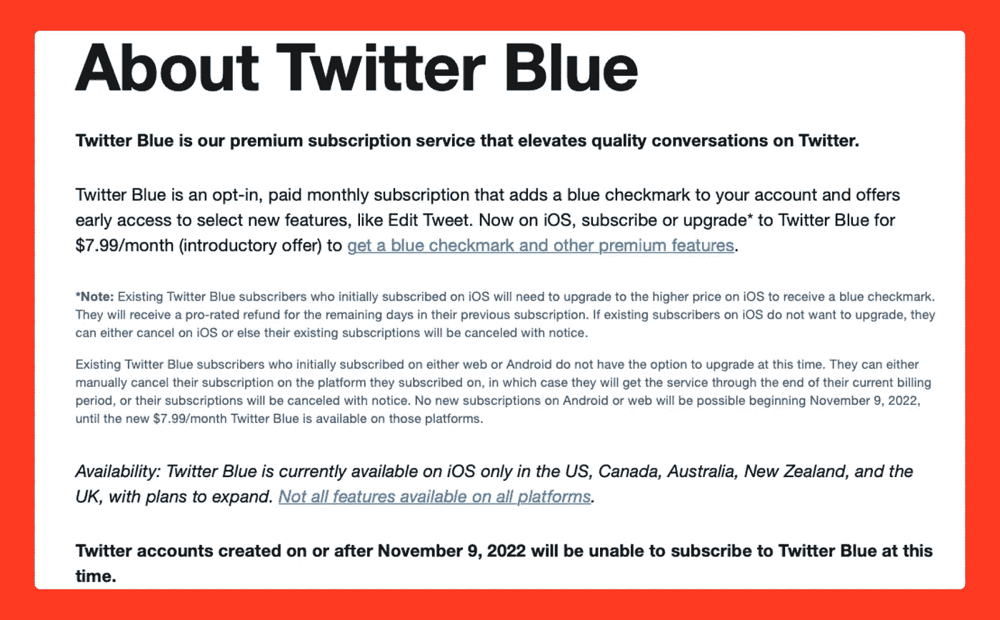

# 推特蓝摧毁了华尔街，损失了数十亿美元

> 原文：<https://blog.devgenius.io/twitter-blue-wrecked-havoc-on-wall-street-billions-of-dollars-lost-cad8d9e1feb6?source=collection_archive---------12----------------------->

## 埃隆·马斯克和他对 Twitter 的爱恨情仇。

推特蓝的反响得到证实。图片来自 Twitter，经作者增强。

好吧，我每天都在推特上享受娱乐，推特真的火了。

马斯克确保人们对 Twitter 感兴趣。我从来没有在站台上这么放纵过。每天都有这样或那样的事情发生。

好吧，对于那些不知道的人来说，几天前，马斯克接管了 Twitter，他想推出每月 8 美元的订阅服务，用于购买蓝色的勾号或徽章，这些都是发给经过验证的 Twitter 手柄的。

不仅如此，他希望每个人都可以随时获得这一订阅，因此无论谁支付 8 美元，都可以在手柄名称旁边有一个经过验证的徽章。好吧，事与愿违。

几天前，一些冒名顶替者账号伪装成名人、品牌或公司并开始发微博，这导致了网民的彻底混乱。

看下面假勒布朗詹姆斯手柄的推文。

看看假勒布朗手柄发来的推文——“@ king jamez”

当人们第一眼看到上面的推文时，他们肯定没有核实它是否真实可信。

对于冒名顶替的账户来说，购买勒布朗·詹姆斯等名人的订阅并发布他们喜欢的任何东西是绝对容易的。

来自 OG 勒布朗詹姆斯手柄的推文—“@金詹姆斯”

李准是 ESPN 的一名专职作家，他也在[的推特上写道，新的推特验证系统可能会对体育交易和新闻](https://twitter.com/joonlee/status/1590441088719892480)造成混乱。他没有错。

航空航天公司 [*洛克希德·马丁*](https://www.lockheedmartin.com/) 和制药巨头 [*礼来公司*](https://www.lilly.com/) 也是这些冒名顶替公司的受害者，损失数十亿。

洛克希德·马丁公司的冒名顶替者在推特上说，由于侵犯人权，他们将停止向几个国家出售武器，直到进行进一步调查。由于这条虚假推文，该公司的股价下跌了 5.5%以上。

洛克希德·马丁公司在这条假推特之后损失了超过 5.5%的股票

同样，礼来公司的假账户在推特上说，从现在开始，胰岛素将是免费的。因此，随着股价下跌 5%，该公司的市值下降了 150 亿美元。

在这条虚假推特之后，礼来公司损失了超过 5%的股票

甚至马斯克自己的公司，如特斯拉和 Twitter，也成为了目标。

这些假账号现在都已经被认定并暂停使用了。

然而，为了避免类似的事情再次发生，Twitter 蓝色验证服务已经暂停 2022 年 11 月 9 日或之后创建的帐户。

自 11 月 9 日起，Twitter 蓝色服务将暂停更新的 Twitter 账户

马斯克解雇 Twitter 上的人并重新雇用其中一些人已经成为所有平台上媒体激烈交谈和讨论的话题。

每日秀主持人*特雷弗·诺亚*正确地谈到了马斯克对 Twitter 的痴迷导致他冲动地购买了这个平台，因为他认为他可以修复它。

特雷弗·诺亚的“伊隆被推特控制”视频

我仍然认为当消息来自正确的账户时，Twitter 是最快和最可靠的消息来源。然而，过去几天的事件暴露了马斯克一直试图避免的事情——错误信息的传播。

Blue Verified 将于 11 月 29 日回归，希望它能解决平台在过去几天面临的所有现有的假冒问题。

虽然其他平台，如 [*蓝天社交*](https://bsky.app/) 、杰克·多西领导的去中心化平台 [*乳齿象*](https://mastodon.social/explore) 、自托管社交媒体网络已经出现，但它们不太可能取代 Twitter，直到它死去。

埃隆·马斯克(Elon Musk)一直以将苦苦挣扎的公司带到新的高度而闻名；然而，让 Twitter 盈利将是他最艰巨的任务。

如果你喜欢读这篇文章，你可能也会发现下面的文章值得你花时间去读。

 [## 如果你是开发者，你必须订阅的 9 个 YouTube 频道

### 强烈推荐给软件开发人员的 YouTube 频道，帮助他们在软件开发职业生涯中脱颖而出。

levelup.gitconnected.com](https://levelup.gitconnected.com/9-youtube-channels-that-you-must-subscribe-to-if-you-are-a-developer-d7ac881c9798)  [## 每个开发者都应该收藏的 9 个不可思议的网站

### 这些网站不仅会帮助你的软件开发之旅，还会帮助你的内容…

levelup.gitconnected.com](https://levelup.gitconnected.com/9-incredible-websites-that-every-developer-should-bookmark-1534d52f3f7d) 

*如果你喜欢阅读有助于你更好地学习、生活和工作的故事，可以考虑* [*成为订阅者*](https://viveknaskar.medium.com/subscribe) *。成为会员后，你可以无限制地阅读 10000 篇故事、文章和作家。每月只要 5 美元。* [*如果你用我的链接*](https://viveknaskar.medium.com/membership) *注册，我会赚一点佣金，帮助我写更多的文章。*