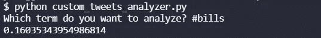
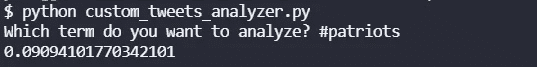

# 推特情绪分析:爱国者法案，2021 年第 16 周

> 原文：<https://blog.devgenius.io/twitter-sentiment-analysis-bills-at-patriots-week-16-2021-a83e0157d3f7?source=collection_archive---------9----------------------->

## 推特情绪能预测 NFL 比赛结果吗？

[来自 DeviantArt 的图像](http://bluehedgedarkattack.deviantart.com/art/New-England-Patriots-364594185)

我们最近做了很多关于 NFL 比赛的 NLP 情感分析。到目前为止，赛前 Twitter 情绪较高的团队赢得了 8 项分析中的 3 项。在第 16 周，我们将分析所有的游戏，看看结果如何。

## 票据情绪

乔希·艾伦带领比尔队在本赛季取得了良好的开端，但他们一直步履蹒跚。他们目前在亚足联东区排名第二。他们赢了，但在上次会议中输给了爱国者队。让我们看看推特是怎么想的。

比尔球迷对这场比赛相当乐观。0.1604 还算体面。

## 爱国者的情感

当布雷迪是四分卫时，我曾经是爱国者队的球迷，真是一个王朝。自从他们放弃了坎姆·牛顿，他们这个赛季在麦克·琼斯身上做得很好。贝利奇克正在展示他的才华，尽管他们在一场卡森·温茨有 50 码的比赛中输给了小马队。他们上次击败了比尔，他们是亚足联东区的第一名。

看来爱国者队的粉丝不太高兴。至少，没有比尔的粉丝多。Twitter 情绪指数为 0.0909，高于大多数球队，但并不惊人。

## 总体评论

直到今天，推特人气较低的团队往往会胜出。让我们看看这种趋势是否会继续。我也很乐意在法案上支持爱国者。

要了解我们如何进行这些情感分析，请阅读[如何从命令行搜索 Twitter](https://pythonalgos.com/2021/12/02/search-twitter-from-your-command-line-with-python/)，以及这篇展示 [Twitter 情感分析](https://pythonalgos.com/2021/11/29/twitter-sentiment-for-stocks-starbucks-11-29-21/)的文章。

如果你喜欢这篇文章，请分享到 Twitter！为了无限制地访问媒体文章，今天就注册成为[媒体会员](https://www.medium.com/@ytang07/membership)！别忘了关注我，[唐](https://www.medium.com/@ytang07)，获取更多科技、体育等方面的文章！