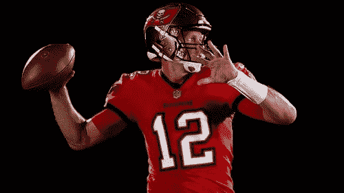
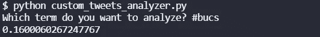
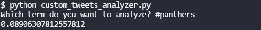

# 推特情绪分析:黑豹队的海盗，2021 年第 16 周

> 原文：<https://blog.devgenius.io/twitter-sentiment-analysis-buccaneers-at-panthers-week-16-2021-15a678e2e93b?source=collection_archive---------14----------------------->

## 推特情绪能预测 NFL 比赛结果吗？

[图片来自 PlayitUSA](https://www.playitusa.com/editoriale/2020/09/103217/nfl-parte-la-stagione-piu-incerta-di-sempre/)

我们最近做了很多关于 NFL 比赛的 NLP 情感分析。到目前为止，赛前 Twitter 情绪较高的团队赢得了 8 项分析中的 3 项。在第 16 周，我们将分析所有的游戏，看看结果如何。

## 海盗情绪

嗯，如果你看过我在[汤姆·布拉迪](https://medium.com/the-hive-mind/the-mindset-of-a-champion-tom-brady-6010ab40110a)上的博客，你就会知道我是布雷迪的粉丝。海盗队是超级碗的卫冕冠军，他们做得还不错。虽然上周的失利(也是布雷迪自 2006 年以来的首次不失球)和伤病对他们不利。

Twitter 似乎认为海盗队做得不算太差。0.16 的情绪高于大多数球队。

## 黑豹情绪

我在北卡罗来纳州长大，所以你会认为我是黑豹队的球迷，但我不是。他们这个赛季无论如何都打得不好，5 胜 9 负，在 NFC 南部排名第四。卡姆·牛顿从爱国者队回来了，他有一些很酷的剧本，但没有带回 w。

推特是关于黑豹的 meh 在 0.0891。我也是。然而，迄今为止的数据对黑豹队有利，因为 Twitter 情绪较低的球队往往会赢。

## 总体评论

尽管推特上的情绪数据对黑豹队有利，但我还是会支持海盗队。抱歉，不是抱歉。布雷迪只是只山羊。

要了解我们如何进行这些情感分析，请阅读[如何从命令行搜索 Twitter](https://pythonalgos.com/2021/12/02/search-twitter-from-your-command-line-with-python/)，以及这篇展示了 [Twitter 情感分析](https://pythonalgos.com/2021/11/29/twitter-sentiment-for-stocks-starbucks-11-29-21/)的文章。

如果你喜欢这篇文章，请分享到 Twitter！为了无限制地访问媒体文章，今天就注册成为[媒体会员](https://www.medium.com/@ytang07/membership)！别忘了关注我，[唐](https://www.medium.com/@ytang07)，获取更多科技、体育等方面的文章！