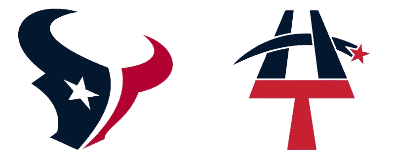
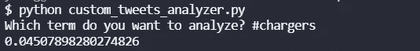
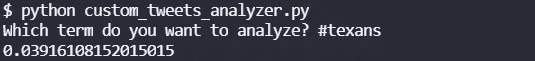

# 推特情绪分析:德州人的充电器，2021 年第 16 周

> 原文：<https://blog.devgenius.io/twitter-sentiment-analysis-chargers-at-texans-week-16-2021-349e50c78707?source=collection_archive---------13----------------------->

## 推特情绪能预测 NFL 比赛结果吗？

德州人可能比达阵得分更多

我们最近做了很多关于 NFL 比赛的 NLP 情感分析。到目前为止，赛前 Twitter 情绪较高的团队赢得了 8 项分析中的 3 项。在第 16 周，我们将分析所有的游戏，看看结果如何。

## 充电器情绪

本赛季的收费标准是 8-6。他们一直打得很好。老实说，我不太了解他们。让我们来看看推特是怎么说的。

今天 0.0451 的推特是关于充电器的 meh。我想没那么糟。

## 德克萨斯人的情绪

德州人这个赛季打得不好，他们 3 胜 11 负。我很确定唯一的另一支 3-11 球队是[喷气机队，他们现在正在打 2-12 Jags](https://medium.com/@ytang07/twitter-sentiment-analysis-jaguars-at-jets-week-16-2021-d63943c596e4)。

推特粉丝对德州人也不太满意。0.0392.

## 总体评论

这些推特上的观点非常接近，考虑到这些球队的战绩相差如此之远，这是一个惊喜。这就像那个[维京熊](/nlp-analysis-of-twitter-to-predict-nfl-games-vikings-at-bears-week-15-52bf79fa83bf)游戏。在推特上的观点有所不同，但得分大致相同。我不得不预测德州人不知何故会翻盘。

要了解我们如何进行这些情感分析，请阅读[如何从命令行搜索 Twitter](https://pythonalgos.com/2021/12/02/search-twitter-from-your-command-line-with-python/)，以及这篇展示 [Twitter 情感分析](https://pythonalgos.com/2021/11/29/twitter-sentiment-for-stocks-starbucks-11-29-21/)的文章。

如果你喜欢这篇文章，请分享到 Twitter！为了无限制地访问媒体文章，今天就注册成为[媒体会员](https://www.medium.com/@ytang07/membership)！别忘了关注我，[唐](https://www.medium.com/@ytang07)，获取更多科技、体育等方面的文章！