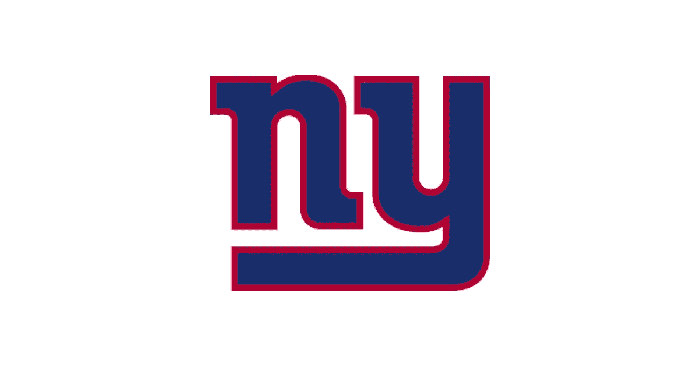
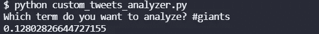
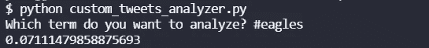

# 推特情绪分析:老鹰队的巨人，2021 年第 16 周

> 原文：<https://blog.devgenius.io/twitter-sentiment-analysis-giants-at-eagles-week-16-2021-9a4fe87197d9?source=collection_archive---------17----------------------->

## 推特情绪能预测 NFL 比赛结果吗？

[图片来自免费 PNG Img](https://www.freepngimg.com/png/32178-new-york-giants-transparent-background)

我们最近做了很多关于 NFL 比赛的 NLP 情感分析。到目前为止，赛前 Twitter 情绪较高的团队赢得了 8 项分析中的 3 项。在第 16 周，我们将分析所有的游戏，看看结果如何。

## 巨人情怀

巨人队现在 4 胜 10 负，看起来并不那么热门。然而，他们最后一次相遇时确实击败了老鹰队。让我们看看 Twitter 对他们有什么评论。

Twitter 似乎相当乐观。0.1280 的 Twitter 情绪对于大多数游戏来说是相当标准的。至少不会像第 15 周的[包装工那样负面。](/twitter-sentiment-for-nfl-games-packers-vs-ravens-week-15-c37e84271851)

## 老鹰情怀

老鹰队最近很火。他们在第 15 周战胜了 T4。他们的记录是 7 比 7 平。比巨人的记录好多了。让我们看看推特有什么说的。

原来推特上巨人队的粉丝比老鹰队的粉丝还多。老鹰队赛前在推特上的情绪是 0.0711。还不错，而且看起来胜算对他们有利。

## 总体评论

到目前为止，在我们进行赛前情绪分析的 8 场比赛中，情绪较低的球队赢了 5 场。让我们看看老鹰队会不会赢。

要了解我们如何进行这些情感分析，请阅读[如何从命令行搜索 Twitter](https://pythonalgos.com/2021/12/02/search-twitter-from-your-command-line-with-python/)，以及这篇展示 [Twitter 情感分析](https://pythonalgos.com/2021/11/29/twitter-sentiment-for-stocks-starbucks-11-29-21/)的文章。

如果你喜欢这篇文章，请分享到 Twitter！为了无限制地访问媒体文章，今天就注册成为[媒体会员](https://www.medium.com/@ytang07/membership)！别忘了关注我，[唐](https://www.medium.com/@ytang07)，获取更多科技、体育等方面的文章！