# Twitter 情感分析:不平衡数据下的仇恨言论检测

> 原文：<https://blog.devgenius.io/twitter-sentiment-analysis-hate-speech-detection-with-unbalanced-data-46d1f57be2ab?source=collection_archive---------3----------------------->

本文由[阿尔帕斯兰·梅斯里](https://medium.com/u/fe99f0a4a612?source=post_page-----46d1f57be2ab--------------------------------)和[泽赫拉·杜曾利](https://medium.com/u/38153624a54d?source=post_page-----46d1f57be2ab--------------------------------)撰写

照片由[多梅尼科·洛亚](https://unsplash.com/@domenicoloia?utm_source=medium&utm_medium=referral)在 [Unsplash](https://unsplash.com?utm_source=medium&utm_medium=referral) 拍摄

这项研究的目的是检测推特中的仇恨言论。

点击进入[数据集](https://datahack.analyticsvidhya.com/contest/practice-problem-twitter-sentiment-analysis/?utm_source=feed&utm_medium=feed-articles&utm_campaign=feed&utm_medium=search#MySubmissions)。

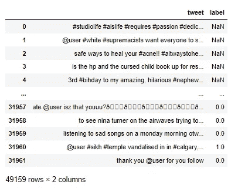

0 —不包含仇恨言论。

1-包含仇恨言论。

# **数据预处理**

我用柱形图和饼图来观察数据集中仇恨言论和非仇恨言论数据的分布。既然面对的是不平衡的数据集，那么在准备算法的时候就要注意这一点。

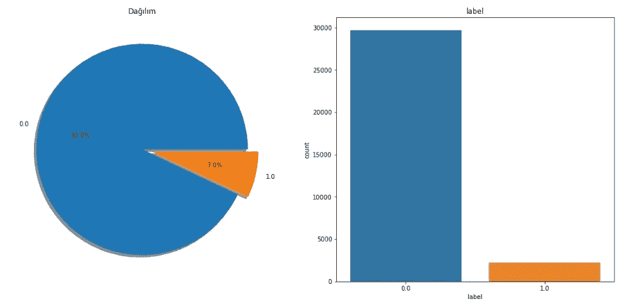

我删除所有的字符，标签，rt，链接，除了推文中的字母和数字。

我删除推文中使用的表情符号。

我回顾推文中最常见的词。

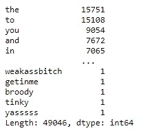

我删除停用词，如，to，you，然后重新检查

新输出:

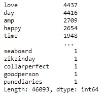

我还会删除这些单词中出现次数最少的单词。

输出:

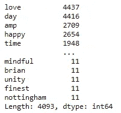

# **机器学习**

我们再次分割测向数据集。我正在分配因变量和自变量。

我们在“tweet”列中的数据目前是字符串数据类型，但我们不能以这种方式创建“机器学习模型”。所以我使用 TfidfVectorizer 函数将其转换为 int 数据类型。

# **决策树分类器**

一般来说，基于决策树的算法受不平衡的影响较小。这就是我使用决策树分类器算法的原因。当处理不平衡的数据集时，我们可以应用各种方法来进行精确的观察。首先，我在不对数据集做任何事情的情况下查看准确度、精确度、召回率和 f1 分数。

0.93 的分数不是因为模型的成功，而是因为不平衡的数据集。

# **重采样**

## **随机过采样**

对于随机过采样，我将少数数据集等同于多数数据集的数量，并重新计算指标。

输出:

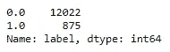

输出:

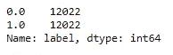

## **Smote 过采样**

对于 Smote 过采样，我们将少数数据集等同于多数数据集的数量，但这不同于随机过采样；通过不复制数据来创建合成数据。

输出:

输出:

## **随机欠采样**

对于随机欠采样，我将多数数据集等同于少数数据集的数量，并重新计算指标。

输出:

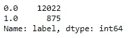

输出:

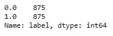

## **欠采样未遂**

这是另一种方法，用于将多数数据集等同于少数数据集的数量。它与随机欠采样的区别在于，它防止信息丢失，并且基于 KNN 算法。计算属于多数类的样本与属于少数类的样本之间的距离，并且保留根据指定 k 值具有最短距离的样本。(我在这项研究中给出的 k 值是 6)

**审核分数和选择指标**

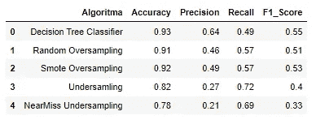

处理不稳定的数据集时，使用准确度分数可能不准确。因为即使当算法给所有的预测都是 0(没有仇恨言论)的时候，也得到了非常高的分数。这就是为什么它没有表现出检测 1(仇恨言论)推文的敏感性。

您可以选择使用哪个指标。

如果你想在称一条推文为仇恨言论之前想清楚，你应该使用精确分数。使用这个指标的缺点是:它可能会错过一些仇恨言论，因为他想查明。

准确地检测一些异常情况比产生假警报更重要。例如，分享包含仇恨言论的推文对于 Twitter 来说是不可接受的，并且你想要删除分享它的用户的账户。在这种情况下，我们可以使用召回分数为包含仇恨言论的推文创建一个敏感度。我们不会忽视包含仇恨言论的推文，而是可以选择暂停那些猜错并且没有使用仇恨言论的用户的账户。

当您需要一个不仅包括精度或召回率，而且包括所有错误成本的度量标准时，您可以使用 F1 分数。

**示例估算**

该算法预测的一些推文包含来自我们应用 Smote 过采样的数据的仇恨言论。

输出:

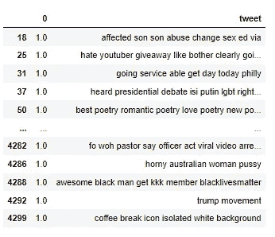