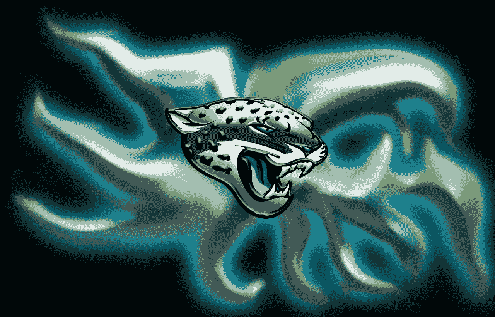
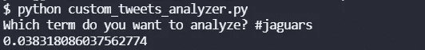
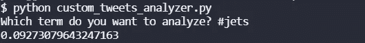

# 推特情绪分析:捷豹在喷气机，2021 年第 16 周

> 原文：<https://blog.devgenius.io/twitter-sentiment-analysis-jaguars-at-jets-week-16-2021-d63943c596e4?source=collection_archive---------16----------------------->

## 推特情绪能预测 NFL 比赛结果吗？

[来自 DeviantArt 的图像](https://bluehedgedarkattack.deviantart.com/art/Jacksonville-Jaguar-362198727)

我们最近做了很多关于 NFL 比赛的 NLP 情感分析。到目前为止，赛前 Twitter 情绪较高的团队赢得了 8 项分析中的 3 项。在第 16 周，我们将分析所有的游戏，看看结果如何。

## 美洲虎的情绪

美洲虎队是目前 NFL 中最差的球队。至少从记录上看是这样。他们最近失去了主教练，他踢了那个踢球的人。真是个疯狂的家伙。希望本赛季在美洲虎队不会完全毁掉特雷沃·劳伦斯的足球生涯。无论如何，让我们看看 Twitter 对美洲虎队进入这场比赛的看法。

Oof，0.0383。比我们今天分析的其他四支队伍都要低。[狮子 vs 猎鹰](https://medium.com/@ytang07/twitter-sentiment-analysis-lions-at-falcons-week-16-2021-a5869c4d50fd)，或者[巨人 vs 老鹰](https://medium.com/@ytang07/twitter-sentiment-analysis-giants-at-eagles-week-16-2021-9a4fe87197d9)。

## 喷气机情绪

喷气机队在 3-11 也相当垃圾。然而，他们至少还有他们的主教练。我不知道会持续多久。他们只是 3 连败，而不是美洲虎的 6 连败，所以我想说他们是这场比赛的最大热门。

Twitter 似乎也这么认为。不出所料，Twitter 的整体人气相当低。他们只有 0.0927，但比捷豹高。不幸的是，鉴于我们目前看到的 Twitter 情绪趋势，这对他们来说并不好。

## 总体评论

两个队都很糟糕，所以我期待看到一场精彩的比赛。希望这是一场势均力敌的比赛。根据目前的统计数据，我不得不假设美洲虎队会以某种方式获胜。让我们找出答案。

要了解我们如何进行这些情感分析，请阅读[如何从命令行搜索 Twitter](https://pythonalgos.com/2021/12/02/search-twitter-from-your-command-line-with-python/)，以及这篇展示 [Twitter 情感分析](https://pythonalgos.com/2021/11/29/twitter-sentiment-for-stocks-starbucks-11-29-21/)的文章。

如果你喜欢这篇文章，请分享到 Twitter！为了无限制地访问媒体文章，今天就注册成为[媒体会员](https://www.medium.com/@ytang07/membership)！别忘了关注我，[唐](https://www.medium.com/@ytang07)，获取更多科技、体育等方面的文章！