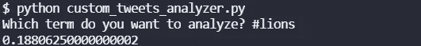

# 推特情绪分析:猎鹰的狮子，2021 年第 16 周

> 原文：<https://blog.devgenius.io/twitter-sentiment-analysis-lions-at-falcons-week-16-2021-a5869c4d50fd?source=collection_archive---------15----------------------->

## 推特情绪能预测 NFL 比赛结果吗？

[图片来自免费 PNG Img](https://freepngimg.com/png/28538-atlanta-falcons-free-download)

我们最近做了很多关于 NFL 比赛的 NLP 情感分析。到目前为止，赛前 Twitter 情绪较高的团队赢得了 8 项分析中的 3 项。在第 16 周，我们将分析所有的游戏，看看结果如何。

## 狮子的情感

狮子队在第 15 周对红雀队的[大胜中春风得意。他们是 NFL 历史上第三支战绩最差的球队，却击败了战绩最好的球队。](/can-twitter-sentiment-predict-nfl-games-cardinals-at-lions-week-15-e87ad8ace99a)

他们在这场比赛中也有很好的情绪。0.1881 明显高于我们最近看到的大多数观点。也许这是因为这是一个圣诞节后的游戏？

## 猎鹰情绪

猎鹰队本赛季的战绩并不糟糕。然而，很明显，自从 2016 年输给[汤姆·布拉迪](https://medium.com/the-hive-mind/the-mindset-of-a-champion-tom-brady-6010ab40110a)和爱国者队后，他们就没再打过同样的比赛。28-3 是一场很难挽回的失败。即使考虑到他们平庸的记录(相对于狮子的糟糕记录)，他们也比狮子有更差的积分差距。

哦，哇，猎鹰队对这场比赛有很高的热情。我们尚未看到任何高于 0.3 的情绪，更不用说 0.4 了。然而，数据对他们不利。情绪较高的球队(在今天之前)仍然输掉了大部分比赛。

## 总体评论

基于目前为止的情绪和数据，我不得不说推特情绪实际上对狮子有利。点微分也是。

要了解我们如何进行这些情感分析，请阅读[如何从命令行搜索 Twitter](https://pythonalgos.com/2021/12/02/search-twitter-from-your-command-line-with-python/)，以及这篇展示 [Twitter 情感分析](https://pythonalgos.com/2021/11/29/twitter-sentiment-for-stocks-starbucks-11-29-21/)的文章。

如果你喜欢这篇文章，请分享到 Twitter！为了无限制地访问媒体文章，今天就注册成为[媒体会员](https://www.medium.com/@ytang07/membership)！别忘了关注我，[唐](https://www.medium.com/@ytang07)，获取更多科技、体育等方面的文章！