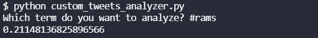
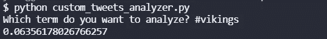

# 推特情绪分析:维京人的公羊，2021 年第 16 周

> 原文：<https://blog.devgenius.io/twitter-sentiment-analysis-rams-at-vikings-week-16-2021-6d47b51bf2e0?source=collection_archive---------11----------------------->

## 推特情绪能预测 NFL 比赛结果吗？

[来自 DeviantArt 的图像](http://bluehedgedarkattack.deviantart.com/art/saint-louis-rams-362353634)

我们最近做了很多关于 NFL 比赛的 NLP 情感分析。到目前为止，赛前 Twitter 情绪较高的团队赢得了 8 项分析中的 3 项。在第 16 周，我们将分析所有的游戏，看看结果如何。

## 公羊情绪

斯塔福德本赛季在公羊队表现强劲。他们取得了三场大胜，也是 NFC 西区的第一名。公羊队很可能是本赛季超级碗的竞争者，或者至少是 NFC 冠军的竞争者。

0.2115 的推特人气相当强劲。看起来 Twitter 粉丝今天对公羊队的心情不错。

## 维京人的情绪

我认为维京人是我本赛季见过的最普通的球队。柯克考辛斯有很好的统计数据，但不知何故就是不能赢。不知道为什么，解释不了。他们上次也没有很好的推特情绪。让我们看看这次会发生什么。

这是一些 meh Twitter 的情绪。虽然比上次[对熊](/nlp-analysis-of-twitter-to-predict-nfl-games-vikings-at-bears-week-15-52bf79fa83bf)要好。

## 总体评论

尽管我喜欢数据，数据显示 Twitter 情绪较低的球队最近往往会赢，但我不得不支持公羊队这场比赛。对不起维京球迷。

要了解我们如何进行这些情感分析，请阅读[如何从命令行搜索 Twitter](https://pythonalgos.com/2021/12/02/search-twitter-from-your-command-line-with-python/)，以及这篇展示了 [Twitter 情感分析](https://pythonalgos.com/2021/11/29/twitter-sentiment-for-stocks-starbucks-11-29-21/)的文章。

如果你喜欢这篇文章，请分享到 Twitter！为了无限制地访问媒体文章，今天就注册成为[媒体会员](https://www.medium.com/@ytang07/membership)！别忘了关注我，[唐](https://www.medium.com/@ytang07)，获取更多科技、体育等方面的文章！