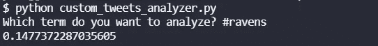
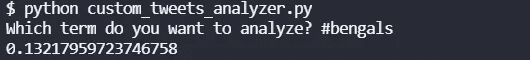

# 推特情绪分析:孟加拉乌鸦队，第 16 周，2021

> 原文：<https://blog.devgenius.io/twitter-sentiment-analysis-ravens-at-bengals-week-16-2021-397b1a099c75?source=collection_archive---------7----------------------->

## 推特情绪能预测 NFL 比赛结果吗？

[图片来自维基百科](https://en.wikipedia.org/wiki/File:Cincinnati_Bengals.svg)

我们最近做了很多关于 NFL 比赛的 NLP 情感分析。到目前为止，赛前 Twitter 情绪较高的团队赢得了 8 项分析中的 3 项。在第 16 周，我们将分析所有的游戏，看看结果如何。

## 乌鸦的情绪

乌鸦队在亚足联北部排名第二，8 胜 6 负。老实说，自从雷·刘易斯退休后，他们就不一样了。今年我真的没有关注他们，但他们上次几乎是[击败包装工](/twitter-sentiment-for-nfl-games-packers-vs-ravens-week-15-c37e84271851)。他们还是没有拉马尔回来！

推特对今天的乌鸦队很满意。0.1477 一点都不算糟糕的情绪。

## 孟加拉人的情感

孟加拉虎队在亚足联北部排名第一，8 胜 6 负。他们第一的原因是因为他们上次相遇时以 41 比 17 赢了乌鸦队。我不知道孟加拉虎队发生了什么，因为我没有看过他们的任何一场比赛，我只知道他们的一位前球员——查德·奥乔辛科。

孟加拉虎队的球迷似乎也在推特上对这场比赛非常关注。0.1322 已经很不错了。

## 总体评论

孟加拉人的情绪较低，所以我必须和他们一起赢。我对这两个队都一无所知，所以对我来说一切都悬而未决。

要了解我们如何进行这些情感分析，请阅读[如何从命令行搜索 Twitter](https://pythonalgos.com/2021/12/02/search-twitter-from-your-command-line-with-python/)，以及这篇展示了 [Twitter 情感分析](https://pythonalgos.com/2021/11/29/twitter-sentiment-for-stocks-starbucks-11-29-21/)的文章。

如果你喜欢这篇文章，请分享到 Twitter！为了无限制地访问媒体文章，今天就注册成为[媒体会员](https://www.medium.com/@ytang07/membership)！别忘了关注我，[唐](https://www.medium.com/@ytang07)，获取更多科技、体育等方面的文章！