# 使用传统机器学习算法与深度学习算法的 Twitter 情感分析(LSTM)。

> 原文：<https://blog.devgenius.io/twitter-sentiment-analysis-with-traditional-machine-learning-algorithms-vs-deep-learning-b5fb7a4d8b00?source=collection_archive---------6----------------------->


在我的第一篇文章中，我们经历了使用 Tweepy 抓取推文的过程，也经历了清理和预处理推文的几个步骤。

下一篇文章的目标是使用传统的机器学习算法，如逻辑回归、支持向量机，以及深度学习算法，LSTM(长短期记忆)，一种特殊类型的 RNNs(递归神经网络)，对上一篇文章结束时获得的数据集进行建模。

如果你还没有，你可以在这里阅读我以前的帖子；

[](https://medium.com/@bolarinwaoreoluwa24/preprocessing-tweets-for-twitter-sentiment-analysis-ced4b4963223) [## 为推特情感分析预处理推文。

### 在进行自然语言处理时，我们需要对数据进行预处理，原因有很多，比如脏…

medium.com](https://medium.com/@bolarinwaoreoluwa24/preprocessing-tweets-for-twitter-sentiment-analysis-ced4b4963223) 

# **用机器学习。**

**导入所需的库。**

## **加载我们的数据集。**

```
**data = pd.read_csv("Tweets.csv")
data.head()**
```

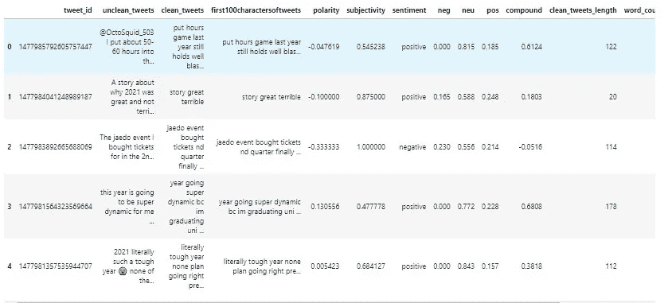

我们应该将原始数据框架分割成建模所需的数据框架；

```
Data**=**data[['non_punctuated_tweets','sentiment']]
Data
```

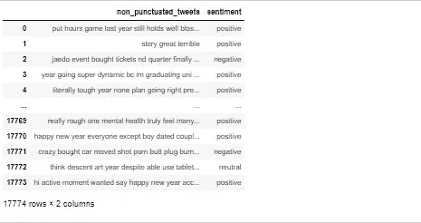

## **情感栏的标签编码。**

```
Data['sentiment'] **=** Data['sentiment']**.**replace('positive',1)
Data['sentiment'] **=** Data['sentiment']**.**replace('negative',**-**1)
Data['sentiment'] **=** Data['sentiment']**.**replace('neutral',0)

*### code for encoding the meaning of positive negative and  neutral tweets*
```

正值取值 1，负值取值-1，中性取值 0。因此，我们应该有 3 个独特的类在我们修改后的情绪栏。

```
Data['sentiment']**.**unique()
#array([ 1, -1,  0], dtype=int64) 
```

让我们来看看我们独特的类的数量计数；

```
Data['sentiment']**.**value_counts()
 1    12622
-1     3823
 0     1329
Name: sentiment, dtype: int64
```

在这里，我们发现自己处于一个不平衡的数据集的情况下(即，正类远远大于负类和中性类)。

有几种技术可以用来解决这个问题，但是我们将只使用一种技术。我们将利用**重采样技术(欠采样和过采样)。**

# **推文的符号化。**

```
**from** nltk.tokenize **import** TweetTokenizer

*# Create a reference variable for Class TweetTokenizer*
tt **=** TweetTokenizer()
Data['tokenized_tweets'] **=** Data['non_punctuated_tweets']**.**apply(tt**.**tokenize)
Data['tokenized_tweets']**.**head()
Data
```

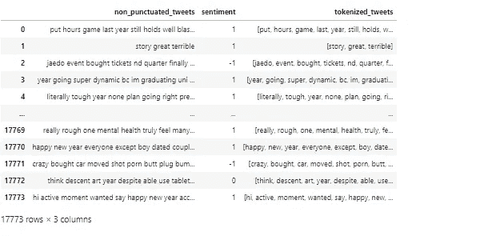

# **推文词干。**

```
**import** nltk
st **=** nltk**.**PorterStemmer()
**def** stemming_on_text(data):
    text **=** [st**.**stem(word) **for** word **in** data]
    **return** text
Data['stemmed_tweets']**=** Data['tokenized_tweets']**.**apply(**lambda** x: stemming_on_text(x))
#Data['stemmed_tweets']**.**head()
```

获取我们的输入数据和输出数据，同时还分成测试和训练数据；

我们还需要将输入数据(文本格式)转换成我们的机器学习算法可以处理的数据，我们需要将它们转换成如下所示的向量；

# 使用 TF-IDF 将 tweets 转换为矢量。

```
tfidf_vect **=** TfidfVectorizer()
tfidf_vect**.**fit(X)
X_train_tfidf **=**  tfidf_vect**.**transform(X_train)
X_test_tfidf **=**  tfidf_vect**.**transform(X_test)
```

# 数据建模。

# 而不需要重新采样不平衡的数据集。

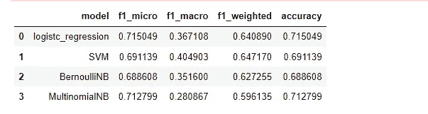

以上是用不平衡数据建模的结果。从这里开始，我们将使用几种采样技术，看看它们的表现如何。

# 随机过采样。

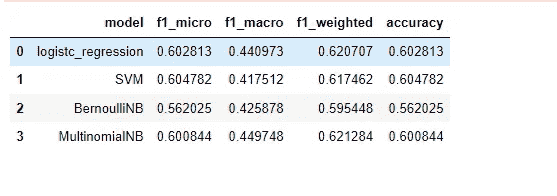

# 打击过采样。

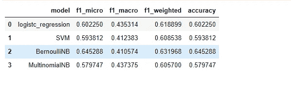

# ADASYN:自适应合成采样(过采样)。

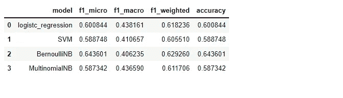

# 临界击打。

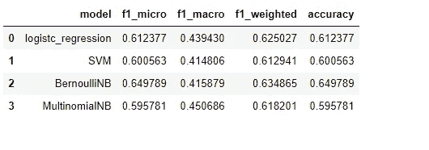

# 随机欠采样。

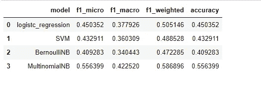

# 删除 Tomek 链接。

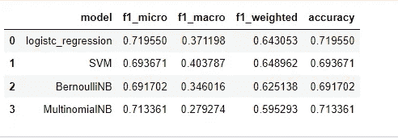

正如我们所看到的，当我们使用 **Tomek 链接移除**欠采样技术**、**时，我们的精度达到最高，大约为 71.95%

当我们在没有对数据进行重采样的情况下建模时，精确度非常接近(71.5%)。

在本文接近尾声时，我们将把我们的结果与使用 LSTM 得到的结果进行比较。

# **用深度学习(LSTM)。**

也许你不知道 RNNs 和 LSTM，递归神经网络基本上是**特殊类型的人工神经网络，适用于时间序列数据或涉及序列的数据(在我们的情况下，文本数据)。**

文本可以说是单词的序列，对吗？

另一方面，LSTM 可以说是 RNNs 的**高级版本**，旨在解决常规 RNNs 遇到的消失梯度通常的问题**。**

更多关于 RNN 和 LSTM 的知识和解释，点击 [**这里**](https://purnasaigudikandula.medium.com/recurrent-neural-networks-and-lstm-explained-7f51c7f6bbb9) **。**

由于我们将利用 GPU 来更快地训练我们的模型，我决定将我的数据集(“Tweets.csv”)上传到 Kaggle，并利用 kaggle 内核。

# **导入所需的库。**

```
*# Importing required libraries*
**import** nltk
**import** numpy **as** np
**import** pandas **as** pd
**from** nltk.corpus **import** stopwords
**from** textblob **import** Word
**from** sklearn.preprocessing **import** LabelEncoder
**from** collections **import** Counter
**import** wordcloud
**from** sklearn.metrics **import** classification_report,confusion_matrix,accuracy_score
**from** tensorflow.keras.models **import** Sequential
**from** tensorflow.keras.preprocessing.text **import** Tokenizer
**from** tensorflow.keras.preprocessing.sequence **import** pad_sequences
**from** tensorflow.keras.layers **import** Dense, Embedding, LSTM, SpatialDropout1D
**from** sklearn.model_selection **import** train_test_split 
**import** matplotlib.pyplot **as** plt
**from** nltk.tokenize **import** word_tokenize
**from** nltk.stem **import** WordNetLemmatizer
**from** tensorflow.keras.callbacks **import** EarlyStopping
**import** tensorflow_addons **as** tfa
```

# **数据**。

```
Data
```

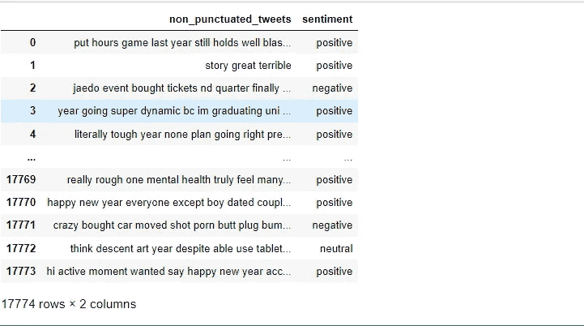

# **标记化。**

```
Data['tokenized_tweets'] **=** Data**.**apply(**lambda** row : nltk**.**word_tokenize(str(row['non_punctuated_tweets'])),axis **=** 1)Data
```

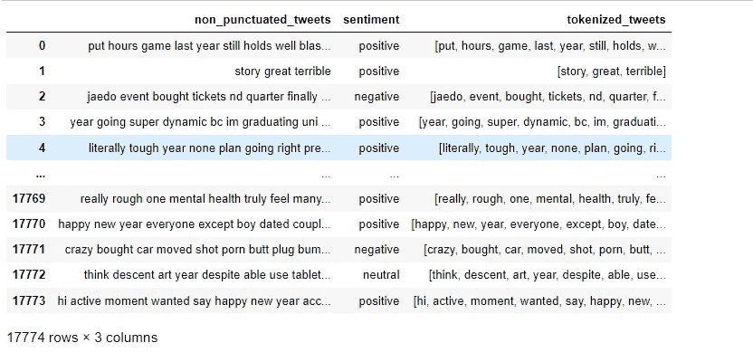

## 词汇化。

```
**def** lemma(data):
    **return** " "**.**join([Word(word)**.**lemmatize() **for** word **in** data])
Data['lemmatized_tweets']**=** Data['tokenized_tweets']**.**apply(**lambda** x: lemma(x))Data
```

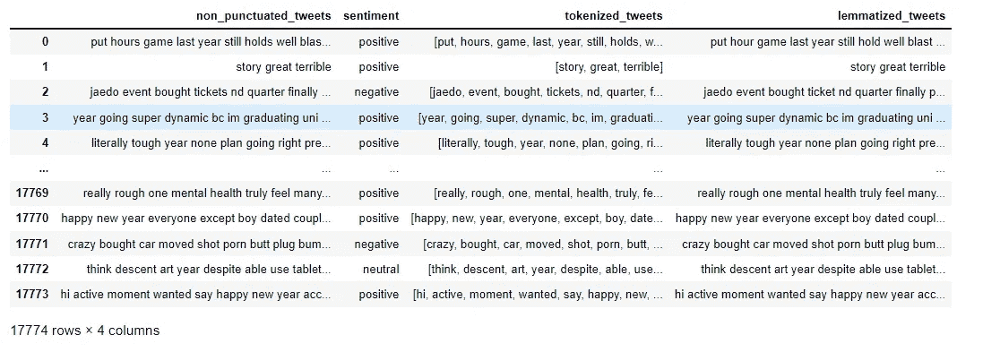

# **情感专栏的一个热门编码。**

```
Shape of label tensor: (17774, 3)
```

我们来看看 Y 现在是什么样子；

```
Y
```

# **将词条化的推文转换成向量。**

```
Found 22546 unique tokens.
```

上面的代码块做了以下事情:

*   将词条化的推文矢量化。
*   将数据集限制在 500 个单词以内。
*   将每条推文的最大字数设置为 50。

```
Shape of data tensor: (17774, 50)
```

# **列车试裂。**

```
(14219, 50) (14219, 3)
(3555, 50) (3555, 3)
```

# **造型。**

*   第一层是嵌入层，使用 100 个长度向量来表示每个单词。
*   SpatialDropout1D 在 NLP 模型中执行变分丢失。
*   下一层是具有 100 个存储单元的 LSTM 层。
*   输出层必须创建 3 个输出值，每个类一个。
*   激活功能是 softmax 用于多类分类。
*   因为这是一个多类分类问题，所以使用 categorical _ crossentropy 作为损失函数。

经过 7 个时代的训练。

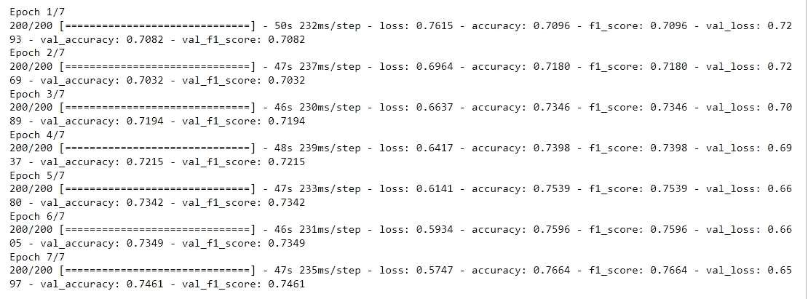

训练准确率:76.64%

验证准确率:74.61 %

让我们检查我们的测试数据；

```
112/112 [==============================] - 2s 14ms/step - loss: 0.6608 - accuracy: 0.7474 - f1_score: 0.7474
Test set
  Loss: 0.661
  Accuracy: 0.747
```

我们的测试数据大约有 75%的准确率..比我们使用机器学习算法的结果高出约 4 %。

让我们想象一下我们的结果；

```
plt**.**figure(figsize**=**(8, 8))
plt**.**title('Loss')
plt**.**plot(history_1**.**history['loss'], label**=**'train')
plt**.**plot(history_1**.**history['val_loss'], label**=**'test')
plt**.**legend()
plt**.**show();
```

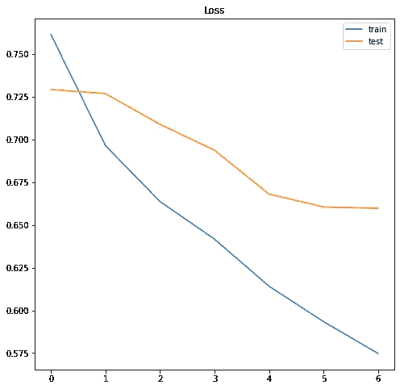

```
plt**.**figure(figsize**=**(8, 8))
plt**.**title('Accuracy')
plt**.**plot(history_1**.**history['accuracy'], label**=**'train')
plt**.**plot(history_1**.**history['val_accuracy'], label**=**'test')
plt**.**legend()
plt**.**show();
```

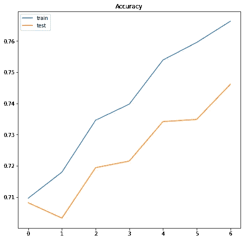

从这个图中，我们可以说有一点过度拟合。获得更多的数据应该有助于改进我们的模型。

# 用新推文测试。

```
[[0.1166406  0.02953981 0.8538196 ]] positive
```

我们的新推文有一个积极的预测标签。

本系列中使用的所有代码都可以在这个 [**Github 资源库中找到。**](https://github.com/zhoroh/Sentiment_Analysis.)