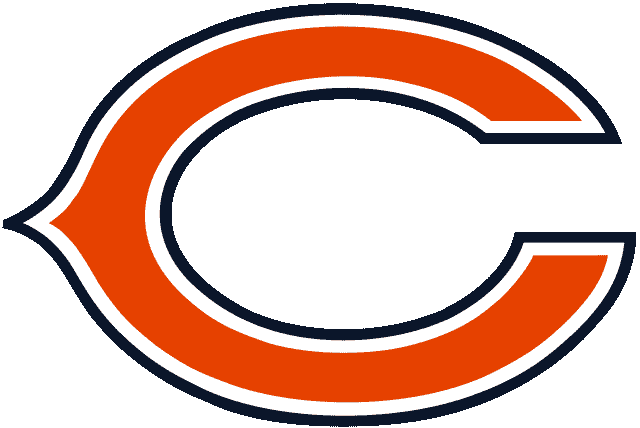
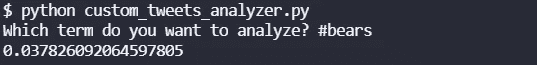
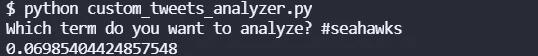

# 推特情绪:海鹰的熊，2021 年第 16 周

> 原文：<https://blog.devgenius.io/twitter-sentiment-bears-at-seahawks-week-16-2021-db4fbf9cb8fd?source=collection_archive---------12----------------------->

## 推特情绪能预测 NFL 比赛吗？

[图片来自维基媒体](http://simple.wikipedia.org/wiki/file:chicago_bears_logo.svg)

我们最近做了很多关于 NFL 比赛的 NLP 情感分析。到目前为止，在撰写本文时，赛前推特情绪较高的团队已经赢得了 10 项分析中的 4 项，其中 2 周 16 场比赛已经结束:[雄狮对猎鹰](https://medium.com/@ytang07/twitter-sentiment-analysis-lions-at-falcons-week-16-2021-a5869c4d50fd)，以及[充电器对德克萨斯人](https://medium.com/@ytang07/twitter-sentiment-analysis-chargers-at-texans-week-16-2021-349e50c78707)。在第 16 周，我们将分析所有的游戏，看看结果如何。

## 悲观情绪

熊队本赛季战绩为 4 胜 10 负。就我个人而言，我从来都不是大熊队的粉丝，所以对我来说无所谓。他们刚刚经历了三连败，所以他们没有太多的动力。让我们看看推特有什么要说的

嗯，0.0378 低于平均情绪，但根据趋势，这对空头来说不一定是坏消息。

## 海鹰情绪

海鹰队在几天前情绪低落的时候失去了公羊队。他们是 5–9，比 4–10 好一点，但差不了多少。皮特·卡罗尔有点老了。

海鹰队本周的情绪比他们的对手高，为 0.0699。让我们看看他们是否会再次给我们带来惊喜。

## 总体评论

根据情绪较高的球队的趋势(4 胜 6 负)，我猜测熊队会赢这场比赛。

要了解我们如何进行这些情感分析，请阅读[如何从命令行搜索 Twitter](https://pythonalgos.com/2021/12/02/search-twitter-from-your-command-line-with-python/)，以及这篇展示 [Twitter 情感分析](https://pythonalgos.com/2021/11/29/twitter-sentiment-for-stocks-starbucks-11-29-21/)的文章。

如果你喜欢这篇文章，请分享到 Twitter！为了无限制地访问媒体文章，今天就注册成为[媒体会员](https://www.medium.com/@ytang07/membership)！别忘了关注我，[唐](https://www.medium.com/@ytang07)，获取更多科技、体育等方面的文章！