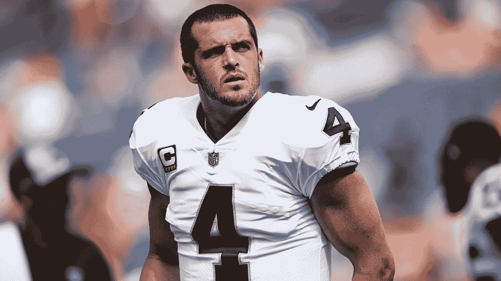
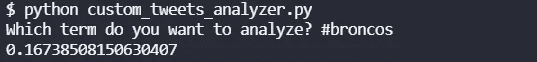
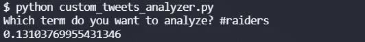

# 推特情绪:袭击者的野马，2021 年第 16 周

> 原文：<https://blog.devgenius.io/twitter-sentiment-broncos-at-raiders-week-16-2021-76e950b6de2c?source=collection_archive---------10----------------------->

## 推特情绪能预测 NFL 比赛吗？

[图片来自 Play It USA](http://www.playitusa.com/nfl/2019/08/98426/oakland-raiders-2019-preview/)

我们最近做了很多关于 NFL 比赛的 NLP 情感分析。到目前为止，在撰写本文时，赛前推特情绪较高的团队已经赢得了 10 项分析中的 4 项，其中 2 周 16 场比赛已经结束:[猎鹰队](https://medium.com/@ytang07/twitter-sentiment-analysis-lions-at-falcons-week-16-2021-a5869c4d50fd)的狮子队，以及[德克萨斯人队](https://medium.com/@ytang07/twitter-sentiment-analysis-chargers-at-texans-week-16-2021-349e50c78707)的充电器队。在第 16 周，我们将分析所有的游戏，看看结果如何。

## 野马情怀

统计数据略微倾向于野马队获胜。他们在亚足联西部排名第四，7 胜 7 负。他们在过去的 4 场比赛中 2 胜 2 负，最后一次相遇时输给了突袭者队。我不知道为什么他们会赢。

看起来 Twitter 今天对野马队也有不错的看法。0.1674 高于我们看到的平均值。

## 袭击者情绪

7-7 突袭者队在亚足联西部排名第三。像野马队一样，他们在过去的 4 场比赛中也是 2 胜 2 负。他们在亚足联西部的排名只比野马队高，因为他们上次相遇时赢了。德里克·卡尔在上周第四节拦截几乎输掉比赛后，取得了奇迹般的胜利。

推特对突袭者队的看好程度比野马队低一点。0.1310 的评分仍然高于平均水平！

## 总体评论

根据趋势，我预测突袭者会赢。他们在上一次比赛中也赢了。尽管统计数据有利于野马队，但最近统计数据已经错了很多。

要了解我们如何进行这些情感分析，请阅读[如何从命令行搜索 Twitter](https://pythonalgos.com/2021/12/02/search-twitter-from-your-command-line-with-python/)，以及这篇展示 [Twitter 情感分析](https://pythonalgos.com/2021/11/29/twitter-sentiment-for-stocks-starbucks-11-29-21/)的文章。

如果你喜欢这篇文章，请分享到 Twitter！为了无限制地访问媒体文章，今天就注册成为[媒体会员](https://www.medium.com/@ytang07/membership)！别忘了关注我，[唐](https://www.medium.com/@ytang07)，获取更多科技、体育等方面的文章！