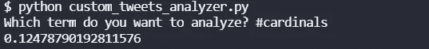

# 推特观点:红雀队的小马，第 16 周

> 原文：<https://blog.devgenius.io/twitter-sentiment-colts-at-cardinals-week-16-c4c17c6868bc?source=collection_archive---------8----------------------->

## 赛前推特情绪对 NFL 比赛结果的预测有多好？

[图片来自 PlayItUSA](https://www.playitusa.com/wp-content/uploads/2021/02/ue-ueu-.jpg)

这是本赛季我们分析赛前推特情绪的第八场比赛。到目前为止，赛前情绪较低的球队在 7 场预测比赛中赢了 5 场。高情绪队赢的两次是在[第 15 周周二双冠王](/twitter-sentiment-for-nfl-games-week-15-washington-at-eagles-and-seahawks-at-rams-1a9c2a6ec290)。

同时，情绪较低的团队赢得了这 5 场比赛:

*   [布朗队对乌鸦队，第 12 周](https://medium.com/@ytang07/natural-language-processing-on-tweets-browns-vs-ravens-prediction-4eb0ca165189)
*   [牛仔 vs 圣徒，第 13 周](https://medium.com/@ytang07/can-twitter-sentiment-predict-nfl-games-cowboys-vs-saints-week-13-2021-3baaa3bf2bf5)
*   [公羊队在红雀队，第 14 周](https://medium.com/@ytang07/can-twitter-sentiment-predict-nfl-games-rams-at-cardinals-week-14-594c7a8a396c)
*   [包装工 vs 乌鸦，第 15 周](/twitter-sentiment-for-nfl-games-packers-vs-ravens-week-15-c37e84271851)
*   [维京人在熊，第 15 周](/nlp-analysis-of-twitter-to-predict-nfl-games-vikings-at-bears-week-15-52bf79fa83bf)

让我们看看第 16 周小马对红雀的比赛会怎么样。

## 小马的情绪

小马队在对阵爱国者队的比赛中取得了一场伟大的胜利，卡森·温茨几乎没有扔球。他们在他们的组别中排名第二，落后于巨人队，[巨人队在本周早些时候半场结束时以 10 比 0 的比分落后并降低了 Twitter 人气后获胜。](/nfl-twitter-nlp-49ers-at-titans-week-16-84862ce4569e)

小马推特情绪，第 16 周，作者图片

小马队本周有很高的人气。他们最近过得很好。我不确定我们是否见过 1641 年的情绪。不过，根据目前的数据，对他们来说并不是很好…

## 红衣主教的情绪

自从本赛季以 7 比 0 开局以来，红雀队一直表现不佳。上周，他们是自 2004 年爱国者队以来，第一支战绩最好的球队输给了联盟中战绩最差的球队(第 8 周之后)。这也是 NFL 历史上第三次出现这种情况。其他时间只有 2004 年的爱国者队和 1995 年的牛仔队。然而，这两个队都赢得了超级碗。让我们看看红雀队如何坚持。

红雀推特情绪，第 16 周，作者图片

推特上对红雀队的好感度为 0.1248。这是一个相当不错的 Twitter 情绪，高于大多数团队。想想他们上一次对狮子队的表现，真是令人惊讶。

## 总体评论

到目前为止，数据是在红雀队这边。我们的分析表明，赛前情绪较低的球队更有可能获胜。让我们看看这种趋势是否会在今天的比赛中继续。

要了解更多关于我们如何进行这些情感分析，请阅读[如何从命令行搜索 Twitter](https://pythonalgos.com/2021/12/02/search-twitter-from-your-command-line-with-python/)，以及这篇展示了 [Twitter 情感分析](https://pythonalgos.com/2021/11/29/twitter-sentiment-for-stocks-starbucks-11-29-21/)的文章。

如果你喜欢这篇文章，请分享到 Twitter！为了无限制地访问媒体文章，今天就注册成为[媒体会员](https://www.medium.com/@ytang07/membership)！别忘了关注我，[唐](https://www.medium.com/@ytang07)，获取更多科技、体育等方面的文章！