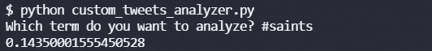

# 推特感悟:圣徒的海豚，第 16 周

> 原文：<https://blog.devgenius.io/twitter-sentiment-dolphins-at-cowboys-week-16-d481eada83de?source=collection_archive---------14----------------------->

## 推特情绪能预测 NFL 比赛吗？

[图片来自 Flickr](https://www.flickr.com/photos/75683070@N00/3937789449/)

我们最近做了很多关于 NFL 比赛的 NLP 情感分析。在第 16 周之前，情绪较低的团队赢得了 8 场比赛中的 5 场。在第 16 周，我们将分析所有的游戏，看看结果如何。这就是他们的结局。

1.  [推特情绪:2021 年第 16 周酋长队的钢人队](/twitter-sentiment-steelers-at-chiefs-week-16-2021-80fdb14c2c18)——情绪较低的球队(酋长队)获胜
2.  [推特情绪:2021 年第 16 周袭击者的野马队](/twitter-sentiment-broncos-at-raiders-week-16-2021-76e950b6de2c)——情绪较低的球队(袭击者)获胜
3.  [推特情绪:2021 年第 16 周海鹰队的熊队](/twitter-sentiment-bears-at-seahawks-week-16-2021-db4fbf9cb8fd)——情绪较低的队(熊队)获胜
4.  [推特情绪分析:孟加拉乌鸦队，2021 年第 16 周](/twitter-sentiment-analysis-ravens-at-bengals-week-16-2021-397b1a099c75) —情绪较低的球队(孟加拉)获胜
5.  [Twitter 情绪分析:公羊队在维京人队，2021 年第 16 周](/twitter-sentiment-analysis-rams-at-vikings-week-16-2021-6d47b51bf2e0) —情绪较高的球队(公羊队)获胜
6.  [Twitter 情绪分析:德州人的充电器，2021 年第 16 周](/twitter-sentiment-analysis-chargers-at-texans-week-16-2021-349e50c78707) —情绪较低的团队(德州人)获胜
7.  [Twitter 情绪分析:黑豹海盗队，2021 年第 16 周](/twitter-sentiment-analysis-buccaneers-at-panthers-week-16-2021-15a678e2e93b) —高情绪团队(Bucs)获胜
8.  [Twitter 情绪分析:捷豹队，2021 年第 16 周](/twitter-sentiment-analysis-jaguars-at-jets-week-16-2021-d63943c596e4) —情绪较高的团队(捷豹队)获胜
9.  [推特情绪分析:老鹰队的巨人队，2021 年第 16 周](/twitter-sentiment-analysis-giants-at-eagles-week-16-2021-9a4fe87197d9)——情绪较低的球队(老鹰队)获胜
10.  推特情绪:第 16 周华盛顿足球队 vs 牛仔队——情绪较高的球队(牛仔队)赢了

赛前情绪较低的球队赢得了迄今为止预测的 18 场比赛中的 11 场。让我们继续看看我们做得怎么样。

## 海豚的情感

7 比 7 的迈阿密海豚队正在结束 6 连胜。唯一一个连胜更久的球队是酋长队。图阿队在最近几场比赛中表现抢眼，他们队只有不到一半的人出局。我得说他们在统计上看起来相当不错。

Twitter 似乎也同意这一点，0.1877 的 Twitter 人气相当高。

## 圣人情怀

圣徒队的三名四分卫都出局了。贾迈斯前交叉韧带撕裂，他们的第二第三弦 QBs 和其他 13 名球员一起在 COVID 名单上。他们选中了伊恩·布克，他在 NFL 打了 0 场比赛，但在大学里表现还不错。让我们看看他们会怎么做。

反正推特对圣徒的感觉还不错。他们坐在 0.1435，这是一个体面的 Twitter 情绪。

## 总体评论

到目前为止，情绪较低的团队仍然倾向于获胜，让我们看看这种情况是否会继续。我将不得不支持圣徒队，这支球队在本周早些时候获得了第四名。他们打电话给德鲁·布里斯，他就像“不熟”。

要了解更多关于我们如何进行这些情感分析，请阅读[如何从命令行搜索 Twitter](https://pythonalgos.com/2021/12/02/search-twitter-from-your-command-line-with-python/)，以及这篇展示了 [Twitter 情感分析](https://pythonalgos.com/2021/11/29/twitter-sentiment-for-stocks-starbucks-11-29-21/)的文章。

如果你喜欢这篇文章，请分享到 Twitter！为了无限制地访问媒体文章，今天就注册成为[媒体会员](https://www.medium.com/@ytang07/membership)！别忘了关注我，[唐](https://www.medium.com/@ytang07)，获取更多科技、体育等方面的文章！