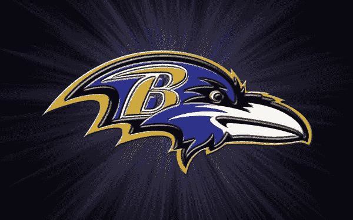
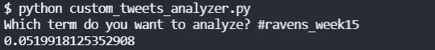
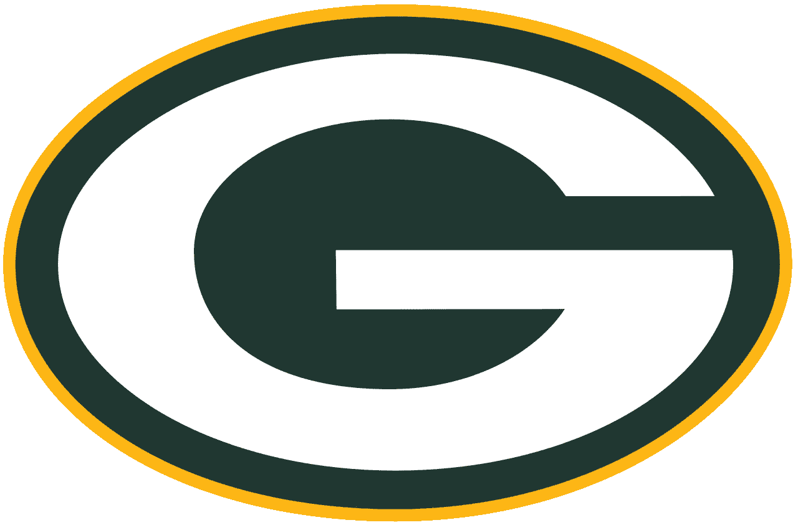
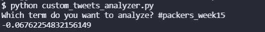

# 推特对 NFL 比赛的看法:包装工队对乌鸦队，第 15 周

> 原文：<https://blog.devgenius.io/twitter-sentiment-for-nfl-games-packers-vs-ravens-week-15-c37e84271851?source=collection_archive---------13----------------------->

## 这是系列赛中的第五场比赛，也是第二场比赛，我们将在第 15 周用推特情感进行预测

【DeviantArt 图像

赛前情绪较高的团队在我们使用推特情绪进行的三次赛前情绪分析预测中失利。今天早些时候，我们在推特上对红雀队对狮子队的比赛进行了半场分析。中场休息时，狮子队在推特上的人气更高，考虑到他们以 17 比 0 战胜(前)10 比 3 的红雀队，这是有道理的。

包装工队对乌鸦队的比赛是本赛季的一场重要比赛。8-5 的乌鸦队目前在 AFC 中排名第四。他们需要跟上节奏，才能保证有一席之地。对他们来说不幸的是，他们饱受伤病困扰，包括拉马尔·杰克逊。10-3 包装工队目前在 NFC 北区排名第一，基本上已经保证了季后赛席位。让我们看看胜利的需要是否会像今天早些时候的狮子队那样，让乌鸦队摆脱沮丧。

## 渡鸦队的推特情绪，第 15 周

推特情感，乌鸦第 15 周，作者图片

我们在美国东部时间 4:19 拍摄了 100 条最近的推特，上面写着“#乌鸦”。我们按照这个关于如何从你的命令行上[搜索推特的指南，使用推特应用编程接口发布了这些推特。接下来我们用](https://pythonalgos.com/2021/12/02/search-twitter-from-your-command-line-with-python/)[Text API](https://www.thetextapi.com)来分析情感，以此[星巴克推特的情感分析](https://pythonalgos.com/2021/11/29/twitter-sentiment-for-stocks-starbucks-11-29-21/)为例。

看起来在今天对阵包装工队的比赛之前，推特对乌鸦队有一点积极的感觉。

## 第 15 周，包装工的推特情绪

[维基百科图片](https://en.wikipedia.org/wiki/File:Green_Bay_Packers_logo.svg)

推特情绪，包装商第 15 周，作者图片

我们在美国东部时间 4:20 拍摄了 100 条最近的推特，上面有“#Packers”。看起来在今天对阵乌鸦队的比赛之前，推特对包装工队有点消极。粉丝们对包装工队的负面评价比对乌鸦队的正面评价要高一些。

## 对情感分析结果的思考

嗯，到目前为止的三场赛前情绪，第 12 周的[布朗队对乌鸦队](https://medium.com/@ytang07/natural-language-processing-on-tweets-browns-vs-ravens-prediction-4eb0ca165189)，然后是第 13 周的[牛仔队对圣徒队](https://medium.com/@ytang07/natural-language-processing-on-tweets-browns-vs-ravens-prediction-4eb0ca165189)，然后是第 14 周的[红雀队的公羊队](https://medium.com/@ytang07/natural-language-processing-on-tweets-browns-vs-ravens-prediction-4eb0ca165189)，都预测了相反的结果。数据也不支持乌鸦队。我个人不是乌鸦队的球迷，但绝对不是包装工队的球迷。我希望 Twitter 在这场游戏中是正确的。否则，对于 NFL 比赛结果的赛前情绪，Twitter 情绪将为 0-4。