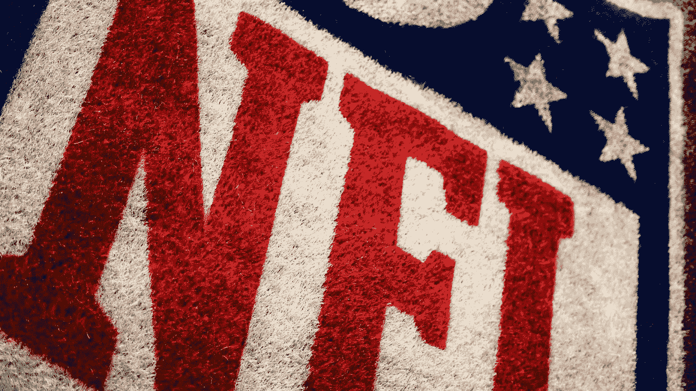
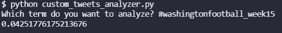
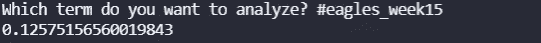
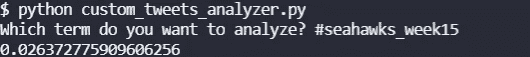
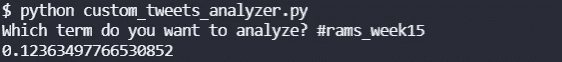

# 第 15 周，华盛顿老鹰队和海鹰队在公羊队的比赛

> 原文：<https://blog.devgenius.io/twitter-sentiment-for-nfl-games-week-15-washington-at-eagles-and-seahawks-at-rams-1a9c2a6ec290?source=collection_archive---------11----------------------->

[来自美国赌博网站的图片](https://www.usgamblingsites.com/news/2021-nfl-odds-each-teams-projected-win-total-for-the-new-season/)

今天是星期二，我们有 NFL 的两场比赛？当然了。这将是我们 Twitter 情绪预测的第七和第八部分。换句话说，双重头。

今天的比赛是老鹰队的华盛顿足球队和公羊队的海鹰队。到目前为止，赛前情绪较高的球队 100%都输了。让我们看看这是否成立。

我们在这篇关于[如何用 Python](https://pythonalgos.com/2021/12/02/search-twitter-from-your-command-line-with-python/) 从命令行搜索 Twitter 的教程之后，用 Twitter API 提取了这些推文。然后我们收集并分析了最近 100 条推文，使用文本 API 分析它们的[极性](https://pythonalgos.com/2021/11/10/natural-language-processing-what-is-text-polarity/)(也称为情绪】。所有的推文都是在美国东部时间下午 6:50 收集的，大约在比赛前 10 分钟。

# 华盛顿足球队 vs 老鹰队，2021 年第 15 周

那将是一场有趣的比赛。华盛顿足球队有 26 名队员在休假。他们在他们的第三阵容 QB，而彭江雨·赫特(首发)将为老鹰队首发。这场比赛是为了争夺一个外卡名额，两队都是 6 胜 7 负。让我们看看推特的观点是什么。

## 华盛顿足球队情绪

最后 100 条关于华盛顿足球队的推文的情绪达到了 0.0425

第 15 周，华盛顿足球队的推特情绪，作者图片

这是一个相当低的情绪，就像昨天在[维京人对熊](/nlp-analysis-of-twitter-to-predict-nfl-games-vikings-at-bears-week-15-52bf79fa83bf)比赛中的情绪一样，但它仍然是积极的。

## 老鹰情怀

最后 100 条关于老鹰队的推文的情绪达到了 0.1257

老鹰队的推特情绪，第 15 周，作者图片

这是一种平庸的情绪，但它高于华盛顿足球队的情绪。

好吧，如果你们一直在关注的话，我们在赛前情绪上做的所有 5 场比赛中，情绪较高的球队都输了。即使华盛顿今天只有 40 名球员在他们的现役名单上，我也要和他们一起去。让我们看看 COVID 是否吹走了 Twitter 的 100%不正确。

# 海鹰 vs 公羊，2021 年第 15 周

海鹰队今年表现不佳。自从得到汤姆·布拉迪的#rekt 之后，他们的表现一直不好(昨天海盗队的比赛到底是怎么回事？Wild)和 2015 年超级碗的爱国者队。公羊队和他们的新四分位马特·斯塔福德相处得很好。

这一周充满了令人沮丧的事情([狮子会的红衣主教](/can-twitter-sentiment-predict-nfl-games-cardinals-at-lions-week-15-e87ad8ace99a)？？？)让我们看看推特的观点是什么。

## 海鹰情绪

最后 100 条关于 Seahwaks 的推文的情绪达到了 0.0264。

哇，这比华盛顿橄榄球队的还低。

## 公羊情绪

关于公羊队的最后 100 条推文的情绪达到了 0.1236。

嗯，我很抱歉公羊队的球迷，即使你们有更好的数据和更高的机会，推特对公羊队的评价更高。为了跟进到目前为止的情绪分析，我必须预测公羊队会输。