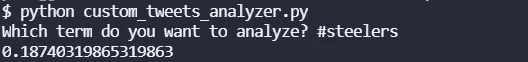
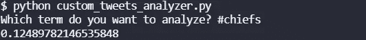

# 推特情绪:钢铁工人在酋长，2021 年第 16 周

> 原文：<https://blog.devgenius.io/twitter-sentiment-steelers-at-chiefs-week-16-2021-80fdb14c2c18?source=collection_archive---------6----------------------->

## 推特情绪能预测 NFL 比赛吗？

[来自 DeviantArt 的图像](https://bluehedgedarkattack.deviantart.com/art/Kansas-City-Chiefs-362288828)

我们最近做了很多关于 NFL 比赛的 NLP 情感分析。到目前为止，在撰写本文时，赛前推特情绪较高的团队已经赢得了 10 项分析中的 4 项，其中 2 周 16 场比赛已经结束:[猎鹰队](https://medium.com/@ytang07/twitter-sentiment-analysis-lions-at-falcons-week-16-2021-a5869c4d50fd)的狮子队，以及[德克萨斯人队](https://medium.com/@ytang07/twitter-sentiment-analysis-chargers-at-texans-week-16-2021-349e50c78707)的充电器队。在第 16 周，我们将分析所有的游戏，看看结果如何。

## 钢人情绪

我不知道上周钢人队是如何战胜巨人队的。大本钟需要退休，也不应该强奸别人。仅此而已。

Twitter 似乎对钢人队相当乐观，情绪指数为 0.1874。

## 酋长情绪

酋长队一直在连胜。自从去年在超级碗比赛中输给汤姆·布拉迪队后，Patrick Mahomes 的表现一直不好。如果我输给一个年龄是我两倍的 QB，而每个人都认为我是最好的，我也不会。

Twitter 本周的 0.1249 似乎对酋长队不太感冒。这比钢人队低，反正他们打得更差。

## 总体评论

从趋势来看，我认为酋长队会赢得这场比赛。我认为统计数据也对他们有利。

要了解我们如何进行这些情感分析，请阅读[如何从命令行搜索 Twitter](https://pythonalgos.com/2021/12/02/search-twitter-from-your-command-line-with-python/)，这篇文章展示了 [Twitter 情感分析](https://pythonalgos.com/2021/11/29/twitter-sentiment-for-stocks-starbucks-11-29-21/)。

如果你喜欢这篇文章，请分享到 Twitter！为了无限制地访问媒体文章，今天就注册成为[媒体会员](https://www.medium.com/@ytang07/membership)！别忘了关注我，[唐](https://www.medium.com/@ytang07)，获取更多科技、体育等方面的文章！