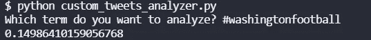

# 推特观点:华盛顿足球队对牛仔队，第 16 周

> 原文：<https://blog.devgenius.io/twitter-sentiment-washington-football-team-vs-c69b664055a1?source=collection_archive---------15----------------------->

## 推特情绪能预测 NFL 比赛吗？

[图片来自维基媒体](https://commons.wikimedia.org/wiki/File:NFL_2010_Week_6,_Sunday_Night_Football,_Colt_at_Redskins.jpg)

我们最近做了很多关于 NFL 比赛的 NLP 情感分析。在第 16 周之前，情绪较低的团队赢得了 8 场比赛中的 5 场。在第 16 周，我们将分析所有的游戏，看看结果如何。这是他们的结局。

1.  [推特情绪:2021 年第 16 周酋长队的钢人队](/twitter-sentiment-steelers-at-chiefs-week-16-2021-80fdb14c2c18)——情绪较低的球队(酋长队)获胜
2.  [推特情绪:2021 年第 16 周袭击者的野马队](/twitter-sentiment-broncos-at-raiders-week-16-2021-76e950b6de2c)——情绪较低的球队(袭击者)获胜
3.  [推特情绪:2021 年第 16 周海鹰队的熊队](/twitter-sentiment-bears-at-seahawks-week-16-2021-db4fbf9cb8fd)——情绪较低的队(熊队)获胜
4.  [推特情绪分析:孟加拉乌鸦队，2021 年第 16 周](/twitter-sentiment-analysis-ravens-at-bengals-week-16-2021-397b1a099c75) —情绪较低的球队(孟加拉)获胜
5.  [Twitter 情绪分析:公羊队在维京人队，2021 年第 16 周](/twitter-sentiment-analysis-rams-at-vikings-week-16-2021-6d47b51bf2e0) —情绪较高的球队(公羊队)获胜
6.  [Twitter 情绪分析:德州人的充电器，2021 年第 16 周](/twitter-sentiment-analysis-chargers-at-texans-week-16-2021-349e50c78707) —情绪较低的团队(德州人)获胜
7.  [Twitter 情绪分析:黑豹海盗队，2021 年第 16 周](/twitter-sentiment-analysis-buccaneers-at-panthers-week-16-2021-15a678e2e93b) —高情绪团队(Bucs)获胜
8.  [Twitter 情绪分析:捷豹队，2021 年第 16 周](/twitter-sentiment-analysis-jaguars-at-jets-week-16-2021-d63943c596e4) —情绪较高的团队(捷豹队)获胜
9.  [推特情绪分析:老鹰队的巨人队，2021 年第 16 周](/twitter-sentiment-analysis-giants-at-eagles-week-16-2021-9a4fe87197d9)——情绪较低的球队(老鹰队)获胜

赛前情绪较低的球队赢得了迄今为止预测的 17 场比赛中的 11 场。让我们继续看看我们做得怎么样。

## 华盛顿足球队情绪

华盛顿足球队 6 胜 8 负，预计将获得 rekt。他们又有更多的球员争夺科维了。上周，他们大概有三分之一的人出局了。他们也有较低的情绪和损失。

嗯，0.1499 比第 15 周的 0.0425 要好得多。

## 牛仔情绪

牛仔队以 10 比 4 领先。Dak 正在努力，他们已经获得了 NFC 东部冠军。如果他们赢了这场比赛，他们只是在巩固他们在季后赛的地位。

哦，他们的推特人气更高，为 0.1730。不过不用太担心，华盛顿足球队上一次情绪低落的时候并没有渡过难关赢得比赛。

## 总体评论

事情似乎仍然倾向于情绪较低的队获胜。让我们看看华盛顿足球队是否真的能赢得这场比赛。

要了解我们如何进行这些情感分析，请阅读[如何从命令行搜索 Twitter](https://pythonalgos.com/2021/12/02/search-twitter-from-your-command-line-with-python/)，以及这篇展示 [Twitter 情感分析](https://pythonalgos.com/2021/11/29/twitter-sentiment-for-stocks-starbucks-11-29-21/)的文章。

如果你喜欢这篇文章，请分享到 Twitter！为了无限制地访问媒体文章，今天就注册成为[媒体会员](https://www.medium.com/@ytang07/membership)！别忘了关注我，[唐](https://www.medium.com/@ytang07)，获取更多科技、体育等方面的文章！