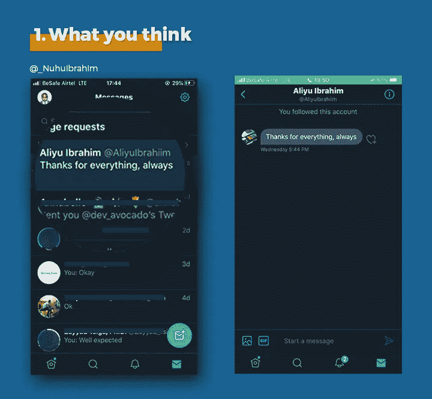
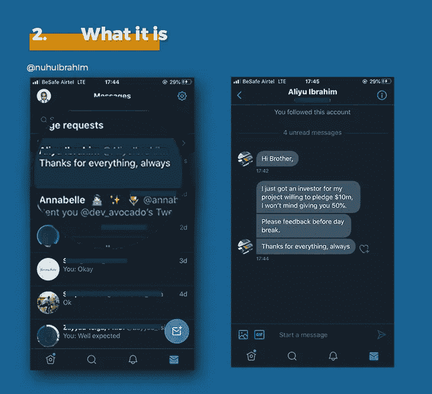
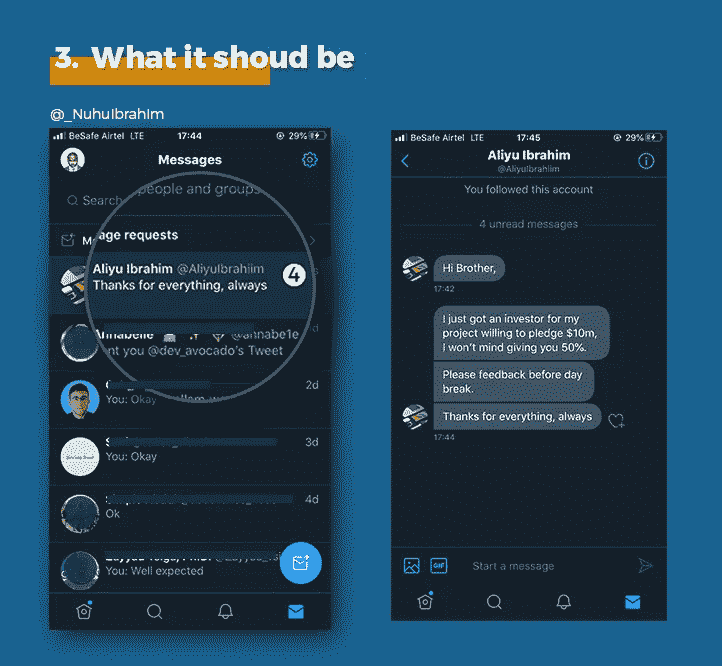

# Twitter:美妙但不完美的(一如既往的)系统

> 原文：<https://blog.devgenius.io/twitter-the-wonderful-but-imperfect-as-always-system-b32826b06bb9?source=collection_archive---------41----------------------->

像往常一样，对于软件工程师，我们会讨论各种系统，为什么他们是成功的或失败的，他们正在做什么来保持领先，以及他们需要做得更好。

我提出了一个我在 twitter 上观察到的 UI 问题，那就是他们的直接消息通知并不友好，会给任何忙碌或不细心的用户造成很大的损害。

下面我将使用手机 twitter 应用程序中的屏幕截图和合并图片来解释我的观点；

照片 1 —你的想法

当您收到通知时，您认为收件箱会是什么样子。

照片 2 —这是什么

收件箱的实际样子

照片 3——它应该是什么样子

它实际上应该是什么样子。请注意通知编号。

*最初发表于*[*【https://nuhuibrahim.com】*](https://nuhuibrahim.com/blog/twitter-ui-ux-defect)*。*