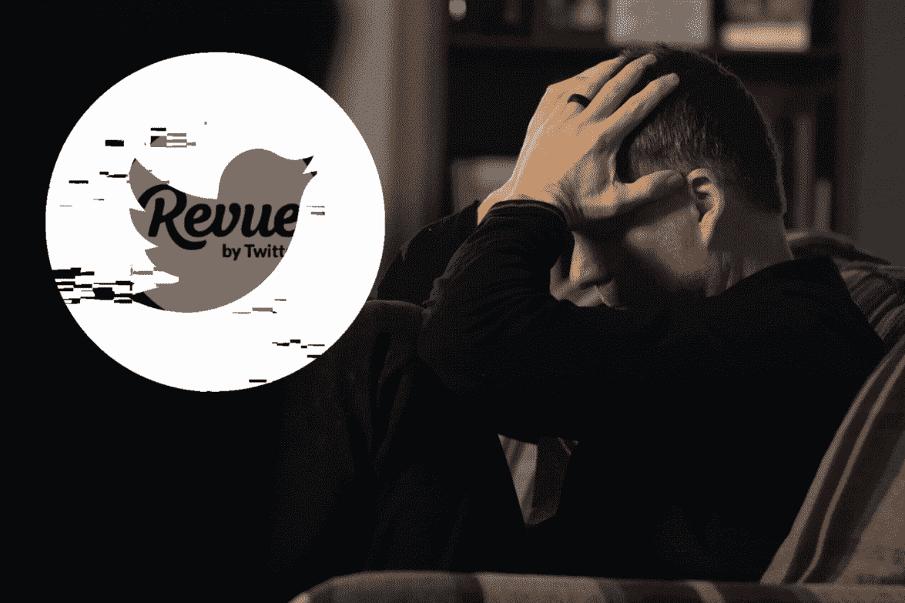
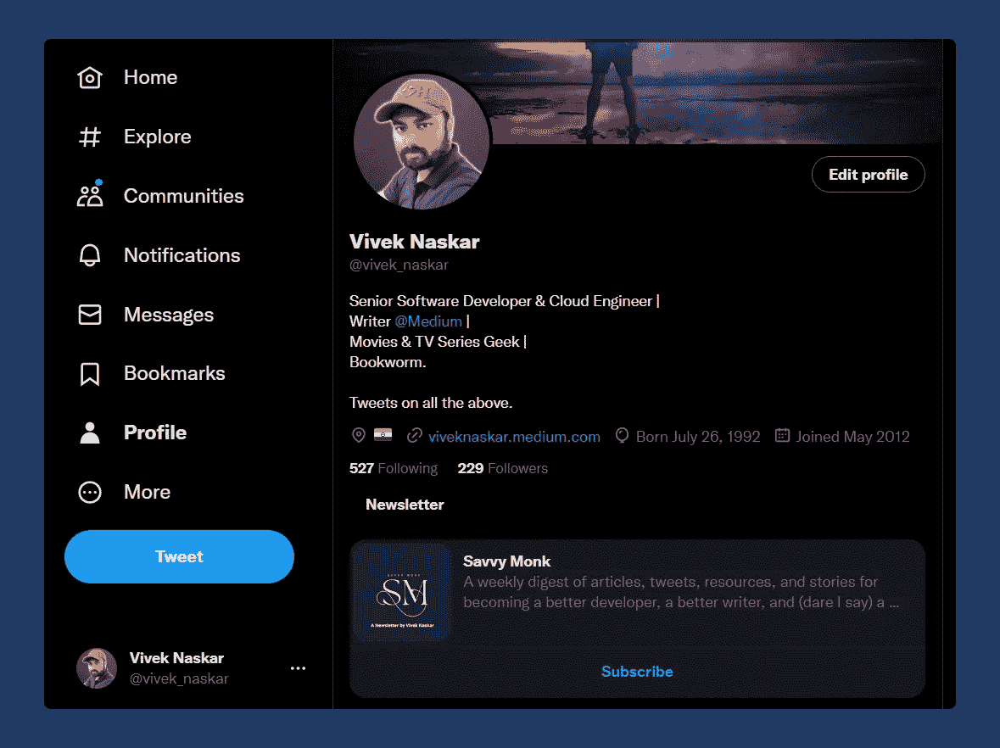

# Twitter 的简讯平台正在关闭。不，埃隆·马斯克不是原因

> 原文：<https://blog.devgenius.io/twitters-newsletter-platform-is-closing-no-elon-musk-is-not-the-reason-a1e0b957b93e?source=collection_archive---------15----------------------->

## Revue 本可以为创作者和平台带来改变游戏规则的收入。

在 [Unsplash](https://unsplash.com/s/photos/frustrated?utm_source=unsplash&utm_medium=referral&utm_content=creditCopyText) 上由 [Malachi Cowie](https://unsplash.com/@malachieyetoeye?utm_source=unsplash&utm_medium=referral&utm_content=creditCopyText) 拍摄的照片。由作者编辑。

几个月前，[我在 Revue](https://medium.com/the-shortform/the-newsletter-feature-for-twitter-is-dope-630f205c8f51) 上创建了我的时事通讯，这是 Twitter 自己的时事通讯平台，我有点喜欢它。

我一点也不知道这个平台会在年底关闭。有趣的是，这个简讯平台在 2021 年 1 月被 Twitter 收购，收购金额未披露。

社交媒体平台收购 Revue 受到了用户的欢迎，因为他们可以轻松地将 Twitter 粉丝转化为电子邮件订户，从而带来更多收入。

当时疫情正处于巅峰，每个人都在网上写作，这为时事通讯和博客平台创造了繁荣。因此，这次收购在当时也是有意义的。

# Revue 为什么失败了？

Twitter 已经亏损了几个月了。根据*华尔街日报*[发布的文章，该平台自 2019 年以来没有实现年度盈利，在过去十年中有八年出现亏损](https://www.wsj.com/articles/how-elon-musks-twitter-faces-mountain-of-debt-falling-revenue-and-surging-costs-11669042132)。

现在，由于 Twitter 不像脸书(现为 Meta)或谷歌那样是广告巨头，该平台一直难以产生急需的稳定收入流。其中一种尝试是收购替代商业模式，如付费通讯。

时事通讯可以添加到 Twitter 的简历中

就像抖音激发了 Instagram 的卷轴和 YouTube 的短片一样，Twitter 的 Revue 收购发生在领先的时事通讯平台 [*Substack*](https://substack.com/inbox) 掀起所有浪潮的时候。

不幸的是，电子邮件简讯与由平台算法驱动的短视频截然不同。电子邮件列表的建立严重依赖于创建者和他们的内容。

如果追随者发现这些简讯有价值，他们就会订阅(或付费)。但是，从简讯的免费关注者到付费订阅者的转化率非常小。

现在，普通的 Twitter 用户只能接触到 1-2%的追随者，而普通的电子邮件营销人员可以从订阅者那里获得 20-40%的打开率。

简单来说，如果我通过 Revue 时事通讯订阅我最喜欢的创作者，我在广告支持的 Twitter 上的机会将大大减少，从而减少收入。

此外，Revue 无法与新闻通讯竞争，如*子堆栈*和 [*幽灵*](https://ghost.org/) 。有影响力的人和创造者会在他们的 Twitter 个人资料或固定推文中分享他们的时事通讯。

因此，停播 Revue 是 Twitter 为数不多的几个止血方法之一。

# Revue 创始人失望

Revue 的创始人 Martijn de Kuijper 也通过推特对这一消息表示极度失望。

他更加失望，因为他的产品一年前刚刚被 Twitter 收购。

但是，如果母公司决定关闭你创建的产品，你也无能为力。

埃隆·马斯克一直在尝试创造稳定的收入来源，以维持 Twitter 的运营，否则 Twitter 每天都会陷入债务之中。

# 结束语

像其他人一样，我对 Revue 被淘汰感到非常失望。我的追随者确实少了，但想想那些拥有成百上千订阅者的人吧。

嗯，有一种方法可以将这些邮件列表导出到新的平台上。我强烈建议 substack。我的同事，Kristina God 已经写了一篇详细的文章，告诉你如何将你现有的电子邮件列表导出到一个新的时事通讯平台。

如果你喜欢读这篇文章，你可能也会发现下面的文章值得你花时间去读。

 [## 在媒体上写作的 700 天&这肯定是一次过山车之旅

### 没有比这更好的平台了。

medium.com](https://medium.com/illumination/700-days-of-writing-on-medium-it-is-a-roller-coaster-ride-for-sure-2f85a8a20615)  [## Getty Images 收购 Unsplash 让很多内容创作者很恼火

### 想象一个你热爱的平台，被广告淹没。

medium.com](https://medium.com/illumination/getty-images-acquiring-unsplash-is-annoying-to-a-lot-of-content-creators-6085bc74cb43) 

如果你喜欢阅读有助于你更好地学习、生活和工作的故事，可以考虑 [*成为*](https://viveknaskar.medium.com/subscribe) *的订阅者。成为会员后，你可以无限制地阅读 10000 篇故事、文章和作家。每月只要 5 美元。* [*如果你使用我的链接*](https://viveknaskar.medium.com/membership) *注册，我将获得一点佣金，帮助我写更多的文章。*