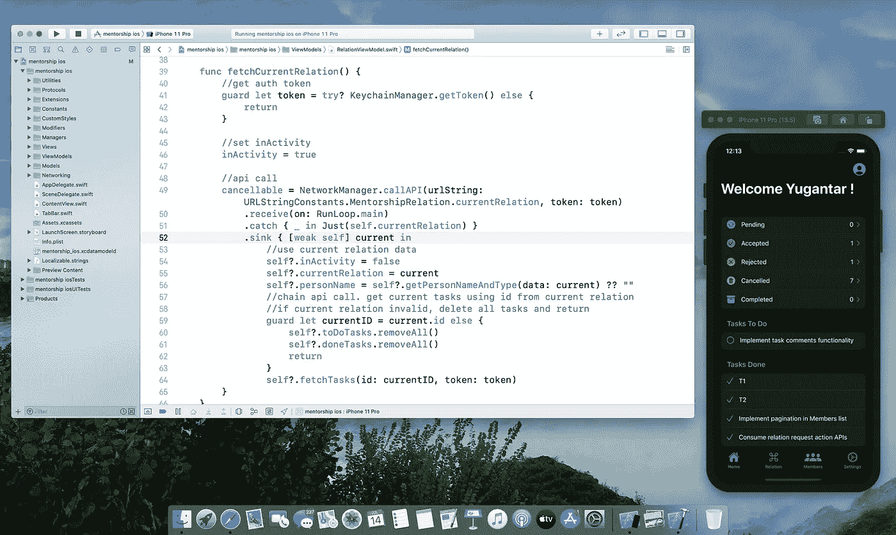

# 我从苹果工程师那里得到的避免内存泄漏和提高 SwiftUI 效率的两个技巧

> 原文：<https://blog.devgenius.io/two-tips-i-got-from-apple-engineers-to-avoid-memory-leaks-and-increase-efficiency-in-swiftui-72be71c652f3?source=collection_archive---------4----------------------->

避免保留周期并在 SwiftUI 中构建高效视图



大家好，

在今天的文章中，我分享了我在 WWDC20 实验室期间直接从苹果工程师那里获得的两个重要提示。

1.  避免内存泄漏:避免在类的闭包中捕获 self 所导致的保留循环。
2.  提高 SwiftUI 中可选视图的效率:避免使用 AnyView，改用@ViewBuilder。

# 1.避免在类的闭包中捕获“自我”所导致的保留循环

Swift 使用自动引用计数(ARC)来管理其内存分配和取消分配。这意味着 Swift 会自动为对象分配内存，然后在对象不再使用时释放内存(这是通过跟踪每个对象的引用数量来实现的，零引用会导致取消分配)。

[](https://docs.swift.org/swift-book/LanguageGuide/AutomaticReferenceCounting.html) [## 自动引用计数-Swift 编程语言(Swift 5.3)

### Swift 使用自动引用计数(ARC)来跟踪和管理您的应用程序的内存使用情况。在大多数情况下，这意味着…

docs.swift.org](https://docs.swift.org/swift-book/LanguageGuide/AutomaticReferenceCounting.html) 

虽然 ARC 管理大部分的内存管理，但是强大的引用周期会导致应用程序的内存泄漏。

这种保留循环的一个常见用例是在类的闭包内捕获 self。

> 如果将闭包赋给类实例的属性，并且该闭包的主体捕获了该实例，也会出现强引用循环—Swift.org

在 [Mentorship iOS 应用程序](https://github.com/anitab-org/mentorship-ios)中，我们在进行网络调用和在 sink 操作符中分配属性时拥有这些保留周期。

像类一样，闭包也是一种引用类型。因此，通过在一个类的闭包内捕获自我，我们形成了一个保持循环；因为闭包是由类捕获的，而类是由闭包捕获的。因此，在上面的代码中，类成员永远不会被去初始化(内存泄漏！).

## 解决方案:

强引用循环可以通过在闭包中捕获弱自我来轻松解决。

```
.sink { [weak self] members in
    self?.membersResponseData = members
}
```

# 2.避免 SwiftUI 中的 AnyView 以提高效率

SwiftUI 使用[不透明类型](https://docs.swift.org/swift-book/LanguageGuide/OpaqueTypes.html)来让我们构建视图，而无需明确提及确切的视图类型。为此，SwiftUI 要求视图应该返回一个明确的单一类型。

这很快就成为一个需要解决的问题，一个常见的例子就是当我们想要随意显示不同的视图时。

```
var body: some View {
    if caseOne {
        viewOne()
    } else {
        viewTwo()
    }
}
```

在上面的代码片段中，SwiftUI 无法在编译时推断出明确的视图类型，并抛出一个错误。
**注意:这将在 Xcode 12 中工作(解释如下)*

解决这个问题的一个常见方法是使用 [AnyView](https://developer.apple.com/documentation/swiftui/anyview) ，这种类型会删除一个视图，从而满足不透明类型。

然而，AnyView 效率不高，因为它每次都要重新创建整个层次结构。这是相当重要的一点，也是乔希·谢弗和伊莱扎·布洛克在约翰·桑德尔的惊人的后 WWDC20 [播客](https://swiftbysundell.com/podcast/76/)中强调的。

## 解决方案:

对此的建议解决方案是使用@ViewBuilder 属性包装。

在 Xcode 12 中，@ViewBuilder 将被自动推断，在大多数情况下甚至不需要指定。然而，就目前而言，这是如何使用它的—

```
@ViewBuilder var body: some View {
    if caseOne {
        viewOne()
    } else {
        viewTwo()
    }
}
```

# 感谢您的阅读！希望你喜欢:)

*请随时联系我并联系，查看我们的项目，或者加入我们的开源社区:* [*LinkedIn*](https://www.linkedin.com/in/yugantar-jain-1a7820158/)*，*[*GitHub*](http://github.com/yugantarjain)*，* [*导师 iOS*](https://github.com/anitab-org/mentorship-ios) *，*[*AnitaB.org 社区*](https://anitab-org.zulipchat.com)