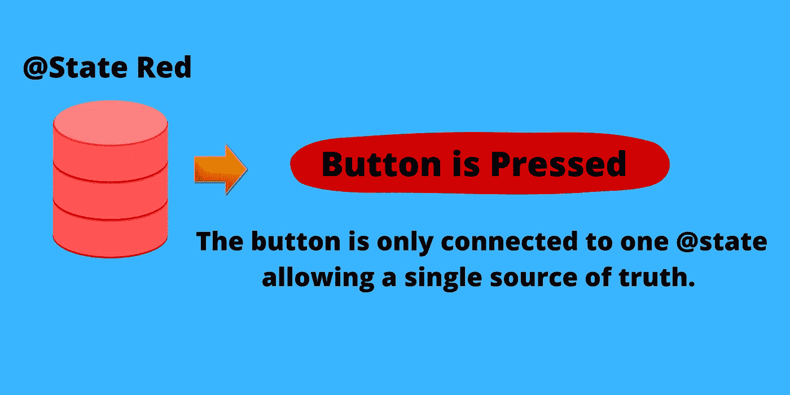

# SwiftUI 中的双向绑定

> 原文：<https://blog.devgenius.io/two-way-binding-n-swiftui-52aaee56e702?source=collection_archive---------4----------------------->

> IOS 开发和软件工程。

[https://unsplash.com/photos/t7wwffh6x8E](https://unsplash.com/photos/t7wwffh6x8E)

> 因此，我们非常了解 Swift 编程语言，并在逻辑思维背后打下了坚实的基础。那么我们如何使用 Swift 语言构建我们的第一个 IOS 应用呢？

在编程时，我们几乎需要像画家或音乐家一样工作。我们必须混合我们的颜色来创造美丽的肖像，让我们的颜料流动。为我们的观众创造一个惊人的展示，或者像一个音乐家写的音乐，用一系列的琶音和方块和弦连接我们的观众，产生美丽的声音音乐。

# 我们将在本文中讨论的内容

*   **SwiftUI 框架**
*   **双向装订**
*   **状态**

[https://unsplash.com/photos/D5nh6mCW52c](https://unsplash.com/photos/D5nh6mCW52c)

作为程序员，我们需要编写代码，为我们的用户连接和产生漂亮的 UI 显示，以及流畅的控制流和逻辑操作，以获得用户舒适和交互。在这个例子中，我们的绘画将是我们的 swift 代码，我们的肖像将是 SwiftUI 框架。

# SwiftUI 框架

SwiftUI 是一个旨在构建苹果设备用户界面的框架。SwiftUI 让创建 IOS 应用变得有趣而简单。应用程序布局使用 SwiftUI 框架开发，包括按钮、图片、选项卡和其他附件。Swift 代码可以链接并允许应用程序中的逻辑操作运行并与用户交互。我在这个链接上附上了苹果开发者文档，让你对 SwiftUI 框架有更深入的了解。

 [## Apple 开发者文档

### 编辑描述

developer.apple.com](https://developer.apple.com/tutorials/swiftui) 

# 状态和双向绑定

当我们看到一个对象或文本值从它的初始状态改变时，这可以被称为使用@State。让我们看看下面的代码，对发生的事情有一个全面的了解。@State 关键字用于使我们的结构可变，并允许初始值改变。

> Structs:是值类型，使得初始值不能改变，不像 swift 编程语言中的类。
> 
> $name:允许用户输入和文本被转移到“var name”属性中，并允许初始状态在每次新的用户输入被键入到输入验证框中时改变。

双向绑定允许传输数据以改变 viewController 的初始外观。如果我们对创建一个当用户按下时改变颜色的按钮感兴趣，我们需要声明关键字和双向绑定。

# 真理概念的单一来源

在维护和理解 Swift 数据时，这一概念至关重要。有一个状态显式链接到一个 UI 按钮或选项卡是单一真实来源的一个很好的例子。但是利用多个状态来对抗一个控制器是不可能的，因为这直接违反了单一真实来源概念的实践。

状态最好与结构一起使用，因为它们是基于值的，而不是基于引用的。在 SwiftUI 中创建动画时，可以很容易地使用状态来允许在 swift 数据中进行初始更改，以更新 UI 视图。这种状态使得将 Struct 从不可变变为可变变得非常简单，并且在 swift 编程语言中广泛适用于许多数据类型。

单一来源的真实例子。

# **结论**

在这些文章中，我们将深入 SwiftUI 和 Swift 编程语言，以便更好地理解 IOS 开发。SwiftUI 有很多有趣的主题，但需要时间和耐心来掌握。编码快乐！

 [## 迈克尔·巴尔萨-技术作家- CodeX | LinkedIn

### 经验丰富的数据专家，负责监督维护美国的飞机数据和信息管理…

www.linkedin.com](https://www.linkedin.com/in/michael-balsa-9474431b0/)