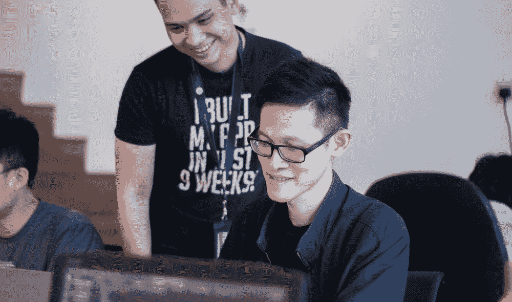

# 有两种方法可以让新成员快速融入一个稳定的开发团队

> 原文：<https://blog.devgenius.io/two-ways-to-quickly-integrate-new-members-to-a-stablished-dev-team-f7d7ce266da4?source=collection_archive---------25----------------------->

## 成长中的软件开发团队

## 在他们问之前给他们答案

[@next_academy](https://unsplash.com/@next_academy) 在 [Unsplash](https://unsplash.com/photos/JyJwO0K5fWM) 上的照片

在我担任首席开发人员或项目主管的十年中，除了正在进行的项目中不断的范围变更之外，团队轮换是另一种规范。

我们都知道当团队达到可预测的速度时，开发人员离开项目的副作用:项目交付的延迟和知识的丢失，只是几个例子。

另一方面，将新成员融入团队也是一个挑战，会产生相关的成本。但是增加一个新成员也是带来新思想、能量和知识的机会。

以下是我实施的一些成功帮助新开发人员融入团队的情况和策略。

# 智能实践训练营

当我们不得不整合十个新成员时，我正与一个固定的五人团队一起工作在一个大规模数据整合项目上，以可预测的速度交付结果。

我们使用 [Pentaho](https://community.hitachivantara.com/s/pentaho) 开源平台来解决这个集成项目，当项目开始时，我是唯一一个有使用该平台经验的人。

我们无法开始构建解决方案的任何部分，因为没有人具备使用 Pentaho 开始交付产品的知识，所以我必须指导我的团队。我决定跟进我在亚马逊上购买的实践指南，教授解决小型集成问题的基础知识。我们做了整整一周，每天练习 6 到 7 个小时。在第二周，我们开始做项目的实际工作。

当团队必须发展时(因为我们工作的公司发现新客户需要集成解决方案)，我们担心如何有效地集成新人，而不影响团队关注和速度方面的正在进行的项目。

该平台(Pentaho)提供了一个可视化数据集成设计器，易于使用，并有良好的文档记录，但唯一的体验是让您利用其所有功能，传递这种体验对于保持团队的质量至关重要。

一开始，我们尝试了结对指导来解决实际的项目情况，但结果表明一些高年级学生不太擅长教学；每个导师都有自己的风格，新团队无法以合理的速度在他们之间拉平。因为这个新的责任被交给了以前没有准备的高级人员，我们影响了他们执行项目任务的估计时间和努力。

我正准备将我的职责委托给我的一个同事来重复以前的工作经验，因为我知道我不能积极地参与交付产品，并且团队还必须在以后花费一定的时间来解释每个项目的具体细节。

就在那时，我的一个“学生”给了我们另一个非常有效的策略。

## 45 分钟的手把手指导就足够了

她根据我们在正在进行的项目中面临的实际的琐碎的集成问题建立了她的启动指南。在接下来的两周里，每天，在 15 分钟的会面后，她都这样做:

在接下来的 10 分钟里，她提出了问题，并大声思考解决了问题。之后，她提出了一个类似的问题，并给新团队 25 到 30 分钟的时间单独解决这个问题。然后，她结束了会议，展示了一个令人难以置信的解决问题的替代方案，这个方案碰巧更好，有时更快，而且“神奇”。只有当没有人指出如何做得更好时，这种情况才会发生。我们很高兴这种情况发生了很多次。

在那之后，我们开始实践这一点，并取得了出色的结果:当一个新的开发人员加入团队时，从第一天开始，每天我们至少花 45 分钟的工作时间来解决已经解决的琐碎集成问题，然后通过战略优化再次解决它们。在接下来的 6 到 7 个小时里，他们参加团队会议，由一位前辈指导，鼓励他大声思考几个小时，他的新伙伴在他身边。剩下的时间可以自由地用来学习、实践或准备环境，以便最终在几天内开始项目工作。

> …她结束了会议，展示了解决问题的不可思议的备选方案，这些方案碰巧更好，有时更快，而且“神奇”。只有当没有人指出如何做得更好时，这种情况才会发生。我们很高兴这种情况发生了很多次。

大三学生和实习生天生好奇，通过这种练习，在每一节课中，他们都带来了从第二天开始通过练习获得的新知识。

照片由 [@brookecagle](https://unsplash.com/@brookecagle) 在 [Unsplash](https://unsplash.com/photos/g1Kr4Ozfoac) 上拍摄

这个实践训练营可以在两周内完成，第一周解决他们肯定会面临的常见集成问题，另一周解决可以在 45 分钟或更短时间内分析、解决和测试的实际项目集成问题。

当时它有效，一个月之后，下一个月，以及每次我们需要添加或替换团队成员时，它再次有效。

# 日志共享

媒体上有很多关于[日志](https://medium.com/search?q=journaling)和它的好处的说法，我看到了它所有的好处，一旦我决定以一种聪明的方式尝试它，一旦我开始在这个与我作为 scrum 大师领导的教育领域相关的大项目上进行关键团队轮换。

六个月前，我们启动了一个项目，对整个基础教育过程进行数字化改造。从构建可定制的课程、课程规划、学生和教授监控、活动和评估、样本基准测试等等。

我们在这个项目中使用的技术非常普遍:Spring 用于后端，VueJS 用于前端，所以寻找新的团队成员一点也不困难。对这些技术的经验和能力的评估可以很容易地通过面试和编程测试来评估，但是有些事情我们不能简单地预见。

这个领域太大了，不可能在几天内解释清楚，所以在开始的时候，每次有新的开发人员加入，产品负责人和我必须每天花两到四个小时介绍这个项目。

> 对这些技术的经验和能力的评估可以很容易地通过面试和编程测试来评估，但是有些事情我们不能简单地预见。

它建立在[敏捷宣言](https://agilemanifesto.org/)以及其他原则之上，“工作软件优于全面的文档”，以满足将更多精力投入到构建解决方案的一部分而不是写在文本上的需求。

> 综合文档之上的工作软件(敏捷宣言，2011)

还解释了需要文档来传递知识，但是可以在解决方案的一部分工作之后进行，它必须简洁并且更可取，直接伴随解决方案，因为它是代码文档。

代码文档很容易付诸实践；当然，它必须成为每个项目的强制性实践，然而仅仅这种类型的文档对于新成员理解项目领域是不够的。

你可以考虑在不知道更大范围的情况下给一些简单的任务。是的，这可能是一个实用且直接的解决方案，但知识就是智慧，更大的图景可以在许多方面提供帮助，比如提出一个更好的横向解决方案、整个系统的优化等等。

> …知识就是智慧，大局可以在许多方面提供帮助，例如提出更好的横向解决方案、整体系统优化等。

## 日志

当我意识到项目开始发展如此之快，并且我与产品负责人(碰巧是远程的)发生了一些情况，当她在谈话中询问或争论决策时，没有人记得这一点，我开始记录每一个 sprint 规划、sprint 回顾和调整会议，并在项目的 Trello 板上的卡片中作为附件分享它们。

如今，主要的视频会议解决方案都提供视频录制。我使用 Google Meet，在会议结束后，它会向你发送一封包含会议视频的电子邮件(你的 Google 帐户管理员必须启用该功能)。也可以在 Windows 10 上按 Win + G 录音。

这种类型的视频日志可以有效地完成，因为你只描述会议的主要议题，这可能有助于你以后回忆起来。会议结束后，您可以查看视频并对他们进行预约，这些预约将与整个团队共享，包括产品负责人和新成员。

## 共享

在积极实践了那种日志之后，我找到了一种让新成员快速融入团队的方法。

在架构评审、领域评审或特定的 scrum 会议中组织会议，使得为每个新人建立团队整合指南成为可能。

照片由 [@airfocus](https://unsplash.com/@airfocus) 在 [Unsplash](https://unsplash.com/photos/8k1R1BngPxY) 上拍摄

当一个新成员到来时，他或她会收到一份加入 Trello 董事会的邀请，上面有所需的卡片，这些卡片包含了解项目和重大决策的视频信息。领域和体系结构的讨论是按照它们的列表进行逻辑排序的。Sprint 计划会议、回顾和回顾是按时间顺序排列在列表上的。

新成员在观看视频后可能会有一系列关于他或她任命什么的问题，回答这些问题要比每次重复项目是什么、项目的架构、解决方案是如何解决的、及时回答问题以及一遍又一遍地重复这些问题容易得多。

我已经在两个项目中实践了这一点，并且已经证明不再需要那“额外的”两周的适应时间。

毫无疑问，疫情的情况有助于将这一战略付诸实践，并为我们节省了几个小时的视频电话，向正在进行的项目介绍新成员。

我很感激你的时间，我也很感激你给我读书。我希望我可以用这些想法激励你，我也有兴趣知道你的想法；所以请便，如果你愿意，可以给我留言。