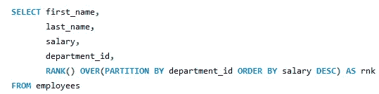
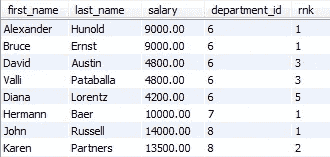
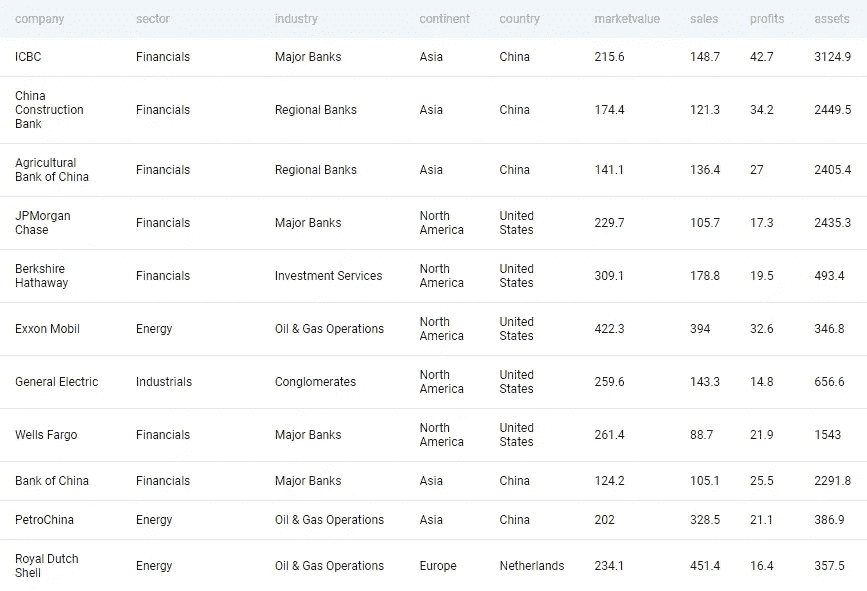
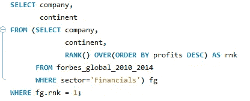
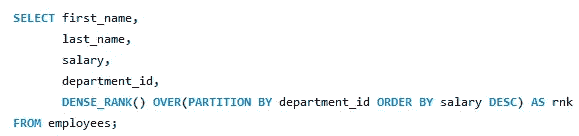
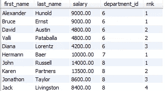
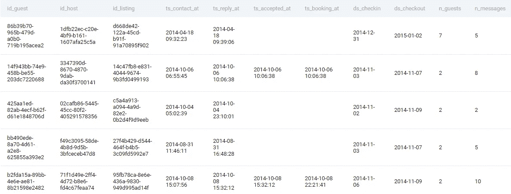
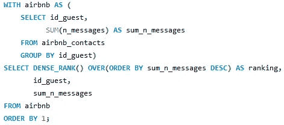
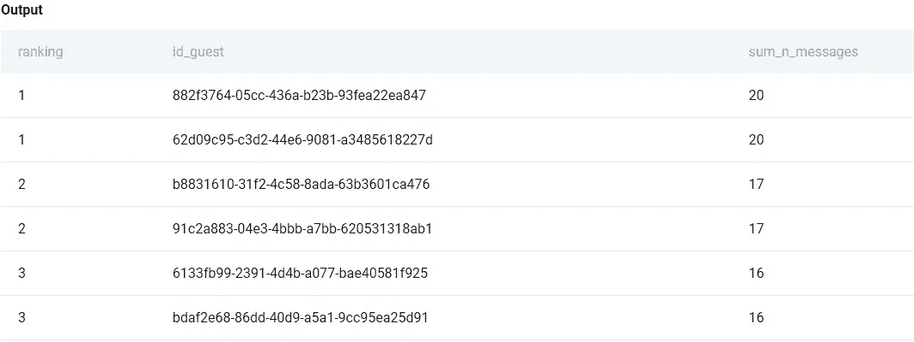

# 两个窗口函数对您的 SQL 编码至关重要

> 原文：<https://blog.devgenius.io/two-window-functions-essential-for-your-sql-coding-round-76ce79b4e5fa?source=collection_archive---------13----------------------->

照片由 [Unsplash](https://unsplash.com?utm_source=medium&utm_medium=referral) 上的 [Sunder Muthukumaran](https://unsplash.com/@sunder_2k25?utm_source=medium&utm_medium=referral) 拍摄

## 用真实的面试问题例子

任何与顶级科技公司的数据科学和数据分析相关的角色都有技术回合，测试你对 SQL 和你选择的编程语言的熟练程度，学习并擅长窗口函数可以帮助你很多，因为大多数时候这些问题需要你使用窗口函数。

在所有的窗口函数中，最重要的两个是 **rank()和 dense_rank()** ，这篇文章将教你如何使用这两个函数，我们将解决在 **Forbes 和 Airbnb 中提出的一系列问题。**

**窗口功能:**

窗口函数对一组特定的行(通常称为特定窗口)应用函数，over 子句与窗口函数一起使用来定义该窗口，OVER 子句中使用了两个子句(i)Partition by 和(ii)Order by。

## **rank():**

顾名思义，rank 函数根据 order by 条件为每个分区中的每一行分配一个等级，如果两行具有相同的值，它会给它们相同的等级，并在对下一个值进行排序时跳过一个等级。

**示例:**

查询的片段

如您所见，我已经将分区设置为部门 id，因此具有相同部门 id 的记录将被单独查看，并根据薪金按降序排列。

输出片段

正如预期的那样，前 2 行具有相同的等级，因为它具有相同的薪金，但是在为第 3 行分配等级时，它分配了第 3 个等级，因为在第一个等级中有两个值。

**编码问题(福布斯):**

## 找出整个世界及其大陆金融领域最赚钱的公司。

表格:福布斯 _ 全球 _2010_2014

表格中的片段

回答:

回答上面的问题

这里，我们创建一个子查询，根据金融行业的利润对公司进行排名，并选择排名=1 的公司和洲。

**dense_rank():**

dense_rank()的工作方式类似于 rank()函数，但它不是跳过等级，而是给出连续的等级，而不考虑具有相同等级的行的数量。

**示例:**

查询的片段

输出片段

正如您所看到的，这个查询没有跳过任何排名，而是给出了连续的排名。

**编码问题(Airbnb):**

## 根据客人与主人交流的信息数量对客人进行排名。与其他访客具有相同数量消息的访客应该具有相同的等级。如果前面的排名相同，不要跳过排名。输出等级、游客 id 和他们发送的总消息数。首先按邮件总数的最大值排序。

表格:airbnb _ 联系人

回答:

回答上面的问题

首先，我们从现有的表中创建一个表，其中包含每个来宾及其 id 的消息总数，下一个 select 语句根据消息总数对表进行排序。

上述查询的输出片段

正如所料，我们可以看到，包含相同 sum_n_messages 的行排名相同，没有排名被跳过。

结论:

这两个是在许多编码问题中经常出现的窗口函数，学习所有的窗口函数将帮助你以更详细的方式分析你的数据，这是顶级科技公司在他们的潜在候选人身上寻找的能力。

谢谢你，祝你准备工作顺利。