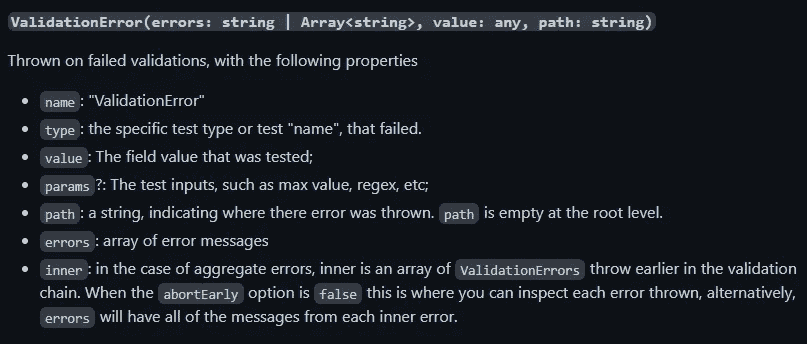

# React 中带有“是”验证的通用自定义挂钩“useForm”

> 原文：<https://blog.devgenius.io/type-safe-useform-hook-with-yup-validation-in-react-27e74c936cbe?source=collection_archive---------1----------------------->

有时，我们正在做一个项目，其中只有很少的表单，我们不想使用任何第三方库来处理这些简单用例的表单。但是，如果我们不使用任何库，那么我们将不得不分别手动处理每个表单，这也不是一个好方法。

那么，我们该怎么办呢？


照片由 [W.S. Coda](https://unsplash.com/@ws_coda?utm_source=medium&utm_medium=referral) 在 [Unsplash](https://unsplash.com?utm_source=medium&utm_medium=referral) 上拍摄

你猜对了。👍创建一个通用的定制钩子，并用它来处理每个表单。

## **先决条件:**

这将是一个类型安全的钩子。所以你要对 *TypeScript* 有适当的了解。

以下是本文中使用的 *TypeScript* 特性的链接。如果你还不知道这些，我强烈建议你先学习一下，然后再进一步。

1.  [仿制药](https://www.typescriptlang.org/docs/handbook/2/generics.html)
2.  [公用事业类型](https://www.typescriptlang.org/docs/handbook/utility-types.html)
3.  [使用类型谓词的类型收缩](https://www.typescriptlang.org/docs/handbook/2/narrowing.html#using-type-predicates)
4.  [键入操作符的键](https://www.typescriptlang.org/docs/handbook/2/keyof-types.html)

# **实施:**

在开始之前，看看我们钩子的最终接口，以了解我们将要实现什么。

使用表单挂钩 API

## **状态管理:**

让我们从定义状态开始。我们将在这个钩子中管理四个不同的状态。

挂钩状态代码段

在这里，前三个状态是不言自明的，关于第四个状态，我们管理它是为了检测一个字段是否被触摸，因为我们将只在被触摸的字段上显示错误。它将在`onBlur`事件中使用，每当模糊事件在任何字段上触发，则`true`将针对该字段设置为状态。

## **验证:**

正如标题中提到的，我们将使用一个非常流行的名为**“Yup”**的库来验证用户输入。

**验证对象类型:** 你可以在上面看到，我们接受`validationSchema`作为钩子的第三个参数。我们需要这个模式是类型安全的，也就是说，所有的表单字段都应该在模式对象中定义，它不应该接受任何不属于表单的字段。让我们为它定义类型。

```
*import* { AnySchema} *from* "yup";export *type* YupSchemaObject<T> = Record<keyof T, AnySchema>;
```

这里，“T”是一个通用值，它的类型将取决于消费者传递的`initialValues`。`AnySchema`是验证对象的类型，从`yup`导入。通过使用类型`YupSchemaObject`,我们的模式将只接受在`initialValues`对象中定义的所有键，并且该模式中的所有值将根据`AnySchema`类型。例如:

如果我们的初始值是这些:

```
const initialValues = {
  name: '',
  email: ''
}
```

那么我们的`validationSchema`中必须有`name`和`email`作为键，并且它不应该包含任何其他键。为了更好地理解，请参见下面的代码片段。

验证模式示例

**验证功能:** 希望你已经了解了验证对象的类型。现在，是时候创建验证函数了。

验证功能代码片段

因为，`validationSchema`是一个可选参数，我们首先检查它是否存在，然后将它传入从`yup`库导入的`yupObject`。接下来，我们只是传递`schema.validate`函数中的`values`和`options`。请注意，`{ abortEarly: false }`在这里很重要，因为它的默认值是`true`,如果为真，它将只返回第一个错误字段，但我们需要它返回所有错误字段。

**验证错误序列化器:** 我还想在本节中添加一个实用函数，因为它是验证的一部分，但将在本教程的**模糊**和**提交**处理程序中使用。

该函数接受两个参数，第一个是由`yup`返回的`err`对象，第二个是可选的`touchedFields`。为了理解这个函数的实现，我们需要知道 yup 的错误对象的形状。这就是了。



截图取自“是”文档

所有这些属性都是`ValidationError`类型的一部分。由于我们已经将`abortEarly`选项设置为`false`，我们将获得作为`ValidationError`数组的`inner`属性，这意味着`inner`数组的每个元素都将有一个`ValidationError`类型的对象，并包含上述所有属性。

现在我们知道了错误对象的形状，让我们开始理解我们的序列化器的实现。

我们需要转换`inner`属性，它是一个对象数组，转换成简单的线性对象，key 为`Keyof Values`，value 为`string`。在 yup error 对象中，`path`属性将具有发生错误的字段的名称，`message`属性将具有`string`中的错误文本。我们只需要将`path`属性设置为错误对象的键，将`message`属性设置为值。在将每个字段的错误值设置到我们的状态对象之前，我们还需要检查可选的`touchedFields`参数。如果存在，那么我们需要检查每个字段的触摸状态，如果字段的触摸状态被设置为`true`，那么我们将设置该字段的错误状态，否则我们将忽略该特定字段的错误。

## 事件处理程序:

事件处理程序是表单最重要的部分。我们在表单中经常用到的三个常用处理程序是*修改*、*模糊*和*提交处理程序*。

**更改处理程序:** 因为我们正在制作一个可以用于不同类型输入的通用钩子，所以我们需要确保我们的更改处理程序可以处理每一种输入类型。为此，我们应该创建一个基于输入类型处理值的效用函数。

我们将在这个函数中传递`event.currentTarget`对象，它将根据输入类型返回值。

更改处理程序代码段

这个处理程序可以在*输入*、*文本区域*和*选择*字段中传递，因此我们创建了一个名为`InputTypes`的类型，并使其成为三者的联合。但是这个联合类型产生了一个问题，我们不能访问`event.currentTarget`的`files`和`checked`属性，因为这些属性在`textarea`和`select`字段中不存在，并且三个的联合使得它对于 TypeScript 不可用。为了解决这个问题，我们将类型`currentTarget`转换为`EventTarget & HTMLInputElement`,因为我们确信如果类型是“文件”或“复选框”,那么它将是**输入**字段，而不是**文本区域**或**选择**字段。最后，我们通过使用之前创建的用于处理不同输入类型的实用函数来设置状态中的输入值。

**模糊处理程序:** 这个处理程序会有两个职责。一个是设置触摸状态(当字段第一次失去焦点时),另一个是调用验证函数(在验证部分定义),并在发生任何错误时设置字段的错误状态。

模糊处理程序代码片段

首先，我们检查字段的值在我们的`touched`状态对象中是否已经为真，如果不是，那么我们将它设置为`true`，然后我们调用`validate`函数。因为它是一个`async`函数并返回`Promise`，所以我们通过`then/catch`块来处理它。如果它拒绝，那么我们通过我们的`serializeYupError`函数序列化`yup`错误，并在我们的状态中设置错误，否则我们在错误状态中设置空对象。

**提交处理程序:** 它的职责是验证表单的所有值，然后调用`submitHandler`函数(钩子的第二个参数)，用`values`作为它的参数。

提交处理程序代码片段

在`try`块中，我们调用`validate`函数和`awaited`，因为它是一个异步函数。如果我们所有的验证都通过了，并且这个函数没有抛出错误，那么我们的`isSubmitting`状态将是`true`，并且`submitHandler`函数将被调用。
这个`submitHandler`的实现完全取决于这个钩子的消费者，要么他们想调用 API，要么在其中做任何其他操作。但有一点是肯定的，他们必须按照这个参数的类型定义要求，从这个函数返回`Promise`。因为它将总是返回`Promise`，所以我们正在等待它，如果它解决了，那么我们将把`isSubmitting`状态设置为`false`。

在`catch`块中，首先我们将`isSubmitting`状态设置为`false`，然后我们需要检查是否有验证错误发生，如果有，我们将把它们设置为状态。由于我们在`try`块中调用了两个不同的函数，错误可以是不同的类型，要么是由`validate`函数抛出的验证错误，要么是由`submitHandler`函数抛出的未知错误。
为了区分验证错误和未知错误，我们使用了名为`isValidationError`的类型保护函数。此函数正在使用 *TypeScript 的类型谓词功能。*我们正在检查`inner`属性是否存在于错误对象中，并返回类型谓词`err is ValidationError`。它在编译时和运行时都能工作。在编译时，它将把`err`对象类型从`any`缩小到`ValidationError`，在运行时，它将检查`err`对象中是否存在`inner`属性，我们的条件语句将基于此工作。这里需要注意的一点是，我们没有在`serializeYupErrors`函数的第二个参数中传递`touchedFields`,因为我们希望在表单提交时设置每个字段的错误，而不仅仅是接触字段的错误。
在处理验证之后，我们只是在`touched`状态下将所有字段设置为`true`，因为如果我们不这样做，那么一旦任何字段发生模糊事件，我们的验证函数将运行，并且由于在模糊事件中我们只设置被触摸字段的错误，未被触摸字段的错误将消失。

## 助手功能:

最后，我们制作了一些助手函数，当这个钩子的消费者想要显式地设置值或错误时，这些函数非常有用。

这篇长文到此结束。我希望我把每一点都讲清楚了。如果你发现有什么难以理解的地方，请随时提问。

你可以在这个 [codesandbox](https://codesandbox.io/s/useform-hook-ml6vdt?file=/src/hooks/useForm.ts) 中找到完整的代码和用法示例。

## 最终想法:

我为我的一个项目制作了这个钩子，在这个项目中，我决定尽可能少地使用第三方库。这个钩子是为一些简单的用例设计的。它只支持数据的线性形状，不支持嵌套对象结构或对象数组。请根据您的需要随意扩展它的功能。但是我建议只有当你是出于学习的目的时才这么做，否则如果你的用例更复杂，最好使用流行的库，如 **React-Hook-Form** 或 **Formik** 。